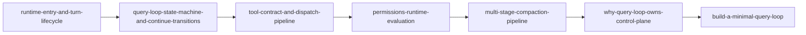

# 架构地图：开发者如何阅读 Lessons from Claude Code V2

> 这篇不是“内容摘要”，而是“阅读协议”。  
> 你看完它，应该知道从哪篇开始、每篇拿什么、什么时候该停下来自己实现一次。

## 1. 先看全景：这站点到底在做什么

这个项目现在不再是“事件介绍站”，而是开发者向的工程分析站。核心目标有三个：

1. 把源码里的运行机制讲清楚（不是讲新闻）。
2. 把设计决策讲清楚（不是只讲“怎么做”）。
3. 给出能直接落地的复建路径（不是只讲观点）。

对应到站点结构就是五条轨道：

- `map`：阅读方法和证据规范。
- `mechanism`：运行机制拆解。
- `decision`：架构权衡与边界。
- `build`：最小实现和工程清单。

## 2. 为什么要这样组织

很多类似内容会卡在两个极端：

- 只讲大词：读完“懂了”，但做不出来。
- 只贴代码：读完“看了”，但不知道为什么。

我们用双线结构把这两个问题拆开处理：

```text
机制线（What happens）  ->  决策线（Why this design）
          \                        /
           \                      /
            ------ 复建线（How to build）
```

机制线给事实，决策线给理由，复建线给动作。

## 3. 这套文章的默认阅读顺序

如果你是第一次来，建议按下面顺序：



这条路径的好处是：你先把“系统怎么跑”跑通，再看“为什么这么设计”，最后再“自己搭一版”。

## 4. 代码锚点怎么用

后续文章会反复引用这几个核心入口：

- `claude-code-main/src/QueryEngine.ts`
- `claude-code-main/src/query.ts`
- `claude-code-main/src/Tool.ts`

请把它们当“总路标”而不是“具体细节”。  
读机制文时先确认这些入口在调用链中的位置，再看局部实现，不然容易在细节里迷路。

## 5. 读的时候要避免的三个误区

### 误区 A：把模型能力当系统能力

模型答得好，不代表运行时稳定。  
生产级问题大多出在循环控制、权限顺序、预算治理这些“非模型层”。

### 误区 B：把安全理解成弹窗

弹窗是 UI，安全边界在判定顺序。  
`deny -> ask -> allow` 一旦顺序错位，UI 再漂亮也挡不住风险。

### 误区 C：把压缩当成一个 summarize 函数

长会话可持续性不是“压一下”就行，而是预算检查、分层压缩、结果外置、回读路径的组合机制。

## 6. 你可以怎样使用这套内容

两种实战方式：

- **架构评审模式**：先读 mechanism + decision，两篇一组，输出评审结论。
- **实现驱动模式**：直接读 build，再回读 mechanism 对齐设计边界。

一个简单模板：

```markdown
模块：
当前实现：
对应机制文章：
对应决策文章：
本团队取舍：
一周内可执行改动：
```

## 7. 本站写作约束（你会一直看到它）

每篇固定 8 段：问题、约束、锚点、运行序列、失败模式、权衡、复建清单、下一篇。  
不是为了形式统一，而是为了让文章可被工程团队复用，不依赖作者个人表达风格。

## 8. 读完这篇后你应该做什么

直接打开：

- `evidence-model-and-claim-discipline`（先把证据规则装进脑子）
- `runtime-entry-and-turn-lifecycle`（进入第一篇机制正文）
