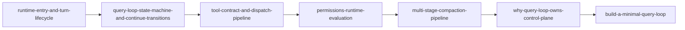

# Architecture Maps: How Developers Read Lessons from Claude Code V2

> This is not a "Summary of Contents" but a "Reading Agreement."
> After reading it, you should know where to start, what to take from each article, and when to stop and implement it yourself.

## 1. Take a look at the big picture first: what exactly is this site doing?

This project is no longer an "event introduction station", but an engineering analysis station for developers. There are three core goals:

1. Explain clearly the operating mechanism in the source code (not the news).
2. Make design decisions clear (not just "how").
3. Provide a reconstruction path that can be directly implemented (not just talking about opinions).

Corresponding to the site structure, there are five tracks:

- `map`: Reading methods and evidence specifications.
- `mechanism`: Disassembly of the operating mechanism.
- `decision`: Architectural trade-offs and boundaries.
- `build`: Minimal implementation and project listing.

## 2. Why is it organized like this?

A lot of similar content will be stuck at two extremes:

- Only big words: "I understand" after reading, but I can't do it.
- Just post the code: I "saw" it after reading it, but I don't know why.

We use a two-line structure to separate these two problems:

```text
机制线（What happens）  ->  决策线（Why this design）
          \                        /
           \                      /
            ------ 复建线（How to build）
```

The mechanism line gives facts, the decision line gives reasons, and the reconstruction line gives actions.

## 3. The default reading order of this set of articles

If this is your first time here, it is recommended to follow the following order:



The advantage of this path is: you first understand "how the system runs", then look at "why it is designed this way", and finally "build your own version".

## 4. How to use code anchors

Subsequent articles will repeatedly reference these core entrances:

- `claude-code-main/src/QueryEngine.ts`
- `claude-code-main/src/query.ts`
- `claude-code-main/src/Tool.ts`

Please think of them as "general guideposts" rather than "specific details."
When reading the mechanism document, first confirm the position of these entries in the call chain, and then look at the partial implementation, otherwise it is easy to get lost in the details.

## 5. Three misunderstandings to avoid when reading

### Misunderstanding A: Treating model capabilities as system capabilities

Just because the model answers well does not mean it is stable at runtime.
Most of the production-level problems lie in the "non-model layers" such as cycle control, authority sequence, and budget management.

### Misunderstanding B: Understanding security as a pop-up window

The pop-up window is the UI, and the safety boundary is in the determination order.
`deny -> ask -> allow` Once the order is misaligned, no matter how beautiful the UI is, it cannot stop the risk.

### Misunderstanding C: Treat compression as a summarize function

Long session sustainability is not just a matter of "pressing it down", but a combination of budget checking, layered compression, result externalization, and readback paths.

## 6. How you can use this content

Two practical methods:

- **Architecture review mode**: Read mechanism + decision first, in groups of two, and output the review conclusion.
- **Implementation-driven mode**: Read the build directly, and then read back the mechanism to align the design boundaries.

A simple template:

```markdown
模块：
当前实现：
对应机制文章：
对应决策文章：
本团队取舍：
一周内可执行改动：
```

## 7. Constraints on writing on this site (you’ll see it all the time)

Each article has 8 fixed paragraphs: problem, constraints, anchors, running sequence, failure mode, trade-offs, reconstruction checklist, and next article.
It is not for the sake of uniformity of form, but to make the article reusable by the engineering team without relying on the author's personal expression style.

## 8. What should you do after reading this?

Open directly:

- `evidence-model-and-claim-discipline` (Put the rules of evidence into your head first)
- `runtime-entry-and-turn-lifecycle` (enter the first mechanism text)
