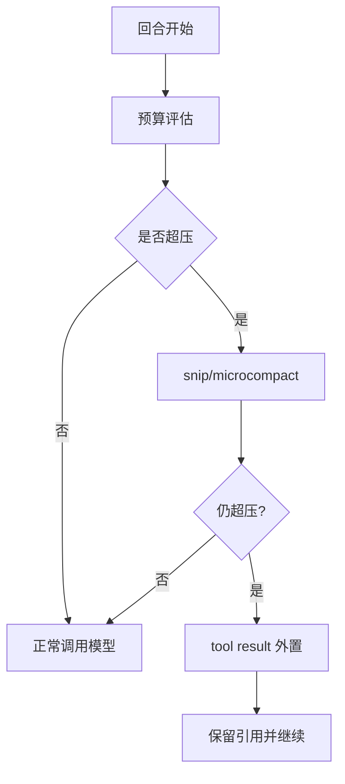

# 上下文预算与工具结果存储治理

> 长会话系统里，“记住多少”不是能力问题，是预算问题。  
> 预算治理做不好，模型再强也会在第 N 轮变钝、变乱、变贵。

## 1. 一个常见误解：预算只等于 token 上限

很多实现把预算理解为一个数字阈值，比如“超过 120k 就压缩”。  
实际工程里预算至少有三层：

- 模型上下文预算（prompt + history + tool result）。
- 响应预算（本轮最多输出多少）。
- 系统预算（压缩和回读本身也有成本）。

`claude-code-main/src/query.ts` 的设计重点不是“有没有阈值”，而是“是否前置、是否分层、是否可恢复”。

## 2. 预算检查为什么要放在回合入口

如果预算检查放在模型调用后，代价是：

- 你已经花了调用成本。
- 你拿到的结果可能基于失真上下文。
- 你只能做被动补救。

所以正确顺序是：

```text
预算评估 -> 轻量裁剪 -> 压缩升级 -> 模型调用
```

而不是“先调模型，超了再说”。

## 3. 结果外置：`toolResultStorage` 的真实作用

`claude-code-main/src/utils/toolResultStorage.ts` 不是缓存工具，它是预算安全阀。  
当工具输出过大时，系统选择：

1. 把结果落盘（或外置存储）。
2. 在消息里保留引用句柄。
3. 下一轮按需回读。

这种模式把“超大输出”从主上下文移出去，避免把整个会话挤爆。

## 4. 触发阈值可以动态，但必须可观测

`claude-code-main/src/services/analytics/growthbook.ts` 提供了动态开关能力。  
它允许你在线调整阈值策略，但同时带来一个新风险：  
“今天和昨天行为不同，却没人知道为什么”。

因此必须配套记录：

- 当前阈值来源（默认值/实验值）。
- 触发压缩或外置的具体原因。
- 触发后释放/消耗了多少预算。

## 5. 运行链示意



## 6. 两类失败模式最致命

### 失败模式 A：引用句柄失效

结果外置后，如果句柄不稳定或生命周期管理失败，系统会出现“知道有历史，但读不到历史”。

### 失败模式 B：压缩成功但语义损失过大

回合能继续，不代表质量可用。  
如果压缩把决策上下文裁掉了，后续行为会明显退化。

## 7. 复建建议：先保证可恢复，再优化保真

一个实用顺序：

1. 先保证预算不爆（稳定性优先）。
2. 再保证引用可回读（恢复优先）。
3. 最后调优压缩策略（质量优先）。

这是“先活下来，再活得好”。

## 8. 小结

预算治理不是单点功能，而是一条跨模块控制链。  
你要看的不是“压缩函数写得好不好”，而是“预算治理链有没有断点”。

## Next Read
- `multi-stage-compaction-pipeline`
- `build-a-minimal-query-loop`

