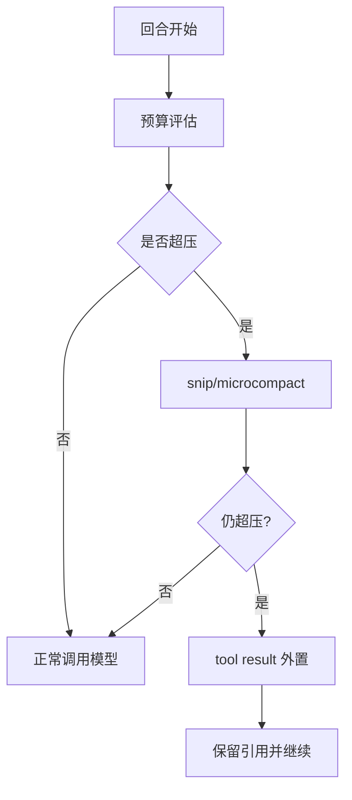

# Contextual Budgeting and Tool Result Storage Governance

> In a long-session system, "how much to remember" is not a question of ability, but a question of budget.
> If budget management is not done well, no matter how strong the model is, it will become blunt, confusing, and expensive in the Nth round.

## 1. A common misunderstanding: the budget is only equal to the token upper limit

Many implementations understand budget as a numeric threshold, such as "compress above 120k".
In actual projects, there are at least three levels of budget:

- Model context budget (prompt + history + tool result).
- Response budget (the maximum output in this round).
- System budget (compression and readback have costs of their own as well).

The design focus of `claude-code-main/src/query.ts` is not "whether there is a threshold", but "whether it is front-end, whether it is layered, whether it is recoverable".

## 2. Why should the budget check be placed at the round entrance?

If the budget check is placed after the model call, the cost is:

- You've already spent the cost of the call.
- The results you get may be based on distorted context.
- You can only do passive remediation.

So the correct order is:

```text
预算评估 -> 轻量裁剪 -> 压缩升级 -> 模型调用
```

Rather than "adjust the model first, and then talk about it later".

## 3. External results: the true role of `toolResultStorage`

`claude-code-main/src/utils/toolResultStorage.ts` is not a caching tool, it is a budget safety valve.
When the tool output is too large, the system selects:

1. Put the results to disk (or external storage).
2. Keep refnums in messages.
3. Read back on demand for the next round.

This mode moves "oversized output" out of the main context to avoid overwhelming the entire session.

## 4. The trigger threshold can be dynamic, but it must be observable

`claude-code-main/src/services/analytics/growthbook.ts` provides dynamic switching capabilities.
It allows you to adjust the threshold policy online, but it also brings a new risk:
"Behaving differently today than yesterday, but no one knows why."

Therefore, it must be recorded accordingly:

- Current threshold source (default/experimental).
- Specific reasons for triggering compression or externalization.
- How much budget was released/consumed after triggering.

## 5. Operation chain diagram



## 6. Two types of failure modes are the most deadly

### Failure mode A: Refnum invalid

After the results are externalized, if the handle is unstable or life cycle management fails, the system will display "Knowing that there is history, but cannot read history."

### Failure mode B: Compression is successful but semantic loss is too large

Just because the round can continue does not mean the quality is available.
If compression cuts out the decision-making context, subsequent behavior will be significantly degraded.

## 7. Reconstruction suggestions: Ensure recovery first, then optimize fidelity

A practical sequence:

1. First ensure that the budget does not explode (stability is priority).
2. Then ensure that the reference can be read back (recovery takes precedence).
3. Finally tune the compression strategy (quality first).

This is "survive first, then live well".

## 8. Summary

Budget governance is not a single point function but a cross-module chain of control.
What you want to look at is not "whether the compression function is well written", but "whether there are any breakpoints in the budget management chain".

## Next Read
- `multi-stage-compaction-pipeline`
- `build-a-minimal-query-loop`
