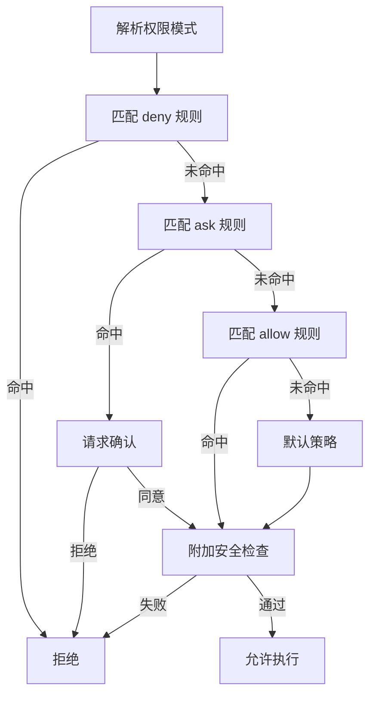

---
title: "权限系统的运行时判定链"
slug: "permissions-runtime-evaluation"
summary: "从权限模式、规则优先级、shell 安全分析三层拆解运行时安全边界。"
track: "mechanism"
category: "mechanism"
order: 14
tags: ["permissions", "policy", "security", "runtime-governance"]
level: "advanced"
depth: "L2"
evidence_level: "E1"
code_anchors:
  - path: "claude-code-main/src/utils/permissions/PermissionMode.ts"
    symbols: ["permission modes"]
  - path: "claude-code-main/src/utils/permissions/filesystem.ts"
    symbols: ["read checks", "write checks", "order of evaluation"]
  - path: "claude-code-main/src/utils/permissions/permissionSetup.ts"
    symbols: ["dangerous rule detection"]
  - path: "claude-code-main/src/utils/bash/treeSitterAnalysis.ts"
    symbols: ["shell AST analysis"]
prerequisites: ["tool-contract-and-dispatch-pipeline"]
status: "published"
updatedAt: "2026-04-06"
lang: "zh-CN"
translation_of: null
---

# 权限系统的运行时判定链

> 权限弹窗只是 UI。真正的安全边界是判定顺序与不可绕过检查。

## 1. 核心问题

如果只做“是否弹窗”，系统会在易用性和安全性之间反复摆动。  
成熟做法是把权限设计为可审计的运行时判定链。

## 2. 运行链示意

## 3. 模式层与执行层

- `PermissionMode.ts`：定义模式入口（保守/自动等）。
- `filesystem.ts`：定义读写评估顺序。
- `permissionSetup.ts`：配置加载时拦截危险规则。
- `treeSitterAnalysis.ts`：对 shell 做结构化风险分析。

模式层决定“倾向”，执行层决定“结果”。

## 4. 为什么写操作要更严格

读失败通常只是信息不足；写失败可能是不可逆损坏。  
因此写路径应有附加检查，不可与读路径同强度处理。

## 5. 为什么不能只靠 regex 检查命令

危险命令很多是结构组合风险，不是单词命中风险。  
`tree-sitter`/AST 分析成本更高，但能降低漏检率。

## 6. 常见故障

- allow 早于 deny，边界反转。
- 不同表面（文件/shell）用不同顺序。
- 日志只有结果没有命中路径。

## 7. 可执行建议

- 固化判定顺序并单测。
- 写与读分层策略。
- 配置加载阶段加 lint。
- 权限日志记录完整命中链。

## 8. 小结

权限系统的本质不是“问不问用户”，而是“能不能稳定给出可解释决策”。

## Next Read
- `why-permission-check-order-is-boundary`
- `build-a-safe-tool-runtime`
