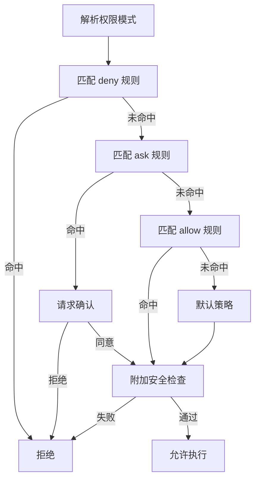

# Runtime decision chain of permission system

> The permission popup is just UI. The real security boundary is decision order and non-bypassable checks.

## 1. 核心问题

If you only do "whether to pop up a window", the system will repeatedly swing between ease of use and security.
The mature approach is to design permissions as an auditable runtime decision chain.

## 2. Operation chain diagram

## 3. Pattern layer and execution layer

- `PermissionMode.ts`: Define mode entry (conservative/automatic, etc.).
- `filesystem.ts`: Defines the read and write evaluation order.
- `permissionSetup.ts`: Configure dangerous rules to intercept when loading.
- `treeSitterAnalysis.ts`: Perform structured risk analysis on the shell.

The pattern layer determines the "tendency", and the execution layer determines the "result".

## 4. Why write operations need to be stricter

Read failures are usually just insufficient information; write failures may be irreversible damage.
Therefore, the write path should have additional checks and should not be treated with the same intensity as the read path.

## 5. Why can’t we just rely on regex to check commands?

Many dangerous commands are structural combination risks, not word hit risks.
`tree-sitter`/AST analysis is more expensive but reduces miss detection rates.

## 6. Common faults

- allow is earlier than deny, and the boundaries are reversed.
- Different surfaces (files/shells) use different orders.
- The log only shows results without hitting the path.

## 7. Actionable recommendations

- Determine the curing sequence and test individually.
- Write and read tiering strategies.
- Add lint during the configuration loading phase.
- Permissions log records the complete hit chain.

## 8. Summary

The essence of the permission system is not "asking the user or not", but "whether it can stably give explainable decisions".

## Next Read
- `why-permission-check-order-is-boundary`
- `build-a-safe-tool-runtime`
