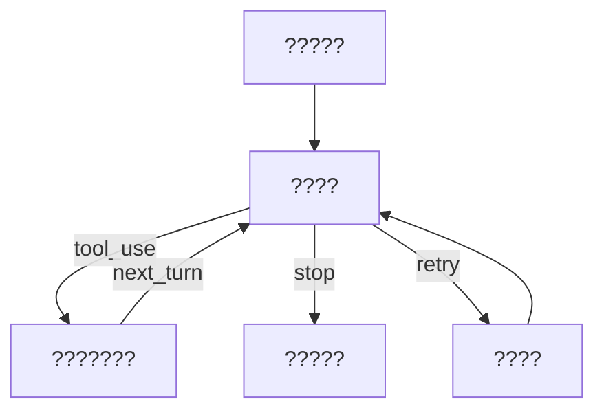

# Query Loop 状态机与 Continue 迁移

> 你可以把 `query.ts` 看成一个“可中断、可恢复、带工具分支的状态机”。  
> 看不懂 continue 位点，就看不懂这个系统为什么能在复杂场景下继续跑。

## 1. 主循环的真实问题不是“长”，而是“迁移是否清晰”

工程里大家经常说某个函数太长。  
但对 query loop 来说，真正危险的是：

- 迁移点隐式出现。
- 退出条件散落在多个分支。
- 重试路径和主路径共享状态却没有明确定义。

这会让行为变成“偶尔对，偶尔乱”。

## 2. 状态机视角下的最小骨架

把实现抽象成四类状态：

```text
S0: 组装上下文
S1: 请求模型一步
S2: 工具执行与回注
S3: 终止与提交
```

迁移关系：



`continue` 不是“再来一次”，而是“沿着定义好的迁移边回到指定状态”。

## 3. 代码里的 continue 位点应该具备什么特征

在 `claude-code-main/src/query.ts`，每个 continue 位点都应满足：

1. 明确写出触发条件。
2. 明确写出带入下一轮的状态字段。
3. 明确写出是否影响预算、重试计数、回合计数。

如果只写 `continue` 而不更新状态，你得到的不是循环，是不确定行为。

## 4. 退出条件必须集中，不要分散

最常见坏味道：每个分支都有自己的“我觉得该结束了”。  
长期结果是不同路径出现不同终止语义，用户会感到行为不一致。

建议做法：

- 在循环内部允许分支更新状态。
- 但最终退出判定收敛到单点检查。

伪代码示例：

```typescript
if (shouldStop(state, modelStep, toolResult)) {
  return finalize(state)
}
continue
```

## 5. 重试路径如何避免“状态双写”

`claude-code-main/src/query/retry.ts` 对应的问题是：  
发生错误时到底是“重跑本轮”还是“开新轮”。

正确策略是：

- 错误发生在回合内部：重跑本轮并复用状态。
- 错误发生在提交之后：按新回合处理。

否则你会得到重复消息或缺失消息。

## 6. 典型故障：无限继续与假退出

### 无限继续

continue 条件过宽 + 退出条件过弱，会导致系统一直“再想一步”。  
表面表现是 token 持续增长，用户看不到收敛。

### 假退出

分支提前 return，但关键状态未提交。  
表面表现是“界面看起来结束了”，恢复后上下文却对不上。

## 7. 你可以直接复用的设计清单

- 先写状态迁移图，再写代码。
- 为每个 continue 位点定义状态快照结构。
- 保留一个统一 `shouldStop`。
- 为 loop 增加迭代上限与异常兜底日志。

这四条足以让多数“循环玄学问题”变成可调试问题。

## 8. 小结

这篇的核心不是“循环怎么写”，而是“状态怎么迁移”。  
当迁移规则清晰时，复杂度会上升，但不可控性会下降。

## Next Read
- `tool-contract-and-dispatch-pipeline`
- `multi-stage-compaction-pipeline`

