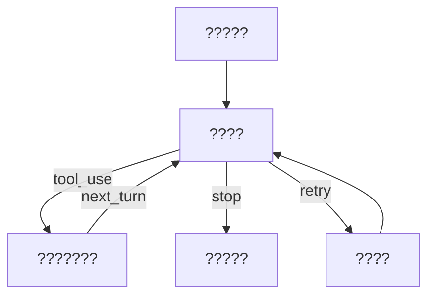

# Query Loop state machine and Continue migration

> You can think of `query.ts` as an "interruptible, resumeable, state machine with tool branches".
> If you don’t understand the continue bit, you won’t understand why the system can continue to run in complex scenarios.

## 1. The real problem of the main loop is not "long", but "whether the migration is clear"

In engineering, people often say that a certain function is too long.
But for the query loop, the real danger is:

- Migration points appear implicitly.
- Exit conditions are scattered across multiple branches.
- The retry path and the main path share state but are not clearly defined.

This can lead to behavior that is sometimes right and sometimes wrong.

## 2. Minimal skeleton from the perspective of state machine

Abstract the implementation into four types of states:

```text
S0: 组装上下文
S1: 请求模型一步
S2: 工具执行与回注
S3: 终止与提交
```

Migration relationship:



`continue` 不是“再来一次”，而是“沿着定义好的迁移边回到指定状态”。

## 3. What characteristics should the continue position in the code have?

In `claude-code-main/src/query.ts`, each continue position shall satisfy:

1. Clearly write out trigger conditions.
2. Clearly write out the status fields that will be carried over to the next round.
3. Clearly write out whether it affects the budget, retry count, and round count.

If you just write `continue` without updating the state, what you get is not a loop, but undefined behavior.

## 4. Exit conditions must be centralized and not dispersed

Most common bad taste: Each branch has its own "I think it's time to wrap up."
The long-term result is that different paths have different termination semantics and users experience inconsistent behavior.

Recommended practices:

- Allow branches to update state inside the loop.
- But eventually the exit decision converges to a single point check.

Pseudocode example:

```typescript
if (shouldStop(state, modelStep, toolResult)) {
  return finalize(state)
}
continue
```

## 5. How to avoid "status double writing" in the retry path

The corresponding question for `claude-code-main/src/query/retry.ts` is:
When an error occurs, whether to "rerun the current round" or "start a new round".

The correct strategy is:

- The error occurred within the round: rerun the round and reuse the state.
- Error occurred after submission: handled in new turn.

Otherwise you will get duplicate messages or missing messages.

## 6. Typical faults: infinite continuation and false exit

### Continue indefinitely

The continue condition is too wide + the exit condition is too weak, which will cause the system to keep "thinking one more step".
The surface manifestation is that the token continues to grow, and users cannot see convergence.

### fake exit

The branch returns early, but the critical state is not committed.
The superficial performance is that "the interface looks finished", but the context does not match after restoration.

## 7. A design checklist you can reuse directly

- Write the state transition diagram first, then write the code.
- Define a state snapshot structure for each continue point.
- Keep a uniform `shouldStop`.
- Add an iteration limit and exception logging to loop.

These four items are enough to turn most "circular metaphysics problems" into debuggable problems.

## 8. Summary

The core of this article is not "how to write a loop", but "how to migrate states".
When migration rules are clear, complexity increases but uncontrollability decreases.

## Next Read
- `tool-contract-and-dispatch-pipeline`
- `multi-stage-compaction-pipeline`
