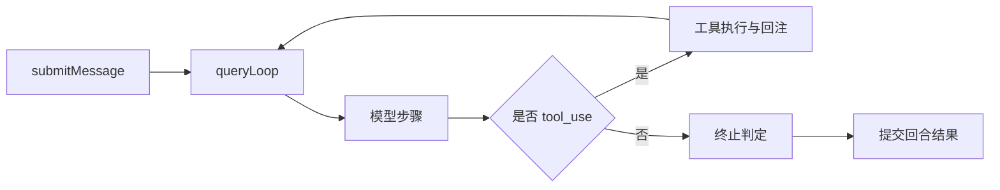

---
title: "运行时入口与 Turn 生命周期"
slug: "runtime-entry-and-turn-lifecycle"
summary: "从 submitMessage 到回合提交，拆解一次用户输入如何进入主循环并落地为会话状态。"
track: "mechanism"
category: "mechanism"
order: 10
tags: ["runtime", "query-engine", "lifecycle"]
level: "advanced"
depth: "L2"
evidence_level: "E1"
code_anchors:
  - path: "claude-code-main/src/QueryEngine.ts"
    symbols: ["QueryEngine", "submitMessage"]
  - path: "claude-code-main/src/query.ts"
    symbols: ["queryLoop", "turn orchestration"]
  - path: "claude-code-main/src/query/tokenBudget.ts"
    symbols: ["budget guardrails"]
prerequisites: ["architecture-map", "evidence-model-and-claim-discipline"]
status: "published"
updatedAt: "2026-04-06"
lang: "zh-CN"
translation_of: null
---

# 运行时入口与 Turn 生命周期

> 一次用户输入从“按下回车”到“成为可恢复状态”，中间不止一条 API 调用。  
> 在生产系统里，这是一条严格的生命周期链。

## 1. 先看全景：一次 turn 到底发生什么

直觉上流程是：输入 -> 模型 -> 输出。  
实际在工具型 agent 里，最小链路是：

```text
submitMessage -> queryLoop -> 模型步骤 -> 工具步骤 -> 状态提交
```



关键点：**“显示给用户”** 和 **“提交到会话状态”** 是两个不同阶段。

## 2. 入口层：`QueryEngine` 在做什么

`claude-code-main/src/QueryEngine.ts` 的职责不是“帮你调接口”，而是“持有会话主权”。

- 接收用户消息。
- 组装回合参数。
- 把执行交给 `query.ts`。
- 最终收拢并提交回合结果。

其中 `submitMessage()` 决定了 turn identity 与回合边界。

## 3. 执行层：`queryLoop` 才是运行时内核

`claude-code-main/src/query.ts` 里的循环更像状态机，而不是一次函数调用。

```typescript
while (true) {
  const step = await callModel(...)
  if (step.toolCalls.length) {
    const results = await runTools(step.toolCalls)
    state = appendToolResults(state, results)
    continue
  }
  state = commitAssistant(state, step.output)
  break
}
```

这段示意的核心是：**同一回合内状态持续演进，结束时统一提交。**

## 4. 为什么“流式输出”不能等于“回合提交”

如果把流式 token 直接当最终状态，会导致：

1. 工具可能还没执行完。
2. 回合可能后续触发重试或压缩。
3. 中断恢复时缺少一致提交点。

所以应该是：

- UI 先展示流式（体验层）。
- 终止条件满足后再提交（状态层）。

## 5. 最容易忽略的两个边界

### 边界 A：预算边界

`claude-code-main/src/query/tokenBudget.ts` 相关逻辑说明：预算检查必须前置，不是事后补救。

### 边界 B：重试边界

重试必须复用原回合 identity，否则会形成“表面继续、实际分叉”的历史。

## 6. 常见故障路径

1. 系统先显示了流式文本。
2. 工具超时，触发重试。
3. 重试没有复用原回合状态。
4. 最终历史出现冲突输出。

这类问题本质是生命周期管理问题，不是模型能力问题。

## 7. 可以直接照抄的检查项

- 是否有唯一 turn ID。
- 是否分离“展示”与“提交”。
- continue 分支是否带齐状态。
- 是否在回合边界埋点（开始/回注/提交/失败）。

## 8. 小结

**turn 生命周期是系统能力，不是实现细节。**

## Next Read
- `query-loop-state-machine-and-continue-transitions`
- `context-budget-and-tool-result-storage`
