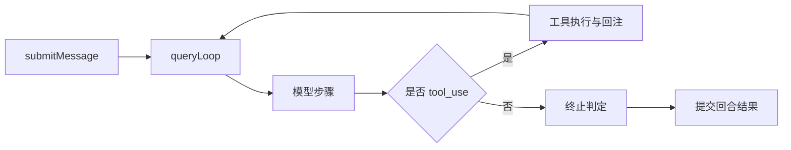

# Runtime entry and Turn life cycle

> A user input goes from "pressing enter" to "becoming resumable" with more than one API call in between.
> In a production system, this is a strict life cycle chain.

## 1. Let’s look at the big picture first: what exactly happens in a turn

Intuitively the process is: input -> model -> output.
Actually in a tool agent, the minimum link is:

```text
submitMessage -> queryLoop -> 模型步骤 -> 工具步骤 -> 状态提交
```



Key point: **"Display to user"** and **"Submit to session state"** are two different stages.

## 2. Entry layer: What `QueryEngine` is doing

The responsibility of `claude-code-main/src/QueryEngine.ts` is not to "help you adjust the interface", but to "hold session sovereignty".

- Receive user messages.
- Assemble round parameters.
- Leave execution to `query.ts`.
- Finally gather and submit the round results.

Among them, `submitMessage()` determines the turn identity and turn boundary.

## 3. Execution layer: `queryLoop` is the runtime kernel

The loop in `claude-code-main/src/query.ts` is more like a state machine than a function call.

```typescript
while (true) {
  const step = await callModel(...)
  if (step.toolCalls.length) {
    const results = await runTools(step.toolCalls)
    state = appendToolResults(state, results)
    continue
  }
  state = commitAssistant(state, step.output)
  break
}
```

The core of this instruction is: **The state continues to evolve within the same round and is submitted uniformly at the end. **

## 4. Why "streaming output" cannot equal "round submission"

If the streaming token is directly used as the final state, it will lead to:

1. The tool may not have finished executing yet.
2. Rounds may subsequently trigger retries or compactions.
3. Missing consistent commit point when recovering from interruption.

So it should be:

- The UI displays the flow (experience layer) first.
- Submit after the termination conditions are met (status layer).

## 5. The two most easily overlooked boundaries

### Boundary A: Budget Boundary

`claude-code-main/src/query/tokenBudget.ts` Relevant logic explanation: Budget inspection must be carried out in advance, not as an afterthought.

### Boundary B: Retry Boundary

The retry must reuse the original round identity, otherwise it will form a history of "apparent continuation but actual fork".

## 6. Common fault paths

1. The system displays streaming text first.
2. The tool times out, triggering a retry.
3. Retrying does not reuse the original round state.
4. The final history appears conflicting output.

This type of problem is essentially a life cycle management problem, not a model capability problem.

## 7. Check items that can be copied directly

- Is there a unique turn ID.
- Whether to separate "display" and "submit".
- Whether the continue branch has complete status.
- Whether to bury points at the round boundary (start/return/submit/fail).

## 8. Summary

**turn life cycle is a system capability, not an implementation detail. **

## Next Read
- `query-loop-state-machine-and-continue-transitions`
- `context-budget-and-tool-result-storage`
