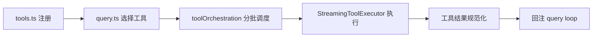

---
title: "工具契约与分发执行管线"
slug: "tool-contract-and-dispatch-pipeline"
summary: "解释 Tool 不是函数列表，而是治理契约；并拆解工具分发、并发编排与流式执行路径。"
track: "mechanism"
category: "mechanism"
order: 12
tags: ["tool-system", "contract", "dispatch", "streaming"]
level: "advanced"
depth: "L2"
evidence_level: "E1"
code_anchors:
  - path: "claude-code-main/src/Tool.ts"
    symbols: ["Tool interface", "isReadOnly", "isConcurrencySafe", "maxResultSize"]
  - path: "claude-code-main/src/tools.ts"
    symbols: ["tool registry"]
  - path: "claude-code-main/src/services/tools/toolOrchestration.ts"
    symbols: ["batch orchestration"]
  - path: "claude-code-main/src/services/tools/StreamingToolExecutor.ts"
    symbols: ["streaming execution"]
prerequisites: ["query-loop-state-machine-and-continue-transitions"]
status: "published"
updatedAt: "2026-04-06"
lang: "zh-CN"
translation_of: null
---

# 工具契约与分发执行管线

> Tool 系统不是“功能集合”，而是“能力 + 风险 + 执行约束”的统一层。

## 1. 为什么 Tool 必须是契约

如果只是 `name -> handler`，系统无法判断：

- 是否只读。
- 是否可并发。
- 是否会产出超大结果。
- 失败后怎么恢复。

`claude-code-main/src/Tool.ts` 的价值在于把这些都前置到契约字段。

## 2. 从注册到执行的全链路



这条链不是“多包一层”，而是多层治理。

## 3. 并发属性为什么是 correctness 字段

`isConcurrencySafe` 不是优化项，而是正确性边界。

- 读工具并发通常安全。
- 写工具并发容易造成工作区竞争。

如果没有这个字段，你会得到“吞吐很好、状态随机”的系统。

## 4. 为什么需要流式执行器

`claude-code-main/src/services/tools/StreamingToolExecutor.ts` 的意义：

1. 进度可见，避免误判卡死。
2. 中间态可观测，便于中断。
3. 结果分片回传，降低尾延迟。

```typescript
for await (const event of executor.run(toolCalls)) {
  if (event.type === "progress") render(event)
  if (event.type === "result") appendToState(event)
}
```

## 5. 结果治理：`maxResultSize` 的作用

工具输出过大不是体验问题，是系统问题：

- 挤占上下文预算。
- 放大压缩频率。
- 增加后续回合失真。

因此结果大小治理要在工具层就执行，不应全部留给压缩层兜底。

## 6. 常见故障

- 缺契约字段：策略层无法判定。
- 写工具并发：状态冲突。
- 无流式事件：调试黑箱。

## 7. 最小可落地契约

```typescript
type ToolContract = {
  name: string
  isReadOnly: boolean
  isConcurrencySafe: boolean
  maxResultSize?: number
  inputSchema: JsonSchema
  run(input: unknown): Promise<ToolResult>
}
```

## 8. 小结

工具系统的核心价值是：**把“能做什么”和“允许怎么做”绑定在同一份契约里。**

## Next Read
- `context-budget-and-tool-result-storage`
- `permissions-runtime-evaluation`
