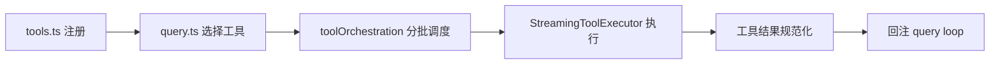

# Tool Contracts and Distribution Execution Pipelines

> Tool system is not a "function collection", but a unified layer of "capabilities + risks + execution constraints".

## 1. Why Tool must be a contract

If it is just `name -> handler`, the system cannot determine:

- Whether it is read-only.
- Whether it can be concurrent.
- Will it produce oversized results?
- How to recover after failure.

The value of `claude-code-main/src/Tool.ts` is to prepend these to the contract fields.

## 2. Full link from registration to execution



This chain is not “one layer of packages” but multi-layered governance.

## 3. Why is the concurrency attribute the correctness field?

`isConcurrencySafe` is not an optimization term, but a correctness bound.

- Read tool concurrency is generally safe.
- Concurrency in writing tools can easily cause workspace contention.

Without this field, you get a "good throughput, random state" system.

## 4. Why do you need a streaming executor?

The meaning of `claude-code-main/src/services/tools/StreamingToolExecutor.ts`:

1. The progress is visible to avoid misjudgment and stuck.
2. Intermediate states are observable and easy to interrupt.
3. The results are returned in fragments to reduce tail latency.

```typescript
for await (const event of executor.run(toolCalls)) {
  if (event.type === "progress") render(event)
  if (event.type === "result") appendToState(event)
}
```

## 5. Governance by results: the role of `maxResultSize`

Excessive tool output is not an experience problem, but a system problem:

- Squeeze the context budget.
- Amplify compression frequencies.
- Added subsequent round distortion.

因此结果大小治理要在工具层就执行，不应全部留给压缩层兜底。

## 6. Common faults

- Missing contract field: The policy layer cannot determine.
- Writing tool concurrency: state conflict.
- No streaming events: a debugging black box.

## 7. Minimum implementable contract

```typescript
type ToolContract = {
  name: string
  isReadOnly: boolean
  isConcurrencySafe: boolean
  maxResultSize?: number
  inputSchema: JsonSchema
  run(input: unknown): Promise<ToolResult>
}
```

## 8. 小结

The core value of the tool system is: **Binding "what can be done" and "how it is allowed to be done" in the same contract. **

## Next Read
- `context-budget-and-tool-result-storage`
- `permissions-runtime-evaluation`
