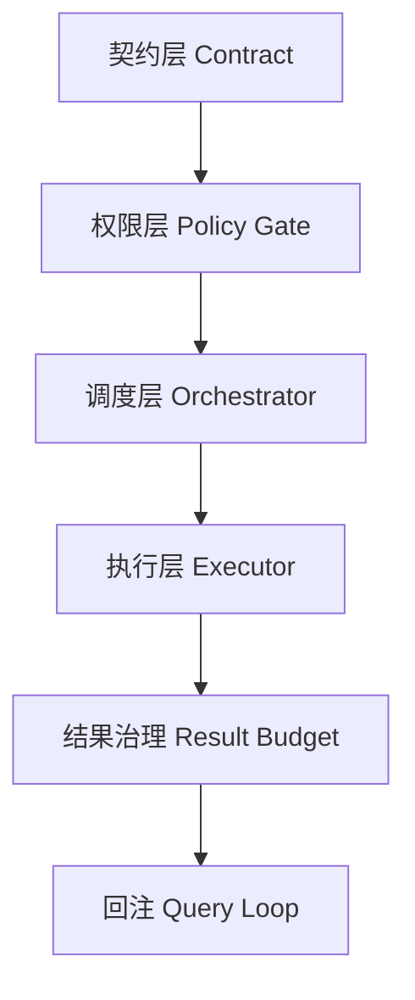

---
title: "构建安全可控的工具运行时"
slug: "build-a-safe-tool-runtime"
summary: "以实现视角给出工具运行时清单：契约约束、权限网关、并发控制、结果治理。"
track: "build"
category: "build"
order: 31
tags: ["build", "tool-runtime", "safety", "policy"]
level: "advanced"
depth: "L3"
evidence_level: "E2"
code_anchors:
  - path: "claude-code-main/src/Tool.ts"
    symbols: ["tool contract fields"]
  - path: "claude-code-main/src/utils/permissions/filesystem.ts"
    symbols: ["policy evaluation"]
  - path: "claude-code-main/src/services/tools/StreamingToolExecutor.ts"
    symbols: ["execution streaming"]
prerequisites: ["tool-contract-and-dispatch-pipeline", "why-permission-check-order-is-boundary"]
status: "published"
updatedAt: "2026-04-06"
lang: "zh-CN"
translation_of: null
---

# 构建安全可控的工具运行时

> 工具运行时是 coding agent 事故高发区。先把护栏立起来，再谈能力扩展。

## 1. 四层最小架构



这六个节点里，任意一个缺失都会直接放大故障概率。

## 2. 契约层

每个工具必须至少声明：

- `inputSchema`
- `isReadOnly`
- `isConcurrencySafe`
- `maxResultSize`

没有契约，后续策略层无法做确定性判断。

## 3. 权限层

执行前固定走策略判定：

```text
schema 校验 -> deny/ask/allow -> 附加安全检查 -> 执行
```

重点是“执行前”与“不可绕过”。

## 4. 调度层

默认串行，按契约放开并发：

- 读工具优先并发。
- 写工具独占批次。
- 高风险工具单独审批。

## 5. 执行层

引入流式事件（进度/结果/错误）有三个价值：

1. 用户可见。
2. 调试可见。
3. 中断可见。

## 6. 结果治理层

大结果不要直接塞回上下文，改成“外置 + 引用”。  
否则工具越成功，上下文越拥挤，后续推理越退化。

## 7. 上线前检查

- 并发写工具是否被正确阻断。
- 权限冲突场景是否稳定复现。
- 大结果是否能按引用回读。
- 中断后状态是否可恢复。

## 8. 小结

安全工具运行时不是“多加几条 if”，而是把契约、权限、调度、执行、结果治理连成一条可审计链。

## Next Read
- `multi-stage-compaction-pipeline`
