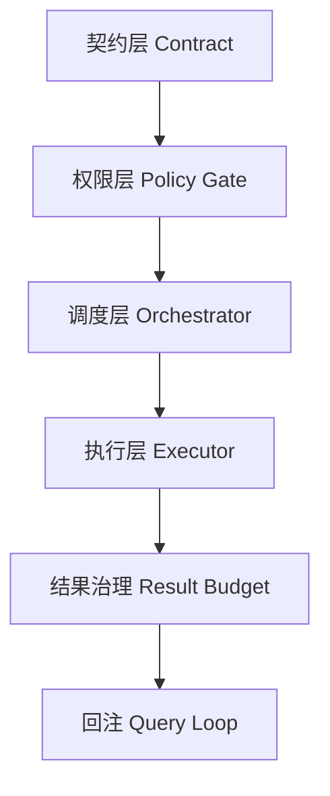

# Build safe and controllable tool runtimes

> The tool runtime is a high-risk area for coding agent accidents. Let’s put up guardrails first, and then talk about capacity expansion.

## 1. Four-layer minimum architecture



The loss of any one of these six nodes will directly amplify the probability of failure.

## 2. Contract layer

每个工具必须至少声明：

- `inputSchema`
- `isReadOnly`
- `isConcurrencySafe`
- `maxResultSize`

Without a contract, the subsequent strategy layer cannot make deterministic judgments.

## 3. Permission level

Fixed strategy determination before execution:

```text
schema 校验 -> deny/ask/allow -> 附加安全检查 -> 执行
```

The key points are "before execution" and "cannot be bypassed".

## 4. Scheduling layer

The default is serial, and concurrency is released according to the contract:

- Reading tools prioritize concurrency.
- Write tools exclusively for batches.
- High-risk tools are approved separately.

## 5. Execution layer

Introducing streaming events (progress/result/error) has three values:

1. Visible to the user.
2. Debugging is visible.
3. Interrupts are visible.

## 6. Results governance layer

Don't put large results directly back into the context, change it to "external + reference".
Otherwise the more successful the tool becomes, the more crowded the context becomes and the more degraded the subsequent reasoning becomes.

## 7. Check before going online

- Whether concurrent writing tools are blocked correctly.
- Whether the permission conflict scenario is reproducible stably.
- Whether large results can be read back by reference.
- Whether the state is recoverable after an interruption.

## 8. Summary

When running security tools, it is not about "adding a few more ifs", but connecting contracts, permissions, scheduling, execution, and result management into an auditable chain.

## Next Read
- `multi-stage-compaction-pipeline`
