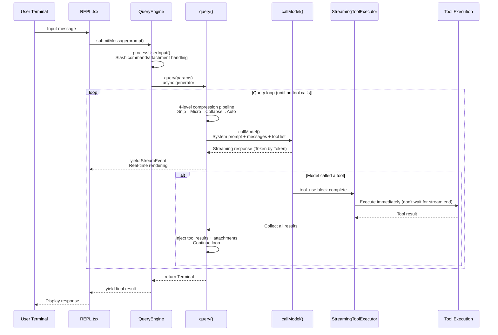
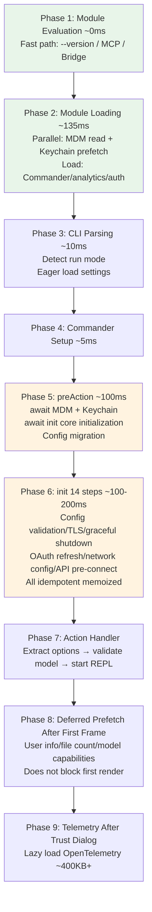
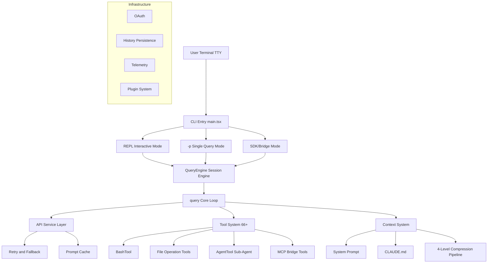

# Chapter 1: Claude Code Overview

## 1.1 What Problem Does Claude Code Solve

Claude Code is not a simple "CLI calling a large model" tool. It is the official **Controlled Tool-Loop Agent** released by Anthropic, designed specifically for real-world software engineering tasks.

### From Tools to Agents: Three Levels of Paradigm

To understand Claude Code's positioning, we first need to understand the three levels of paradigm in AI-assisted programming:

**Level One: Code Completion** (e.g., Copilot). The model's job is to "predict the next line of code." It sees your cursor position and context, then generates a completion suggestion. This is essentially a **single-shot prediction problem** -- the model doesn't need to understand the entire project, doesn't need to perform any operations, it only needs to generate reasonable code snippets based on local context. The user is always the driver, and the model is just the copilot.

**Level Two: IDE Chat Assistant** (e.g., Cursor Chat, Copilot Chat). Users can describe requirements in natural language, and the model generates code snippets or modification suggestions. This is more powerful than completion -- the model can see more context and can generate modifications across multiple files. But the key limitation is: **the model cannot execute operations**. It generates a diff, and the user decides whether to apply it. If the diff has problems (e.g., it depends on a function that doesn't exist), the user needs to manually discover and provide feedback -- the model cannot verify on its own.

**Level Three: Autonomous Agent** (Claude Code). The model not only generates code but can also **autonomously execute multi-step operations**. Consider a real scenario: you want to add a new REST endpoint to a project. Copilot would give you a function body. An IDE chat might suggest a modification plan. What Claude Code does is: first use Grep to search existing route definitions to understand the project's routing patterns, use FileRead to read middleware configuration, then create handler files, register routes, write tests, then run `npm test` and discover tests failing, read the error messages, fix the code, run tests again until they pass, and finally commit a git commit. The entire process is an **autonomous decision loop** -- the model decides what to do next, observes the result after execution, then decides the next step.

This paradigm leap brings fundamental architectural differences. An Agent needs:
- **Loop**: Not a single call, but repeated "think -> execute -> observe" until the task is complete
- **Tools**: Not just generating text, but able to read files, write files, execute commands
- **Memory**: Not starting from scratch every time, but remembering user preferences and project context
- **Safety Controls**: Because it executes real operations on the user's machine, strict permission management is needed

Every architectural decision in Claude Code revolves around these four requirements.

### Differences from Other Agents

There is no shortage of other programming Agents on the market (such as AutoGPT, OpenDevin, Aider, etc.), but Claude Code has a unique advantage: it is developed by the same team that builds the Claude model. This means **system prompts, tool descriptions, and error handling strategies are co-designed and tuned with the model's behavioral characteristics**. For example, Claude Code's system prompt is not a generic "you are a programming assistant" -- it contains detailed behavioral instructions optimized for Claude model characteristics, and the `description` fields of tools are also iteratively tuned to match the model's understanding patterns.

Furthermore, Claude Code far surpasses most open-source Agent projects in production-grade engineering quality: a 5-layer defense-in-depth security system, 4-level progressive context compression, 7 error recovery strategies, streaming tool pre-execution -- these are not academic demos, but industrial-grade implementations serving real users.

### Architectural Implications of "Agent-first"

"Agent-first" is not a marketing slogan -- it has specific architectural implications: **the model is the decision-maker in the loop, not the human**. Humans set the goal ("add user authentication to this project") and approve dangerous operations ("confirm executing `npm install`?"), but between two human interactions, the model autonomously decides what files to read, what code to change, what commands to execute.

This is reflected in the most critical line in the source code -- the `while (true)` at `src/query.ts:307`:

```typescript
// src/query.ts:307
while (true) {
    // ... compression -> API call -> tool execution -> continue/exit
}
```

This loop **only exits when the model's response does not contain any tool calls**. In other words, it is the model -- not the code logic -- that decides whether the task is complete. The code merely provides the execution environment; the real "brain" is the model itself.

## 1.2 Technology Stack

| Layer | Technology Choice | Description |
|-------|------------------|-------------|
| Runtime | Bun | High-performance JS/TS runtime, supports compile-time Feature Flag elimination |
| Language | TypeScript | Full TypeScript, strict type checking |
| UI Framework | React + Ink (in-house) | React-based terminal UI framework, in-house Ink renderer (`src/ink/`, 251KB) |
| Layout Engine | Yoga | Facebook's Flexbox layout engine, adapted for terminal |
| Schema Validation | Zod | Runtime type validation, used for tool input, Hook output, configuration validation |
| CLI Framework | Commander.js | Command-line argument parsing, dispatching to REPL/headless/SDK modes |
| API Protocol | Anthropic SDK | Official TypeScript SDK, supports streaming responses |

The technology choices themselves are not the focus of this article, but two choices are worth mentioning because they profoundly influence the architectural design:

- **Bun's `feature()` macro**: Claude Code internally has a large number of features (coordinator mode, Swarm teams, etc.) that need to be completely removed in external release versions. The compile-time Feature Flags provided by Bun allow this code to be physically removed at build time, rather than hidden at runtime. This will be expanded upon in the "Compile-time Feature Gate" design principle section later.
- **In-house React terminal renderer**: The terminal UI complexity of Claude Code far exceeds that of a typical CLI -- permission confirmation dialogs, streaming code highlighting, nested tool progress indicators all require componentized state management. The team maintains a 251KB custom Ink renderer (rather than using the upstream library), see [Chapter 12: User Experience Design](/en/docs/12-user-experience.md) for details.

## 1.3 Core Design Principles

Claude Code's architecture follows 6 core design principles:

### 1. Generator-based Streaming Architecture

From API calls to UI rendering, the entire pipeline uses `async function*` async generators. This is not simple callbacks or Promise chains -- but a true streaming processing pipeline where every Token and every tool result can flow to the user interface in real-time.

The core query loop's signature is:

```typescript
// src/query.ts
export async function* query(
  params: QueryParams,
): AsyncGenerator<StreamEvent | Message | ToolUseSummaryMessage, Terminal>
```

This is an async generator -- it does not return results all at once, but **yields events as it executes**. The caller (QueryEngine) consumes each event in real-time via `for await (const msg of query(params))`: every Token the model outputs, every tool call result, compression events, error recovery -- all of these flow through the same generator pipeline to the UI layer.

The benefit of this design is **zero-buffer latency**: the user can see output the instant the model starts generating, without needing to wait for the entire response to complete.

**Why Generators Instead of Callbacks or Promises?** This choice was not arbitrary -- the three async patterns each have fundamental limitations:

- **Callback pattern**: Classic Node.js style, prone to "callback hell." More importantly, it cannot elegantly handle backpressure (when UI rendering can't keep up with data production speed, there is no natural pause mechanism). When the user presses Ctrl+C to interrupt, cancellation logic needs to be manually wired through every layer of callbacks.
- **Promise/async-await pattern**: Solves callback hell, but `await` is blocking -- a single `await apiCall()` must wait for the entire response to complete before returning. To achieve streaming, you need to manually buffer partial results and poll, which is essentially reinventing generators on top of Promises.
- **Generator pattern**: `yield` is inherently streaming semantics -- the producer (API layer) yields once for each token produced, and the consumer (UI layer) pulls at its own pace. More critically, `generator.return()` can **cascade cleanup through the entire call chain**: user presses Ctrl+C -> REPL calls generator.return() -> QueryEngine's generator terminates -> query()'s generator terminates -> API request is aborted. No manual wiring needed; cleanup propagates automatically along the generator chain.

Note the return type of `query()`: `AsyncGenerator<..., Terminal>` -- `Terminal` is the generator's **return type**, representing the final state of the query, separate from the intermediate event stream yielded. This "dual-channel" approach (yielding streaming events + returning the final result) can only be cleanly expressed with generators.

The entire data flow forms a nested generator pipeline: `REPL.tsx` -> `QueryEngine.submitMessage()` -> `query()` -> `queryModelWithStreaming()` (`services/api/claude.ts`). Each layer of the generator adds its own processing logic on the pipeline (compression, error recovery, permission checks), but to the upper layer, it is just a unified `AsyncGenerator` event stream.

### 2. Defense-in-Depth Security

The permission system adopts multi-layered defense:

```
Permission Rule Matching (src/hooks/toolPermission/)
    | pass
Bash AST Analysis (src/utils/bash/, tree-sitter parsing)
    | pass
23 Static Security Validators
    | pass
ML Classifier (yoloClassifier)
    | pass
User Confirmation Dialog
```

**Why so many layers?** Understanding the threat model is key: Claude Code executes arbitrary code on the user's real machine. The model is not perfect -- it may generate incorrect commands due to context confusion, may be misled by prompt injection in a malicious README, or may simply make a logic error. A single `rm -rf ~` is enough to cause irreversible damage.

This is classic **defense in depth**: even if one layer has a bug or is bypassed, other layers can still block dangerous operations. Each layer uses a different technical approach, covering different categories of risk:

1. **Permission Rule Matching** (`src/hooks/toolPermission/`): This is the **policy layer** -- users declare which operations are allowed through CLAUDE.md's `allowedTools` or the `--allowedTools` flag. This layer expresses user intent: "in this project, running `npm test` is always safe."
2. **Bash AST Analysis** (`src/utils/bash/`, tree-sitter): Instead of matching command strings with regex, it uses tree-sitter to parse Bash commands into an abstract syntax tree. Why not regex? Because Bash syntax is extremely flexible -- `r"m" -rf /`, `$(echo rm) -rf /`, `eval "rm -rf /"` are all variations that can bypass simple string matching, but AST analysis can identify the commands actually being executed.
3. **23 Static Security Validators**: Hardcoded checks for known dangerous patterns. This is the "whitelist/blacklist" layer -- certain operations (such as writing to `/etc/passwd`, modifying SSH configuration) should be blocked regardless of context.
4. **ML Classifier** (yoloClassifier): A trained classification model that can judge safety based on the semantic context of a command. It captures "novel" dangerous patterns that static rules cannot cover -- for example, a command that looks harmless but could cause problems in the current context.
5. **User Confirmation Dialog**: The final human review. Even if all automated layers have approved, the user can still see the operation about to be executed and choose to reject it.

Key design insight: **each layer uses a completely different technology** (rule matching, syntax parsing, machine learning, human judgment), which means a single category of bug cannot bypass all layers simultaneously. Even if a permission rule is misconfigured to allow a command, the tree-sitter AST analysis will still detect structurally dangerous patterns like `rm -rf /`.

### 3. Compile-time Feature Gate

Compile-time dead code elimination is achieved through Bun bundler's `feature()` macro. Internal features (such as coordinator mode) are completely removed in external builds -- not hidden at runtime, but physically deleted at compile time.

This pattern appears repeatedly throughout the codebase:

```typescript
// Top of src/query.ts — 4 Feature Gates
const reactiveCompact = feature('REACTIVE_COMPACT')
  ? (require('./services/compact/reactiveCompact.js') as typeof import('./services/compact/reactiveCompact.js'))
  : null
const contextCollapse = feature('CONTEXT_COLLAPSE')
  ? (require('./services/contextCollapse/index.js') as typeof import('./services/contextCollapse/index.js'))
  : null
const snipModule = feature('HISTORY_SNIP')
  ? (require('./services/compact/snipCompact.js') as typeof import('./services/compact/snipCompact.js'))
  : null
const skillPrefetch = feature('EXPERIMENTAL_SKILL_SEARCH')
  ? (require('./services/skillSearch/prefetch.js') as typeof import('./services/skillSearch/prefetch.js'))
  : null
```

The `as typeof import(...)` type assertions give TypeScript correct type information at compile time, while `feature()` is evaluated at Bun bundler build time -- if the result is `false`, the entire `require()` branch and related code are tree-shaken away. Code that uses these modules always first checks `if (contextCollapse) { ... }`, and this conditional check itself is also eliminated at compile time.

### 4. Centralized State + Immutable Updates

Global state is centralized in `bootstrap/state.ts` (1,758 lines, 150+ accessors). Why not just use global variables?

In a system with 66+ tools, multiple sub-Agents, compression pipelines, and a React UI, shared state is inevitable -- the current model name, session ID, Feature Flag cache, accumulated costs, file modification state, etc. -- this information needs to be accessed and modified by multiple subsystems simultaneously. A naive global variable approach would bring three practical problems:

1. **Import cycles**: Module A imports B's state, B imports C's tools, C imports A's state -- in a 1,900-file project, such cycles are almost unavoidable
2. **Untraceable modifications**: When a bug causes the model name to be unexpectedly changed, you cannot set a breakpoint to see "who changed this value and when"
3. **React rendering issues**: Directly modifying properties of a global object does not trigger React component re-renders

The solution in `bootstrap/state.ts` is to expose state through explicit getter/setter functions (such as `getSessionId()`, `getTotalCost()`, `setCurrentModel()`), rather than exporting mutable objects. Each module only imports the getter/setter functions it needs, thereby breaking import cycles; every modification goes through a function call, making it easy to add logging or breakpoint tracing.

UI state uses Zustand-style immutable updates -- `setAppState(prev => ({ ...prev, newField: value }))` -- ensuring React components can correctly detect state changes.

It is worth noting that this is not an "ideal" architecture -- the team themselves are working to control the growth of global state. But in a complex system like Claude Code, centralized getter/setters are a pragmatic balance: safer than global variables, lighter than a full state management framework (like Redux).

### 5. Progressive Compression

A Snip -> Microcompact -> Context Collapse -> Autocompact four-level compression pipeline ensures conversations never break due to context overflow. The four levels are arranged from lowest to highest cost, with each level addressing problems at different granularities:

1. **Snip** (zero API cost): Removes old tool results from conversation history that are no longer referenced. For example, a `grep` search result from 10 turns ago might be 50KB, but the model has long since stopped paying attention to it. Snip replaces this content with a placeholder, a purely local operation that does not require API calls. (`query.ts:401-410`)
2. **Microcompact** (near-zero cost): Compresses the size of individual tool results. For example, a Grep tool returned 200 matching lines, and Microcompact can truncate it to the most relevant top 20 lines. Also a local heuristic operation. (`query.ts:414-426`)
3. **Context Collapse** (moderate cost): Groups and folds related message sequences into summaries. Key design: this is a **read-time projection** -- the original complete history is preserved in memory, and what is sent to the API is the folded view. This means folding is reversible and does not lose original information. (`query.ts:440-447`)
4. **Autocompact** (full cost): Forks a sub-Agent to generate a summary of the entire conversation, replacing the original history with the summary. This is the "nuclear option" -- releases the most space, but irreversibly loses conversation details. (`query.ts:454-467`)

**Why four levels instead of just Autocompact?** If there were only Autocompact, the API would need to be called to generate a summary every time the context approached capacity -- incurring both latency costs (user waiting) and quality costs (lost details). By first executing zero-cost Snip and Microcompact, the system can often free enough space to avoid triggering the expensive Autocompact. In practice, many conversations never need to reach the Autocompact stage at all.

See [Chapter 3: Context Engineering](/en/docs/03-context-engineering.md) for details.

### 6. Tools as Extension Points

All capabilities -- file operations, search, Agent spawning, MCP bridging -- are unified into the `Tool` interface (`src/Tool.ts`). Whether it's the built-in `BashTool`, an external tool connected via the MCP protocol, or a third-party tool registered through the plugin system, they all share the exact same execution pipeline: permission check -> input validation -> execution -> result formatting -> UI rendering.

The `Tool` interface (`src/Tool.ts`) has approximately 20 fields and methods, each playing a role in the unified pipeline:
- `isReadOnly()`: Tells the permission system whether this tool is read-only -- read-only tools (like Grep, Glob) can skip user confirmation
- `isConcurrencySafe()`: Tells `StreamingToolExecutor` whether this tool can execute in parallel with other tools -- Grep can, but FileEdit cannot (potential write conflicts)
- `shouldDefer`: Tells the API layer whether to defer sending the full schema -- the schemas of 66+ tools combined consume a large number of tokens, so infrequently used tools can be loaded on demand
- `inputSchema` (Zod): Parameters generated by the model must pass Schema validation before execution, preventing malformed input from reaching the tool execution layer
- `interruptBehavior()`: Defines the tool's behavior when the user interrupts -- some tools can be interrupted immediately, others need cleanup

The `findToolByName()` function does not distinguish between tool sources -- for the query loop, all tools are equal `Tool` objects. This means an external Kubernetes tool connected via the MCP protocol goes through the exact same permission checking, input validation, and result formatting process as the built-in BashTool. Extending Claude Code's capabilities is simply implementing an object that conforms to the `Tool` interface, without modifying the core loop -- this is a classic embodiment of the Open-Closed Principle in Agent architecture.

## 1.4 Source Directory Structure

Claude Code's source code is approximately 1,900 files, 512K+ lines of TypeScript, with the following directory structure:

```
src/
├── main.tsx                 # CLI main entry (4,683 lines)
│                            # Commander.js parses args, dispatches to REPL/headless/SDK modes
├── QueryEngine.ts           # Session engine (1,155 lines)
│                            # Manages full conversation lifecycle: message persistence, budget tracking, result assembly
├── query.ts                 # Core query loop (1,728 lines)
│                            # Single query state machine: compression->API call->tool execution->recover/continue
├── Tool.ts                  # Tool interface definition
│                            # Unified type constraint for all tools (built-in/MCP/plugins)
├── tools.ts                 # Tool registration and assembly
├── context.ts               # Context building (190 lines)
│                            # getSystemContext/getUserContext: Git state, CLAUDE.md, date
│
├── bootstrap/               # Global state management
│   └── state.ts             # Centralized state store (1,758 lines, 150+ getter/setters)
│                            # All subsystems read/write shared state via accessors, avoiding import cycles
│
├── entrypoints/             # Entry points
│   ├── init.ts              # Core initialization (341 lines): 14-step idempotent initialization
│   ├── cli.tsx              # Fast path (--version, MCP server, bridge)
│   └── sdk/                 # SDK entry and types
│
├── screens/                 # Main screens
│   ├── REPL.tsx             # Main conversation UI (895KB): message rendering, input handling, state management
│   ├── Doctor.tsx           # Diagnostics screen
│   └── ResumeConversation.tsx
│
├── tools/                   # 66+ built-in tools
│   ├── BashTool/            # Shell command execution (with AST security analysis)
│   ├── AgentTool/           # Sub-Agent spawning (supports worktree isolation)
│   ├── FileReadTool/        # File reading (supports images, PDF, Notebook)
│   ├── FileEditTool/        # File editing (search-and-replace strategy)
│   ├── GrepTool/            # Content search (based on ripgrep)
│   ├── GlobTool/            # File matching
│   ├── WebFetchTool/        # Web fetching
│   ├── SkillTool/           # Skill invocation
│   └── ...                  # More tools
│
├── services/
│   ├── api/                 # API client layer
│   │   ├── claude.ts        # Core query logic (3,419 lines)
│   │   │                    # HTTP->Claude API bridge: prompt construction, cache control,
│   │   │                    # thinking configuration, task budget injection, streaming response parsing
│   │   ├── withRetry.ts     # Retry strategy (exponential backoff + model fallback)
│   │   └── promptCacheBreakDetection.ts  # Cache break detection and automatic attribution
│   ├── compact/             # Compression system
│   │   ├── autoCompact.ts   # Auto-compression trigger (threshold calculation, condition evaluation)
│   │   └── compact.ts       # Summary generation engine (1,705 lines)
│   │                        # Forks sub-Agent to generate conversation summary, restores recent files and skills after compression
│   ├── mcp/                 # MCP protocol integration (7 transport types)
│   ├── oauth/               # OAuth 2.0 + PKCE
│   ├── plugins/             # Plugin system
│   └── lsp/                 # Language Server Protocol
│
├── hooks/                   # Permission and Hook handling
│   └── toolPermission/      # Tool permission determination
│       └── handlers/        # 3 permission handlers: rule matching, Hook, user confirmation
│
├── coordinator/             # Multi-Agent coordinator (internal feature, Feature-gated)
├── memdir/                  # Memory system (~/.claude/memory/ management)
├── skills/                  # Skills system (18+ built-in skills)
├── ink/                     # Custom terminal renderer (251KB core, React->terminal output)
├── vim/                     # Vim mode
├── schemas/                 # Zod Schema definitions
└── utils/                   # Common utility library
    ├── hooks.ts             # Hook execution engine
    ├── bash/                # Bash AST parsing (tree-sitter)
    ├── messages.ts          # Message processing (5,512 lines): normalization, compression boundaries, format conversion
    └── tokens.ts            # Token estimation and tracking
```

## 1.5 Data Flow Panorama

The key to understanding Claude Code is understanding **how data flows between layers**. Below is the data flow for a complete user interaction:



Let's step through the data flow to understand what happens at each stage:

**Step 1: User input enters REPL.** The React component `REPL.tsx` captures the user's text input. If it's a slash command (like `/clear`, `/compact`), it's handled locally and never sent to the API. Regular messages are passed to `QueryEngine.submitMessage()`.

**Step 2: QueryEngine prepares the query.** `processUserInput()` handles attachments in the message (image scaling, file reference resolution), builds a `QueryParams` object containing message history, system prompt, tool list, and permission context, then calls `query()` to start the core loop.

**Step 3: The 4-level compression pipeline runs.** Note -- compression doesn't run just once at the start of the conversation, but **runs before every API call**. Each iteration of the loop sequentially checks Snip -> Microcompact -> Context Collapse -> Autocompact, triggering as needed. In most iterations no compression fires (the context isn't full yet), but when historical messages accumulate close to the context window limit, the compression pipeline automatically intervenes.

**Step 4: API call.** The system prompt, compressed message history, and tool schemas are sent to the Claude API (via `queryModelWithStreaming()` in `services/api/claude.ts`). The response streams back token-by-token, with each token yielded as a `StreamEvent` along the generator chain up to the UI, and the user immediately sees text appearing.

**Step 5: Tools begin executing during streaming.** This is an important performance optimization in Claude Code: `StreamingToolExecutor` **does not wait for the model's complete response**. When the streaming parser detects that a `tool_use` JSON block is complete, tool execution begins immediately -- at this point the model may still be generating subsequent text or other tool calls. Read-only and concurrency-safe tools (like Grep, Glob) can even **execute in parallel**, further reducing total latency for multi-tool calls.

**Step 6: Results injected, loop continues.** Tool execution results are encapsulated as `tool_result` messages and appended to the conversation history. The loop returns to Step 3 -- checking again whether compression is needed, calling the API again. After seeing tool results, the model decides the next step: continue calling more tools, or generate a final text reply.

**Step 7: Loop exits, results assembled.** When the model's response does not contain any `tool_use` blocks, `query()` returns a `Terminal` value. `QueryEngine` assembles the final result, persists the conversation history, and updates usage/cost tracking.

### About Performance: Streaming Tool Pre-execution

The "streaming tool pre-execution" in Step 5 deserves special emphasis. In a naive implementation, the flow is serial: wait for the model's complete response -> parse tool calls -> execute tools sequentially -> send results. Claude Code's flow is overlapped: while the model is still generating text, already-parsed tool calls are executing. For a response containing 3-4 tool calls, this overlap can significantly reduce end-to-end latency.

### About Error Recovery

Multiple layers of error recovery mechanisms are hidden within the data flow:
- **API errors** (429 rate limiting, 529 service overload): The `withRetry` layer automatically performs exponential backoff retries, and in severe cases can fall back to an alternative model
- **Context too long** (`prompt_too_long`): Triggers reactive compact -- urgently executes a round of compression then retries the API call
- **Tool execution failure**: Error messages are wrapped as `tool_result` (marked `is_error: true`) and returned to the model, which can decide on its own whether to retry or try a different approach. `yieldMissingToolResultBlocks()` (`query.ts:123`) ensures every `tool_use` has a corresponding `tool_result`, even in interrupt scenarios, preventing message pairing mismatches

Key insight: **Data flows through nested async generators.** Each layer adds its own processing logic on the generator pipeline (permission checks, compression, error recovery), but to the upper layer, it's just a unified event stream. This achieves complete separation of concerns -- QueryEngine doesn't need to know about compression details, REPL doesn't need to know about error recovery logic.

## 1.6 Startup Process

Claude Code's startup is carefully optimized, parallelizing and deferring a large amount of work. The entire process is divided into 9 phases, with the critical path being only about **235ms**:



### Why 9 Phases?

The core goal of this design is to **minimize the user-perceived startup time**. What users care about is "how quickly they see the input prompt after typing `claude`," not whether all initialization is complete. So:

- **Phases 1-2 parallel prefetch**: MDM (Mobile Device Management) policy reading and Keychain credential prefetching start in parallel with module loading, rather than executing serially after loading completes
- **Phase 6 idempotent initialization**: The `init()` function is memoized, with repeated calls having no side effects. This allows multiple code paths to safely call `await init()` without worrying about duplicate initialization
- **Phase 8 deferred non-critical tasks**: User info queries, file count statistics, model capability detection -- operations that are not important for the first interaction are deferred until after the first frame renders
- **Phase 9 lazy loading heavy dependencies**: OpenTelemetry (~400KB+) is loaded only after the user completes the Trust Dialog, avoiding slowing down startup speed

## 1.7 Architecture Overview



This diagram looks like a typical layered architecture, but the design decisions at each layer are worth understanding:

**Entry Layer (main.tsx)**: The CLI entry handles three fundamentally different run modes -- REPL (interactive terminal), Print mode (`-p` flag, exit after a single query), and SDK/Bridge mode (for third-party programs to call). The key design is: **all three modes converge to the same QueryEngine**. This means the core Agent loop is mode-agnostic -- whether Claude Code is being used by a human interactively, called by a CI script with `-p`, or integrated by an IDE plugin via SDK, the same `query()` function is executed underneath. This is also valuable for testing: Print mode is essentially a headless testing tool.

**Session Layer (QueryEngine)**: Manages the complete lifecycle of a conversation -- message persistence (automatically saved after each interaction), cost tracking (cumulative tokens and dollar costs), budget enforcement (task budget limits), structured output retries. It is the boundary between "user interaction" and "Agent execution." When a new message arrives, QueryEngine determines whether it is a slash command, file attachment, or regular prompt, performs the appropriate preprocessing, and only then hands it over to the core loop.

**Core Loop (query)**: This is the heart of Claude Code. A `while(true)` loop repeatedly executes: compress context -> call API -> execute tools -> determine whether to continue. The loop carries a mutable `State` object (`query.ts:204`), including message history, compression tracking state, output token recovery count, turn count, etc. The loop has 7 different "continue sites" (Continue Sites), handling normal tool loops, context-too-long recovery, compression-triggered retries, and other scenarios.

**Service Layer (API + Tools + Context)**: Three independent subsystems, orchestrated by the core loop. The API service handles model communication (streaming, retry strategies, prompt caching). The tool system provides 66+ capabilities (file operations, search, Agent spawning, MCP bridging). The context system is responsible for building system prompts, injecting CLAUDE.md content, and managing git state information. The three are independent of each other.

**Infrastructure Layer (OAuth, History, Telemetry, Plugins)**: Cross-cutting concerns that support all other layers but do not participate in the main loop. OAuth handles authentication, History provides conversation persistence and recovery (`claude --resume`), Telemetry (lazy loaded, ~400KB+) tracks usage data, and Plugins extend tools and Hooks.

### Module Dependency Rules

This layering has a critical dependency rule: **the core loop (query.ts) depends on the service layer, but never depends on the UI layer; the UI layer (REPL.tsx) depends on QueryEngine, but never directly depends on query.ts**. This means you can replace the entire terminal UI with a Web UI by just rewriting the REPL layer -- QueryEngine and all modules below it need no changes at all. SDK mode is a direct embodiment of this design: it bypasses the entire UI layer and interacts directly with QueryEngine.

## 1.8 Code Scale Reference

| Metric | Value |
|--------|-------|
| TypeScript files | ~1,332 |
| TSX (React) files | ~552 |
| Total lines | 512,000+ |
| Built-in tools | 66+ |
| Hook event types | 23+ |
| Security validators | 23 |
| MCP transport types | 7 |
| Permission modes | 5+2 |
| Built-in skills | 18+ |

---

Next chapter: [The Main Agent Loop](/en/docs/02-agent-loop.md)
