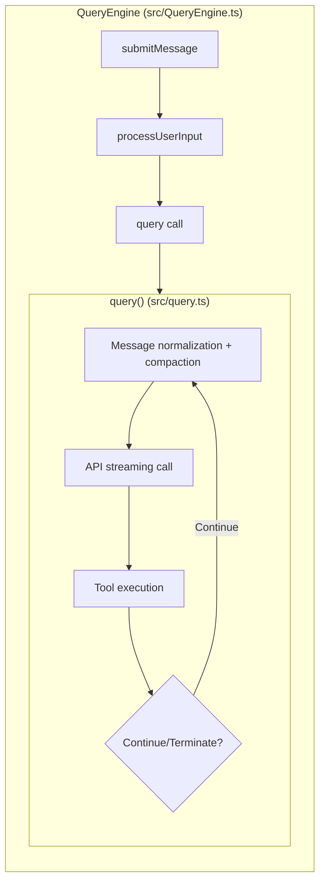
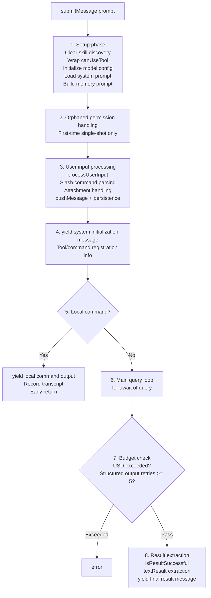
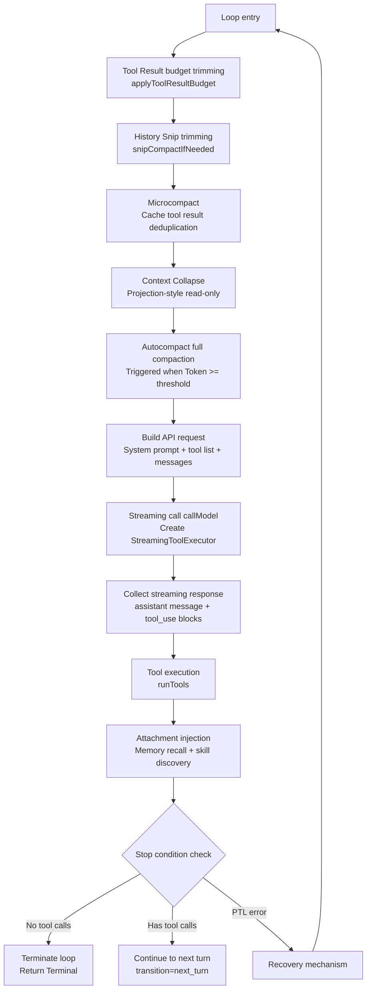
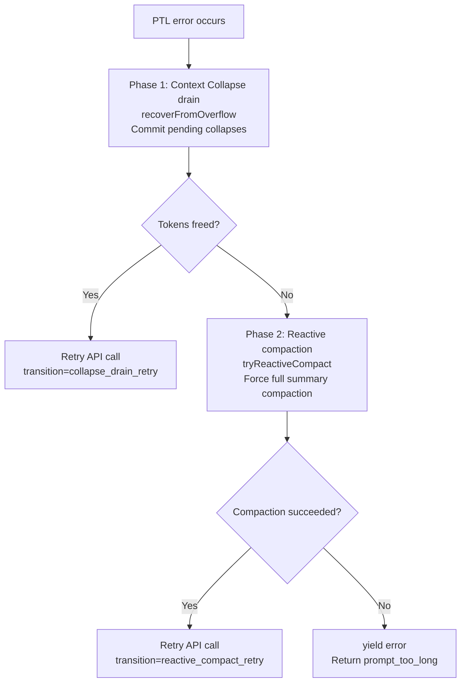
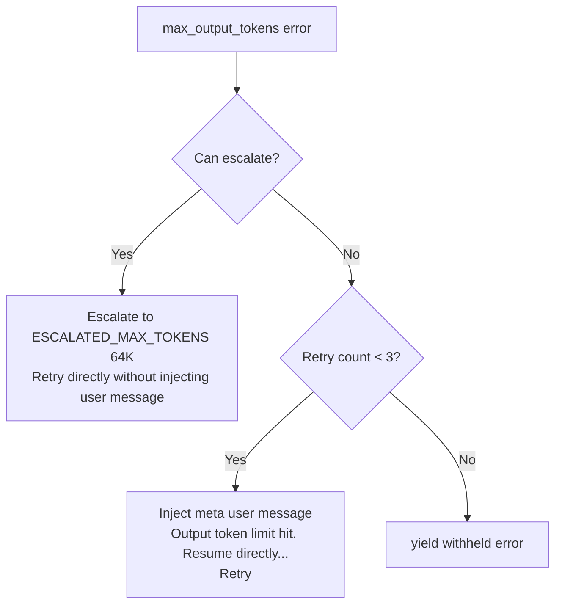

# Chapter 2: The Main Loop

> This is the most critical chapter of the entire Claude Code analysis. Understanding the main loop means understanding the soul of Claude Code.

## 2.1 The Big Picture: A Complete Interaction

When a user enters a message, Claude Code executes the following flow:

```
User Input → Context Assembly → Model Decision → Tool Execution → Result Injection → Continue/Stop
```

This loop repeats continuously until the model decides not to call any more tools — returning a plain text response. This is the essence of the Agent Loop.

## 2.2 Two-Layer Generator Architecture

Claude Code's query system employs a **two-layer generator architecture** that cleanly separates session management from query execution:



| Dimension | QueryEngine | query() |
|-----------|-------------|---------|
| Scope | Entire conversation lifecycle | Single query cycle |
| State | Persistent (mutableMessages, usage) | Loop-local (State object reassigned each iteration) |
| Budget tracking | USD/turn checks, structured output retries | Task Budget carried across compactions, Token budget continuation |
| Recovery strategy | Permission denial, orphaned permissions | PTL drain/compact, max_output_tokens escalation/retry |

Why split into two layers? Because **session management and query execution have entirely different concerns**. QueryEngine cares about "what did the user say, how much did it cost, was this turn's result successful"; query() cares about "do messages need compaction, what did the API return, did tool execution succeed, is recovery needed". The two-layer separation makes each layer's code more focused and easier to test.

## 2.3 QueryEngine: Session Lifecycle Management

`src/QueryEngine.ts` (1,155 lines) is the outer shell of a conversation. Its core method `submitMessage()` drives a complete user interaction.

### Full Configuration Parameters

QueryEngine receives all configuration through `QueryEngineConfig`:

```typescript
// src/QueryEngine.ts
export type QueryEngineConfig = {
  cwd: string                          // Working directory for tool execution
  tools: Tools                         // Available tool set (66+ built-in tools)
  commands: Command[]                  // Slash commands (/compact, /memory, /clear, etc.)
  mcpClients: MCPServerConnection[]    // Active MCP server connections
  agents: AgentDefinition[]            // Custom Agent definitions (from .claude/agents/)
  canUseTool: CanUseToolFn             // Permission checking function (multi-layer defense)
  getAppState: () => AppState          // Read UI state
  setAppState: (f: (prev: AppState) => AppState) => void  // Zustand-style immutable updates

  // Optional configuration
  initialMessages?: Message[]          // Initial messages for session restoration
  readFileCache: FileStateCache        // File state cache (deduplicate reads)
  customSystemPrompt?: string          // Completely override system prompt
  appendSystemPrompt?: string          // Append to end of system prompt
  userSpecifiedModel?: string          // Model override (e.g., claude-sonnet)
  fallbackModel?: string               // Fallback model on errors
  thinkingConfig?: ThinkingConfig      // Extended thinking configuration
  maxTurns?: number                    // Maximum tool call turns (safety limit)
  maxBudgetUsd?: number                // USD cost ceiling
  taskBudget?: { total: number }       // API-side Token budget
  jsonSchema?: Record<string, unknown> // Structured output JSON Schema
  verbose?: boolean                    // Verbose debug logging
  abortController?: AbortController    // Cancellation controller
  orphanedPermission?: OrphanedPermission  // Orphaned permission handling
}
```

A few noteworthy design details:

- **`canUseTool` wrapping**: Inside `submitMessage()`, this function is wrapped to track all permission denial events on top of the original permission checks. These denial records are ultimately returned in the result message to SDK consumers (such as the desktop app), letting them know which operations the user rejected
- **`readFileCache`**: Prevents the model from repeatedly reading the same file. If the model reads `src/query.ts` via `FileReadTool` on turn 3, when it requests the same file again on turn 5, the cache returns the existing content instead of re-reading from disk
- **`orphanedPermission`**: Handles an edge case — the previous session crashed after the user authorized "always allow BashTool", but the permission wasn't persisted. On next startup, this "orphaned permission" is replayed once

### submitMessage() Eight-Phase Lifecycle

`submitMessage()` drives a complete user interaction, divided into 8 phases:



**Detailed explanation of each phase**:

**Phase 1 — Setup**: Why clear skill discovery (`clearSkillDiscovery()`) every turn? Because skills are dynamically discovered during tool execution (via `SkillSearchTool`), and skills discovered in the previous turn may reference tools or configurations that no longer exist. Re-discovering each turn ensures skills are always up to date.

**Phase 2 — Orphaned permission**: Only triggers on the first `submitMessage()` call of a session, and only once (the `orphanedPermission` is cleared after use). This handles permission grants left over from a previous crashed session.

**Phase 3 — User input processing**: `processUserInput()` is a complex function that needs to:
- Parse slash commands (`/compact` triggers manual compaction, `/memory` manages memory, etc.)
- Process attachments (images, PDFs, file references)
- Push processed messages into `mutableMessages` and persist to disk

**Phase 5 — Local command check**: Commands like `/clear` don't need API calls — they only clean up local state. If `processUserInput()` sets `shouldQuery = false`, it directly yields the command output and returns early, skipping the entire query loop.

**Phase 6 — Main query loop**: This is the most complex phase. `for await (const msg of query(params))` iterates over the query generator, handling 7 different message types:
- `message_start` / `message_delta`: Update Token usage statistics
- `assistant` messages: Push to message list and yield to upper layer
- `progress` messages: Inline progress logging
- `user` messages: Tool result injection
- `compact_boundary`: Trigger snip/splice/GC cleanup
- `api_error`: Yield retry signal
- `tool_use_summary`: Tool usage summary

**Phase 7 — Budget check**: Two types of budget limits — USD cost (`getTotalCost() > maxBudgetUsd`) and structured output retry count (maximum 5 times).

**Phase 8 — Result extraction**: `isResultSuccessful()` checks whether the last assistant message is valid. The final yielded result message includes rich metadata: usage (Token consumption), cost (USD cost), turns (tool call turns), stop_reason, permission_denials (list of rejected permissions), etc.

## 2.4 query(): Implementation of the Core Loop

`src/query.ts` (1,728 lines) is Claude Code's most complex single module, implementing a **state-machine-based async generator loop**.

### Core Signature

```typescript
export async function* query(
  params: QueryParams,
): AsyncGenerator<StreamEvent | Message | ToolUseSummaryMessage, Terminal>
```

Key point: this is an `async function*` — an async generator. It doesn't return results all at once; instead, it **yields events as it executes**, allowing the caller to render streaming output in real time.

### Loop State

Each loop iteration shares a mutable `State` object:

```typescript
type State = {
  messages: Message[]           // Current message list
  toolUseContext: ToolUseContext // Tool execution context
  autoCompactTracking: AutoCompactTrackingState | undefined
  maxOutputTokensRecoveryCount: number   // Output Token recovery count
  hasAttemptedReactiveCompact: boolean   // Whether reactive compaction has been attempted
  maxOutputTokensOverride: number | undefined
  pendingToolUseSummary: Promise<ToolUseSummaryMessage | null> | undefined
  stopHookActive: boolean | undefined
  turnCount: number             // Current turn count
  transition: Continue | undefined  // Reason for last loop continuation
}
```

### Immutable Parameters vs Mutable State

There is an important design distinction inside `query()`:

```typescript
async function* queryLoop(params: QueryParams, consumedCommandUuids: string[]) {
  // Immutable parameters — never reassigned during the loop
  const { systemPrompt, userContext, systemContext, canUseTool,
          fallbackModel, querySource, maxTurns, skipCacheWrite } = params

  // Mutable cross-iteration state — updated via state = { ... } at 7 continue sites
  let state: State = {
    messages: params.messages,
    toolUseContext: params.toolUseContext,
    maxOutputTokensOverride: params.maxOutputTokensOverride,
    autoCompactTracking: undefined,
    // ...
  }
}
```

Fields from `params` are constants during the loop; `state` is updated via whole-object assignment at each continue site (rather than per-field mutation), making state changes more explicit and traceable.

### Single Loop Iteration Flow



### Loop Body Code Walkthrough

Let's walk through the key steps of the loop body following the code:

**Step 1: 4-Level Compaction Pipeline** (see [Chapter 3](/en/docs/03-context-engineering.md) for details)

At the entry of each loop iteration, the message list passes through Tool Result Budget → Snip → Microcompact → Context Collapse → Autocompact in sequence. This is a defensive design — even if the previous turn's tool returned 100K Tokens of output, the compaction pipeline will bring it within budget before the API call.

```typescript
// 1. Tool Result budget trimming
messagesForQuery = await applyToolResultBudget(messagesForQuery, ...)

// 2. History Snip (Feature-gated)
if (feature('HISTORY_SNIP')) {
  const snipResult = snipModule!.snipCompactIfNeeded(messagesForQuery)
  messagesForQuery = snipResult.messages
  snipTokensFreed = snipResult.tokensFreed
}

// 3. Microcompact
const microcompactResult = await deps.microcompact(messagesForQuery, ...)
messagesForQuery = microcompactResult.messages

// 4. Context Collapse (Feature-gated)
if (feature('CONTEXT_COLLAPSE') && contextCollapse) {
  const collapseResult = await contextCollapse.applyCollapsesIfNeeded(
    messagesForQuery, toolUseContext, querySource
  )
  messagesForQuery = collapseResult.messages
}
```

**Step 2: Build API Request**

```typescript
const fullSystemPrompt = asSystemPrompt(
  appendSystemContext(systemPrompt, systemContext)  // System context appended
)
// userContext is prepended to messages via prependUserContext()
```

The injection order of context matters for prompt caching: the system prompt (relatively stable) has system context (Git status, etc.) appended after it, while user context (CLAUDE.md, date) is prepended to messages. This arrangement allows the system prompt portion to be cached more efficiently.

**Step 3: Streaming Call + Parallel Tool Execution**

`callModel()` returns an async generator, and `StreamingToolExecutor` begins executing completed tool calls while still receiving the streaming response (see Section 2.5 for details).

**Step 4: Memory Prefetch Consumption**

```typescript
// Created at loop entry, using the `using` keyword to ensure disposal on all exit paths
using pendingMemoryPrefetch = startRelevantMemoryPrefetch(
  state.messages, state.toolUseContext,
)
```

`using` is TypeScript's Explicit Resource Management syntax — when the generator exits (whether through normal return or exception), `pendingMemoryPrefetch`'s `[Symbol.dispose]()` is automatically called, used for sending telemetry and cleaning up resources. Memory prefetch runs in parallel during model streaming generation, with a `settledAt` guard ensuring it is consumed only once per turn.

## 2.5 Streaming Processing and Parallel Tool Execution

Claude Code's streaming processing is not a simple "wait for API to return, then display". It uses `StreamingToolExecutor` to implement **streaming parallel tool execution**:

```
                    API Streaming Output
                    vvvvvvvvvv
    +----------------------------------+
    | StreamingToolExecutor            |
    |                                  |
    | tool_use_1 complete -> execute immediately --> | result ready
    | ...model continues generating...              |
    | tool_use_2 complete -> execute immediately --> | result ready
    | ...model continues generating...              |
    | tool_use_3 complete -> execute immediately --> | result ready
    +----------------------------------+

    Timeline comparison:
    Serial execution:   [===API===][tool1][tool2][tool3]
    Streaming parallel: [===API===]
                           [tool1]     <- Leverages streaming window (5-30s)
                              [tool2]  <- Covers ~1s tool latency
                                 [tool3]
                        [==Results immediately available==]
```

### StreamingToolExecutor Implementation

The core logic of `StreamingToolExecutor` (`src/services/tools/StreamingToolExecutor.ts`):

1. **`addToolUseBlock(block)`**: Called when the API streaming response has parsed a complete `tool_use` JSON block. Note that it's a "complete block" — it doesn't need to wait for the entire API response to finish; execution can be dispatched as soon as a single tool_use block's JSON parsing is complete
2. **Internal execution**: Each block is immediately submitted to `runTools()` for execution. Permission checks, input validation, and tool invocation all happen at this point
3. **`getCompletedResults()`**: Called after the API streaming response ends, collecting all completed tool execution results. Since tools have already started executing during streaming, most results are already ready at this point

The effect of this design is: during a typical API response (5-30 second streaming window), multiple tools can be dispatched and completed. By the time streaming ends, tool results are already available — eliminating the serial execution bottleneck.

## 2.6 Feature Flag Conditional Loading

At the beginning of `query.ts`, 4 Feature Flags are used for conditional module loading:

```typescript
import { feature } from 'bun:bundle'

const reactiveCompact = feature('REACTIVE_COMPACT')
  ? (require('./services/compact/reactiveCompact.js') as typeof import('./services/compact/reactiveCompact.js'))
  : null
const contextCollapse = feature('CONTEXT_COLLAPSE')
  ? (require('./services/contextCollapse/index.js') as typeof import('./services/contextCollapse/index.js'))
  : null
const snipModule = feature('HISTORY_SNIP')
  ? (require('./services/compact/snipCompact.js') as typeof import('./services/compact/snipCompact.js'))
  : null
const skillPrefetch = feature('EXPERIMENTAL_SKILL_SEARCH')
  ? (require('./services/skillSearch/prefetch.js') as typeof import('./services/skillSearch/prefetch.js'))
  : null
```

This pattern operates on three levels:
1. **Compile-time elimination**: `feature()` is evaluated at Bun bundler build time. In external builds, `feature('REACTIVE_COMPACT')` returns `false`, and the entire `require()` branch is tree-shaken
2. **Type safety**: `as typeof import(...)` lets TypeScript know the module's full type, so IDE completion and type checking are unaffected
3. **Runtime guard**: Code uses `if (contextCollapse) { contextCollapse.applyCollapsesIfNeeded(...) }`, and this null check is also eliminated at compile time

## 2.7 Seven Continue Sites

The `query()` loop has 7 positions that cause the loop to continue, each corresponding to a recovery strategy:

| Continue Reason | Trigger Condition | Handling |
|----------------|-------------------|----------|
| `next_turn` | Model called a tool | Normal continuation with tool results |
| `collapse_drain_retry` | PTL error + Context Collapse has pending items | Commit collapses, free Tokens, retry |
| `reactive_compact_retry` | PTL error + Collapse insufficient | Force full summary compaction, retry |
| `max_output_tokens_escalate` | Output Tokens insufficient | Escalate to 64K Token limit |
| `max_output_tokens_recovery` | Escalation unavailable/already used | Inject continuation prompt, retry up to 3 times |
| `stop_hook_blocking` | Stop Hook prevents termination | Continue execution |
| `token_budget_continuation` | Token budget continuation | Continue generating |

### PTL (Prompt-Too-Long) Recovery Flow



### Max-Output-Tokens Recovery



## 2.8 Error Withholding Strategy

This is one of Claude Code's most ingenious designs: **recoverable errors are not immediately yielded to the upper layer**.

### How It Works

When a `prompt_too_long` or `max_output_tokens` error occurs, query() does not immediately notify the caller. It pushes the error into `assistantMessages` but retains a reference, then runs recovery checks. If recovery succeeds, the error is **never exposed to the caller** (including SDK consumers and the desktop app) — the user is completely unaware of the intermediate error.

```typescript
// src/query.ts — Error withholding detection function
function isWithheldMaxOutputTokens(
  msg: Message | StreamEvent | undefined,
): msg is AssistantMessage {
  return msg?.type === 'assistant' && msg.apiError === 'max_output_tokens'
}
```

### A Practical Scenario

Suppose the model is editing a large file and gets truncated by `max_output_tokens` after generating 16,000 Tokens of output:

1. **Error occurs**: API returns `stop_reason: 'max_output_tokens'`
2. **Withhold rather than expose**: The error is wrapped as an `AssistantMessage` (with `apiError: 'max_output_tokens'`), pushed to the message list but **not yielded** to the caller
3. **Recovery strategy 1 — Escalation**: Check if escalation to `ESCALATED_MAX_TOKENS` (64K) is possible. If so, retry directly with a larger Token limit without injecting any user message
4. **Recovery strategy 2 — Continuation**: If escalation is unavailable or already used, inject a meta user message `"Output token limit hit. Resume directly from where you left off..."` to have the model continue from the breakpoint, with up to 3 retries
5. **Successful recovery**: If recovery succeeds, the withheld error message is never yielded — SDK consumers (such as the desktop app) see no errors, and the user perceives a smooth response

Only when all recovery attempts fail (escalation unavailable + all 3 continuation attempts fail) is the error yielded to the upper layer.

### Why This Design?

Without withholding, SDK consumers (desktop app, Bridge mode) would terminate the session upon receiving an `error`-type message — even though the backend recovery loop is still running, the frontend has already stopped listening. The withholding mechanism ensures the frontend only sees a "clean" result stream.

## 2.9 Token Usage Tracking

QueryEngine maintains comprehensive Token usage statistics:

```typescript
totalUsage: {
  input_tokens: 0,
  output_tokens: 0,
  cache_read_input_tokens: 0,
  cache_creation_input_tokens: 0,
  server_tool_use_input_tokens: 0,
}
```

Tracking mechanism:
- In each API response's `message_delta` event, `currentMessageUsage` is updated
- At `message_stop`, `currentMessageUsage` is accumulated into `totalUsage` via `accumulateUsage()`
- `getTotalCost()` calculates the total USD cost based on `totalUsage` and model pricing
- Once `getTotalCost() > maxBudgetUsd`, the entire query terminates — this is a safety mechanism to prevent unexpectedly high costs

Tracking `cache_read_input_tokens` and `cache_creation_input_tokens` is crucial for prompt caching strategy — they tell the system whether caching is working effectively. Cache break detection (`promptCacheBreakDetection.ts`) relies on this data to determine whether cache invalidation has occurred.

## 2.10 Stop Conditions

The loop terminates under the following conditions:

1. **Model did not call any tools**: Returns a plain text response, normal termination
2. **Maximum turns reached**: `maxTurns` limit
3. **USD budget exceeded**: `getTotalCost() > maxBudgetUsd`
4. **User interruption**: `abortController.signal` triggered
5. **Unrecoverable error**: All PTL/MOT recovery attempts failed
6. **Consecutive compaction failures**: 3 consecutive autocompact failures (circuit breaker)

> **Design Decision: Why is the circuit breaker threshold 3?**
>
> `MAX_CONSECUTIVE_AUTOCOMPACT_FAILURES = 3` (`src/services/compact/autoCompact.ts`). The source code comment cites production data: *"BQ 2026-03-10: 1,279 sessions had 50+ consecutive failures (up to 3,272) in a single session, wasting ~250K API calls/day globally."* Without this circuit breaker, once compaction entered a failure loop, it would retry indefinitely — each time consuming a full API call (~20K output tokens). The threshold of 3 strikes a balance between "giving the compaction service a chance to recover" and "avoiding resource waste".

> **Design Decision: Why use async generators instead of callbacks/events?**
>
> `query()` is an `async function*` that progressively outputs events via `yield`. Compared to callback patterns (like EventEmitter), generators have two key advantages: (1) **Backpressure control** — the producer won't continue executing until the consumer has processed the previous event, naturally preventing event accumulation; (2) **Linear control flow** — the loop's 7 continue sites can be expressed with ordinary `state = { ... }; continue`, without needing an explicit transition table for a state machine. The tradeoff is that the caller must consume with `for await...of`, but since QueryEngine is the only consumer in Claude Code, this constraint is perfectly acceptable.

## 2.11 Design Highlights Summary

1. **Two-layer generator separation of concerns**: QueryEngine manages the session lifecycle, query() manages the single-cycle loop
2. **Streaming parallel tool execution**: Leverages the API streaming window to cover tool latency
3. **Error withholding ensures imperceptible recovery for users**: Recoverable errors are not exposed to the upper layer
4. **7 precise continue sites**: Each recovery strategy has a clear transition marker, testable and traceable
5. **Compile-time Feature Gates**: Internal features are physically removed from external builds
6. **Task Budget carried across compactions**: Token budgets seamlessly persist before and after compaction

---

> **Hands-on Practice**: In [claude-code-from-scratch](https://github.com/Windy3f3f3f3f/claude-code-from-scratch)'s `src/agent.ts`, you can see a ~574-line Agent main loop implementation. Compare it with the two-layer generator architecture described in this chapter and consider: why doesn't the minimal implementation need two layers? At what scale does it become worthwhile to introduce a session management layer like QueryEngine? See the tutorial [Chapter 1: Agent Loop](https://github.com/Windy3f3f3f3f/claude-code-from-scratch/blob/main/docs/01-agent-loop.md).

Previous chapter: [Overview](/en/docs/01-overview.md) | Next chapter: [Context Engineering](/en/docs/03-context-engineering.md)
