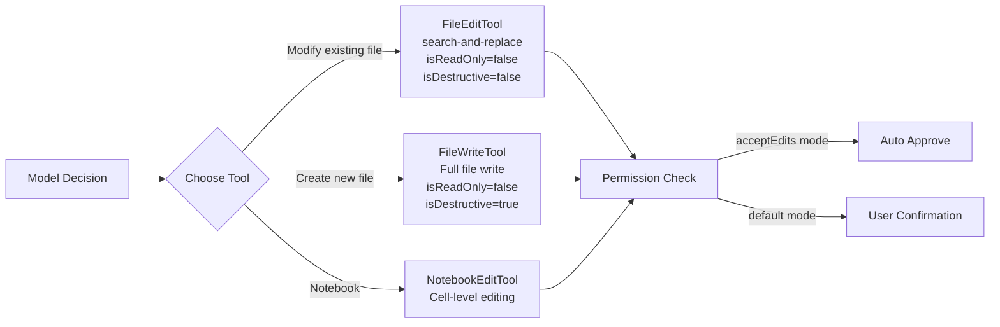

# Chapter 5: Code Editing Strategy

> A good coding agent doesn't just write code — it modifies code in a minimally destructive way.

## 5.1 Two Editing Tools

Claude Code provides two file editing tools, each suited for different scenarios:

| Tool | Strategy | Use Case | Destructiveness |
|------|----------|----------|-----------------|
| **FileEditTool** | search-and-replace | Modifying specific parts of existing files | Low |
| **FileWriteTool** | Full file overwrite | Creating new files or complete rewrites | High |

The system prompt explicitly guides the model: **prefer FileEditTool**. Only use FileWriteTool when creating entirely new files or when a complete rewrite is needed.

## 5.2 FileEditTool: The Search-and-Replace Approach

FileEditTool is the core tool for code editing in Claude Code, employing an exact string replacement strategy.

### Input Schema

```typescript
{
  file_path: string    // Absolute path of the file to edit
  old_string: string   // Exact string to be replaced
  new_string: string   // New string to replace with
  replace_all?: boolean // Whether to replace all occurrences (default false)
}
```

### How It Works

FileEditTool requires no line numbers, no regular expressions. Its operation is extremely simple:

1. Perform an exact search for `old_string` in the file
2. Ensure `old_string` appears **exactly once** in the file (unless `replace_all=true`)
3. Replace it with `new_string`
4. If `old_string` is not unique, return an error requesting more context

### Why Search-and-Replace Is Superior to Other Approaches

There are deep engineering considerations behind this design choice:

#### 1. Low Destructiveness

Search-and-replace only modifies the target text, leaving the rest of the file completely unchanged. In contrast, full file writes may:
- Accidentally lose unexpected content
- Introduce formatting changes (indentation, blank lines)
- Truncate content on large files due to token limits

#### 2. Verifiability

Every edit has a clear "before" and "after". Users can see precisely what was changed — which is much easier than reviewing an entirely new file.

#### 3. Hallucination Resistance

The model must provide an exact string that **actually exists** in the file. If the model "hallucinates" non-existent code, the edit will directly fail and return an error, rather than silently writing incorrect content.

#### 4. Token Efficiency

For small changes to large files, search-and-replace only needs to send context around the modification point, rather than the entire file content.

#### 5. Git Friendliness

Search-and-replace produces minimal, precise diffs. When creating automated PRs, reviewers see clean, targeted changes.

#### Comparison with Alternative Approaches

Before settling on the search-and-replace approach, it's worth understanding why other seemingly reasonable alternatives were ruled out:

**Line-number-based editing** (e.g., `edit line 42-45`): This is the most intuitive approach, but also the most fragile. The problem is that line numbers are **position-dependent** — when the model needs to make multiple edits to the same file in a single conversation turn, the first edit (say, inserting 3 lines at line 10) causes all subsequent line numbers to shift. The model would either need complex line number recalculation logic, or could only guarantee editing one location at a time. Search-and-replace is **position-independent**: no matter how many lines are inserted above, the target string's content doesn't change, and matching always works.

**AST-based editing** (e.g., `rename function foo to bar`): This approach is elegant in theory but impractical in reality. Claude Code needs to support dozens of programming languages, and maintaining a complete AST parser for each language would be extremely costly. The more critical issue is: **files with syntax errors are precisely the files that most need editing**, but AST parsers refuse to parse when encountering syntax errors. This means in the scenarios where the editing tool is needed most (fixing bugs, fixing syntax errors), the tool becomes unavailable.

**Unified diff/patch format** (e.g., having the model directly output `@@ -1,3 +1,4 @@` format diffs): LLMs perform poorly at generating this strict format. Unified diff requires precise hunk headers (starting line numbers and line counts), requires every line to correctly use `+`/`-`/space prefixes, and context line counts must match the header declarations. Any single character deviation causes the entire patch to fail. In contrast, search-and-replace only requires the model to provide two natural-language-level strings — which is exactly the type of task LLMs excel at.

**Full file rewrite** (i.e., the FileWriteTool approach): This works for small files, but has serious problems for large files. For a 500-line file, even if only one line needs changing, the model must output the complete 500 lines. This not only wastes tokens, but more dangerously, the model may **omit unmodified code** during output — especially in parts of the file with high repetition (such as a series of similar case statements). Moreover, users cannot quickly review changes: finding the one actually modified line in a 500-line new file is like looking for a needle in a haystack.

**Hallucination safety is the most underrated advantage of search-and-replace**. Consider this scenario: the model "remembers" a `handleError()` function in the file, but in reality this function was renamed to `processError()` in the last refactoring. If using search-and-replace, the model providing `old_string: "function handleError()"` will directly fail (error code 8: "String to replace not found in file"), and the model will re-read the file upon seeing the error and discover the correct function name. If using full file rewrite, the model might write out a complete file containing `handleError()`, overwriting the correct `processError()` — and this error is completely silent, with no error message at all.

### Input Preprocessing Pipeline

Before entering the core validation and execution flow, the model's input goes through a preprocessing stage. `normalizeFileEditInput()` is called before `validateInput`, responsible for cleaning common imperfections in model output:

**1. Trailing Whitespace Trimming**

When generating code, models frequently add extra spaces or tabs at the end of lines. `stripTrailingWhitespace()` removes trailing whitespace characters from each line of `new_string`. However, this rule has an important exception: **`.md` and `.mdx` files are exempt from trailing whitespace trimming**. This is because in Markdown syntax, two trailing spaces represent a hard line break (`<br>`), and trimming them would change the document's semantics.

```typescript
// Markdown uses two trailing spaces as hard line breaks — trimming would change semantics
const isMarkdown = /\.(md|mdx)$/i.test(file_path)
const normalizedNewString = isMarkdown
  ? new_string
  : stripTrailingWhitespace(new_string)
```

**2. API Desanitization**

For security reasons, the Claude API "sanitizes" certain XML tags into short forms, preventing model output from being misinterpreted as API control tags. For example:

| Sanitized (what the model sees) | Original form (in the file) |
|---|---|
| `<fnr>` | `<function_results>` |
| `<n>` / `</n>` | `<name>` / `</name>` |
| `<s>` / `</s>` | `<system>` / `</system>` |
| `\n\nH:` | `\n\nHuman:` |
| `\n\nA:` | `\n\nAssistant:` |

When the model's `old_string` output cannot exactly match the file content, `desanitizeMatchString()` attempts to restore these sanitized short forms back to their original tags. If the restoration leads to a successful match, the same replacements are applied to `new_string` as well, ensuring edit consistency.

This preprocessing stage is completely transparent to users — in most cases, users won't even realize it exists. But for editing files containing XML tags or special strings like `Human:`/`Assistant:` (e.g., prompt template files), it is critical to whether the edit succeeds.

### Complete Validation Pipeline

The `validateInput()` method of FileEditTool implements a multi-layered validation pipeline that intercepts various issues before the edit is actually executed. The order of validation is deliberately designed: **low-cost checks come first, checks requiring file I/O come in the middle, and checks depending on file content come last**. This way, issues that can be caught early don't waste subsequent disk read overhead.

The complete validation steps and their corresponding error codes:

| Step | Error Code | Check | Purpose |
|------|------------|-------|---------|
| 1 | 0 | `checkTeamMemSecrets()` | Prevent writing secrets to team memory files |
| 2 | 1 | `old_string === new_string` | Reject meaningless no-op operations |
| 3 | 2 | Permission deny rule matching | Respect user-configured path exclusion rules |
| 4 | — | UNC path detection | Security: prevent Windows NTLM credential leakage |
| 5 | 10 | File size > 1 GiB | Prevent OOM due to V8 string length limits |
| 6 | — | File encoding detection | Determine UTF-16LE or UTF-8 via BOM |
| 7 | 4 | File doesn't exist + `old_string` non-empty | Target file not found; attempt to suggest similar files |
| 8 | 3 | `old_string` empty + file already has content | Block overwriting existing files using "create new file" semantics |
| 9 | 5 | `.ipynb` extension detection | Redirect to NotebookEditTool |
| 10 | 6 | `readFileState` missing or `isPartialView` | File hasn't been read — must read first |
| 11 | 7 | `mtime > readTimestamp.timestamp` | File modified externally — needs re-reading |
| 12 | 8 | `findActualString()` returns null | `old_string` doesn't exist in the file |
| 13 | 9 | Match count > 1 and `replace_all=false` | Multiple matches but global replace not specified |
| 14 | 10 | `validateInputForSettingsFileEdit()` | JSON Schema validation for Claude config files |

Several steps are worth discussing in detail:

**Steps 7-8: Dual gating for file creation**. An empty `old_string` has special semantics — it means "create a new file". When `old_string` is empty and the file doesn't exist, validation passes directly; when `old_string` is empty but the file exists and has content (error code 3), the operation is blocked to prevent the model from accidentally overwriting existing files using creation semantics. However, if the file exists but its content is empty (`fileContent.trim() === ''`), it is allowed through — this handles the edge case of "an empty file is equivalent to non-existent".

**Step 12: String lookup**. This step calls the previously introduced `findActualString()`, first attempting exact matching, then attempting matching after quote normalization. If neither method finds a match, it returns error code 8 along with the content of `old_string`, helping the model understand why the match failed. Additionally, the error response includes `isFilePathAbsolute` metadata — because a common failure cause is the model using a relative path, resulting in searching in the wrong directory.

**Step 14: Config file protection**. For config files like `.claude/settings.json`, validation not only checks whether `old_string` exists, but also **simulates executing the edit** and verifies whether the result conforms to the JSON Schema. This prevents a dangerous scenario: a seemingly reasonable edit could corrupt the config file format, preventing Claude Code from starting properly.

### Uniqueness Constraint

In the validation pipeline above, the uniqueness constraint in step 13 deserves separate discussion. FileEditTool requires `old_string` to appear exactly once in the file. If it's not unique, the edit fails with the message:

```
Found N matches of the string to replace, but replace_all is false.
To replace all occurrences, set replace_all to true.
To replace only one occurrence, please provide more context to uniquely identify the instance.
```

The design philosophy behind this constraint is "better to fail than to guess":

- **Prevent ambiguity**: If `old_string` is `return null`, there may be 5 occurrences of `return null` in the file. Without the uniqueness constraint, the tool would only replace the first match — but the model might intend to replace the third one. Failing and requesting more context from the model (such as including surrounding function signatures) is far safer than speculatively replacing the first occurrence
- **Require contextual understanding**: This forces the model to truly understand the code structure before editing. The model cannot take shortcuts by providing just a keyword — it must provide enough contextual snippet to uniquely identify the modification point
- **`replace_all` as an explicit escape valve**: When batch operations like variable renaming are needed, the model must explicitly set `replace_all: true`. This design makes batch replacement a "deliberate choice" rather than an "accidental consequence"

### Implementation Details: From Matching to Writing

#### Quote Normalization

Files may contain curly quotes, which is common in code copied from Word, Google Docs, or web pages. However, the model always outputs straight quotes. Without handling this, `old_string` would fail to match due to quote mismatches.

Claude Code implements a quote normalization mechanism in `utils.ts`:

```typescript
// normalizeQuotes() converts all curly quotes to straight quotes for matching
function normalizeQuotes(str: string): string {
  return str
    .replaceAll('\u201C', '"')   // "left double curly → straight
    .replaceAll('\u201D', '"')   // "right double curly → straight
    .replaceAll('\u2018', "'")   // 'left single curly → straight
    .replaceAll('\u2019', "'")   // 'right single curly → straight
}
```

`findActualString()` implements a two-phase matching strategy:

```typescript
function findActualString(fileContent: string, searchString: string): string | null {
  // Phase 1: Exact match
  if (fileContent.includes(searchString)) {
    return searchString
  }

  // Phase 2: Retry after normalizing quotes
  const normalizedSearch = normalizeQuotes(searchString)
  const normalizedFile = normalizeQuotes(fileContent)

  const searchIndex = normalizedFile.indexOf(normalizedSearch)
  if (searchIndex !== -1) {
    // Return the original string from the file (preserving curly quotes)
    return fileContent.substring(searchIndex, searchIndex + searchString.length)
  }

  return null
}
```

It's worth noting that when a match succeeds through quote normalization, Claude Code also uses `preserveQuoteStyle()` to convert straight quotes in `new_string` back to curly quotes, maintaining the file's typographic consistency. This function uses heuristic rules to determine the opening/closing position of quotes — a quote preceded by whitespace or an opening bracket is a left quote, otherwise it's a right quote — and correctly handles apostrophes in contractions (e.g., `don't`).

In addition to quote normalization, there is a **desanitization** mechanism: the Claude API sanitizes certain XML tags (such as `<function_results>`, `<name>`, etc.) into short forms (`<fnr>`, `<n>`), and the model uses the sanitized forms when outputting edits. `desanitizeMatchString()` automatically restores these tags when matching fails.

#### Diff Generation

`getPatchForEdit()` is responsible for converting edit operations into structured diff patches:

```typescript
function getPatchForEdits({ filePath, fileContents, edits }): {
  patch: StructuredPatchHunk[]
  updatedFile: string
} {
  let updatedFile = fileContents

  for (const edit of edits) {
    const previousContent = updatedFile
    updatedFile = applyEditToFile(updatedFile, edit.old_string, edit.new_string, edit.replace_all)

    // If the edit didn't change anything, throw an error
    if (updatedFile === previousContent) {
      throw new Error('String not found in file. Failed to apply edit.')
    }
  }

  // Use the diff library's structuredPatch to generate hunks
  // Note: tabs are converted to spaces first for display purposes
  const patch = getPatchFromContents({
    filePath,
    oldContent: convertLeadingTabsToSpaces(fileContents),
    newContent: convertLeadingTabsToSpaces(updatedFile),
  })

  return { patch, updatedFile }
}
```

Before calling `structuredPatch`, `&` and `$` characters in the content are escaped (replaced with special tokens) because the diff library has bugs when processing these characters. After the diff computation, they are unescaped back.

#### Special Handling of Delete Operations

When `new_string` is empty (i.e., a delete operation), `applyEditToFile()` has a thoughtful detail: it checks whether `old_string + '\n'` exists in the file — if so, it deletes the trailing newline character along with the content. This prevents the common problem of leaving an empty line after deleting a line of code.

```typescript
if (newString !== '') {
  return f(originalContent, oldString, newString)  // Normal replacement, execute precisely
}

// Delete scenario: if old_string is immediately followed by a newline, delete the newline too
const stripTrailingNewline =
  !oldString.endsWith('\n') && originalContent.includes(oldString + '\n')

return stripTrailingNewline
  ? f(originalContent, oldString + '\n', newString)  // Delete old_string + newline
  : f(originalContent, oldString, newString)          // Delete only old_string
```

For example: suppose the file content is `line1\nline2\nline3\n`, and the model wants to delete `line2`. If we directly replace `"line2"` with `""`, the result is `line1\n\nline3\n` — an extra blank line. With this handling, what's actually deleted is `"line2\n"`, and the result is `line1\nline3\n`, matching user expectations.

Note that this behavior only triggers when `new_string` is empty; normal replacement operations are unaffected. This is a good example of "doing the right thing" design — users don't need to know this mechanism exists, but it ensures delete operations always produce intuitive results.

#### Edit Deduplication

In practice, the model occasionally sends duplicate edit requests due to retry logic and other reasons. Claude Code performs **semantic deduplication** via `areFileEditsInputsEquivalent()` — it doesn't just compare whether two sets of edits have identical literal values, but applies both sets of edits to the current file content and compares whether the final results are identical:

```typescript
function areFileEditsEquivalent(edits1, edits2, originalContent): boolean {
  // Fast path: literal values are completely identical
  if (edits1.length === edits2.length &&
      edits1.every((e1, i) => e1.old_string === edits2[i].old_string && ...)) {
    return true
  }

  // Slow path: apply both sets of edits separately, compare results
  const result1 = getPatchForEdits({ fileContents: originalContent, edits: edits1 })
  const result2 = getPatchForEdits({ fileContents: originalContent, edits: edits2 })
  return result1.updatedFile === result2.updatedFile
}
```

This semantic comparison can identify edits that are "different in input but identical in effect". For example, two sets of edits might use different lengths of `old_string` context, but the final modifications are completely identical — they will be correctly determined as equivalent, avoiding redundant execution.

## 5.3 FileWriteTool: Full File Write

FileWriteTool is positioned for creating new files or complete rewrites:

```typescript
{
  file_path: string    // Absolute file path
  content: string      // Complete file content
}
```

Usage guidelines from the system prompt:
- For existing files, **must first read content using the Read tool**, then edit
- Prefer using the Edit tool for modifying existing files — it only sends the diff
- Only use Write when creating new files or for complete rewrites
- **Never create documentation files** (.md/README) unless the user explicitly requests it
- Avoid using emojis unless the user requests them

### Line Ending Strategy: Why Write Always Uses LF

FileWriteTool **always uses LF line endings** when writing to disk, without preserving the original file's line ending style:

```typescript
// Write is full content replacement — the explicit newlines the model sends are its intent. Don't rewrite them.
writeTextContent(fullFilePath, content, enc, 'LF')
```

This decision comes from a real bug lesson. The source code comments record the history:

> *Previously we preserved the old file's line endings (or sampled the repo via ripgrep for new files), which silently corrupted e.g. bash scripts with `\r` on Linux when overwriting a CRLF file or when binaries in cwd poisoned the repo sample.*

The old version would preserve the original file's line ending style (for new files, it would sample other files in the repository via ripgrep to decide). But this caused two problems:
1. When overwriting a CRLF file on Linux, Write would add `\r` to the new content, causing bash scripts to fail execution due to the trailing `\r` at line ends
2. When the working directory contains binary files, ripgrep sampling might misidentify binary content as CRLF, polluting the new file's line endings

**This forms a deliberate asymmetry with FileEditTool**:

| | FileEditTool | FileWriteTool |
|---|---|---|
| **Line endings** | Preserve original file's line ending style | Always LF |
| **Encoding** | Preserve original file encoding | Preserve original file encoding |
| **Design principle** | Minimal change — only modify the target text | Model intent — content is truth |

Why are they different? FileEditTool only modifies a small part of the file, and preserving line ending style is a natural extension of the "minimal change" principle. FileWriteTool replaces the entire file, and the content the model sends (including line endings) represents its complete intent, which should not be overridden at the tool level.

### Encoding Detection

FileEditTool's validation pipeline includes a BOM (Byte Order Mark) detection step for correctly reading files in non-UTF-8 encodings:

```typescript
const fileBuffer = await fs.readFileBytes(fullFilePath)
const encoding: BufferEncoding =
  fileBuffer.length >= 2 &&
  fileBuffer[0] === 0xff &&
  fileBuffer[1] === 0xfe
    ? 'utf16le'
    : 'utf8'
```

If the first two bytes of the file are `0xFF 0xFE` (the BOM for UTF-16LE), UTF-16LE decoding is used; otherwise, it defaults to UTF-8. The complete `detectEncodingForResolvedPath()` also recognizes UTF-8 BOM (`0xEF 0xBB 0xBF`), and defaults empty files to UTF-8 (rather than ASCII), avoiding encoding corruption when subsequently writing emojis or Chinese characters.

### Security Validation

FileWriteTool performs multiple layers of security checks before executing the write, sharing core validation logic with FileEditTool:

```typescript
// 1. Team memory secret check
const secretError = checkTeamMemSecrets(fullFilePath, content)

// 2. Permission deny rule matching
const denyRule = matchingRuleForInput(fullFilePath, ..., 'edit', 'deny')

// 3. Windows UNC path check: prevent NTLM credential leakage
if (fullFilePath.startsWith('\\\\') || fullFilePath.startsWith('//')) {
  return { result: true }  // Skip filesystem operations, let the permission system handle it
}

// 4. File existence check + mtime validation
const fileStat = await fs.stat(fullFilePath)
const lastWriteTime = Math.floor(fileStat.mtimeMs)

// 5. Read prerequisite check
const readTimestamp = toolUseContext.readFileState.get(fullFilePath)
if (!readTimestamp || readTimestamp.isPartialView) {
  return { result: false, message: 'File has not been read yet.' }
}

// 6. External modification detection
if (lastWriteTime > readTimestamp.timestamp) {
  return { result: false, message: 'File has been modified since read.' }
}
```

FileWriteTool shares the same `readFileState` caching mechanism with FileEditTool — for existing files, **you must read before you can write**. This constraint is enforced at the code level, not just as a suggestion in the prompt. It's worth noting that if the file doesn't exist (ENOENT), validation passes directly — because this is the normal scenario of "creating a new file".

FileEditTool additionally checks file size (1 GiB upper limit) to prevent OOM caused by V8/Bun string length limitations (approximately 2^30 characters):

```typescript
const MAX_EDIT_FILE_SIZE = 1024 * 1024 * 1024 // 1 GiB
const { size } = await fs.stat(fullFilePath)
if (size > MAX_EDIT_FILE_SIZE) {
  return { result: false, message: `File is too large to edit (${formatFileSize(size)}).` }
}
```

## 5.4 Multi-File Edit Coordination

When coordinated modifications across multiple files are needed (such as renaming a widely referenced function), Claude Code's strategy is:

### Serial Editing

Since FileEditTool's `isReadOnly()` returns `false`, multiple file edit operations are **executed serially**. This ensures:
- No race conditions
- Each edit is based on the file's latest state
- If an intermediate edit fails, subsequent edits won't continue on an erroneous basis

### Atomicity Considerations

A single FileEditTool call is atomic — it either successfully replaces or doesn't modify at all. However, a sequence of edits across multiple files is not atomic. If a failure occurs midway, completed edits are not rolled back.

This is an intentional design tradeoff:
- A rollback mechanism would add enormous complexity
- Git provides natural rollback capability (`git checkout`)
- The model can autonomously fix issues after a failure

### Cascade Edit Protection

When multiple edit operations execute sequentially on the same file, there is a subtle risk: text inserted by a previous edit might be accidentally matched by a subsequent edit. `getPatchForEdits()` prevents this cascade error through substring checking:

```typescript
const appliedNewStrings: string[] = []

for (const edit of edits) {
  const oldStringToCheck = edit.old_string.replace(/\n+$/, '')

  // Check if the current old_string is a substring of any previous new_string
  for (const previousNewString of appliedNewStrings) {
    if (oldStringToCheck !== '' && previousNewString.includes(oldStringToCheck)) {
      throw new Error(
        'Cannot edit file: old_string is a substring of a new_string from a previous edit.'
      )
    }
  }

  // ... execute edit ...
  appliedNewStrings.push(edit.new_string)
}
```

For example: suppose edit A replaces `foo()` with `foo() // calls bar()`, and edit B wants to replace `bar()` with `baz()`. Without cascade protection, edit B's `old_string: "bar()"` would match the `bar()` in the comment just inserted by edit A, turning the comment into `// calls baz()` — which is not the model's intent. With the substring check, the system detects that `"bar()"` is a substring of the previous `new_string` and directly throws an error, letting the model rethink its editing strategy.

Note that before the check, trailing newlines are stripped from `old_string` (`replace(/\n+$/, '')`) to avoid false positives caused by newline character differences.

### Worktree Isolation

For large-scale refactoring, AgentTool supports Git Worktree isolation mode. Sub-agents work in an independent Worktree, and the user decides whether to merge upon completion:

```typescript
{
  prompt: "Refactor all API handler functions...",
  isolation: 'worktree'  // Work in an independent Worktree
}
```

## 5.5 Read-Before-Edit Requirement

The system prompt mandates: **you must read a file before editing it**.

```
You MUST use your Read tool at least once in the conversation
before editing. This tool will error if you attempt an edit
without reading the file.
```

This is not merely a prompt-level constraint — FileEditTool's implementation actually checks the `readFileState` cache, and returns an error (error code 6) if the file hasn't been read.

This design ensures the model:
1. Understands the file's current state
2. Doesn't edit based on stale memory
3. Can provide the correct `old_string`

### What Would Happen Without This Constraint?

Consider a real usage scenario to understand the necessity of the read prerequisite:

**Scenario 1: Stale memory**. The user asks Claude in the 3rd conversation turn to modify the `formatDate()` function in `utils.ts`. Claude read this file in the 1st turn and knows the function signature is `function formatDate(date: Date)`. But in the 2nd turn, the user manually changed the signature in the IDE to `function formatDate(date: Date, locale?: string)`. Without the read prerequisite constraint, Claude would generate `old_string: "function formatDate(date: Date)"` based on the old version in the conversation history — this string no longer exists in the current file (because of the added `locale` parameter), and the edit would fail. Even worse, if Claude used FileWriteTool for a full file rewrite, the old version's content would directly overwrite the user's manual modification.

**Scenario 2: The `isPartialView` trap**. Some files have additional content injected when Read (e.g., comments in HTML files are stripped, `MEMORY.md` is truncated). These files' `readFileState` is marked as `isPartialView: true`. If editing based on a partial view were allowed, the content the model sees wouldn't match the file's actual content, and `old_string` would very likely fail to match or match at the wrong location.

The implementation of the read prerequisite constraint is also noteworthy — it distinguishes between "never read" and "read but partial view", rejecting edits for both:

```typescript
const readTimestamp = toolUseContext.readFileState.get(fullFilePath)
if (!readTimestamp || readTimestamp.isPartialView) {
  return {
    result: false,
    message: 'File has not been read yet. Read it first before writing to it.',
    errorCode: 6,
  }
}
```

### Concurrency Safety: File State Cache

`readFileState` is a cache in the tool context that records the read state of each file:

```typescript
// Cache entry for each file in readFileState
interface FileStateEntry {
  content: string       // File content (for match validation and content comparison)
  timestamp: number     // mtime at read time (for external modification detection)
  offset?: number       // Read start line (recorded during partial reads)
  limit?: number        // Number of lines read (recorded during partial reads)
  isPartialView?: boolean // Whether it's a partial view
}
```

The concurrency detection flow before editing:

```
1. Read the file's current mtime (via fs.stat or getFileModificationTime)
2. Compare with the cached timestamp in readFileState
3. If mtime > timestamp → file modified externally → return warning
4. Windows fallback: when mtime is unreliable (cloud sync, antivirus software, etc. may
   trigger mtime changes), use content hash/full comparison as secondary confirmation
```

This solves a common race condition: the user editing a file in the IDE while Claude Code is also editing the same file. The mtime check catches this concurrent modification, preventing overwriting the user's manual changes.

In the specific implementation, the mtime check on Windows has special handling. Because cloud sync (OneDrive), antivirus software, etc. on Windows may update mtime without modifying file content, when an mtime change is detected, if it's a full read (not a partial read with offset/limit), an additional content comparison is performed — if the content is the same, it's considered safe to proceed with the edit:

```typescript
const isFullRead = lastRead.offset === undefined && lastRead.limit === undefined
const contentUnchanged = isFullRead && currentContent === lastRead.content
if (!contentUnchanged) {
  throw new Error('File unexpectedly modified')
}
```

After a successful edit, `readFileState` is immediately updated with the new content and timestamp, preventing false positives in subsequent edits. This update is crucial — without it, when the model makes a second edit to the same file in the same turn, the new mtime (caused by the just-completed write) would be greater than the old readTimestamp, triggering a false "file modified externally" alarm. After the update, subsequent edits can proceed normally without re-reading the file.

## 5.6 Indentation Preservation

The system prompt provides explicit guidance about indentation:

```
When editing text from Read tool output, ensure you preserve
the exact indentation (tabs/spaces) as it appears AFTER the
line number prefix.
```

This is particularly important because the Read tool's output includes line number prefixes (`cat -n` format), and the model needs to correctly distinguish between the line number prefix and the actual indentation in the file content.

## 5.7 NotebookEditTool: Jupyter Editing

For Jupyter Notebooks (`.ipynb` files), Claude Code provides the specialized NotebookEditTool, which understands Notebook cell structure and performs precise editing at the cell level.

### Input Schema

```typescript
{
  notebook_path: string     // Absolute path of the .ipynb file
  cell_id?: string          // Target cell's ID (or cell-N format index)
  new_source: string        // New cell content
  cell_type?: 'code' | 'markdown'  // Cell type (required for insert)
  edit_mode?: 'replace' | 'insert' | 'delete'  // Edit mode (default replace)
}
```

### How It Works

A Jupyter Notebook is essentially a JSON file with a core structure of a `cells` array. Each cell contains `cell_type`, `source`, `metadata`, and code-cell-specific `outputs` and `execution_count`.

The three edit modes of NotebookEditTool:

- **replace**: Replace the `source` content of the specified cell. For code cells, it simultaneously resets `execution_count` to `null` and clears `outputs` — because the source code has changed, old outputs are no longer valid
- **insert**: Insert a new cell after the specified cell. If `cell_id` is not specified, it inserts at the beginning. For notebooks with nbformat >= 4.5, a random cell ID is automatically generated
- **delete**: Delete the specified cell, implemented via `cells.splice(cellIndex, 1)`

### Cell Positioning

Cell positioning supports two methods:
1. **Native cell ID**: Directly using each cell's `id` field in the notebook
2. **Index format**: `cell-N` format (e.g., `cell-0`, `cell-3`), parsed into a numeric index by `parseCellId()`

### Permissions and Security

NotebookEditTool shares the same security mechanisms as FileEditTool:
- **Read prerequisite check**: Must read the notebook file before editing (consistent with FileEditTool/FileWriteTool)
- **External modification detection**: Detects whether the file was externally modified via mtime comparison
- **UNC path protection**: Also intercepts Windows UNC paths
- **Permission grouping**: In `acceptEdits` permission mode, NotebookEditTool is automatically approved like FileEditTool, without requiring user confirmation

After writing, it also updates the `readFileState` cache, maintaining consistency with other editing tools.

## 5.8 Atomic Writes and LSP Integration

FileEditTool's `call()` method implements a complete edit execution pipeline, from file reading to various post-write side effects:

```typescript
async call(input, context) {
  // === Pre-write preparation (can be async) ===

  // 1. Discover skill directories (fire-and-forget)
  const newSkillDirs = await discoverSkillDirsForPaths([absoluteFilePath], cwd)
  addSkillDirectories(newSkillDirs).catch(() => {})  // Don't wait

  // 2. Ensure parent directory exists
  await fs.mkdir(dirname(absoluteFilePath))

  // 3. File history backup (deduplicated by content hash, v1 backup format)
  await fileHistoryTrackEdit(updateFileHistoryState, absoluteFilePath, messageId)

  // === Critical section: avoid async operations to preserve atomicity ===

  // 4. Synchronously read file (with encoding and line ending metadata)
  const { content, encoding, lineEndings } = readFileSyncWithMetadata(filePath)

  // 5. Staleness detection (mtime + content comparison)
  const lastWriteTime = getFileModificationTime(absoluteFilePath)
  if (lastWriteTime > lastRead.timestamp) { /* ... throw error */ }

  // 6. Quote normalization + find match
  const actualOldString = findActualString(content, old_string)
  const actualNewString = preserveQuoteStyle(old_string, actualOldString, new_string)

  // 7. Generate patch
  const { patch, updatedFile } = getPatchForEdit(/* ... */)

  // 8. Write to disk (preserving original encoding and line endings)
  writeTextContent(absoluteFilePath, updatedFile, encoding, lineEndings)

  // === Post-write side effects ===

  // 9. Notify LSP server
  lspManager.changeFile(absoluteFilePath, updatedFile)  // didChange
  lspManager.saveFile(absoluteFilePath)                  // didSave

  // 10. Notify VSCode (for diff view)
  notifyVscodeFileUpdated(absoluteFilePath, originalContent, updatedFile)

  // 11. Update readFileState cache
  readFileState.set(absoluteFilePath, {
    content: updatedFile,
    timestamp: getFileModificationTime(absoluteFilePath),
  })

  // 12. Statistics and telemetry
  countLinesChanged(patch)
  logFileOperation({ operation: 'edit', tool: 'FileEditTool', filePath })
}
```

Several key design points:

**Critical section minimization**: Steps 4-8 deliberately avoid any `await` async operations. The comments explicitly state *"Please avoid async operations between here and writing to disk to preserve atomicity"*. Why is this so important? JavaScript/TypeScript is single-threaded but event-loop-based — every `await` is a point where control is yielded. If there were an `await` between staleness detection (step 5) and writing to disk (step 8), another async operation (such as linter auto-fix, IDE save) could modify the file in that gap, causing the write to overwrite external modifications. Moving async-capable operations like file history backup and directory creation outside the critical section ensures no interruption between detection and writing.

**Complete round-trip pipeline for encoding and line endings**. FileEditTool's handling of file encoding and line endings follows the "write back what you read" principle, with the entire pipeline divided into three stages:

1. **Read stage** (`readFileSyncWithMetadata()`):
   - Detect encoding: via BOM (`0xFF 0xFE` → UTF-16LE, `0xEF 0xBB 0xBF` → UTF-8 with BOM, default UTF-8)
   - Detect line endings: scan the first 4096 code units of the original content, count CRLF and standalone LF occurrences, majority vote to determine the line ending style
   - Normalize content: unify all `\r\n` to `\n`, so internal processing is entirely based on LF

2. **Processing stage**: All string matching, replacement, and diff generation are based on LF-normalized content. This simplifies the `old_string` matching logic — the model doesn't need to worry about whether the target file uses LF or CRLF

3. **Write stage** (`writeTextContent()`):
   - If the detected original line endings are CRLF: first replace all `\n` in the content with `\r\n`
   - Write to disk using the detected original encoding

This means editing a UTF-16LE + CRLF file (legacy text files on Windows) is internally processed entirely with UTF-8 + LF, and restored to UTF-16LE + CRLF upon writing — the file's encoding and line ending style remain completely unchanged.

**LSP notifications**: After the edit is complete, the LSP server is immediately notified in two steps — `changeFile()` (corresponding to `textDocument/didChange`) informs that the content has been modified, and `saveFile()` (corresponding to `textDocument/didSave`) triggers diagnostic updates from language servers like the TypeScript server. These notifications are all fire-and-forget (`.catch()` only logs), and do not block the edit return. At the same time, previously delivered diagnostics for the file are cleared (`clearDeliveredDiagnosticsForFile`), ensuring new diagnostics are not filtered out by deduplication.

**File history backup**: `fileHistoryTrackEdit()` captures the file's original content before writing, using content hash deduplication — if consecutive edits don't change the content, no duplicate backups are produced. The backup format is v1 (based on hard links or copies), stored in the `~/.claude/fileHistory/` directory. Since it's an idempotent operation, even if the subsequent staleness detection fails and the edit is aborted, the extra backup won't affect state consistency.

**Skill directory discovery**: When the edited file is located within a skill directory, `discoverSkillDirsForPaths()` identifies that directory and triggers dynamic skill loading. Additionally, `activateConditionalSkillsForPaths()` activates conditional skills matching the path. This allows new skills to be immediately discovered and used when editing skill files.

## 5.9 Diff Rendering

After an edit is complete, Claude Code needs to display the changes to the user in the terminal. This is handled by the `StructuredDiff` component (`src/components/StructuredDiff.tsx`).

### Data Structure

The core data for diff rendering comes from the `diff` library's `StructuredPatchHunk`:

```typescript
// StructuredPatchHunk from the diff library
interface StructuredPatchHunk {
  oldStart: number      // Starting line number in the original file
  newStart: number      // Starting line number in the new file
  oldLines: number      // Number of lines involved in the original file
  newLines: number      // Number of lines involved in the new file
  lines: string[]       // Diff lines (prefixed with +/-/space for add/delete/unchanged)
}
```

Key constants:

```typescript
const CONTEXT_LINES = 3          // Diff context lines (diff library parameter)
const DIFF_TIMEOUT_MS = 5_000    // Diff computation timeout (5 seconds)
```

### Line Number Adjustment

When `getPatchForDisplay` receives a file fragment (such as the local content provided by `readEditContext`) rather than the complete file, the hunk line numbers are relative to the fragment's starting position. `adjustHunkLineNumbers()` converts them to file-level absolute line numbers:

```typescript
function adjustHunkLineNumbers(hunks: StructuredPatchHunk[], offset: number) {
  return hunks.map(h => ({
    ...h,
    oldStart: h.oldStart + offset,
    newStart: h.newStart + offset,
  }))
}
```

### Syntax Highlighting

The StructuredDiff component uses the `color-diff` native module (Rust NAPI) for syntax-highlighted rendering. The entire rendering flow has multiple layers of caching optimization:

1. **WeakMap cache**: Uses the `StructuredPatchHunk` object reference as key, caching render results. When the hunk object is garbage collected, the cache is automatically released
2. **Parameterized cache key**: The cache key includes `theme`, `width`, `dim`, `gutterWidth`, `firstLine` (shebang detection), and `filePath` (language detection), ensuring cache hits for identical parameters
3. **Cache limit**: Each hunk retains a maximum of 4 cache entries (covering width changes in normal usage scenarios), clearing and rebuilding when exceeded

```typescript
const RENDER_CACHE = new WeakMap<StructuredPatchHunk, Map<string, CachedRender>>()

// The cache key encodes all parameters that affect rendering
const key = `${theme}|${width}|${dim ? 1 : 0}|${gutterWidth}|${firstLine ?? ''}|${filePath}`
```

### Terminal Rendering Layout

In fullscreen mode, diff uses a two-column layout — the gutter column (line numbers and +/- markers) is separated from the content column:

```typescript
// Gutter width is determined by the number of digits in the maximum line number
function computeGutterWidth(patch: StructuredPatchHunk): number {
  const maxLineNumber = Math.max(
    patch.oldStart + patch.oldLines - 1,
    patch.newStart + patch.newLines - 1,
    1
  )
  return maxLineNumber.toString().length + 3  // Marker(1) + two spacing characters
}
```

The gutter column is wrapped in `<NoSelect>`, so when users select and copy diff content in the terminal, line numbers are not included — this is a subtle but important UX optimization. The `sliceAnsi` function maintains the integrity of escape sequences when slicing ANSI-colored text, ensuring colors don't get garbled due to column splitting.

When the gutter width exceeds the total terminal width (extremely narrow terminal scenario), it automatically falls back to single-column rendering, handled by the Rust module with automatic line wrapping. If the native module is unavailable or syntax highlighting is disabled, it falls back to the `StructuredDiffFallback` component for plain text rendering.

## 5.10 Integration with the Tool System

The position of editing tools within the tool system:



In `acceptEdits` permission mode, editing tools are automatically approved without requiring user confirmation — this is a significant efficiency boost for high-trust projects.

## 5.11 Key Design Insights

1. **Low destructiveness is the core principle**: Search-and-replace was not chosen because it's simple, but because it has the least impact on the codebase
2. **Failure is better than silent errors**: The uniqueness constraint ensures the model won't make incorrect edits in ambiguous scenarios
3. **Read prerequisite is a safety net**: Mandatory reading ensures the model edits based on the latest state
4. **Restrained use of `replace_all`**: Defaults to `false`, only enabled in clear batch operation scenarios
5. **Git is the ultimate rollback mechanism**: No need to implement complex transactions or rollbacks at the editing tool level
6. **Quote normalization is pragmatic**: Handles code copy-pasted from various real-world sources, rather than assuming all files are perfectly formatted
7. **LSP integration enables real-time IDE response**: Immediately notifying the language server after edits means users see the latest diagnostics without waiting
8. **File history provides an additional safety net**: Idempotent backups based on content hashing, adding a layer of protection beyond Git
9. **Input preprocessing is silent but critical**: Trailing whitespace trimming and API desanitization silently correct common imperfections in model output before validation, a process neither users nor the model need to be aware of
10. **The line ending asymmetry between Edit and Write is deliberate**: Edit preserves the original line ending style (minimal change principle), Write always uses LF (model intent principle) — both are the correct choice in their respective scenarios
11. **Cascade protection prevents self-referential edits**: Substring checking in multi-step edits ensures subsequent edits don't accidentally modify text just inserted by a previous step, intercepting a class of hard-to-debug bugs at the source

The essence of this editing strategy can be summarized in one sentence: **It is better for an edit to fail and have the model retry, than to silently write incorrect content**.

---

> **Hands-on practice**: In the `src/tools.ts` of [claude-code-from-scratch](https://github.com/Windy3f3f3f3f/claude-code-from-scratch), the `edit_file` tool implements a simplified version of the search-and-replace strategy. Try running `npm start` to let the Agent edit a file, and observe how the uniqueness constraint works in practice.

Previous chapter: [Tool System](/en/docs/04-tool-system.md) | Next chapter: [Hooks and Extensibility](/en/docs/06-hooks-extensibility.md)
