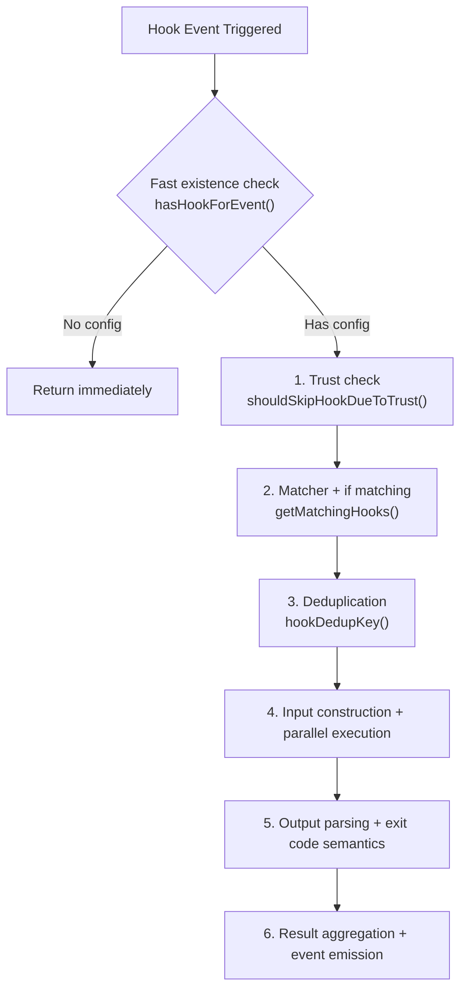
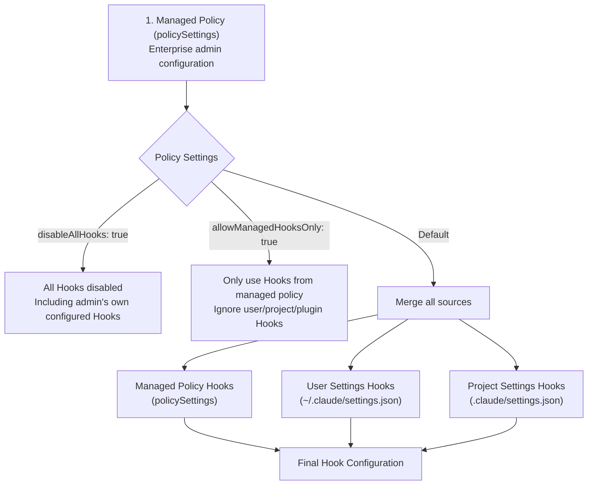
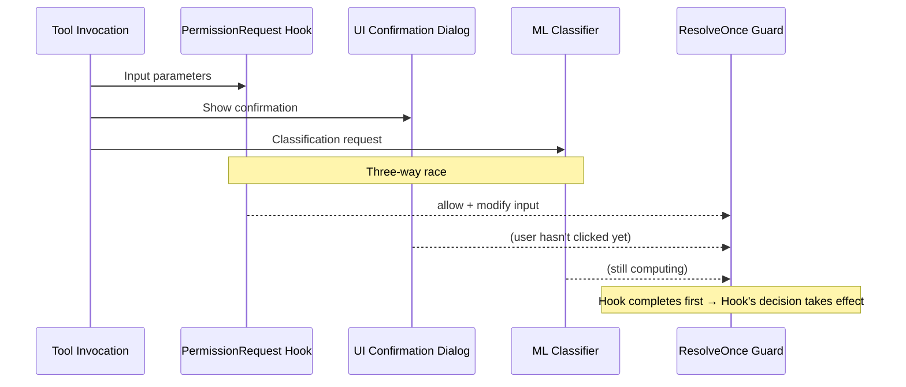

# Chapter 6: Hooks and Extensibility

> Hooks are Claude Code's event-driven extension mechanism — injecting custom logic into key lifecycle points without modifying the source code.

Imagine these scenarios: automatically running lint checks every time Claude executes `git push`; running tests in the background after every file edit and only interrupting Claude when a test fails; or sending all tool calls to your company's audit system. These are all typical use cases for Hooks.

The core design philosophy of Hooks is: **every key point in the Agent Loop exposes an event, and external code can listen to these events and inject behavior**. This shares the same design philosophy as Git Hooks (pre-commit, post-merge) and Webpack Plugins, but the problem Claude Code faces is more complex — it needs to handle permission control, long-running async tasks, multi-Agent coordination, and other scenarios, making the Hook system design far more complex than traditional "before/after interceptors."

## 6.1 Hook Event Overview

### Why These 25 Events?

Claude Code's Hook event design follows one principle: **cover all key decision points across the complete Agent Loop lifecycle**. Looking back at the Agent Loop from [Chapter 2](/en/docs/02-agent-loop.md), a complete interaction involves: user input → model reasoning → tool call (permission check → execution → result) → model decides whether to continue → final output. Each step may require external intervention, so each step needs a corresponding Hook event.

The source code defines the complete event list (`src/entrypoints/agentSdkTypes.ts`):

```typescript
export const HOOK_EVENTS = [
  'PreToolUse', 'PostToolUse', 'PostToolUseFailure',
  'Notification', 'UserPromptSubmit', 'SessionStart', 'SessionEnd',
  'Stop', 'StopFailure', 'SubagentStart', 'SubagentStop',
  'PreCompact', 'PostCompact', 'PermissionRequest', 'PermissionDenied',
  'Setup', 'TeammateIdle', 'TaskCreated', 'TaskCompleted',
  'Elicitation', 'ElicitationResult', 'ConfigChange',
  'WorktreeCreate', 'WorktreeRemove', 'InstructionsLoaded',
  'CwdChanged', 'FileChanged'
] as const
```

Categorized by function:

| Category | Event | Trigger Timing | Matcher Value |
|----------|-------|---------------|---------------|
| **Tool Lifecycle** | PreToolUse | Before tool execution | `tool_name` (e.g., `Write`, `Bash`) |
| | PostToolUse | After successful tool execution | `tool_name` |
| | PostToolUseFailure | After tool execution failure | `tool_name` |
| **Permission System** | PermissionRequest | At permission determination | `tool_name` |
| | PermissionDenied | When auto-classifier rejects | `tool_name` |
| **Session Lifecycle** | SessionStart | Session starts | `source` (`startup`/`resume`/`clear`/`compact`) |
| | SessionEnd | Session ends | `reason` |
| | UserPromptSubmit | When user submits input | None |
| **Model Response** | Stop | When model decides to stop | None |
| | StopFailure | When API call fails | `error` |
| **Agent Coordination** | SubagentStart | Sub-Agent starts | `agent_type` |
| | SubagentStop | Sub-Agent stops | `agent_type` |
| | TeammateIdle | Collaborative Agent idle | None |
| **Task System** | TaskCreated | Task created | None |
| | TaskCompleted | Task completed | None |
| **Compaction** | PreCompact | Before context compaction | `trigger` (`manual`/`auto`) |
| | PostCompact | After context compaction | `trigger` |
| **MCP Interaction** | Elicitation | MCP user query | `mcp_server_name` |
| | ElicitationResult | Query result | `mcp_server_name` |
| **Environment Changes** | ConfigChange | Config file changed | `source` |
| | CwdChanged | Working directory changed | None |
| | FileChanged | Watched file changed | Filename (`basename`) |
| | InstructionsLoaded | Instructions file loaded | `load_reason` |
| **Workspace** | Setup | Repository initialization/maintenance | `trigger` (`init`/`maintenance`) |
| | WorktreeCreate | Worktree created | None |
| | WorktreeRemove | Worktree removed | None |

**The fourth column "Matcher Value" in the table is important** — it tells you what value the system actually compares against when you write `matcher: "Write"` in the configuration. For tool-related events, the matcher matches the tool name; for SessionStart, it matches the trigger source; for Notification, it matches the notification type. This mapping is defined in a switch statement within `getMatchingHooks()`.

### Why So Many Events?

At first glance, 25 events may seem excessive, but each event has a clear use case:

- **Tool before/after events** (PreToolUse/PostToolUse): The most core extension points. Pre-hooks can block execution or modify input; post-hooks can perform checks or inject context.
- **Session events** (SessionStart/SessionEnd): Initialize environments, clean up resources, report audit logs.
- **Environment change events** (FileChanged/CwdChanged/ConfigChange): Respond to external changes, enabling workflows like "auto-lint after file save."
- **Agent coordination events** (SubagentStart/SubagentStop/TeammateIdle): Inject coordination logic in multi-Agent scenarios.

## 6.2 Hook Types

Claude Code supports four configurable Hook types and two programmatic Hook types. The first four can be written in `settings.json`, while the latter two are only used internally within the SDK/plugins.

### 1. Command Hook

**The most commonly used type.** Executes a shell command, receives JSON input via stdin, returns JSON results via stdout, and expresses success/failure/blocking via exit codes.

```typescript
{
  type: 'command',
  command: string,           // Shell command
  if?: string,               // Secondary filtering using permission rule syntax
  shell?: 'bash' | 'powershell',  // Shell type, defaults to bash
  timeout?: number,          // Timeout (seconds)
  statusMessage?: string,    // Spinner message during execution
  once?: boolean,            // Auto-remove after one execution
  async?: boolean,           // Async execution, non-blocking
  asyncRewake?: boolean      // Async execution + wake model on exit code 2
}
```

**How it works (`execCommandHook`):**

1. **Process creation**: Calls `spawn()` to create a child process. The shell selection logic is: if `shell: 'powershell'` is specified, use `pwsh`; otherwise use the user's `$SHELL` (bash/zsh/sh).
2. **Input passing**: Serializes the Hook's structured input (including session_id, tool_name, tool_input, etc.) as JSON, passing it to the child process via **stdin**. This means Hook scripts can get full context information by reading stdin.
3. **Environment variables**: The child process inherits current environment variables. For plugin Hooks, `CLAUDE_PLUGIN_ROOT` (plugin root directory) and `CLAUDE_PLUGIN_DATA` (plugin data directory) are additionally injected, and `${CLAUDE_PLUGIN_ROOT}` placeholders in commands are also replaced.
4. **Output collection**: Waits for process exit, collects stdout and stderr.
5. **Result parsing**: Determines Hook result based on exit code and stdout content (see Section 6.4 for details).

**Applicable scenarios**: Logging, file syncing, CI/CD triggering, shell script integration, custom linters.

### 2. Prompt Hook

Calls an LLM for semantic evaluation. Suitable for judgment scenarios that require "understanding" rather than simple pattern matching.

```typescript
{
  type: 'prompt',
  prompt: string,            // Prompt ($ARGUMENTS placeholder replaced with JSON input)
  if?: string,               // Permission rule syntax filtering
  model?: string,            // Specify model (defaults to a small fast model, e.g., Haiku)
  timeout?: number,          // Timeout (seconds, default 30)
  statusMessage?: string,
  once?: boolean
}
```

**How it works (`execPromptHook`):**

1. Replaces the `$ARGUMENTS` placeholder with the Hook input's JSON string
2. Builds a message array (optionally including conversation history), calls `queryModelWithoutStreaming` (single-turn, non-streaming)
3. The system prompt requires the model to return `{"ok": true}` or `{"ok": false, "reason": "..."}`
4. Parses the model response, `ok: false` maps to a blocking error

**Key design detail**: Prompt Hook directly calls `createUserMessage` instead of going through `processUserInput` — because the latter would trigger the `UserPromptSubmit` Hook, causing infinite recursion.

**Applicable scenarios**: Semantic safety checks ("Could this SQL query delete data?"), code review ("Does this change comply with project standards?").

### 3. Agent Hook

Similar to Prompt Hook, but runs in **multi-turn Agent mode** — it can call tools to verify conditions, not just "think about it."

```typescript
{
  type: 'agent',
  prompt: string,            // Verification instructions ($ARGUMENTS placeholder)
  if?: string,
  model?: string,            // Defaults to Haiku
  timeout?: number,          // Timeout (seconds, default 60)
  statusMessage?: string,
  once?: boolean
}
```

**Key differences from Prompt Hook:**

| | Prompt Hook | Agent Hook |
|--|-------------|------------|
| Invocation method | `queryModelWithoutStreaming` (single-turn) | `query` (multi-turn Agent Loop) |
| Can call tools | No (LLM reasoning only) | Yes (can read files, run commands to verify) |
| Default timeout | 30 seconds | 60 seconds |
| Output format | Forced `{ok, reason}` JSON | Returns `{ok, reason}` via registered structured output tool |

Agent Hook uses `registerStructuredOutputEnforcement` to register a function Hook, ensuring the Agent must call a structured output tool to return results at the end. This is a "Hook nesting Hook" design — the Agent Hook itself registers temporary Function Hooks during execution to constrain Agent behavior.

**Applicable scenarios**: Complex verification workflows — for example, "run tests and confirm all pass," "check if the edited file passes type checking."

### 4. HTTP Hook

Sends POST requests to external services, suitable for integration with enterprise infrastructure.

```typescript
{
  type: 'http',
  url: string,               // POST endpoint
  if?: string,
  timeout?: number,          // Timeout (seconds, default 10 minutes)
  headers?: Record<string, string>,  // Supports $VAR environment variable interpolation
  allowedEnvVars?: string[], // Whitelist of env vars allowed for interpolation
  statusMessage?: string,
  once?: boolean
}
```

**How it works (`execHttpHook`):**

1. **URL whitelist check**: If an `allowedHttpHookUrls` policy is configured, first checks whether the URL matches an allowed pattern. Non-matching URLs are directly rejected without sending any request.
2. **Header environment variable interpolation**: Iterates through headers, matching `$VAR_NAME` or `${VAR_NAME}` patterns. **Only variables listed in `allowedEnvVars` will be substituted**; other variables are replaced with empty strings. This prevents malicious Hooks in project-level `.claude/settings.json` from stealing sensitive variables like `$HOME` or `$AWS_SECRET_ACCESS_KEY`.
3. **CRLF injection protection**: After interpolation, header values have `\r`, `\n`, and `\x00` characters stripped, preventing malicious environment variables from injecting additional HTTP headers.
4. **Proxy support**: Automatically detects sandbox proxies and environment variable proxies (`HTTP_PROXY`/`HTTPS_PROXY`), sending requests through the proxy.
5. **SSRF protection**: When not going through a proxy, uses `ssrfGuardedLookup` to prevent requests from reaching internal network addresses.
6. **Response parsing**: HTTP Hooks **must return JSON** (unlike Command Hooks, which can return plain text). An empty body is treated as `{}` (success with no special directives).

**Important limitation**: **HTTP Hooks do not support SessionStart and Setup events.** The reason is that in headless mode, the sandbox's structuredInput consumer has not started when these two events trigger, causing HTTP requests to deadlock.

**Applicable scenarios**: Webhook notifications, audit log reporting, third-party approval systems, compliance checks.

### 5. Callback Hook — SDK/Plugin Only

Programmatic functions that execute directly within the process, without going through spawn/HTTP or other I/O operations.

```typescript
{
  type: 'callback',
  callback: async (input, toolUseID, signal, index, context) => HookJSONOutput,
  timeout?: number,
  internal?: boolean  // Marks as internal Hook (enables fast path optimization)
}
```

**Why are Callback Hooks extremely fast?** Claude Code has an important fast path optimization in `executeHooks`:

```typescript
// src/utils/hooks.ts
// If all matching Hooks are callback/function type (no need to spawn external processes)
if (matchedHooks.every(m => m.hook.type === 'callback' || m.hook.type === 'function')) {
  // Fast path: skip JSON serialization, AbortSignal creation, progress events, result processing
  for (const [i, { hook }] of matchingHooks.entries()) {
    if (hook.type === 'callback') {
      await hook.callback(hookInput, toolUseID, signal, i, context)
    }
  }
  return  // Does not go through the regular processHookJSONOutput flow
}
```

This optimization reduces internal Hook overhead from ~6µs to ~1.8µs (-70%). Internal Hooks (such as file access tracking, commit attribution) trigger on every tool call, and the cumulative difference is significant.

### 6. Function Hook — Session-Scoped Only

Similar to Callback, but scoped to a specific session, preventing cross-Agent leakage.

```typescript
{
  type: 'function',
  id?: string,
  callback: (messages: Message[], signal?: AbortSignal) => boolean | Promise<boolean>,
  errorMessage: string,      // Error displayed when callback returns false
  timeout?: number,
  statusMessage?: string
}
```

**Primary use**: Structured output enforcement for Agent Hooks (ensuring the Agent must return results through a specific tool). Registered via `addFunctionHook()`, removed via `removeFunctionHook()`, isolated by `sessionId` — this ensures verification Agent's function Hooks don't leak into the main Agent.

### Common Field Descriptions

Several fields appear across multiple Hook types and deserve separate explanation:

**`if` condition**: This is a more granular filter than `matcher`. Matcher matches tool names (e.g., "Bash"), while `if` uses permission rule syntax to match the tool's specific input (e.g., `"Bash(git *)"` — only triggers when the Bash tool executes a git command). The `if` condition is parsed in `prepareIfConditionMatcher`: it calls the tool's `preparePermissionMatcher` to perform pattern matching on tool input, reusing the permission system's matching engine. **`if` only applies to tool-related events** (PreToolUse, PostToolUse, PostToolUseFailure, PermissionRequest) and has no effect on other events.

**`once` field**: If true, the Hook is automatically removed from configuration after one execution. Suitable for one-time initialization or verification.

**`statusMessage` field**: Custom message displayed in the spinner while the Hook executes. The default shows the command content, but for complex commands or those containing sensitive information, a custom message is more user-friendly.

## 6.3 Matcher

Matcher is the Hook system's routing mechanism — determining whether a Hook should respond to a given event.

### Configuration Format

```typescript
type HookMatcher = {
  matcher?: string,          // Match pattern; matches all if not set
  hooks: HookCommand[]       // List of Hooks to execute on match
}
```

Configuration example:

```json
{
  "hooks": {
    "PreToolUse": [
      {
        "matcher": "Bash",
        "hooks": [{ "type": "command", "command": "echo 'Bash tool used'" }]
      },
      {
        "matcher": "Write|Edit",
        "hooks": [{ "type": "command", "command": "echo 'File modified'" }]
      }
    ]
  }
}
```

### Three Matching Modes

The `matchesPattern()` function implements three levels of matching, attempted in order:

```typescript
// src/utils/hooks.ts
function matchesPattern(matchQuery: string, matcher: string): boolean {
  if (!matcher || matcher === '*') return true

  // 1. Exact match or pipe-delimited (treated as simple pattern if only alphanumeric and |)
  if (/^[a-zA-Z0-9_|]+$/.test(matcher)) {
    if (matcher.includes('|')) {
      // "Write|Edit|Read" → split and exact match each
      return patterns.includes(matchQuery)
    }
    // "Write" → direct exact match
    return matchQuery === matcher
  }

  // 2. Regular expression (when any special characters are present)
  const regex = new RegExp(matcher)
  return regex.test(matchQuery)
}
```

The three modes reflect **progressive complexity**:

| Mode | Example | Use Case |
|------|---------|----------|
| Exact match | `"Write"` | Most common, matches a single tool |
| Pipe-delimited | `"Write\|Edit\|Read"` | Matches multiple tools (OR semantics) |
| Regular expression | `"^Bash.*"` / `"^(Write\|Edit)$"` | Complex pattern matching |

Why not use regex for everything? Because the vast majority of users only need exact matching. The string pattern detection (`/^[a-zA-Z0-9_|]+$/`) ensures simple tool names won't be accidentally parsed as regex — for example, `"Bash"` won't trigger the regex engine.

### Matcher and `if` Condition Cooperation

Matcher and `if` form two layers of filtering:

```
Event triggered
  │
  ▼
Matcher filter: matches tool name/event type (coarse-grained)
  │ No match → skip, don't spawn process
  ▼
if condition filter: matches tool's specific input parameters (fine-grained)
  │ No match → skip, don't spawn process
  ▼
Execute Hook
```

Example:

```json
{
  "matcher": "Bash",
  "hooks": [{
    "type": "command",
    "command": "echo 'git command detected'",
    "if": "Bash(git push*)"
  }]
}
```

The matching process for this configuration:
1. PreToolUse event triggers, tool_name is "Bash" → matcher passes
2. Check `if` condition: `"Bash(git push*)"` → parse permission rule, check if the tool input command matches the `git push*` pattern
3. If the user is executing `git push origin main` → match passes, execute Hook
4. If the user is executing `git status` → match fails, skip

**Performance critical**: Both layers of filtering complete before spawning child processes. If a PreToolUse event triggers 10 Hook configurations but only 2 pass the dual matcher + if filtering, the system will only spawn 2 processes. This is "zero-cost abstraction" — Hooks that don't trigger have absolutely no runtime overhead.

## 6.4 Hook Execution Engine

Key file: `src/utils/hooks.ts` (core scheduling)

Hook execution goes through 6 stages. Below we expand on the implementation details of each stage.



### Stage 0: Fast Existence Check

Before entering the full Hook flow, `hasHookForEvent()` provides a lightweight short-circuit check:

```typescript
// src/utils/hooks.ts
function hasHookForEvent(hookEvent, appState, sessionId): boolean {
  const snap = getHooksConfigFromSnapshot()?.[hookEvent]
  if (snap && snap.length > 0) return true
  const reg = getRegisteredHooks()?.[hookEvent]
  if (reg && reg.length > 0) return true
  if (appState?.sessionHooks.get(sessionId)?.hooks[hookEvent]) return true
  return false
}
```

This check intentionally **over-approximates**: it doesn't check whether the matcher matches, doesn't check the managedOnly policy — it returns true as long as any configuration exists. False positives only mean taking one extra step through the full matching path; false negatives would skip Hooks that should execute, so it's better to over-check than to miss.

The value of this optimization is: **the vast majority of events have no Hooks configured at all**. For a project with no FileChanged Hooks configured, every file change event can short-circuit return in a few microseconds, avoiding the overhead of `createBaseHookInput` (which requires path concatenation) and `getMatchingHooks` (which requires iterating through configurations).

### Stage 1: Trust Check

`shouldSkipHookDueToTrust()` is the safety baseline — **all Hooks require workspace trust**:

```typescript
// src/utils/hooks.ts
export function shouldSkipHookDueToTrust(): boolean {
  const isInteractive = !getIsNonInteractiveSession()
  if (!isInteractive) return false  // Trust is implicit in SDK mode
  const hasTrust = checkHasTrustDialogAccepted()
  return !hasTrust  // true = skip Hook
}
```
  const hasTrust = checkHasTrustDialogAccepted()
  return !hasTrust  // true = skip Hook
}
```

**Why so strict?** Hooks read configuration from `.claude/settings.json` and execute arbitrary commands. Without checking trust, a malicious repository could execute code by injecting Hooks into `.claude/settings.json`—as soon as the user clones and opens the repository, the Hooks would run automatically.

**Historical vulnerabilities drove this design**:

1. **SessionEnd Hook leak**: User clones a malicious repository → opens Claude Code → sees the trust dialog → clicks reject → exits. But the SessionEnd Hook executes on exit without checking trust—the malicious Hook still runs.
2. **SubagentStop Hook premature execution**: The sub-Agent completes before the trust dialog appears → the SubagentStop event fires → the Hook executes in an untrusted workspace.

The fix is simple but effective: check trust at the very beginning of `executeHooks`, and all Hooks (without exception) must wait until workspace trust is established before they can execute. The source code comment puts it bluntly:

> *"This centralized check prevents RCE vulnerabilities for all current and future hooks"*

### Stage 2: Matcher Matching and Hook Collection

`getMatchingHooks()` is the most logically complex function in the entire engine. It needs to:

1. **Collect Hook configurations from all sources**: snapshot config + registered SDK/plugin Hooks + session Hooks + function Hooks
2. **Determine matchQuery based on event type**: extract the match value from hookInput via a switch statement
3. **Matcher match filtering**: for each HookMatcher, check whether the matcher matches the matchQuery
4. **`if` condition filtering**: use `prepareIfConditionMatcher` to generate a matching closure and check each one
5. **Special restrictions**: HTTP Hooks are filtered out in SessionStart/Setup events

**matchQuery extraction logic** (switch in source code `getMatchingHooks`):

```typescript
switch (hookInput.hook_event_name) {
  case 'PreToolUse':
  case 'PostToolUse':
  case 'PostToolUseFailure':
  case 'PermissionRequest':
  case 'PermissionDenied':
    matchQuery = hookInput.tool_name        // tool name
    break
  case 'SessionStart':
    matchQuery = hookInput.source           // "startup" | "resume" | "clear" | "compact"
    break
  case 'Setup':
    matchQuery = hookInput.trigger          // "init" | "maintenance"
    break
  case 'Notification':
    matchQuery = hookInput.notification_type // notification type
    break
  case 'SubagentStart':
  case 'SubagentStop':
    matchQuery = hookInput.agent_type       // Agent type
    break
  case 'FileChanged':
    matchQuery = basename(hookInput.file_path) // filename (without path)
    break
  // ...
}
```

Note that `FileChanged` uses `basename`—it only matches the filename, not the path. This means `matcher: ".env"` will match `.env` files in any directory.

### Stage 3: Hook Deduplication

When Hook configurations appear in multiple sources (for example, both user settings and project settings define the same Hook), the deduplication mechanism ensures they are not executed repeatedly.

```typescript
// src/utils/hooks.ts
function hookDedupKey(m: MatchedHook, payload: string): string {
  return `${m.pluginRoot ?? m.skillRoot ?? ''}\0${payload}`
}
```

Core deduplication design:

- **Same-source Hook deduplication**: Hooks from settings (without pluginRoot/skillRoot) share an empty string prefix; identical commands keep only the last one merged
- **Cross-source Hooks are not deduplicated**: Plugin A and Plugin B may both have `${CLAUDE_PLUGIN_ROOT}/hook.sh`, which expand to different files. The dedup key includes pluginRoot, ensuring they are not incorrectly merged
- **Different `if` conditions are not deduplicated**: even if the commands are identical, different `if` conditions make them different Hooks

**Last-wins semantics**: `new Map(entries)` keeps the last entry when keys conflict. For settings Hooks, this means later-merged configurations (e.g., project settings) override earlier-merged ones (e.g., user settings).

**Callback and Function Hooks skip deduplication**—each callback function is unique, and deduplication would be meaningless.

### Stage 4: Input Construction and Parallel Execution

**Input construction**: `createBaseHookInput()` builds the base input shared by all Hooks:

```typescript
{
  session_id: string,       // session ID
  transcript_path: string,  // transcript file path
  cwd: string,              // current working directory
  permission_mode?: string, // permission mode
  agent_id?: string,        // sub-Agent ID
  agent_type?: string       // Agent type
}
```

`agent_type` has a noteworthy priority logic: the sub-Agent's type (from toolUseContext) takes precedence over the main thread's `--agent` flag. This allows Hooks to distinguish between "main Agent tool calls" and "sub-Agent tool calls" by checking whether `agent_id` is present.

**Lazy serialization of JSON input**: Hook input is serialized only once and shared via closure with all Hooks in the same batch:

```typescript
let jsonInputResult: { ok: true; value: string } | { ok: false; error: unknown } | undefined
function getJsonInput() {
  if (jsonInputResult !== undefined) return jsonInputResult
  try {
    return (jsonInputResult = { ok: true, value: jsonStringify(hookInput) })
  } catch (error) {
    return (jsonInputResult = { ok: false, error })
  }
}
```

If an event triggers 5 Command Hooks, hookInput is `jsonStringify`-ed only once.

**Parallel execution**: All matching Hooks are launched in parallel via `hookPromises.map(async function* ...)`, with `all()` awaiting all results. This means the execution time for 5 Hooks depends on the slowest one, not the sum of all 5. Each Hook has independent timeout control (`createCombinedAbortSignal` merges the parent signal with the Hook's own timeout).

**Three execution modes**:

**Synchronous mode (default)**: Waits for the process to exit, collects stdout/stderr, and parses the output. While multiple Hooks run in parallel with each other, each individual Hook synchronously awaits its result.

**Asynchronous mode (`async: true`)**: The Hook process runs in the background, is registered to the global `AsyncHookRegistry` via `registerPendingAsyncHook()`, and immediately returns success. The Agent Loop calls `checkForAsyncHookResponses()` on each iteration to poll for completed async Hooks and injects the results into the conversation. Default timeout is 15 seconds (overridable via `asyncTimeout`).

**Async rewake mode (`asyncRewake: true`)**: The most special mode, designed specifically for "background check + on-demand interrupt" scenarios:

```typescript
// src/utils/hooks.ts - executeInBackground()
if (asyncRewake) {
  // asyncRewake hooks bypass AsyncHookRegistry
  void shellCommand.result.then(async result => {
    if (result.code === 2) {
      // exit code 2 = blocking error → wake the model via notification
      enqueuePendingNotification({
        value: wrapInSystemReminder(
          `Stop hook blocking error from command "${hookName}": ${stderr || stdout}`
        ),
        mode: 'task-notification',
      })
    }
  })
}
```

Workflow:
1. The Hook process runs in the background without blocking the current operation
2. Exit code 0 → silent success, does not disturb the model
3. Exit code 2 → blocking error, injects a `<system-reminder>` via `enqueuePendingNotification` to wake the model
4. The model sees this error on the next iteration and can respond accordingly (e.g., fix failing tests)

**Why exit code 2 instead of 1?** This is a carefully designed convention: 0 = success, 1 = general error (visible to the user but does not disturb the model), 2 = blocking error requiring model attention. This allows long-running checks (such as CI builds, integration tests) to interrupt the model's workflow only when a real problem is found.

**An important implementation detail**: asyncRewake Hooks intentionally do not call `shellCommand.background()`—because `background()` would trigger `taskOutput.spillToDisk()`, writing output to a disk file. But the subsequent notification message construction needs to read in-memory output via `getStdout()` and `getStderr()`, and `spillToDisk()` would cause stderr to be cleared from memory (returning an empty string).

### Stage 5: Output Parsing and Exit Code Semantics

The Hook output protocol consists of two parts: **exit code** and **stdout content**.

#### Exit Code Semantics

For Command Hooks with non-JSON output, the exit code is the only communication channel:

| Exit Code | Meaning | Impact on User | Impact on Model |
|-----------|---------|---------------|-----------------|
| **0** | Success | stdout displayed in transcript | No impact |
| **1** | General error | stderr displayed to user | **Not** passed to model |
| **2** | Blocking error | stderr displayed to user | stderr passed to model (blocks operation) |
| **Other** | General error (same as 1) | stderr displayed to user | Not passed to model |

**The key difference between exit codes 1 and 2** is worth emphasizing: exit code 1 simply "tells the user something went wrong" (non-blocking), and the model neither knows nor cares; exit code 2 "tells the model there is a problem that must be handled" (blocking), preventing the current tool execution or the model from stopping.

This distinction is very practical:
- Linter warnings use exit code 1 → user sees them but the workflow is not interrupted
- Security check failures use exit code 2 → the model must know and handle them

#### stdout Parsing

`parseHookOutput()` performs intelligent parsing on stdout:

```typescript
function parseHookOutput(stdout: string) {
  const trimmed = stdout.trim()
  // Does not start with '{' → plain text, do not attempt JSON parsing
  if (!trimmed.startsWith('{')) {
    return { plainText: stdout }
  }
  // Starts with '{' → attempt JSON parsing + Zod schema validation
  try {
    const result = validateHookJson(trimmed)
    if ('json' in result) return result
    // Validation failed → return plainText + validationError (includes expected schema)
    return { plainText: stdout, validationError: result.validationError }
  } catch {
    return { plainText: stdout }
  }
}
```

**Design highlights**:
1. Only attempts JSON parsing if it starts with `{`—a simple `echo "done"` will not be mistakenly parsed
2. After JSON parsing, Zod schema validation is still applied—ensuring field names and types are correct
3. **Schema hint on validation failure**: When the JSON format is wrong, the error message directly shows the expected complete schema. This is excellent DX (Developer Experience)—Hook authors can see what the correct format should look like without consulting the documentation

HTTP Hook parsing (`parseHttpHookOutput`) differs slightly: an empty body is treated as an empty object `{}` (success), while non-empty content must be valid JSON.

### Stage 6: Result Aggregation and Event Emission

Results from multiple parallel Hooks are merged via `AggregatedHookResult`:

```typescript
type AggregatedHookResult = {
  blockingError?: HookBlockingError      // blocking error
  preventContinuation?: boolean          // whether to prevent continuation
  stopReason?: string                    // stop reason
  permissionBehavior?: 'allow' | 'deny' | 'ask' | 'passthrough'
  additionalContexts?: string[]          // additional contexts (can come from multiple Hooks)
  updatedInput?: Record<string, unknown> // modified tool input
  updatedMCPToolOutput?: unknown         // modified MCP output
  // ...
}
```

Aggregation is performed in a streaming fashion via `for await ... of all(hookPromises)`—each Hook yields its result immediately upon completion without waiting for all Hooks to finish. This means one Hook's blocking error can propagate immediately without waiting for other slower Hooks.

**Event emission** is used for UI updates and observability:
- `emitHookStarted()`: when a Hook starts executing (for spinner display)
- `emitHookResponse()`: when a Hook completes (includes stdout/stderr/exitCode/outcome)
- `startHookProgressInterval()`: long-running Hooks periodically emit progress updates (for pushing real-time output in remote mode)

### Timeout Configuration

| Scenario | Default Timeout | Source |
|----------|----------------|--------|
| General Hook | 10 minutes | `TOOL_HOOK_EXECUTION_TIMEOUT_MS` |
| SessionEnd Hook | 1.5 seconds | `SESSION_END_HOOK_TIMEOUT_MS_DEFAULT` |
| Prompt Hook | 30 seconds | Hardcoded |
| Agent Hook | 60 seconds | Hardcoded |
| HTTP Hook | 10 minutes | `DEFAULT_HTTP_HOOK_TIMEOUT_MS` |
| Async Hook default | 15 seconds | `asyncTimeout` or default value |
| Custom | Configurable | `timeout` field in Hook definition (seconds) |

The SessionEnd timeout is extremely short (1.5 seconds) because the user is exiting and should not be blocked by a Hook. It can be overridden via the environment variable `CLAUDE_CODE_SESSIONEND_HOOKS_TIMEOUT_MS`.

## 6.5 Hook JSON Output Schema

Hooks control Claude Code's behavior by outputting JSON to stdout. The complete schema is defined in `src/types/hooks.ts` and validated with Zod.

### Common Fields

```typescript
{
  // === Flow Control ===
  continue?: boolean,          // false → prevent Claude from continuing (preventContinuation)
  suppressOutput?: boolean,    // hide stdout output (not recorded in transcript)
  stopReason?: string,         // stop reason message when continue=false

  // === Decision Fields (backward compatible) ===
  decision?: 'approve' | 'block',  // approve → allow, block → block + error
  reason?: string,                  // decision reason

  // === Feedback ===
  systemMessage?: string,      // warning message (displayed to user)
}
```

### Event-Specific Output (hookSpecificOutput)

`hookSpecificOutput` is a discriminated union that distinguishes output formats for different events via the `hookEventName` field:

**PreToolUse**—the richest output, capable of controlling permissions, modifying input, and injecting context:

```typescript
{
  hookEventName: 'PreToolUse',
  permissionDecision?: 'allow' | 'deny' | 'ask',  // permission decision
  permissionDecisionReason?: string,               // decision reason
  updatedInput?: Record<string, unknown>,           // modify tool input
  additionalContext?: string                        // additional context
}
```

**PermissionRequest**—structured differently from PreToolUse, using a nested decision object:

```typescript
{
  hookEventName: 'PermissionRequest',
  decision: {
    behavior: 'allow',
    updatedInput?: Record<string, unknown>,          // modify input
    updatedPermissions?: PermissionUpdate[]          // inject new permission rules
  } | {
    behavior: 'deny',
    message?: string,                                // denial reason
    interrupt?: boolean                              // interrupt operation
  }
}
```

**PostToolUse**—can inject context or replace MCP tool output:

```typescript
{
  hookEventName: 'PostToolUse',
  additionalContext?: string,
  updatedMCPToolOutput?: unknown   // replace the original output of an MCP tool
}
```

**SessionStart**—can set initial messages and file watchers:

```typescript
{
  hookEventName: 'SessionStart',
  additionalContext?: string,
  initialUserMessage?: string,     // automatically injected initial user message
  watchPaths?: string[]            // register FileChanged watch paths
}
```

**UserPromptSubmit / Setup / SubagentStart / PostToolUseFailure / Notification**—only additionalContext:

```typescript
{ hookEventName: '...', additionalContext?: string }
```

**PermissionDenied**—can trigger a retry:

```typescript
{ hookEventName: 'PermissionDenied', retry?: boolean }
```

**Elicitation / ElicitationResult**—MCP interaction responses:

```typescript
{
  hookEventName: 'Elicitation',
  action?: 'accept' | 'decline' | 'cancel',
  content?: Record<string, unknown>
}
```

**Async response**—Hooks can also return an async declaration, indicating that the result will arrive later:

```typescript
{ async: true, asyncTimeout?: number }
```

### Common Field Combination Quick Reference

| Purpose | JSON Output |
|---------|------------|
| Approve tool execution | `{"hookSpecificOutput": {"hookEventName": "PreToolUse", "permissionDecision": "allow"}}` |
| Deny tool execution | `{"hookSpecificOutput": {"hookEventName": "PreToolUse", "permissionDecision": "deny", "permissionDecisionReason": "Unsafe"}}` |
| Modify tool input | `{"hookSpecificOutput": {"hookEventName": "PreToolUse", "permissionDecision": "allow", "updatedInput": {"command": "git push --dry-run"}}}` |
| Prevent continuation | `{"continue": false, "stopReason": "Security issue detected"}` |
| Inject context | `{"hookSpecificOutput": {"hookEventName": "UserPromptSubmit", "additionalContext": "Current linter has 3 warnings"}}` |

### Data Flow Trace Example

Taking a PreToolUse Hook that denies an `rm -rf` command as an example, tracing the complete data flow:

```
1. Model calls the Bash tool, command = "rm -rf /tmp/data"
   │
2. Agent Loop triggers PreToolUse event
   │
3. executePreToolHooks() builds hookInput:
   {
     hook_event_name: "PreToolUse",
     tool_name: "Bash",
     tool_input: { command: "rm -rf /tmp/data" },
     session_id: "abc-123",
     cwd: "/home/user/project",
     ...
   }
   │
4. getMatchingHooks() searches for matching Hooks
   ├── matcher: "Bash" → matches tool_name "Bash" ✓
   └── if: "Bash(rm *)" → preparePermissionMatcher("rm -rf /tmp/data") → matches "rm *" ✓
   │
5. execCommandHook() executes the Hook command
   ├── spawn("bash", ["-c", "echo '{...}'"])
   ├── writes JSON input to stdin
   └── waits for exit
   │
6. Hook script stdout returns:
   {"hookSpecificOutput": {"hookEventName": "PreToolUse", "permissionDecision": "deny",
    "permissionDecisionReason": "rm -rf command is prohibited by security policy"}}
   │
7. parseHookOutput() → starts with '{' → JSON parse → Zod validation passes
   │
8. processHookJSONOutput() processes JSON:
   ├── hookSpecificOutput.hookEventName === "PreToolUse" ✓
   ├── permissionDecision === "deny"
   ├── result.permissionBehavior = 'deny'
   └── result.blockingError = { blockingError: "rm -rf command is prohibited by security policy", command: "..." }
   │
9. Tool execution is blocked, model receives error message:
   "PreToolUse:Bash hook error: rm -rf command is prohibited by security policy"
```

## 6.6 Trust Model and Security
### Hook Configuration Snapshot

`captureHooksConfigSnapshot()` freezes the Hook configuration at **startup**. This means:

1. Hook definitions remain unchanged throughout the entire session
2. Even if `.claude/settings.json` is modified during the session (e.g., by malicious code), Hooks will not be dynamically updated
3. `updateHooksConfigSnapshot()` will recapture the configuration when it changes, but only triggers in controlled scenarios

### Three-Layer Sources and Policy Control

`getHooksFromAllowedSources()` merges Hook configurations from three sources:



The three policy modes are designed for different enterprise security requirements:

| Policy | Effect | Use Case |
|--------|--------|----------|
| `disableAllHooks` | Disables all Hooks, including those from the managed policy itself | Security-locked environment, completely distrusting the Hook mechanism |
| `allowManagedHooksOnly` | Only runs Hooks defined by the admin in policySettings | Enterprise compliance environment, preventing users/repos from injecting uncontrolled Hooks |
| Default | Merges all sources | Flexible development environment |

**The scope of `allowManagedHooksOnly`** is broad — it not only blocks Hooks from user settings and project settings, but also blocks plugin Hooks (skipped when `pluginRoot` exists) and session Hooks (including Hooks in Agent/Skill frontmatter). However, it **does not block** SDK-registered callback Hooks (these are runtime internal mechanisms, not user configurations).

## 6.7 PermissionRequest Hook Deep Dive

This is the most powerful Hook type — it can **programmatically control tool permissions** and participates in the racing mechanism within the permission system chapter.

### Input

```typescript
{
  hook_event_name: 'PermissionRequest',
  tool_name: string,                    // Tool name
  tool_input: Record<string, unknown>,  // Tool input parameters
  session_id: string,
  cwd: string,
  permission_mode: string
}
```

### Output

PermissionRequest's hookSpecificOutput uses a nested `decision` object, which differs from PreToolUse's `permissionDecision` field:

```typescript
{
  hookSpecificOutput: {
    hookEventName: 'PermissionRequest',
    decision: {
      // Allow → can simultaneously modify input and inject permission rules
      behavior: 'allow',
      updatedInput?: Record<string, unknown>,
      updatedPermissions?: PermissionUpdate[]
    } | {
      // Deny → can attach a message and interrupt flag
      behavior: 'deny',
      message?: string,
      interrupt?: boolean
    }
  }
}
```

### Four Capabilities

PermissionRequest Hook goes far beyond simple allow/deny:

1. **Approval decision**: `behavior: 'allow'` or `'deny'`
2. **Input modification**: Modify the tool's input parameters via `updatedInput` (e.g., forcefully adding a `--dry-run` flag)
3. **Rule injection**: Dynamically persist new permission rules via `updatedPermissions` — not just effective for this invocation, but persisting throughout the entire session
4. **Operation interruption**: `interrupt: true` immediately interrupts the current operation

### Racing with the Permission System

PermissionRequest Hook participates in the [permission system's racing mechanism](/en/docs/11-permission-security.md) — running concurrently with the UI confirmation dialog and ML classifier, with the first to complete winning.



## 6.8 Stop Hook: Post-Sampling Validation

Stop Hook triggers when the model decides to stop the loop (i.e., when the model returns plain text rather than a tool call), and can **prevent termination** to force continuation:

```
Model returns plain text (no tool calls)
    │
    ▼
Stop Hook triggers
    │
    ├── Returns allow / no blocking error → Normal termination
    └── Returns deny / exit code 2 →
        Inject blockingError.blockingError into conversation
        transition = stop_hook_blocking
        Continue Agent Loop
```

This enables automated workflows to achieve "can only stop when done" semantics. For example:

```json
{
  "hooks": {
    "Stop": [{
      "hooks": [{
        "type": "command",
        "command": "if ! npm test --silent 2>/dev/null; then echo 'Tests failed' >&2; exit 2; fi"
      }]
    }]
  }
}
```

Each time the model is about to stop, tests are automatically run. Tests pass → allow stop; tests fail → exit code 2 → model receives "Tests failed" message → forced to continue fixing.

## 6.9 Practical Patterns

### Pattern 1: CI Build Check (asyncRewake)

**Scenario**: Automatically run tests after each file edit, but don't block the editing workflow — only alert the model when tests fail.

**Why asyncRewake?** Tests may take tens of seconds. If using synchronous Hooks, the model would have to wait tens of seconds after every file edit. asyncRewake lets tests run in the background while the model continues editing other files, only interrupting when tests fail.

```json
{
  "hooks": {
    "PostToolUse": [{
      "matcher": "Edit",
      "hooks": [{
        "type": "command",
        "command": "npm test 2>&1; if [ $? -ne 0 ]; then exit 2; else exit 0; fi",
        "asyncRewake": true
      }]
    }]
  }
}
```

Workflow: After each file edit, tests run automatically in the background. Tests pass (exit code 0) → silent. Tests fail (exit code 2) → wake up the model and inject error information, model automatically fixes.

### Pattern 2: Context Injection (additionalContext)

**Scenario**: Automatically run a linter each time the user submits input and inject the results as additional context.

**Why UserPromptSubmit + additionalContext?** This lets the model know about existing lint issues before starting work, so it can fix them along the way while making changes.

```json
{
  "hooks": {
    "UserPromptSubmit": [{
      "hooks": [{
        "type": "command",
        "command": "result=$(npx eslint --format=compact src/ 2>&1); if [ -n \"$result\" ]; then echo \"{\\\"hookSpecificOutput\\\": {\\\"hookEventName\\\": \\\"UserPromptSubmit\\\", \\\"additionalContext\\\": \\\"Current lint warnings:\\n$result\\\"}}\"; fi"
      }]
    }]
  }
}
```

### Pattern 3: Team Audit Logging (HTTP Hook)

**Scenario**: Send all tool usage records to the company's audit system.

**Why HTTP Hook?** Audit systems are typically REST APIs. Command Hooks require additionally installing curl and handling authentication, while HTTP Hooks natively support headers and environment variable interpolation.

```json
{
  "hooks": {
    "PreToolUse": [{
      "hooks": [{
        "type": "http",
        "url": "https://audit.company.com/claude-code/tool-use",
        "headers": { "Authorization": "Bearer ${AUDIT_TOKEN}" },
        "allowedEnvVars": ["AUDIT_TOKEN"]
      }]
    }]
  }
}
```

**Security note**: `allowedEnvVars` explicitly declares which environment variables are allowed for interpolation. Unlisted variable references (such as `$HOME`) are replaced with empty strings, preventing accidental exposure of sensitive information.

### Pattern 4: LLM Safety Assessment (Prompt Hook)

**Scenario**: Use an LLM to assess whether a command is safe before executing Bash commands.

**Why Prompt Hook?** Simple pattern matching (such as `rm *`) cannot cover all dangerous commands. An LLM can understand command semantics and identify atypical but dangerous commands like `find / -delete`, `dd if=/dev/zero of=/dev/sda`, etc.

```json
{
  "hooks": {
    "PreToolUse": [{
      "matcher": "Bash",
      "hooks": [{
        "type": "prompt",
        "prompt": "Evaluate whether the following bash command is safe to execute in a development environment. The command details are: $ARGUMENTS. Consider: Does it modify system files? Does it delete data irreversibly? Does it access network resources unexpectedly?",
        "timeout": 15
      }]
    }]
  }
}
```

### Pattern 5: PermissionRequest Auto-Approval

**Scenario**: Automatically approve known-safe command patterns to reduce user confirmation popups.

```json
{
  "hooks": {
    "PermissionRequest": [{
      "matcher": "Bash",
      "hooks": [{
        "type": "command",
        "command": "echo '{\"hookSpecificOutput\": {\"hookEventName\": \"PermissionRequest\", \"decision\": {\"behavior\": \"allow\"}}}'",
        "if": "Bash(npm test*)"
      }]
    }]
  }
}
```

### Pattern 6: Input Rewriting (updatedInput)

**Scenario**: Force dangerous commands to use safe mode.

```json
{
  "hooks": {
    "PreToolUse": [{
      "matcher": "Bash",
      "hooks": [{
        "type": "command",
        "command": "input=$(cat); cmd=$(echo $input | jq -r '.tool_input.command'); echo \"{\\\"hookSpecificOutput\\\": {\\\"hookEventName\\\": \\\"PreToolUse\\\", \\\"permissionDecision\\\": \\\"allow\\\", \\\"updatedInput\\\": {\\\"command\\\": \\\"$cmd --dry-run\\\"}}}\"",
        "if": "Bash(rm *)"
      }]
    }]
  }
}
```

## 6.10 Hooks and Skills/Plugins Collaboration

### Skill-Level Hooks

Skills can define their own Hooks in frontmatter, which take effect during skill execution. This creates a hierarchical extension:

```
Global Hooks (settings.json) ── Always active
  └── Skill-level Hooks (skill frontmatter) ── Only active during that skill's execution
        └── Plugin-level Hooks (plugins/*/hooks/hooks.json) ── Active when plugin is enabled
```

For example, a deployment skill can define PreToolUse Hooks to restrict executable commands:

```yaml
# .claude/skills/deploy.md
---
name: deploy
hooks:
  PreToolUse:
    - matcher: "Bash"
      hooks:
        - type: command
          command: "echo '{\"hookSpecificOutput\": {\"hookEventName\": \"PreToolUse\", \"permissionDecision\": \"deny\", \"permissionDecisionReason\": \"rm commands are forbidden during deployment\"}}'"
          if: "Bash(rm *)"
---
```

Skill-level Hooks are parsed via `parseHooksFromFrontmatter()`, using exactly the same `HooksSchema` validation as global Hooks. Session Hooks are isolated by `sessionId`, ensuring that one Agent's Hooks do not leak to another Agent.

### Plugin Hook Variable Substitution

Special placeholders can be used in plugin Hook commands:

- `${CLAUDE_PLUGIN_ROOT}` → Plugin installation directory
- `${CLAUDE_PLUGIN_DATA}` → Plugin data directory
- `${user_config.keyName}` → Option values set by the user in plugin configuration

At execution time, these variables are replaced with actual paths and injected as environment variables into the child process.

### Hook Deduplication Mechanism

When the same Hook command appears in multiple configuration sources (e.g., both user settings and project settings define `echo 'hello'`), the deduplication mechanism ensures it is only executed once.

The deduplication namespace design is worth noting:

```typescript
function hookDedupKey(m: MatchedHook, payload: string): string {
  return `${m.pluginRoot ?? m.skillRoot ?? ''}\0${payload}`
}
```

- **Settings Hooks** (no pluginRoot/skillRoot) → prefix is empty string → identical commands in user/project/local settings are merged
- **Plugin Hooks** → prefix is pluginRoot → identical template commands from different plugins (e.g., `${CLAUDE_PLUGIN_ROOT}/hook.sh`) are not merged (because they expand to different files)
- **Skill Hooks** → prefix is skillRoot → same logic

`new Map(entries)` retains the last entry for duplicate keys (last-wins), which for settings Hooks means later-merged configurations override earlier-merged ones.

## 6.11 Design Insights

### 1. Event-Driven + Dual-Layer Matching = Precise Control

25 event types x matcher (coarse-grained) x if condition (fine-grained) covers nearly all extension needs. Non-matching Hooks are filtered out before spawning processes — this is true zero-cost abstraction.

### 2. Exit Codes Are the Core Communication Protocol

The distinction between exit codes 0/1/2 appears simple but is in fact ingenious. It divides information transmission into three levels: silent success (0), inform the user (1), require model handling (2). This allows Hook authors to control basic behavior without learning a complex JSON protocol — `exit 2` is much simpler than constructing a JSON object.

### 3. Async Rewake Is an Innovative Design

Traditional Hook systems are either synchronously blocking (slow) or asynchronous fire-and-forget (no feedback). asyncRewake is a third pattern — background execution + on-demand interruption. The exit code 2 convention allows long-running checks to only interrupt the model on failure, perfectly balancing performance and feedback.

### 4. Multi-Layer Performance Optimization

The Hook system has three layers of optimization on the hot path:
- **hasHookForEvent**: Most events have no Hook configuration, enabling fast short-circuit returns
- **matcher/if pre-filtering**: Non-matching Hooks don't spawn processes
- **Callback fast path**: When all Hooks are callbacks, JSON serialization and progress events are skipped (-70% overhead), because internal Hooks (file access tracking, commit attribution) trigger on every tool call

### 5. Security Design Follows the "All-or-Nothing" Principle

Historical vulnerabilities have proven that "most Hooks need to be trusted" is insufficient — it must be "all Hooks need to be trusted." Configuration snapshots, trust checks, environment variable whitelists, CRLF injection protection — each layer assumes attackers can control the input of the previous layer.

### 6. Hooks Are Cross-Cutting Concerns of the Agent Loop

The Hook system is essentially an AOP (Aspect-Oriented Programming) layer for the Agent Loop. It does not modify any logic of the core loop, but instead injects cross-cutting logic at key points. This keeps the core loop concise while extension capabilities are achieved through the Hook system. From an architectural perspective, the Hook system is the bridge connecting Claude Code's internal mechanisms with the external ecosystem (enterprise infrastructure, CI/CD, security policies).

---

Previous chapter: [Code Editing Strategy](/en/docs/05-code-editing-strategy.md) | Next chapter: [Multi-Agent Architecture](/en/docs/07-multi-agent.md)
