# Chapter 7: Multi-Agent Architecture

> From a single Agent to a team of Agents — how Claude Code coordinates multiple Agents to complete complex tasks in parallel.

## 7.1 Three Multi-Agent Patterns

Claude Code supports three multi-Agent collaboration patterns, suitable for scenarios of varying complexity:

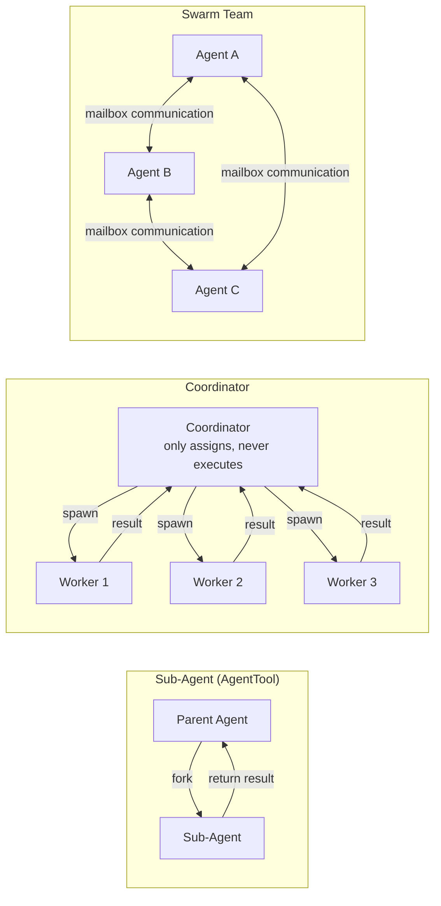

| Pattern | Use Case | Communication | Characteristics |
|---------|----------|---------------|-----------------|
| **Sub-Agent** | Single independent subtask | fork-return | Simplest, parent Agent waits for result |
| **Coordinator** | Complex multi-step task | spawn + synthesize | Coordinator does not execute, only orchestrates |
| **Swarm Team** | Parallel collaborative task | Named mailbox | Peer-to-peer communication between Agents |

These three patterns increase in complexity, but share the same underlying infrastructure — the `AgentTool` tool, `ToolUseContext` context isolation, and `<task-notification>` result notifications. Understanding the Sub-Agent pattern is the foundation for understanding the other two patterns.

## 7.2 Sub-Agent Pattern (AgentTool)

This is the most fundamental multi-Agent pattern. The parent Agent spawns a sub-Agent via [AgentTool](/en/docs/04-tool-system.md) to execute independent tasks.

Key file: `src/tools/AgentTool/AgentTool.tsx`

### Complete Parameter Analysis

```typescript
{
  description: string,           // 3-5 word task description (required)
  prompt: string,                // Complete task instruction (required) — Worker starts from scratch, no conversation context
  subagent_type?: string,        // Specialized Agent type
  model?: 'sonnet' | 'opus' | 'haiku',  // Model override
  run_in_background?: boolean,   // Async execution, result delivered via <task-notification>
  name?: string,                 // Addressable name (used for SendMessage)
  isolation?: 'worktree' | 'remote'  // Isolation mode
}
```

**Key design**: The `prompt` must be self-contained — the Worker cannot see the parent Agent's conversation history. This means every prompt must include all the information needed to complete the task: file paths, line numbers, specific modification details.

Why adopt this "no-context" design instead of sharing conversation history? There are three reasons:
1. **Isolation**: The sub-Agent won't be distracted by irrelevant information in the parent Agent's conversation, keeping the context more focused
2. **Cost control**: Sharing the full conversation history would significantly increase token consumption per API call
3. **Parallel safety**: When multiple sub-Agents run in parallel, sharing mutable conversation history would cause race conditions

The only exception is the Fork sub-Agent (detailed later), which inherits the full context while maintaining cost efficiency through an ingenious caching mechanism.

### Sub-Agent Type System

`subagent_type` determines the Worker's toolset, system prompt, and behavioral constraints. The Claude Code source code defines three tiers of Agent types:

**Tier 1: Built-in types** (`src/tools/AgentTool/built-in/`)

These types are defined by the Claude Code core code and have been carefully optimized:

| Type | Toolset | Model | System Prompt Characteristics | Purpose |
|------|---------|-------|-------------------------------|---------|
| **general-purpose** | `['*']` (all) | Default sub-Agent model | Minimal — "complete the task, report concisely" | General tasks |
| **Explore** | Excludes Agent/Edit/Write/NotebookEdit | Haiku for external (fast); inherits parent for internal | Strict read-only + parallel search optimization | Codebase exploration |
| **Plan** | Same as Explore | Inherits parent model | Read-only + structured output requirement | Designing implementation plans |

**Tier 2: Custom types** (`.claude/agents/*.md`)

Defined by users via Markdown frontmatter, supporting all `BaseAgentDefinition` fields. For example:

```markdown
---
description: "Database migration specialist"
tools: ["Bash", "Read", "Edit"]
model: "sonnet"
permissionMode: "plan"
---
You are a database migration expert...
```

**Tier 3: Plugin types**

Injected through the plugin system, identified by `source: 'plugin'`.

#### Explore Agent In-Depth Analysis

The design of the Explore Agent reflects multiple nuanced engineering trade-offs (`src/tools/AgentTool/built-in/exploreAgent.ts`):

**System prompt "READ-ONLY" hard constraint**: The prompt begins with `=== CRITICAL: READ-ONLY MODE ===`, explicitly declaring a forbidden list (cannot create/modify/delete files, cannot use redirects to write files, cannot run commands that change system state). Although `disallowedTools` already blocks write tools at the tool layer, the repeated declaration in the system prompt adds an additional safety barrier at the model layer — the model won't attempt to write files indirectly through the Bash tool.

**Haiku model selection**: External users use Haiku (speed-first), internal users inherit the parent model. This choice is based on Explore's task characteristics — searching and reading files don't require strong reasoning capabilities, and speed matters more. The source code comments explain this:

```typescript
// Ants get inherit to use the main agent's model; external users get haiku for speed
model: process.env.USER_TYPE === 'ant' ? 'inherit' : 'haiku',
```

**`omitClaudeMd: true` cost optimization**: The Explore Agent doesn't need to know about the project's commit conventions, PR templates, or other rules in CLAUDE.md — it only reads code, and the parent Agent interprets the results. The source code comments reveal the scale of this optimization:

```typescript
// Explore is a fast read-only search agent — it doesn't need commit/PR/lint
// rules from CLAUDE.md. The main agent has full context and interprets results.
omitClaudeMd: true,
```

> At the scale of 34M+ Explore calls/week, omitting CLAUDE.md saves approximately 5-15 Gtok/week.

**Speed hint for parallel tool calls**: The end of the system prompt specifically emphasizes "call multiple tools in parallel for search and file reading whenever possible" — this leverages the API's parallel tool calling capability to accelerate search.

#### Plan Agent In-Depth Analysis

The Plan Agent (`src/tools/AgentTool/built-in/planAgent.ts`) shares the read-only tool restriction with Explore but has different design goals:

**Structured output requirement**: The system prompt requires the Plan Agent to include a "Critical Files for Implementation" list (3-5 files) at the end of its output. This is not an optional suggestion — it ensures the planning result is actionable, so the parent Agent can begin execution based on these key file paths.

**Inherits parent model**: Unlike Explore which uses Haiku, Plan uses `model: 'inherit'`, because architecture design and plan formulation require stronger reasoning capabilities.

**Tool list reuse**: `tools: EXPLORE_AGENT.tools` — Plan directly references Explore's tool definition, ensuring the two remain consistent.

#### General-purpose Agent Design Philosophy

The design philosophy of the General-purpose Agent (`src/tools/AgentTool/built-in/generalPurposeAgent.ts`) is "minimal constraints":

```typescript
const SHARED_PREFIX = `You are an agent for Claude Code... Complete the task
  fully—don't gold-plate, but don't leave it half-done.`
```

- `tools: ['*']` grants full tool capabilities
- Does not set `omitClaudeMd` — because the general Agent may need to follow the project's commit conventions and other rules
- Does not specify `model` — uses `getDefaultSubagentModel()` to get the default sub-Agent model
- Concise system prompt: only requires "complete the task, report concisely"

**Why restrict toolsets?** Different tasks have different security needs. The Explore Agent only needs to read code — granting it write capabilities is unnecessary risk. The type system implements the principle of least privilege.

### AgentTool Call Complete Flow

When the model issues an Agent tool call, the system goes through the following 5 stages. Understanding this flow helps explain how sub-Agents achieve both isolation and efficiency.

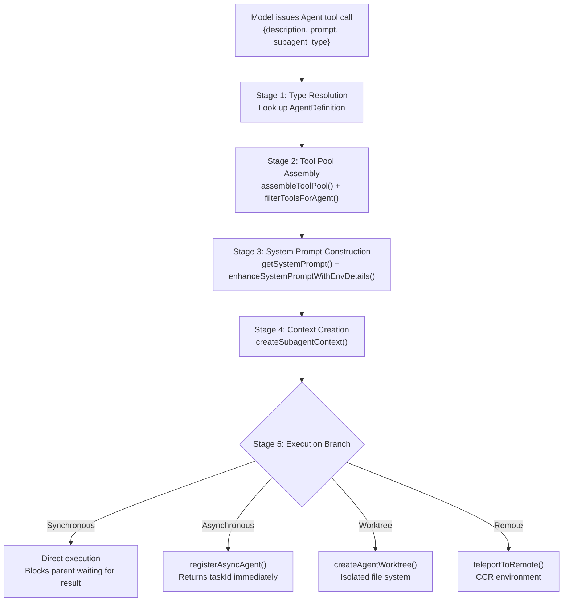

#### Stage 1: Type Resolution

The core logic for type resolution is in `AgentTool.tsx:318-356`:

```typescript
// Fork subagent experiment routing:
// - subagent_type set: use it (explicit wins)
// - subagent_type omitted, gate on: fork path (undefined)
// - subagent_type omitted, gate off: default general-purpose
const effectiveType = subagent_type
  ?? (isForkSubagentEnabled() ? undefined : GENERAL_PURPOSE_AGENT.agentType);
const isForkPath = effectiveType === undefined;
```

The decision logic of this code is quite clever:
- **Type explicitly specified**: Use it directly, no guessing — "explicit wins"
- **Type omitted + fork experiment enabled**: Take the fork path (inherits full context)
- **Type omitted + fork experiment disabled**: Fall back to general-purpose

If a type is specified, the system looks for a matching `AgentDefinition` in the `agentDefinitions.activeAgents` list. When not found, it distinguishes between "does not exist" and "rejected by permissions" — two different cases with different error messages — which is very helpful for user debugging.

#### Stage 2: Tool Pool Assembly

The sub-Agent's tool pool is **built independently of the parent**, which is a key isolation design (`AgentTool.tsx:568-577`):

```typescript
// Assemble the worker's tool pool independently of the parent's.
// Workers always get their tools from assembleToolPool with their own
// permission mode, so they aren't affected by the parent's tool restrictions.
const workerPermissionContext = {
  ...appState.toolPermissionContext,
  mode: selectedAgent.permissionMode ?? 'acceptEdits'
};
const workerTools = assembleToolPool(workerPermissionContext, appState.mcp.tools);
```

Note that `permissionMode` defaults to `'acceptEdits'` — this means the sub-Agent can automatically execute edit operations by default, without requiring individual confirmations. This is reasonable because the sub-Agent has already been delegated a clear task by the parent Agent.

After the tool pool is assembled, it still passes through multi-layer filtering by `filterToolsForAgent()` (see "Tool Filtering Pipeline" below for details).

#### Stage 3: System Prompt Construction

The prompt construction paths for regular sub-Agents and Fork sub-Agents are completely different (`AgentTool.tsx:483-541`):

**Regular path**:
1. Call the agent definition's `getSystemPrompt()` function to get the base prompt
2. Use `enhanceSystemPromptWithEnvDetails()` to append environment information (absolute path format, platform info, etc.)
3. The user's `prompt` is sent as a separate user message

**Fork path**:
1. Directly use the parent's already-rendered system prompt bytes (`toolUseContext.renderedSystemPrompt`), without recalculating
2. Use `buildForkedMessages()` to construct the message sequence (clone parent assistant message + placeholder tool_result + sub-agent instruction)

Why doesn't the Fork path recalculate the system prompt? Because the GrowthBook (A/B testing system) state might change between the start of the parent's turn and when the fork is generated. Recalculating would produce a different byte sequence, causing Prompt Cache invalidation.

#### Stage 4: Context Creation

`createSubagentContext()` (`src/utils/forkedAgent.ts:345-462`) is the security cornerstone of the entire multi-Agent architecture. See "Context Isolation In-Depth Analysis" below for details.

#### Stage 5: Execution Branch

The execution mode selection logic is in `AgentTool.tsx:555-567`:

```typescript
const shouldRunAsync = (
  run_in_background === true ||
  selectedAgent.background === true ||
  isCoordinator ||      // All Agents are async in coordinator mode
  forceAsync ||         // All Agents are async when fork experiment is enabled
  assistantForceAsync   // Force async in assistant mode
) && !isBackgroundTasksDisabled;
```

Several noteworthy design decisions:
- **Coordinator mode forces async**: Because the coordinator needs to manage multiple Workers simultaneously, and synchronous execution would block orchestration
- **Fork experiment forces async**: Unifies on the `<task-notification>` interaction model
- **In-process teammates cannot run background Agents**: Their lifecycle is bound to the parent, and forcing background would lead to orphan processes

### Tool Filtering Pipeline

A sub-Agent's tools are not simply "use whatever is given" — instead they pass through a carefully designed four-layer filtering pipeline. This pipeline implements **defense in depth**: even if one layer has a vulnerability, the other layers can still intercept dangerous tool access.

Key function: `filterToolsForAgent()` (`src/tools/AgentTool/agentToolUtils.ts:70-116`)

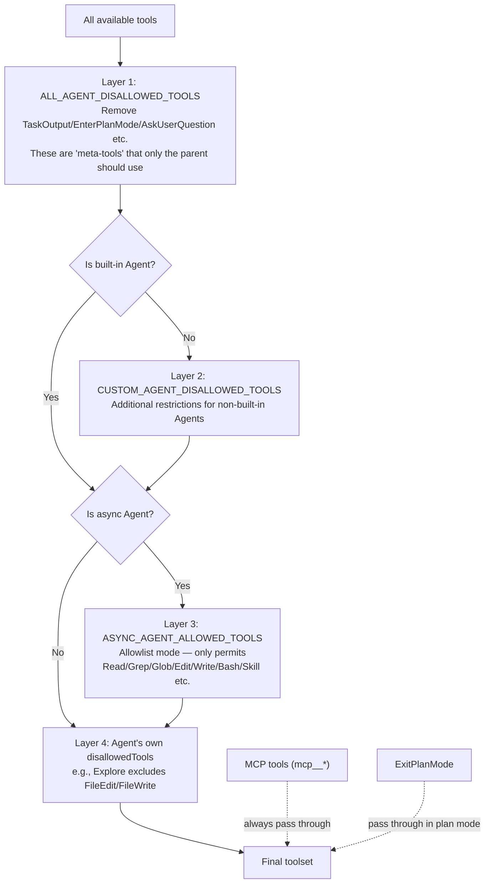

**Layer 1 `ALL_AGENT_DISALLOWED_TOOLS`**: Removes "meta-tools" — TaskOutput, EnterPlanMode, ExitPlanMode, AskUserQuestion, TaskStop, etc. These tools are used to control the Agent's execution flow itself; sub-Agents should not be able to enter Plan mode or ask the user questions.

**Layer 2 `CUSTOM_AGENT_DISALLOWED_TOOLS`**: Imposes additional restrictions on user-defined Agents (from `.claude/agents/`). This is a security boundary — user-defined Agent types should not gain the same permissions as built-in types.

**Layer 3 `ASYNC_AGENT_ALLOWED_TOOLS`** (allowlist mode): Async Agents can only use tools on the allowlist (Read, Grep, Glob, Edit, Write, Bash, Skill, NotebookEdit, etc.). Why do async Agents need stricter restrictions? Because async Agents run in the background and cannot display interactive UI (such as permission confirmation dialogs), so certain tools that require user interaction must be excluded.

**Layer 3 exceptions**:
- **MCP tools** (names starting with `mcp__`) always pass through — they are provided by user-configured external services, and the user is responsible for their security
- **ExitPlanMode**: Allowed when `permissionMode === 'plan'` — in-process teammates need the ability to exit Plan mode
- **In-process teammates**: Gain additional Agent tools (can spawn synchronous sub-Agents) and task coordination tools (TaskCreate/TaskGet/TaskList/TaskUpdate/SendMessage) — these tools enable teammates to coordinate shared task lists and communicate with each other

**Layer 4**: The Agent's own defined `disallowedTools`. For example, the Explore Agent explicitly excludes `[Agent, ExitPlanMode, FileEdit, FileWrite, NotebookEdit]`.

> **Design insight**: The first three layers are global policies (all Agents are constrained), while the fourth layer is a type-level policy (constraints specific to a type). This layering ensures that even if someone writes a custom Agent with `disallowedTools: []` (an empty forbidden list), it is still protected by the first three layers.

### Context Isolation In-Depth Analysis

`createSubagentContext()` (`src/utils/forkedAgent.ts:345-462`) is the security cornerstone of the multi-Agent architecture. It creates an isolated `ToolUseContext` for each sub-Agent, ensuring that the sub-Agent's behavior does not affect the parent.

The core design principle is **"isolated by default, explicitly shared"** (deny by default): all mutable state is isolated by default, and if sharing is needed, it must be explicitly opted in via `shareSetAppState`, `shareAbortController`, and similar parameters.

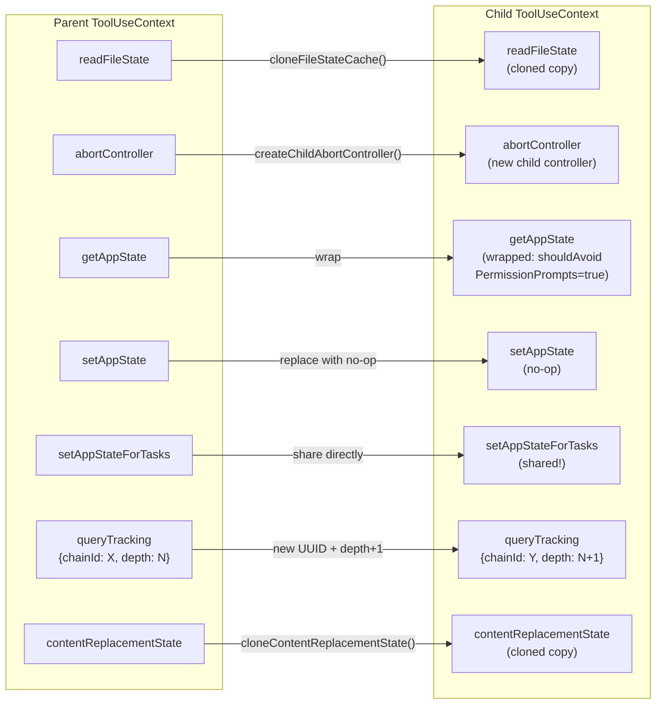

A field-by-field analysis of each isolation approach and its design rationale:

#### readFileState: Cloned

```typescript
readFileState: cloneFileStateCache(
  overrides?.readFileState ?? parentContext.readFileState,
),
```

The file state cache records the last read time and content hash for each file. If the sub-Agent shared the same cache with the parent, the sub-Agent's file reads would alter the cache state, causing the parent to misjudge file freshness. Cloning ensures the sub-Agent's read operations do not "pollute" the parent's cache.

#### abortController: New Child Controller

```typescript
const abortController = overrides?.abortController ??
  (overrides?.shareAbortController
    ? parentContext.abortController
    : createChildAbortController(parentContext.abortController))
```

`createChildAbortController()` uses `WeakRef` to create a child controller linked to the parent. Key behaviors:
- **Parent aborts -> child also aborts**: The abort signal is propagated via an event listener
- **Child aborts != parent aborts**: The child's abort only cleans up its own listeners, without affecting the parent

This unidirectional propagation is the foundation of fault isolation: the failure (abort) of one sub-Agent does not cascade to the parent or other sub-Agents.

#### getAppState: Wrapped

```typescript
getAppState: overrides?.shareAbortController
  ? parentContext.getAppState  // Interactive sub-Agent shares directly
  : () => {
      const state = parentContext.getAppState()
      return {
        ...state,
        toolPermissionContext: {
          ...state.toolPermissionContext,
          shouldAvoidPermissionPrompts: true,  // Key!
        },
      }
    }
```

The `getAppState` of non-interactive sub-Agents (running in background) is wrapped to always return `shouldAvoidPermissionPrompts: true`. This prevents background sub-Agents from popping up permission confirmation dialogs that would block the parent's terminal — background Agents have nowhere to display UI.

#### setAppState: Default no-op

```typescript
setAppState: overrides?.shareSetAppState
  ? parentContext.setAppState
  : () => {},  // Isolated: sub-Agent's state changes do not propagate
```

A sub-Agent's state changes (such as tool progress, response length) do not propagate to the parent UI by default. This avoids the chaos of multiple parallel sub-Agents updating the UI simultaneously.

#### setAppStateForTasks: Always Shared

```typescript
// Task registration/kill must always reach the root store, even when
// setAppState is a no-op — otherwise async agents' background bash tasks
// are never registered and never killed (PPID=1 zombie).
setAppStateForTasks:
  parentContext.setAppStateForTasks ?? parentContext.setAppState,
```

This is the only callback that must be shared even when `setAppState` is a no-op. Why? Because sub-Agents may start background processes via the Bash tool. If these processes' registration information cannot reach the root store, when the sub-Agent finishes, those processes become zombie processes — PPID=1, with no one to reap them.

#### queryTracking: New chainId + depth + 1

```typescript
queryTracking: {
  chainId: randomUUID(),           // A new chain ID for each sub-Agent
  depth: (parentContext.queryTracking?.depth ?? -1) + 1,
}
```

This field serves two purposes:
1. **Preventing infinite recursion**: The incrementing depth enables the system to detect and limit Agent nesting depth
2. **Chain tracing**: The chainId allows analytics systems to trace an Agent's lineage, used for performance analysis and debugging

#### contentReplacementState: Cloned (Not Fresh)

```typescript
// Clone by default (not fresh): cache-sharing forks process parent
// messages containing parent tool_use_ids. A fresh state would see
// them as unseen and make divergent replacement decisions → wire
// prefix differs → cache miss.
contentReplacementState:
  overrides?.contentReplacementState ??
  (parentContext.contentReplacementState
    ? cloneContentReplacementState(parentContext.contentReplacementState)
    : undefined),
```

The handling of this field is particularly subtle. It manages content replacement in tool results (such as truncating excessively long output). Why use cloning instead of creating fresh? Because Fork sub-Agents process messages containing parent `tool_use_id`s. If a fresh state were used, it would make different replacement decisions for the same `tool_use_id`, causing the API request byte sequence to differ — and the Prompt Cache would be invalidated. Cloning ensures identical decisions for known IDs, maintaining cache hits.

### Four Execution Modes

| Mode | Implementation | Result Delivery | Use Case |
|------|---------------|-----------------|----------|
| **Synchronous** | In-process direct execution | Result embedded in parent conversation | Simple subtasks |
| **Asynchronous** | `LocalAgentTask` | `<task-notification>` XML | Long-running tasks |
| **Teammate** | Tmux/iTerm2/InProcess session | Mailbox communication | Parallel collaboration |
| **Remote** | `RemoteAgentTask` | WebSocket streaming | CCR environment |

**Synchronous mode** is the simplest: the parent Agent blocks and waits for the sub-Agent to complete, and the result is directly embedded in the parent conversation as a `tool_result`. Suitable for quick exploration or search tasks.

**Asynchronous mode** is suitable for long-running tasks. `registerAsyncAgent()` registers the task state in `AppState.tasks`, and the parent Agent immediately receives a response containing `agentId` and `outputFile`, allowing it to continue processing other work. When the task completes, `enqueueAgentNotification()` delivers a `<task-notification>` XML as a user-role message into the parent's next conversation turn.

**Automatic backgrounding**: When a synchronous Agent runs for more than 120 seconds (`getAutoBackgroundMs()`), the system automatically converts it to a background task to avoid blocking the parent for extended periods:

```typescript
function getAutoBackgroundMs(): number {
  if (isEnvTruthy(process.env.CLAUDE_AUTO_BACKGROUND_TASKS) ||
      getFeatureValue_CACHED_MAY_BE_STALE('tengu_auto_background_agents', false)) {
    return 120_000;
  }
  return 0;
}
```

### Isolation Modes

**Git Worktree isolation**: The sub-Agent works in an independent Git Worktree, preventing multiple Agents from modifying the same file simultaneously:

```
Main repository (main branch)
├── Agent A works here
│
├── .git/worktrees/
│   ├── worktree-abc/     ← Agent B's isolated copy
│   └── worktree-def/     ← Agent C's isolated copy
```

Worktree creation process (`src/utils/worktree.ts`):
1. **Slug validation**: Maximum 64 characters, only allows alphanumeric characters and `./-/_`, forbids path traversal (`..`, absolute paths) — this is a security boundary, preventing sub-Agents from accessing files outside the repository via slug injection
2. **Creation**: Created under `.claude/worktrees/<slug>/`, using symbolic links for large directories (such as `node_modules`) to avoid disk usage
3. **Cleanup**: After the task completes, if the worktree has no file changes (detected via `git diff`), it is automatically deleted; if there are changes, the path and branch name are returned, and the user decides whether to merge

**Remote isolation**: Executes in a remote CCR (Cross-Continent Runtime) environment, with messages streamed via WebSocket, suitable for scenarios requiring complete sandbox isolation. Remote isolation always runs in asynchronous mode.

### Fork Sub-Agent

When `subagent_type` is not specified and the `FORK_SUBAGENT` feature gate is enabled, the system creates a **fork sub-Agent** — a special mode that inherits the parent's full conversation context.

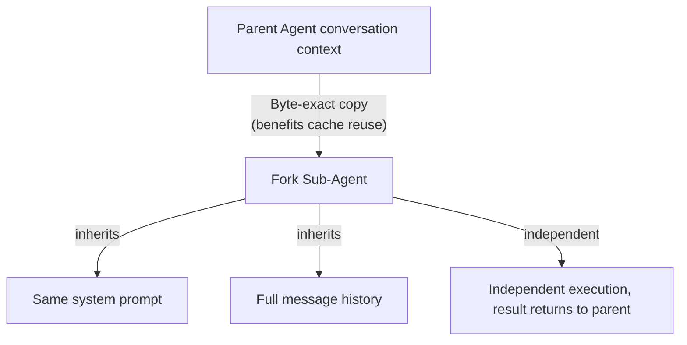

#### Why Fork? The Economics of Prompt Cache

The core motivation for the Fork mechanism is **Prompt Cache sharing**. Understanding this requires first understanding the Anthropic API's caching mechanism:

The API caches based on request prefix (system prompt + tools + messages prefix). If two requests have byte-identical prefixes, the second request can reuse the first's cache, with cache read tokens being 90% cheaper than input tokens.

A regular sub-Agent has its own system prompt and empty message history — its request prefix is completely different from the parent's and cannot share the cache. Every call is a "cold start."

A Fork sub-Agent is different: it **inherits the parent's full request prefix** (same system prompt, same tool definitions, same message history), only appending a different instruction at the end. This means all sub-Agents forked from the same parent share the same cache prefix — the first fork is a cold start, and subsequent ones are cache hits.

The `CacheSafeParams` type in the source code (`forkedAgent.ts:57-68`) makes this "byte-level identical" requirement explicit:

```typescript
export type CacheSafeParams = {
  /** System prompt - must match parent for cache hits */
  systemPrompt: SystemPrompt
  /** User context - prepended to messages, affects cache */
  userContext: { [k: string]: string }
  /** System context - appended to system prompt, affects cache */
  systemContext: { [k: string]: string }
  /** Tool use context containing tools, model, and other options */
  toolUseContext: ToolUseContext
  /** Parent context messages for prompt cache sharing */
  forkContextMessages: Message[]
}
```
#### Fork Message Construction

`buildForkedMessages()` (`forkSubagent.ts:107-169`) is the core of the fork mechanism — it constructs a set of messages ensuring that all fork children share identical request prefix bytes:

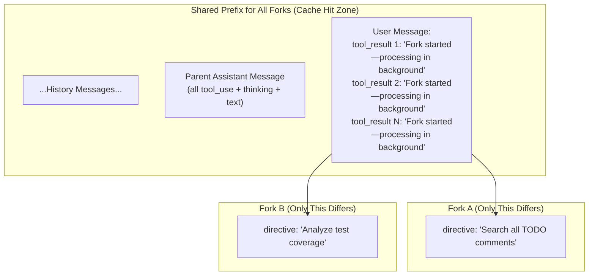

Key implementation details:
1. **Clone the parent assistant message**: Preserve all content blocks (thinking, text, every tool_use) without modification — ensuring byte-identical content
2. **Placeholder tool_results**: Generate a tool_result for each tool_use, with the text uniformly set to `"Fork started — processing in background"`. Why not use actual results? Because actual results differ from one another, which would break the consistency of the cache prefix
3. **Per-child directive**: Only the last text block is unique to each fork — containing the specific instructions that fork needs to execute

#### Recursive Fork Prevention

The fork children's tool pool retains the Agent tool (for cache consistency — removing it would change the tool definition bytes), but at runtime, recursive forking is blocked through two lines of defense:

```typescript
// First line: Detection via querySource (resistant to message compaction)
if (toolUseContext.options.querySource === `agent:builtin:${FORK_AGENT.agentType}`)

// Second line: Scanning message history for FORK_BOILERPLATE_TAG (fallback)
|| isInForkChild(toolUseContext.messages)
```

Why are two lines of defense needed? `querySource` is set in the context's options and is unaffected by automatic message compaction (autocompact) — this is the preferred approach. Message scanning is a fallback, covering edge cases where `querySource` was not correctly propagated.

#### Fork Agent Definition

```typescript
export const FORK_AGENT = {
  agentType: 'fork',
  tools: ['*'],              // All tools, maintaining cache consistency with parent
  maxTurns: 200,
  model: 'inherit',          // Inherit parent model (matching context length)
  permissionMode: 'bubble',  // Permission requests bubble up to parent terminal
  getSystemPrompt: () => '', // Not used — fork directly uses parent's rendered system prompt
}
```

`permissionMode: 'bubble'` is a unique permission mode — when a fork child needs permission confirmation, the request "bubbles" up to the parent's terminal display, rather than being silently denied. This is because fork children are designed as "extensions of the parent," and their operations are conceptually still under user control.

`getSystemPrompt: () => ''` looks like a bug, but is actually intentional design — the fork path never calls this function, instead directly passing the parent's `renderedSystemPrompt` bytes. If it is accidentally called (e.g., due to incorrect code path), the empty string causes an obvious exception rather than a subtle cache invalidation.

**Mutually exclusive with Coordinator mode**: Fork and Coordinator cannot be enabled simultaneously — the Coordinator has its own Worker delegation mechanism, and fork's "inherit full context" design contradicts the Coordinator's "Worker starts from scratch" philosophy.

## 7.3 Coordinator Mode

Coordinator mode (Feature-gated: `COORDINATOR_MODE`) transforms the main Agent into a **pure orchestrator** — only responsible for analyzing tasks, assigning Workers, and synthesizing results, never directly operating on files.

Key file: `src/coordinator/coordinatorMode.ts`

### Coordinator Role Definition

The Coordinator's system prompt is generated by `getCoordinatorSystemPrompt()`, containing 6 carefully designed sections:

| Section | Content | Core Constraint |
|---------|---------|----------------|
| **1. Your Role** | Defines coordinator responsibilities | "Direct workers, synthesize results, communicate with user" |
| **2. Your Tools** | Agent, SendMessage, TaskStop | "Do not use workers to trivially report file contents" |
| **3. Workers** | Worker capabilities and toolset | subagent_type must be `worker` |
| **4. Task Workflow** | Four-phase workflow + concurrency management | "Parallelism is your superpower" |
| **5. Writing Worker Prompts** | Prompt writing guidelines | "Never write 'based on your findings'" |
| **6. Example Session** | Complete multi-turn interaction example | End-to-end flow from research to fix |

### Coordinator Available Tools

The Coordinator's toolset is strictly limited — this is a core design constraint:

| Tool | Purpose |
|------|---------|
| `Agent` | Spawn new Workers |
| `SendMessage` | Continue existing Workers (leveraging their loaded context) |
| `TaskStop` | Terminate Workers (cut losses when direction is wrong) |
| `subscribe_pr_activity` | Subscribe to GitHub PR events (if available) |

The Coordinator **cannot** use Bash, Edit, Read, and other tools — this ensures it only orchestrates, never executes. Internal tools (TeamCreate, TeamDelete, SendMessage, SyntheticOutput) are excluded from the main thread.

**Why can't the Coordinator execute?** This is not merely a division of labor — if the Coordinator both made decisions and executed them, it would tend toward "doing it myself is faster than delegating," thereby degenerating into an ordinary single Agent. The hard limitation on the toolset forces it to accomplish all actual operations through Workers, which guarantees objectivity in task allocation and parallelization.

### Worker Toolset

Workers receive different tools based on the mode:

```typescript
// src/coordinator/coordinatorMode.ts
const workerTools = isEnvTruthy(process.env.CLAUDE_CODE_SIMPLE)
  ? [BASH_TOOL_NAME, FILE_READ_TOOL_NAME, FILE_EDIT_TOOL_NAME]  // Simple mode
  : Array.from(ASYNC_AGENT_ALLOWED_TOOLS)                        // Full mode
      .filter(name => !INTERNAL_WORKER_TOOLS.has(name))
```

- **Simple mode** (`CLAUDE_CODE_SIMPLE`): Bash, Read, Edit
- **Full mode**: All tools in `ASYNC_AGENT_ALLOWED_TOOLS` (excluding internal tools)
- MCP tools are automatically available
- Skills are delegated through SkillTool

### Worker Tool Context Injection

`getCoordinatorUserContext()` does something seemingly simple but critically important: it constructs a `workerToolsContext` string that is injected into the Coordinator's user context. This string tells the Coordinator:

1. **What tools Workers have** — the Coordinator needs to know Workers' capability boundaries to write feasible prompts (it won't ask Workers to use tools they don't have)
2. **What MCP servers are available** — if a Slack MCP is connected, the Coordinator knows it can dispatch a Worker to send messages
3. **Scratchpad directory path** — if Scratchpad is enabled, the Coordinator can direct Workers to write findings in the shared directory

This is **context engineering manifested at the orchestration layer** — the Coordinator is not blindly delegating, but formulating feasible task plans based on Workers' actual capabilities.

### Standard Workflow

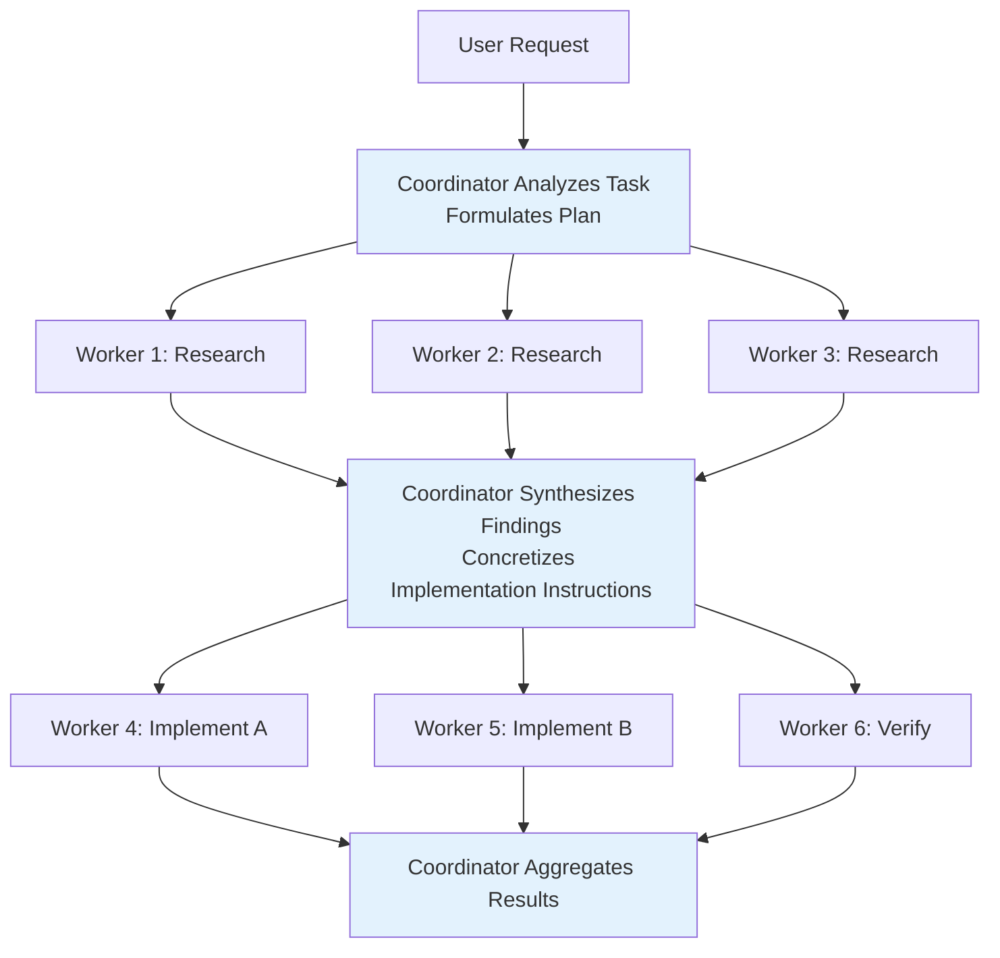

Concurrency management rules for the four phases:

| Phase | Concurrency Strategy | Reason |
|-------|---------------------|--------|
| Research | Freely parallel | Read-only operations, no conflict risk |
| Synthesis | Coordinator serial | Must understand all findings before issuing instructions |
| Implementation | Serial per file set | Writes to the same file must be serialized to prevent conflicts |
| Verification | Can parallelize with implementation on different file regions | Verification does not modify code under test |

### Coordinator Prompt Design Essentials

`getCoordinatorSystemPrompt()` embodies multiple design principles validated through practice:

**1. "Never write 'based on your findings'"**

The Coordinator must understand research results itself, then write implementation instructions that include specific file paths, line numbers, and modification content. "Based on your findings" delegates the understanding capability to the Worker, violating the Coordinator's core responsibility.

```
// Anti-pattern — lazy delegation
Agent({ prompt: "Based on your findings, fix the auth bug" })

// Correct — concrete instructions after synthesis
Agent({ prompt: "Fix the null pointer in src/auth/validate.ts:42.
  The user field on Session is undefined when sessions expire but
  the token remains cached. Add a null check before user.id access." })
```

Why is this rule so important? Because it defines the Coordinator's **non-delegable responsibility** — synthesized understanding. If the Coordinator merely forwards messages ("Worker A found something, Worker B go handle it"), it degenerates into a message router with no intelligent orchestration value. Forcing the Coordinator to "understand and concretize" during the synthesis phase is the key to maintaining orchestration quality.

**2. "Every message you send is to the user"**

This rule prevents the Coordinator from remaining silent during long-running operations. Workers' `<task-notification>` messages are internal signals, not conversation partners — the Coordinator should not reply to notifications, but should report progress to the user.

**3. "Don't set the model parameter"**

The Coordinator prompt explicitly requires not setting the `model` parameter for Workers. The reason is that Workers default to using the same model as the Coordinator for substantive tasks. If the Coordinator sets a cheaper model to "save costs," Workers may perform poorly on complex implementation tasks — this is an easy mistake to make.

**4. "Add a purpose statement"**

The Coordinator is required to include a "purpose statement" in Worker prompts — for example, "This research will inform a PR description." This is subtle but important prompt engineering: when Workers know the purpose of their output, they adjust the depth and format accordingly. Research for a PR description will focus more on user-visible changes, while research for a bug fix will focus more on root cause analysis.

**5. Continue vs Spawn Decision Table**

| Scenario | Decision | Reason |
|----------|----------|--------|
| Research explored files that need editing | **Continue** | Worker already has file context |
| Research scope broad but implementation scope narrow | **Spawn** | Avoid exploration noise, focused context is cleaner |
| Correcting failure or extending recent work | **Continue** | Worker has error context |
| Verifying code another Worker just wrote | **Spawn** | Verifier should review with fresh perspective |
| Last implementation approach was completely wrong | **Spawn** | Wrong context anchors retry thinking |

The last point is particularly insightful: when a Worker's approach is completely wrong, its conversation history is full of incorrect assumptions and failed attempts. If you continue using this Worker, the model tends to make small patches based on existing context ("anchoring effect") rather than fundamentally switching to a different approach. Spawning a brand new Worker avoids this cognitive anchoring.

**6. "Verification = prove the code works, not confirm the code exists"**

Verification Workers must: run tests (with the feature enabled), investigate type check errors (don't hastily deem them "unrelated"), maintain skepticism, and test independently.

**7. Workers can't see your conversation**

Every Worker prompt must be self-contained. The Coordinator prompt repeatedly emphasizes this point: "Workers can't see your conversation. Every prompt must be self-contained."

This is the most common mistake for beginners — writing prompts like "please continue the previous work," but the Worker has no idea what "previous" refers to.

## 7.4 Swarm Execution Backend

The Swarm system supports creating **named Agent teams**, where Agents communicate peer-to-peer through mailboxes.

Key files: `src/utils/swarm/backends/`

### Three Backends

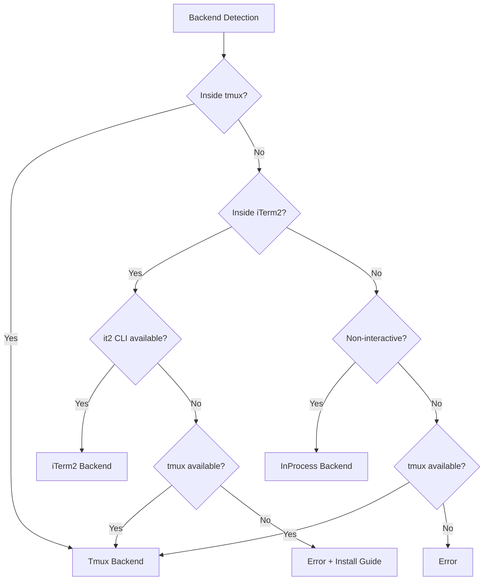

| Backend | Implementation | Characteristics |
|---------|---------------|-----------------|
| **Tmux** | Creates/manages tmux split panes | Supports hide/show, most commonly used |
| **iTerm2** | Native iTerm2 panes (via `it2` CLI) | macOS native experience |
| **InProcess** | Runs within the same Node.js process | AsyncLocalStorage isolation, shared API client and MCP connections |

#### Design Considerations for Backend Selection Priority

The backend detection priority is not arbitrarily arranged; every step has a clear rationale:

1. **Already inside tmux -> Use Tmux directly**: The user already has tmux split-pane infrastructure; creating a new tmux session inside tmux would cause nested confusion. Leveraging the existing environment directly is most natural.

2. **Inside iTerm2 + `it2` CLI available -> Use iTerm2**: Provides a macOS native pane experience (creating/splitting window panes rather than tmux panes), but falls back to tmux if `it2` CLI is unavailable — because tmux is usually also available in an iTerm2 environment.

3. **Non-interactive environment -> InProcess**: CI/CD, SDK calls, and other scenarios without a terminal cannot create visual panes. The InProcess backend running Workers within the same process is the only viable option.

4. **Other interactive environments -> Try tmux**: If none of the above are satisfied, try tmux as a last resort. tmux is available on virtually all Linux/macOS systems.

### Unified Interface

All backends implement the unified `TeammateExecutor` interface:

```typescript
interface TeammateExecutor {
  spawn(config): Promise<void>              // Create teammate
  sendMessage(agentId, message): Promise<void>  // Send message
  terminate(agentId, reason): Promise<void> // Graceful shutdown
  kill(agentId): Promise<void>              // Immediate termination
  isActive(agentId): boolean                // Check if alive
}
```

The distinction between `terminate` and `kill` is important: `terminate` sends a graceful shutdown request (the Agent can finish its current work before exiting), while `kill` immediately interrupts via AbortController. The Coordinator uses `TaskStop` (mapped to kill) when a Worker is headed in the wrong direction, and uses terminate for normal completion.

### InProcess Execution Details

The InProcess backend is the lightest execution method, suitable for non-interactive environments (such as CI/CD). Core file: `src/utils/swarm/inProcessRunner.ts`.

**AsyncLocalStorage Context Isolation**:

Each Worker runs in an independent AsyncLocalStorage context via `runWithTeammateContext()`. Node.js's AsyncLocalStorage provides a mechanism for passing context through asynchronous call chains — each Worker's async call stack (Promise chains, callbacks, etc.) can access its own `TeammateIdentity`, even when they interleave execution in the same Node.js event loop.

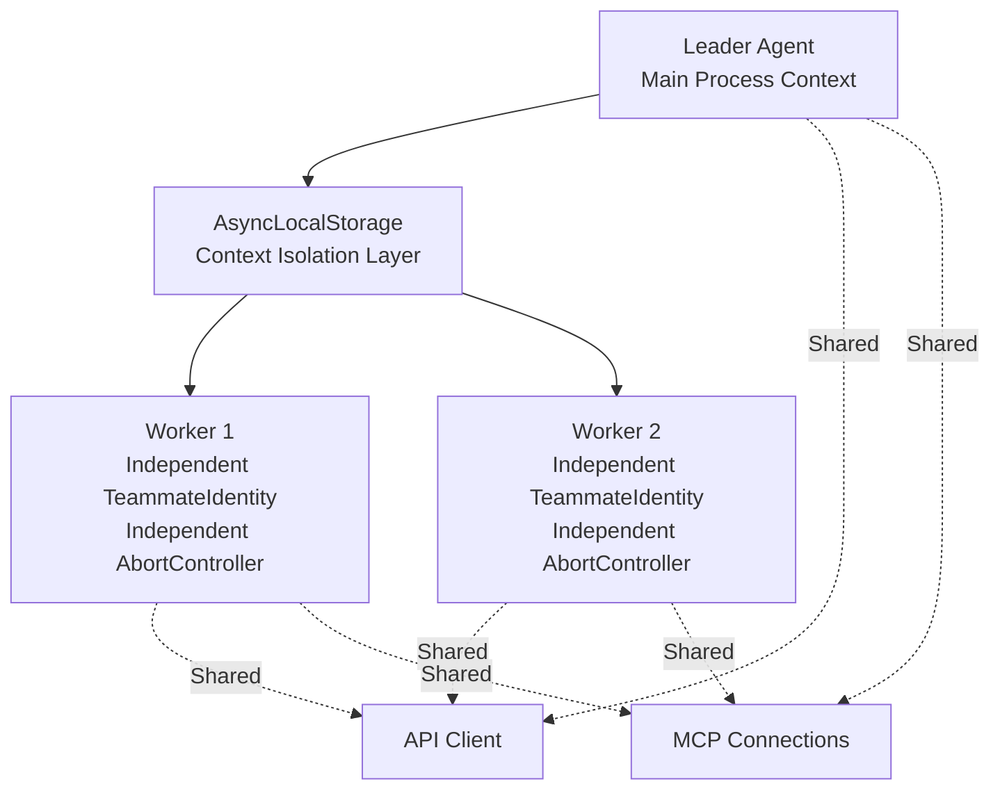

Why can the API client and MCP connections be shared? Because they are essentially stateless connection multiplexing — HTTP clients and WebSocket connections are thread-safe, and multiple Workers can concurrently use the same connection without interference. This avoids the overhead of establishing independent connections for each Worker (TCP handshake, TLS negotiation, MCP initialization, etc.).

**Permission Synchronization Mechanism**:

Workers need permission approval when executing tools. The InProcess backend uses two permission bridging approaches:

1. **Leader bridging** (preferred): Workers directly invoke the Leader's `ToolUseConfirm` dialog, with the UI displaying a Worker badge so the user knows which Worker is making the request. This is the fast path — permission confirmation pops up directly in the terminal, and the user sees it and makes a decision immediately.

2. **Mailbox communication** (fallback): Workers write permission requests to the mailbox (`writeToMailbox`), and the Leader reads and responds via `readMailbox`. This is implemented through `registerPermissionCallback()` / `processMailboxPermissionResponse()`. This is the fallback when Leader bridging is unavailable — for example, when the Leader is busy processing other requests.

**AbortController Independence**:

Each Worker has an independent AbortController. This means:
- One Worker's failure does not affect other Workers
- Coordinator interruption does not cascade to Workers (Workers can be explicitly TaskStopped)
- `killInProcessTeammate()` immediately terminates a specific Worker via its abort controller

### Scratchpad: Cross-Worker Knowledge Sharing

When the `tengu_scratch` feature gate is enabled, the system provides a shared Scratchpad directory:

```typescript
// src/coordinator/coordinatorMode.ts
if (scratchpadDir && isScratchpadGateEnabled()) {
  content += `\nScratchpad directory: ${scratchpadDir}\n` +
    `Workers can read and write here without permission prompts. ` +
    `Use this for durable cross-worker knowledge.`
}
```

Workers can freely read and write files in this directory (without permission confirmation), used for persisting cross-Worker knowledge — such as research findings, intermediate results, and shared configurations.

**Why is Scratchpad needed?** Without it, Workers can only relay information through the Coordinator. This has two problems:
1. **Latency**: Worker A's findings must first be transmitted back to the Coordinator, which synthesizes them and then passes them to Worker B — adding an extra round trip
2. **Information loss**: The Coordinator may lose details during synthesis (such as specific line numbers), and Worker B receives the Coordinator's understanding rather than the original findings

Scratchpad provides a direct bypass channel: Worker A writes detailed findings to a file, and Worker B reads them directly — without going through the Coordinator's "understanding and retelling."

## 7.5 Worker Result Delivery

### Synchronous vs Asynchronous: Two Return Paths

Worker result delivery is divided into synchronous and asynchronous paths, with completely different mechanisms:

**Synchronous path** (`finalizeAgentTool()` in `agentToolUtils.ts`):

When a sub-Agent executes synchronously, the parent Agent blocks and waits. Upon completion, the system extracts the text content from the sub-Agent's last assistant message (excluding intermediate tool call processes), wraps it as an `AgentToolResult`, and embeds it directly as a `tool_result` in the parent conversation.

```typescript
// Synchronous result structure
{
  status: 'completed',
  agentId: string,
  content: [{ type: 'text', text: 'Final result text' }],
  totalToolUseCount: number,
  totalDurationMs: number,
  totalTokens: number,
}
```

**Asynchronous path** (`enqueueAgentNotification()` in `LocalAgentTask.tsx`):

Asynchronous Agents run in the background, and the parent Agent immediately receives a "started" response. When the task completes (success/failure/terminated), the result is delivered as a `<task-notification>` XML format as a **user role message** into the parent's next conversation turn:

```xml
<task-notification>
  <task-id>ae9a65ee22594487c</task-id>
  <status>completed</status>
  <summary>Agent "research query engine" completed</summary>
  <result>
    ... Detailed result content ...
  </result>
  <usage>
    <total_tokens>71330</total_tokens>
    <tool_uses>21</tool_uses>
    <duration_ms>81748</duration_ms>
  </usage>
</task-notification>
```

Key fields:
- `task-id`: Agent ID, can be used with `SendMessage` to continue that Worker
- `status`: `completed` / `failed` / `killed`
- `summary`: Human-readable result summary ("completed" / "failed: {error}" / "was stopped")
- `result`: Worker's text output (optional), used by the Coordinator for synthesis decisions
- `usage`: Token usage, tool call count, duration — for cost tracking

**task-notification arrives as a user role message**. The Coordinator distinguishes them from real user messages via the `<task-notification>` opening tag. This design choice is due to Claude API message format requirements — only user role messages can be system-injected, and `<task-notification>` is essentially a "system event" rather than genuine user input.

### Notification Deduplication and Safety Checks

**Deduplication mechanism**: `enqueueAgentNotification()` uses an atomic `notified` flag (`LocalAgentTask.tsx`) to prevent duplicate notifications. If TaskStop has already marked a task as notified, subsequent completion notifications are silently discarded. This prevents a Worker that was stopped and then happened to naturally complete from sending two notifications to the Coordinator.

**Safety classifier**: When the `TRANSCRIPT_CLASSIFIER` feature gate is enabled, `classifyHandoffIfNeeded()` (`agentToolUtils.ts`) runs a safety classification on the sub-Agent's complete conversation transcript before returning the result to the parent. This is a **defense-in-depth** mechanism — preventing attackers from using carefully crafted file contents (such as prompt injection embedded in a README) to exploit sub-Agents as "stepping stones" to inject malicious instructions into the parent conversation. If the classifier flags the result, a safety warning is prepended to the result text.

### Worker Lifecycle

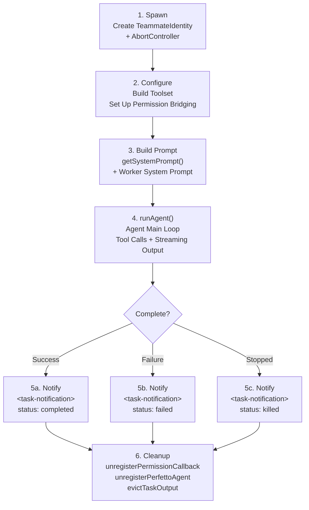

### Error Handling and Recovery

When a Worker fails, the Coordinator has multiple recovery strategies:

| Scenario | Recommended Strategy | Reason |
|----------|---------------------|--------|
| Test failure | `SendMessage` to continue the same Worker | Worker has full error context |
| Approach completely wrong | Spawn new Worker | Avoid wrong context anchoring retry thinking |
| Worker was TaskStopped | Can `SendMessage` to redirect | A stopped Worker can continue |
| Multiple correction failures | Report to user | May require human judgment |

The Coordinator prompt explicitly states handling strategies:

```
When a worker reports failure:
- Continue the same worker with SendMessage — it has the full error context
- If a correction attempt fails, try a different approach or report to the user
```

## 7.6 Plan Mode: Two-Phase Execution

Plan mode inserts an **approval checkpoint** into the Agent's tool call loop — upon entering Plan mode, write permissions are stripped at the system level, and the Agent can only read code and write plan files; after the user approves the plan, permissions are restored, and the Agent executes modifications according to the plan.

Key files: `src/tools/EnterPlanModeTool/`, `src/tools/ExitPlanModeTool/`, `src/utils/planModeV2.ts`, `src/utils/plans.ts`

### Two-Phase Design

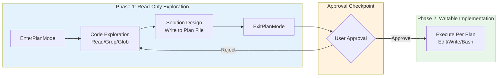

| Phase | Permission Mode | Writable Scope | Agent Behavior |
|-------|----------------|---------------|----------------|
| **Exploration** | `plan` | Plan file only | Read-only tools + Explore/Plan sub-Agents |
| **Implementation** | Restored to original mode | All authorized tools | Execute per approved plan |

### Permission Stripping and Restoration

Upon entering Plan mode, the system performs fine-grained permission management:

```typescript
// src/utils/permissions/permissionSetup.ts
function prepareContextForPlanMode(context: ToolPermissionContext) {
  // 1. Remember the permission mode before entering Plan (e.g., default/auto)
  //    Restore to this mode upon exit
  context.prePlanMode = context.mode

  // 2. If entering from auto mode, strip dangerous permissions
  //    Prevent the auto classifier from approving write operations during exploration
  if (context.mode === 'auto') {
    stripDangerousPermissionsForAutoMode(context)
  }

  // 3. Switch to plan mode
  context.mode = 'plan'
}
```

**"Dangerous permissions" that are stripped include**: Bash tool-level allow rules, script interpreter prefixes (`python:*`, `node:*`, etc.), and Agent wildcards (`agent(*)`). These permissions are automatically restored after the user approves the plan.

> **Design decision: Why not simply disable all write tools?**
>
> Plan mode preserves one writable surface — the plan file (stored at `~/.claude/plans/{slug}.md`). The Agent needs to persist exploration findings and design proposals to this file for user review. This "only allow writing to the plan file" design strikes a balance between safety (not modifying code) and utility (being able to produce a reviewable proposal).

### Plan Mode's Five-Phase Workflow

The system prompt (`src/utils/messages.ts`) defines a structured workflow for Plan mode:

1. **Initial Understanding** — Use Explore sub-Agent to investigate the codebase
2. **Solution Design** — Use Plan sub-Agent to design the implementation approach
3. **Solution Review** — Read key files to ensure the approach is feasible
4. **Write Plan** — Write the final proposal to the plan file (the only editable file)
5. **Exit Plan** — Call ExitPlanMode, triggering user approval

### Approval and State Transitions

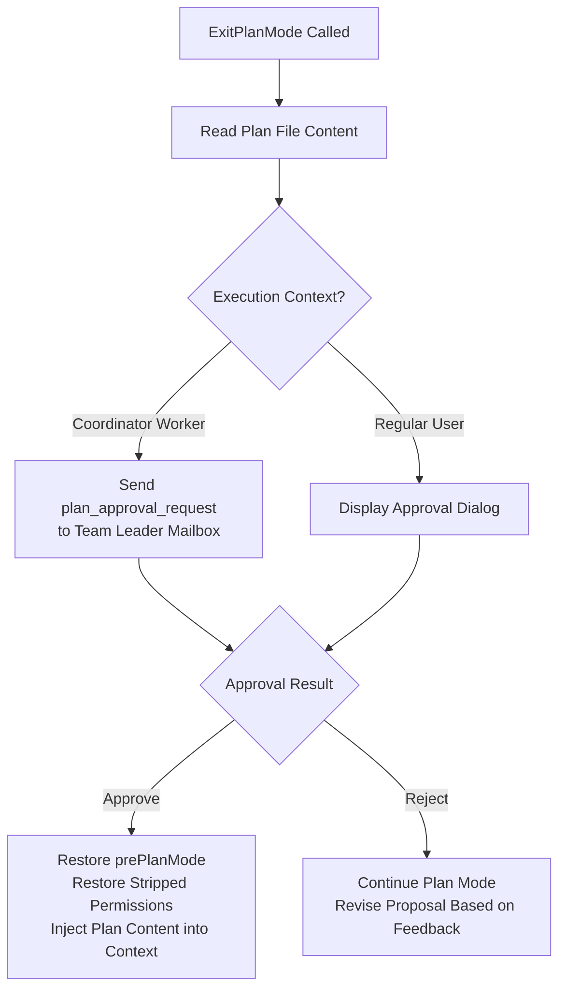

After approval, the plan content is injected into the conversation as a `tool_result`, ensuring the model can reference the specific proposal during the implementation phase.

### Why Is Two-Phase Design Needed?

The traditional Agent execution model is "think while doing" — the model analyzes problems and modifies code simultaneously. This is highly efficient for simple tasks, but for complex tasks it leads to:

- **Directional rework**: The Agent starts modifying code after only looking at partial code, later discovers the overall direction is wrong, and all existing modifications are wasted
- **Unplanned local modifications**: File-by-file modifications lacking a global perspective may introduce inconsistencies, especially in large-scale refactoring
- **Overly fine-grained approval**: Users are forced to approve each tool call individually, having to make decisions without seeing the full picture

Two-phase design forces the Agent to "think thoroughly before acting" through an **approval checkpoint**. The key constraint in the source code is this sentence from the system prompt:

> *"The user indicated that they do not want you to execute yet — you MUST NOT make any edits, run any non-readonly tools, or otherwise make any changes to the system."*

This is not a suggestion; it is a hard constraint — write tool permissions are stripped at the system level in Plan mode, and even if the model attempts to call them, the calls will be rejected.

## 7.7 Design Insights

1. **The Coordinator not executing is a core constraint**: Prevents the Coordinator from both making decisions and executing them, guaranteeing objectivity in task allocation. This is also why the Coordinator's toolset is strictly limited to Agent + SendMessage + TaskStop.
2. **"Never write based on your findings" is the most important prompt design**: Forces the Coordinator to synthesize and understand research results rather than delegating understanding to Workers. This constraint elevates the Coordinator from a message forwarder to a truly intelligent orchestrator.
3. **Continue vs Spawn is not a default choice**: It depends on context overlap. High overlap -> continue, low overlap -> spawn. This decision framework avoids mindless reuse or mindless creation.
4. **AbortController independence ensures fault isolation**: One Worker's crash does not cascade to other Workers. This is a fundamental reliability requirement for parallel systems.
5. **Backend detection priority considers the user's environment**: tmux > iTerm2 > InProcess, maximizing the use of existing terminal capabilities.
6. **Scratchpad solves cross-Worker knowledge sharing**: Without it, Workers can only relay information through the Coordinator, increasing latency and the risk of information loss.
7. **Plan mode's approval checkpoint is the materialization of trust**: Two-phase design is not just a UX improvement — it transforms "user trust" from implicit (permission popups on every tool call) to explicit (one-time approval of the overall plan). This is especially important in team collaboration: a Coordinator Worker's plan needs team leader approval, rather than requiring confirmation for every file modification.
8. **Fork is a cache optimization disguised as an architectural pattern**: The core motivation for fork sub-Agents is not "inheriting context" — it is enabling multiple children to share the parent's Prompt Cache. The `CacheSafeParams` type explicitly requiring "byte-level identical" is the best evidence. Inheriting context is a byproduct of cache sharing, not the design goal.
9. **Context isolation defaults to maximum safety**: `createSubagentContext()` sets all mutable state to isolated by default (no-op / clone), and developers must explicitly opt-in to sharing via parameters like `shareSetAppState`, `shareAbortController`, etc. This "deny by default" design means newly added sub-Agent functionality is inherently safe — unless developers consciously enable sharing.
10. **Tool filtering implements defense in depth**: Four independent layers of filtering (global prohibition -> custom restrictions -> async whitelist -> type-level prohibition) ensure that even if one layer has a bug, other layers can still intercept dangerous tool access. MCP tools' "always pass through" seems like an exception, but is actually the correct delineation of trust boundaries — users are responsible for the security of external tools they configure themselves.

---

> **Hands-on practice**: In [claude-code-from-scratch](https://github.com/Windy3f3f3f3f/claude-code-from-scratch), the Agent main loop (`src/agent.ts`) implements a basic tool call loop. Try adding a simple "plan mode" on top of it — collect all planned operations before executing tools, and let the user approve them all at once.
