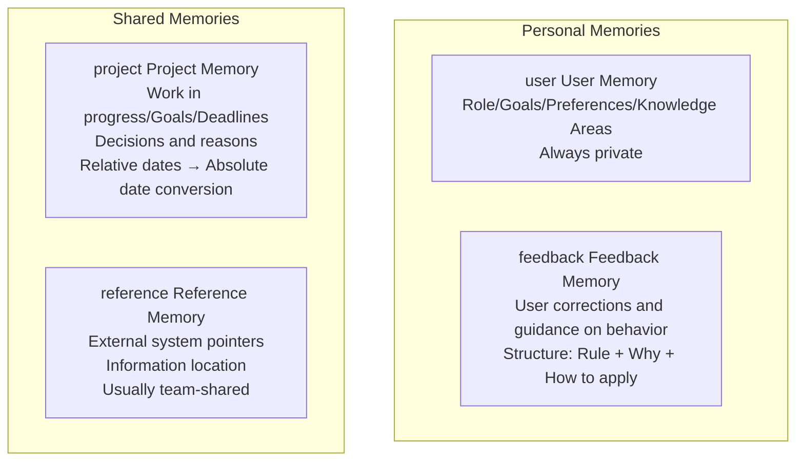
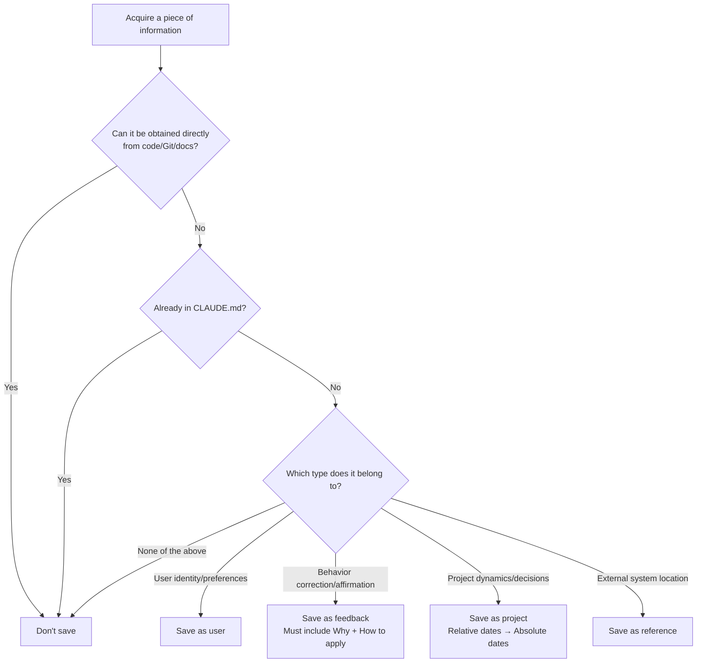
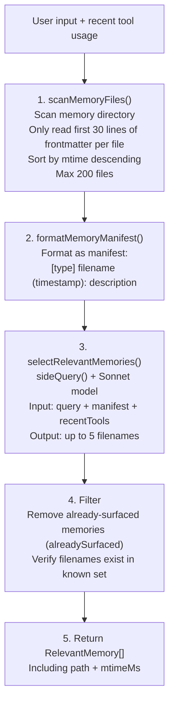
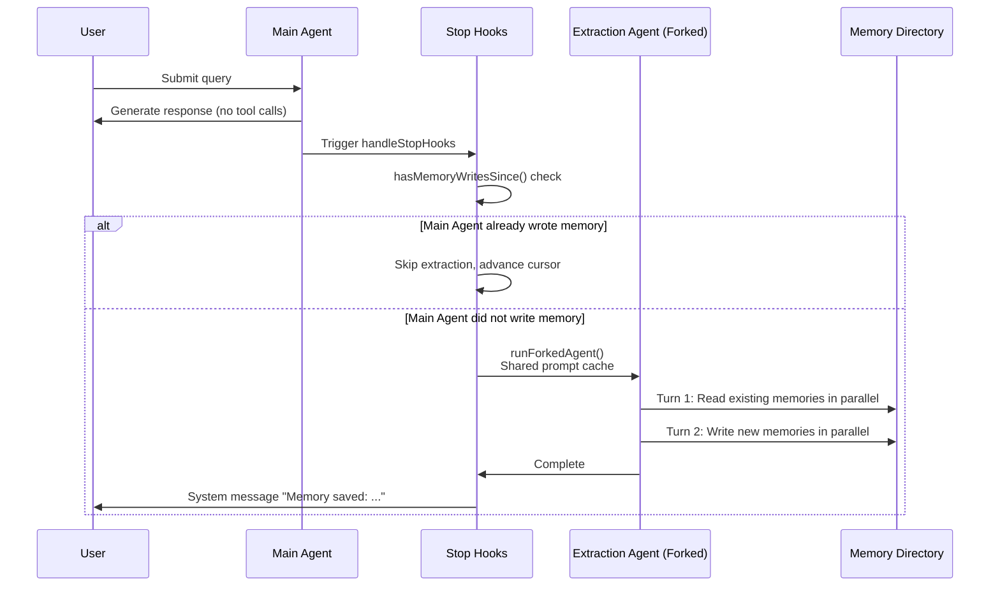
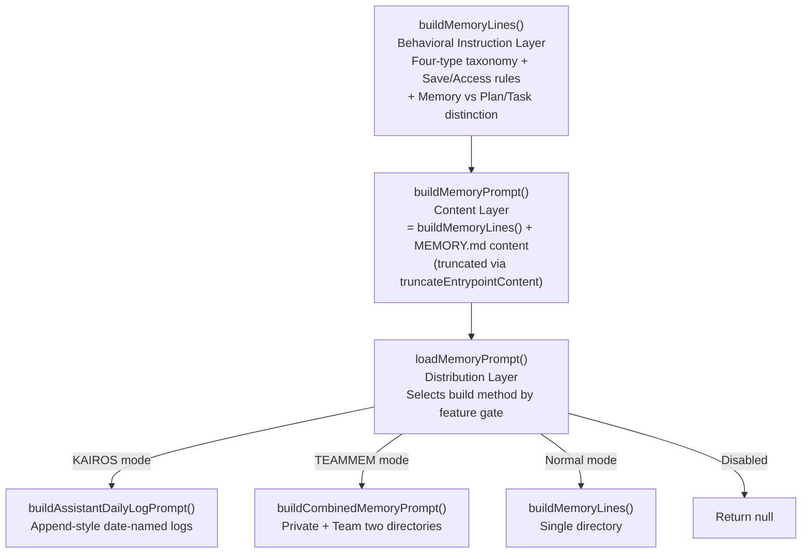

# Chapter 8: Memory System

> An Agent without memory treats every conversation as a first meeting — memory is what evolves Claude Code from a "stateless tool" into a "cross-session learning programming partner."

## 8.1 Why Does an Agent Need Memory?

Imagine this scenario: you collaborate with Claude Code on the same project for three consecutive days. On day one you tell it "don't summarize at the end of responses," on day two you say it again, and by day three you're getting frustrated — why can't it remember?

This is the fundamental problem of an Agent without memory: **every session starts from scratch**. User preferences are lost, project context is reset, and previous corrections are forgotten.

Claude Code's memory system solves this problem, but it's not a simple "store everything" system. It has a core constraint:

> **Only memorize information that cannot be derived from the current project state.**

This constraint isn't about saving storage space — it's about **preventing memory from drifting away from reality**. If memory records "the auth module is in `src/auth/`," a single code refactor turns that memory into misinformation. Code patterns, architecture, git history, and similar information are **self-describing** — reading from the code itself is always more accurate than recalling from memory.

### Memory vs CLAUDE.md: Complementary, Not Competing

| Dimension | CLAUDE.md | Memory System |
|-----------|-----------|---------------|
| Nature | Static configuration file | Dynamic knowledge base |
| Maintenance | Manually edited by users, checked into Git | Automatically written by Agent or via `/remember` |
| Scope | Team-shared (project-level) or user-global | Personally private (optionally team-shared) |
| Content Type | Project specs, coding conventions, CI config | User preferences, behavior corrections, project dynamics |
| Loading Method | Fully loaded each session | Index pre-loaded + semantic recall loaded on demand |

The two are complementary: CLAUDE.md stores "what the project is," memory stores "what to pay attention to when collaborating with this person."

Key files: `src/memdir/`

## 8.2 Four Memory Types: Closed Taxonomy

The memory system uses a **closed four-type taxonomy**, where each type has clear responsibility boundaries and structural requirements:



| Type | What to Remember | Example | Trigger Timing |
|------|-----------------|---------|----------------|
| **user** | User identity, preferences, knowledge background | "User is a data scientist focused on observability" | When learning about user role/preferences |
| **feedback** | Corrections to Agent behavior | "Don't summarize at the end of responses, user can read the diff themselves" | When user corrects behavior ("don't...", "stop...") |
| **project** | Project progress, decisions, deadlines | "2026-03-05 merge freeze, mobile release" | When learning who is doing what, why, and deadlines |
| **reference** | Location information for external systems | "Pipeline bug tracking is in Linear INGEST project" | When learning about information locations in external systems |

**Why four types instead of free-form tags?** A closed taxonomy forces the Agent to make explicit semantic classifications, avoiding tag proliferation that leads to fuzzy matching during recall. Each type has different storage structures and usage patterns — this gives the model clear behavioral guidance during both writing and reading.

### Deep Dive into the feedback Type: Not Just Recording Failures

The definition of the feedback type in the source code `memoryTypes.ts` reveals a subtle design decision — feedback records not only user corrections but also user affirmations:

```
Guidance or correction the user has given you. These are a very important
type of memory to read and write as they allow you to remain coherent and
responsive to the way you should approach work in the project.
```

Why record both successes and failures? There's a key explanation in the source code comments (paraphrased):

> If you only save corrections, you'll avoid past mistakes but drift away from good approaches the user has already validated, and may become overly cautious.

This is a profound observation. Suppose the user says "this code style is great, write like this from now on" — if this positive feedback isn't recorded, the Agent might "improve" the code style in the next session, actually drifting away from the direction the user was satisfied with.

### Structural Requirements for feedback and project

These two types require specific body structures:

```markdown
The rule or fact itself.

**Why:** The reason the user gave this feedback — usually a past incident or strong preference.
**How to apply:** When/where to apply this guidance.
```

**Why is "Why" needed?** The source code prompt explicitly states: "Knowing *why* lets you judge edge cases instead of blindly following the rule."

For example: if memory only records "don't mock the database," the Agent will avoid mocking in all tests. But if memory also includes "Why: last quarter mock tests passed but production migration failed," the Agent can judge — this rule applies to integration tests, and lightweight mocks in unit tests might be fine.

### project Type: Relative Dates → Absolute Dates

The project type has a special requirement: **relative dates must be converted to absolute dates**.

When the user says "merge freeze after Thursday," the memory must be stored as "merge freeze after 2026-03-05." The reason is simple: the memory might be read by another session weeks later, at which point "Thursday" is meaningless.

### What Should Not Be Saved

The memory system has an explicit exclusion list, from `WHAT_NOT_TO_SAVE_SECTION` in the source code:

```
- Code patterns, conventions, architecture, file paths, project structure — can be obtained by reading current code
- Git history, recent changes, who changed what — git log / git blame is the authoritative source
- Debugging solutions or fix steps — fixes are in the code, context is in commit messages
- Content already recorded in CLAUDE.md
- Temporary task details: work in progress, temporary state, current conversation context
```

Key design point: these exclusion rules **apply even when the user explicitly asks to save**. If the user says "remember this PR list," the Agent should guide the user to think: "what in this list is non-derivable? Is it a decision about it, an unexpected finding, or a deadline?"

### Memory Decision Flow



## 8.3 Storage Architecture

### Storage Format

Each memory is an independent Markdown file with YAML frontmatter:

```markdown
---
name: Terse reply preference
description: User doesn't want to see summaries at the end of responses
type: feedback
---

Don't summarize completed operations at the end of every response.

**Why:** User explicitly stated they can read diffs themselves.
**How to apply:** Keep all responses concise, omit trailing summaries.
```

Key design: the `description` field is not just metadata — it is the **core basis for the recall system**. When the Sonnet model selects relevant memories, it primarily relies on description to judge relevance, so the description must be specific enough — "user preference" is too vague, "user doesn't want to see summaries at the end of responses" is precise enough.

### Directory Structure

Memory files are stored in project-specific directories:

```
~/.claude/projects/{project-hash}/memory/
├── MEMORY.md              ← Index file (automatically loaded each session)
├── user_role.md            ← User memory
├── feedback_terse.md       ← Feedback memory
├── project_freeze.md       ← Project memory
└── reference_linear.md     ← Reference memory
```

### Path Resolution: Three-Level Priority

The memory directory location is determined through a three-level priority chain (`src/memdir/paths.ts`):

| Priority | Source | Purpose |
|----------|--------|---------|
| 1 | `CLAUDE_COWORK_MEMORY_PATH_OVERRIDE` environment variable | Cowork/SDK integration, completely bypasses standard paths |
| 2 | `autoMemoryDirectory` in settings.json | User-customized memory storage location (supports `~/` expansion) |
| 3 | `~/.claude/projects/{sanitized-git-root}/memory/` | Default path |

**Security Decision: Why is projectSettings Excluded?**

`getAutoMemPathSetting()` only reads from user/managed settings, **not** from projectSettings. The reason is security: projectSettings comes from the project's `.claude/settings.json` file, which is checked into the code repository. A malicious repository could set `autoMemoryDirectory: "~/.ssh"`, allowing Claude Code's memory write operations (Edit/Write tools) to gain write access to the user's SSH key directory. This is consistent with the principle in the permission system of "not trusting project-level settings for security-sensitive paths."

### Git Worktree Sharing

`findCanonicalGitRoot()` ensures all Git worktrees of the same repository share the same memory directory. Without this, a new working directory created by `git worktree add` would generate an independent memory space, causing memory "islanding" — preferences saved in the main working directory would disappear in the worktree.

### Directory Pre-creation: Avoiding Wasted Model Turns

The system ensures the directory exists at session start through `ensureMemoryDirExists()`. This step is idempotent — the underlying `fs.mkdir` automatically handles `EEXIST`, and the entire path chain is created in a single call.

**Why guarantee directory pre-creation?** In practice, it was found that Claude would waste turns executing `ls` / `mkdir -p` to check whether the directory exists. The system prompt injects `DIR_EXISTS_GUIDANCE`, explicitly telling the model:

> "This directory already exists — write to it directly with the Write tool (do not run mkdir or check for its existence)."

This is a typical example of "using system design to eliminate model inefficient behavior" — rather than expecting the model to learn not to check the directory, just pre-create it and explicitly inform the model.

### Whether Memory Is Enabled: Five-Level Priority

The judgment chain of `isAutoMemoryEnabled()`:

```
CLAUDE_CODE_DISABLE_AUTO_MEMORY env variable  →  Disabled
--bare startup flag                           →  Disabled
Remote mode (no persistent storage)           →  Disabled
autoMemoryEnabled in settings.json            →  Per configuration
None of the above satisfied                   →  Enabled by default
```

## 8.4 MEMORY.md: Index, Not Container

`MEMORY.md` is the **index file** of the memory system, not a memory container. Each entry should be a single-line link:

```markdown
- [User role](user_role.md) — Data scientist focused on observability
- [Terse reply preference](feedback_terse.md) — No trailing summaries
- [Merge freeze](project_freeze.md) — 2026-03-05 mobile release freeze
- [Bug tracking](reference_linear.md) — Pipeline bugs in Linear INGEST project
```

**Why an index rather than a container?** By analogy with databases: MEMORY.md is the index, memory files are data rows. The index must be compact — because MEMORY.md is **fully loaded into the system prompt every session**, its size directly competes with effective context space. Actual memory content is only read on demand when selected by Sonnet.

### Dual-Layer Truncation Mechanism

MEMORY.md has strict size limits, implemented by `truncateEntrypointContent()`:

```typescript
// src/memdir/memdir.ts
export const MAX_ENTRYPOINT_LINES = 200
export const MAX_ENTRYPOINT_BYTES = 25_000  // ~125 chars/line at 200 lines

export function truncateEntrypointContent(raw: string): EntrypointTruncation {
  const contentLines = trimmed.split('\n')
  const wasLineTruncated = lineCount > MAX_ENTRYPOINT_LINES
  const wasByteTruncated = byteCount > MAX_ENTRYPOINT_BYTES

  // Step 1: Truncate by lines (natural boundary)
  let truncated = wasLineTruncated
    ? contentLines.slice(0, MAX_ENTRYPOINT_LINES).join('\n')
    : trimmed

  // Step 2: If still over byte limit, truncate at last newline (don't cut mid-line)
  if (truncated.length > MAX_ENTRYPOINT_BYTES) {
    const cutAt = truncated.lastIndexOf('\n', MAX_ENTRYPOINT_BYTES)
    truncated = truncated.slice(0, cutAt > 0 ? cutAt : MAX_ENTRYPOINT_BYTES)
  }

  // Append warning message
  return {
    content: truncated + `\n\n> WARNING: MEMORY.md is ${reason}. Only part of it was loaded.`,
    lineCount, byteCount, wasLineTruncated, wasByteTruncated,
  }
}
```

**Why two layers of truncation?**

- **Line truncation** (200 lines): Normal case — too many index entries, truncate by line to keep entries intact.
- **Byte truncation** (25KB): Defensive measure — catches anomalous indexes where line count is within 200 but individual lines are extremely long. Actually observed p100 scenario: 197KB within 200 lines (someone put an entire document as a single-line entry).

The returned metadata (`wasLineTruncated` / `wasByteTruncated`) is used for telemetry tracking, helping the team understand users' index growth patterns.

**Warning message design**: The warning appended during truncation doesn't just report the problem — it also **teaches the model how to fix it** — prompting the model to "keep index entries to one line under ~200 chars; move detail into topic files." This embodies a design principle: error messages should include remediation guidance.

### skipIndex Mode

An experimental feature gate (`tengu_moth_copse`) is testing the removal of the MEMORY.md index requirement. When enabled, the memory extraction Agent writes memory files directly without updating MEMORY.md.

Why test this? The two-step save flow (write file + update index) is **the most error-prone part** of the memory system — the model might write a file but forget to update the index, or the index format might be wrong. If skipIndex mode's recall quality doesn't degrade (because `scanMemoryFiles()` directly scans the directory rather than relying on the index), the entire save flow can be simplified.

## 8.5 Memory Recall: Semantic Retrieval

When the user submits a query, the system automatically searches for relevant memories. This process is divided into three phases: scanning, evaluation, and filtering:



### scanMemoryFiles(): Single-Pass Optimization

The scan implementation in `src/memdir/memoryScan.ts` employs a clever performance optimization — a **single pass** (read-then-sort) instead of the traditional two-step approach (stat-sort-read):

```typescript
export async function scanMemoryFiles(memoryDir: string, signal: AbortSignal) {
  const entries = await readdir(memoryDir, { recursive: true })
  const mdFiles = entries.filter(f => f.endsWith('.md') && basename(f) !== 'MEMORY.md')

  // Read all files' frontmatter in parallel (only first 30 lines)
  const headerResults = await Promise.allSettled(
    mdFiles.map(async (relativePath) => {
      const { content, mtimeMs } = await readFileInRange(filePath, 0, FRONTMATTER_MAX_LINES)
      const { frontmatter } = parseFrontmatter(content, filePath)
      return { filename: relativePath, filePath, mtimeMs, description, type }
    })
  )

  // Single pass: read then sort, instead of stat-sort-read
  return headerResults
    .filter(r => r.status === 'fulfilled')
    .map(r => r.value)
    .sort((a, b) => b.mtimeMs - a.mtimeMs)
    .slice(0, MAX_MEMORY_FILES)  // MAX_MEMORY_FILES = 200
}
```

**Why is this faster?**

The traditional approach:
1. `stat()` all files to get mtime → N syscalls
2. Sort by mtime, take top 200
3. `read()` frontmatter of top 200 files → 200 syscalls
4. Total: N + 200 syscalls

The single-pass approach:
1. `read()` the first 30 lines of all files (`readFileInRange` also returns mtime) → N syscalls
2. Sort and take top 200
3. Total: N syscalls

For the common scenario (N <= 200), the number of syscalls is halved. The trade-off is reading frontmatter from some files that are ultimately discarded, but each file only reads 30 lines, so the overhead is minimal.

**FRONTMATTER_MAX_LINES = 30**: Only reading the first 30 lines is because frontmatter is always at the top of the file. Reading the full file is wasteful for recall — the selection phase only needs the description field.

### formatMemoryManifest(): Manifest Format

Scan results are formatted as a manifest for Sonnet to evaluate:

```
- [feedback] feedback_terse.md (2026-03-28T10:30:00Z): User doesn't want to see summaries at the end of responses
- [project] project_freeze.md (2026-03-01T09:00:00Z): 2026-03-05 merge freeze, mobile release
```

The **ISO timestamp** in the format is crucial — it allows Sonnet to judge memory freshness. A "merge freeze" memory from a month ago is likely outdated, and Sonnet can lower its priority accordingly.

### selectRelevantMemories(): Sonnet Semantic Evaluation

```typescript
const SELECT_MEMORIES_SYSTEM_PROMPT = `You are selecting memories that will be useful
to Claude Code as it processes a user's query. Return a list of filenames for the
memories that will clearly be useful (up to 5).
- Be selective and discerning.
- If recently-used tools are provided, do not select usage reference docs for those
  tools. DO still select warnings, gotchas, or known issues about those tools.`

const result = await sideQuery({
  model: getDefaultSonnetModel(),
  system: SELECT_MEMORIES_SYSTEM_PROMPT,
  messages: [{ role: 'user', content: `Query: ${query}\n\nAvailable memories:\n${manifest}${toolsSection}` }],
  max_tokens: 256,
  output_format: { type: 'json_schema', schema: { /* selected_memories: string[] */ } },
})
```

**Why use Sonnet instead of keyword matching?** Semantic relevance evaluation is more accurate than keyword matching. For example, when the user asks about "deployment process," keyword matching might miss a memory titled "CI/CD considerations," but Sonnet can understand the semantic association.

**Why limit to 5?** Context space is limited. Memory content is injected into the conversation as user messages — too many memories would crowd out the working space. 5 is the balance point between recall value and context cost.

### recentTools Parameter: Precise Noise Filtering

The `recentTools` parameter is a clever design. When Claude Code is using a particular tool (e.g., `mcp__X__spawn`):

- **Reference documentation memories** for that tool are noise — the conversation already contains usage instructions
- But **warnings and known issues** about that tool are still valuable

The prompt explicitly distinguishes these two cases: "do not select usage reference docs for those tools. DO still select warnings, gotchas, or known issues about those tools." This allows the selector to make more precise judgments in the context of tool usage.

### alreadySurfaced Pre-filtering

`findRelevantMemories()` filters out already-surfaced memory paths **before** calling Sonnet. This isn't just to avoid duplicate display (though it has that effect too) — it's to **not waste the 5 recall slots** — if not pre-filtered, Sonnet might select 3 already-surfaced memories, leaving only 2 slots for new memories.

### Asynchronous Prefetch: Non-blocking Main Loop

Memory recall is implemented through `pendingMemoryPrefetch` as **asynchronous prefetch** — while the model starts generating a response, Sonnet is queried in the background via `sideQuery()`. When the model actually needs the memories, the results are usually ready.

This design ensures the ~250ms latency of memory recall doesn't add to the user-perceived response time. For the user, memory recall is "free."

## 8.6 Memory Freshness and Drift Defense

Memories record **facts at the time of writing**, but time makes memories stale. The memory system handles this through multiple layers of defense mechanisms.

### Human-Readable Time Distance

`memoryAge.ts` converts mtime to human-readable strings:

```
0 days → "today"
1 day  → "yesterday"
47 days → "47 days ago"
```

**Why not use ISO timestamps?** Models aren't good at date arithmetic. Give the model `2026-02-12T10:30:00Z` and tell it today is `2026-04-01`, and it might not calculate how many days have passed. But "47 days ago" directly triggers the model's "this might be outdated" reasoning.

### Freshness Warning

For memories older than 1 day, the system injects a freshness warning text (`memoryFreshnessText`):

> "Memories are point-in-time observations, not live state — claims about code behavior or file:line citations may be outdated."

The motivation for this warning: users reported that the Agent treated stale memories (like "function X is at line 42") as factual assertions, leading to incorrect code modifications.

### Three Rules for Memory Access

`WHEN_TO_ACCESS_SECTION` in the source code defines three access rules:

1. **When known memories are relevant to the task**: Proactively consult them
2. **When the user explicitly requests**: **Must** access memories (emphasized with MUST)
3. **When the user says "ignore memories"**: Treat them as non-existent

Behind the third rule is an eval failure case: the user said "ignore memories about X," but Claude replied "it's not Y (as stated in memory), but rather..." — it acknowledged the memory's existence and tried to "correct" it, violating the user's intent.

### Trusting Recall: Verify, Don't Blindly Trust

`TRUSTING_RECALL_SECTION` is one of the most critical safety nets in the memory system:

> "Memory says X exists" != "X currently exists"

The rule requires: if memory mentions a file path, verify it exists with Glob/Read. If memory mentions a function, confirm it's still there with Grep.

The effect of this section was validated in evals: **without this section, pass rate 0/2; with it added, pass rate 3/3.** This shows that the model defaults to trusting specific references in memory, but code location information in memory decays quickly — a single refactor can invalidate everything.

## 8.7 Background Memory Extraction

Beyond the model's active writing and user saving via `/remember`, Claude Code also has a **background memory extraction Agent** (`src/services/extractMemories/extractMemories.ts`) that runs automatically after each conversation turn.

### Overall Architecture



### Triggering and Mutual Exclusion

The extraction Agent is triggered in `handleStopHooks` — when the main Agent completes its response (no more tool calls). But it doesn't run every time:

**Mutual exclusion mechanism**: `hasMemoryWritesSince()` checks whether the main Agent has already written to memory files within the recent message range. If the main Agent has already proactively saved memory (e.g., the user said "remember this" and the main Agent directly called Write), the extraction Agent **skips** — avoiding duplicate memories for the same conversation segment.

**Turn throttling**: The `turnsSinceLastExtraction` counter controls extraction frequency. Not every turn needs extraction — many turns (like simple Q&A) don't have information worth memorizing.

### Overlap Protection

If the previous extraction is still running when a new turn ends, the system doesn't start concurrent extractions:

```
inProgress = true → Queue new request as pendingContext
Current extraction completes → Check pendingContext, if present start trailing run
trailing run → Only process new messages since cursor advancement
```

This design ensures: (1) no two extraction Agents write to the memory directory simultaneously (avoiding conflicts); (2) no conversation content is missed.

### Tool Permissions: Strict Write Whitelist

The extraction Agent's tool permissions are defined by `createAutoMemCanUseTool()`:

| Tool | Permission |
|------|-----------|
| Read / Grep / Glob | Unrestricted — needs to read existing memories and code |
| Bash | Read-only commands (ls, find, grep, cat, stat, wc, head, tail) |
| Edit / Write | **Only within the memory directory** (verified via `isAutoMemPath()`) |
| All other tools | Denied |

This is an embodiment of the **principle of least privilege** — the extraction Agent only needs to read the conversation context and existing memories, then write new memories. It doesn't need to execute code, modify project files, or call external services.

### Extraction Prompt Design

The extraction Agent's prompts (`src/services/extractMemories/prompts.ts`) have several key designs:

**Efficient turn budget**: The prompt explicitly guides the Agent's execution strategy — "Turn 1: issue all reads in parallel; Turn 2: issue all writes in parallel." This maximizes tool call parallelism, typically completing in 2 turns (hard limit is 5 turns).

**Preventing duplicates**: The prompt injects a manifest of existing memories and instructs the Agent to "check whether a similar memory already exists before deciding to create a new one."

**Scope limitation**: `MUST only use content from last ~${newMessageCount} messages` — only extract from the latest messages, don't reprocess already-processed history.

### Shared Prompt Cache

The extraction Agent is created via `runForkedAgent()`, which uses the same underlying mechanism as the skill system's fork mode. The key advantage is **sharing the parent's prompt cache** — the system prompt doesn't need to be recalculated and transmitted, significantly reducing the token consumption of extraction.

## 8.8 Memory Prompt Construction Hierarchy

The memory system's prompt construction is divided into three levels, each layer adding different content:



### buildMemoryLines(): Eight Sub-sections of Behavioral Instructions

`buildMemoryLines()` constructs instructions containing eight sub-sections:

1. **Persistent memory introduction**: Informs the model of the memory directory path, `DIR_EXISTS_GUIDANCE` states the directory already exists
2. **Explicit save/forget**: User says "remember" → save immediately, says "forget" → find and delete
3. **Four-type taxonomy**: Complete definitions, examples, and save timing for user / feedback / project / reference
4. **What not to save**: Exclusion list including code patterns, git history, content already in CLAUDE.md, etc.
5. **How to save**: Two-step flow (write file + update MEMORY.md) or single-step (skipIndex mode)
6. **When to access**: Three rules + "if user says ignore, then ignore"
7. **Trusting recall**: Verify references in memory, don't blindly trust
8. **Memory vs other persistence**: Plan is for aligning implementation approaches, Task is for tracking current session progress, Memory is for cross-session information

The distinction in point 8 is particularly important — the model easily confuses when to use memory, when to use Plan, and when to use Task. The memory system's prompt clearly delineates the boundaries:

> - Plan: Approach alignment for non-trivial implementation tasks; changes should update the Plan rather than save to memory
> - Task: Step decomposition and progress tracking within the current session
> - Memory: Information valuable across sessions

### KAIROS Mode

KAIROS is an experimental "assistant mode" designed for long-running sessions. Unlike the normal mode that maintains a real-time MEMORY.md index, KAIROS mode appends information to **date-named log files**:

```
~/.claude/projects/{hash}/logs/
└── 2026/
    └── 04/
        └── 2026-04-01.md    ← Today's log
```

Each day's log is append-only, avoiding the overhead of frequently updating the MEMORY.md index. Periodically, the `/dream` skill **distills** logs into structured topic memory files. This "append first, organize later" pattern is suitable for high-frequency interaction scenarios.

## 8.9 Team Memory

When team memory is enabled (`TEAMMEM` feature gate), the system manages two memory directories:

```
~/.claude/projects/{hash}/memory/          ← Private memory (visible only to yourself)
~/.claude/projects/{hash}/memory/team/     ← Team memory (shared among project members)
```

### Scope Guidance

In team mode, the type taxonomy adds `<scope>` tags to guide memory storage location:

| Type | Default Scope | Reason |
|------|--------------|--------|
| **user** | Always private | Personal preferences should not be imposed on the team |
| **feedback** | Leans private, project conventions can be team-shared | "Don't summarize" is a personal preference; "tests must use real database" is a team convention |
| **project** | Leans team | Milestones and decisions are valuable to all members |
| **reference** | Leans team | External system locations are shared knowledge |

**Sensitive data protection**: The team memory prompt explicitly requires "MUST NOT save sensitive data (API keys, credentials) in team memories." Private memory also discourages storing sensitive information, but for team memory this is a mandatory requirement — because team memories are read by other members' Agents.

**Architecture details**: `isTeamMemoryEnabled()` requires auto memory to be enabled first. The team directory is a subdirectory of the auto memory directory — `mkdir(teamDir)` automatically creates the parent directory through recursive creation. Both directories have independent MEMORY.md indexes, both loaded into the system prompt.

## 8.10 Agent Memory

Beyond the main Agent's memory system, Claude Code also provides an independent memory system for **sub-Agents** (created via the Agent tool) (`src/tools/AgentTool/agentMemory.ts`).

### Three Scopes

```
user scope:    ~/.claude/agent-memory/{agentType}/
project scope: .claude/agent-memory/{agentType}/
local scope:   .claude/agent-memory-local/{agentType}/
```

- **user**: Agent-level knowledge across all projects (e.g., "how this type of exploration Agent should work")
- **project**: Project-specific Agent knowledge (e.g., "which test framework this project's test Agent should use")
- **local**: Local machine-specific, not checked into version control

### Why Separate from Main Memory?

Sub-Agent knowledge types differ from the main Agent's. Code navigation tricks learned by an "explorer" Agent, testing patterns learned by a "test-runner" Agent — these are operational knowledge specific to the Agent type, unrelated to user preferences and project decisions. Separate storage prevents main memory from being polluted by Agent operational details.

The role of `agentType` in the path is to isolate the knowledge space of different Agent types. Colons in the path are replaced with dashes (`sanitizeAgentTypeForPath()`) for file system compatibility.

### Memory Injection Method

Agent memory is built through the same `buildMemoryPrompt()` function as main memory, but with Agent-specific behavioral guidance. The injection method is also the same — MEMORY.md indexes go into the system prompt, and specific memories are loaded on demand through semantic recall.

## 8.11 How Memory Is Injected into Conversations

Understanding how memory reaches the model's context window:

### MEMORY.md: System Prompt Injection

MEMORY.md content is injected into the system prompt via `systemPromptSection('memory', () => loadMemoryPrompt())`. This means:

- Automatically loaded every session
- Truncated via `truncateEntrypointContent()`
- Located in the dynamic section of the system prompt

### Recalled Memories: User Message Injection

Memories selected by Sonnet are injected as **user messages** (with `isMeta: true`) into the conversation:

```typescript
case 'relevant_memories': {
  return wrapMessagesInSystemReminder(
    attachment.memories.map(m => createUserMessage({
      content: `${memoryHeader(m.path, m.mtimeMs)}\n\n${m.content}`,
      isMeta: true
    }))
  )
}
```

`memoryHeader()` includes the file path, human-readable distance of modification time (e.g., "3 days ago"), and a freshness warning. Memories are wrapped in `<system-reminder>` tags, grouped with other contextual information (like Read/Grep results).

The `isMeta: true` flag ensures these messages are not displayed as user messages in the UI, but the model can see them.

## 8.12 Design Insights

1. **Only memorize non-derivable information**: Code patterns are read from code, git history is queried from git, memory only stores "meta-information" — this constraint is the foundation of the entire system, preventing memory from becoming an outdated code map

2. **Semantic recall outperforms keyword matching**: Using Sonnet to evaluate relevance can understand the semantic association between "deployment" and "CI/CD." The cost is ~250ms additional latency, but it's completely hidden through asynchronous prefetch

3. **Dual-layer truncation defends against long indexes**: Line truncation catches normal growth, byte truncation catches anomalously long lines (actually observed 197KB within 200 lines) — designed for real-world data, not theoretical scenarios

4. **Background extraction Agent pattern**: Encapsulating "extract memories from conversation" as an independent forked agent, sharing prompt cache to reduce costs, mutual exclusion to avoid duplication, minimum privilege to limit write scope. This pattern is generalizable to any "background intelligence" scenario

5. **Eval-driven prompt engineering**: The addition of TRUSTING_RECALL_SECTION was directly driven by eval data (0/2 → 3/3). Every prompt section in the memory system has been validated through evaluation, not added by intuition

6. **Using system design to eliminate model inefficient behavior**: Pre-creating directories + `DIR_EXISTS_GUIDANCE` is more reliable than "teaching the model not to check directories." This is a general principle: if the model repeatedly makes a certain mistake, prioritize changing the environment over changing the prompt

7. **Frontmatter as a unified interface**: Memory and skills use the same Markdown + YAML frontmatter format, reducing the model's cognitive burden — only one file format needs to be learned to operate both systems

---

> **Hands-on Practice**: In [claude-code-from-scratch](https://github.com/Windy3f3f3f3f/claude-code-from-scratch)'s `src/session.ts`, you can see a minimal session persistence implementation. Try adding a memory system on top of it — write user preferences to the `~/.mini-claude/memory/` directory and inject them into the system prompt.

Previous chapter: [Multi-Agent Architecture](/en/docs/07-multi-agent.md) | Next chapter: [Skills System](/en/docs/09-skills-system.md)
