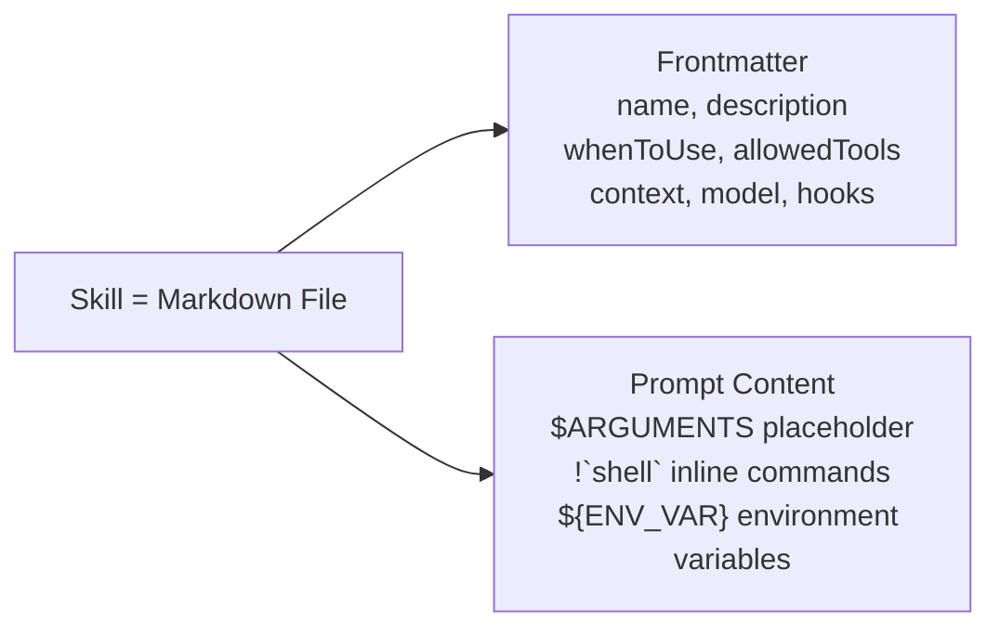
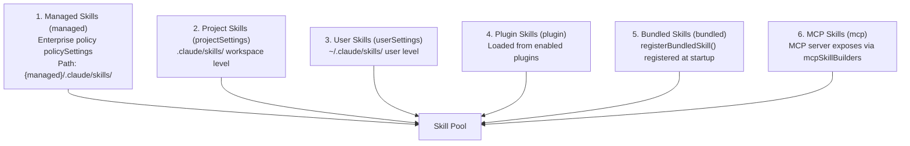
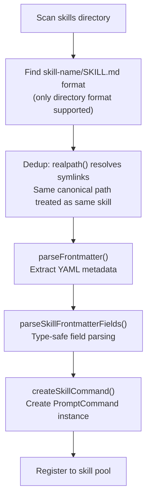
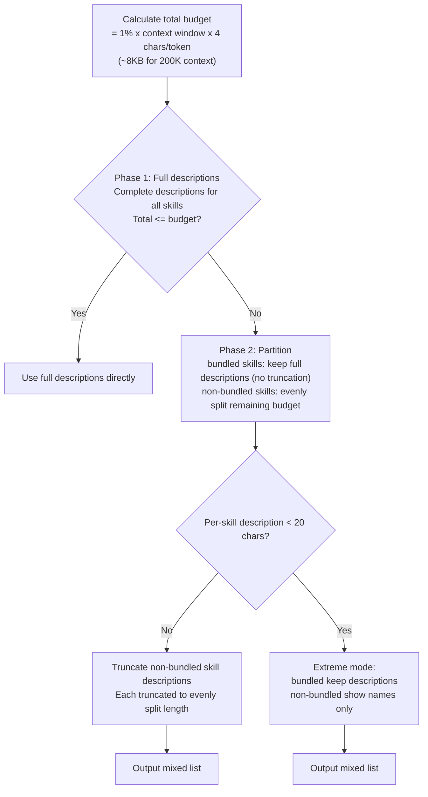
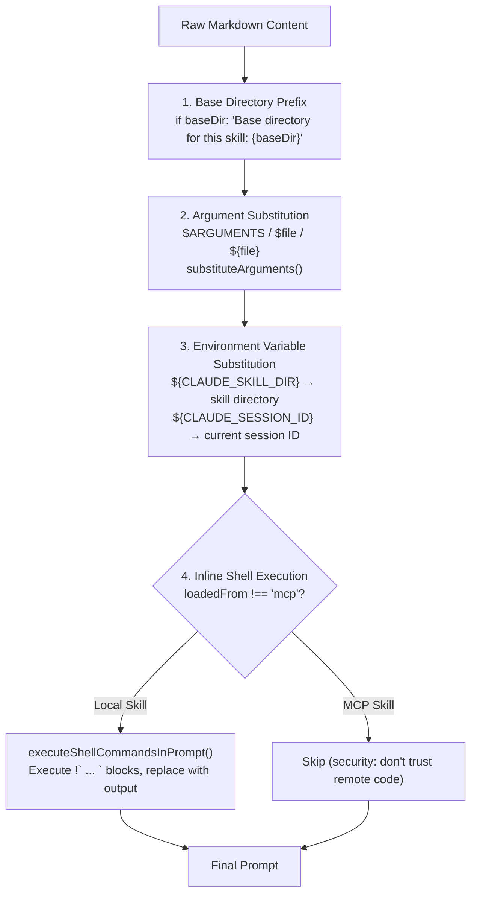
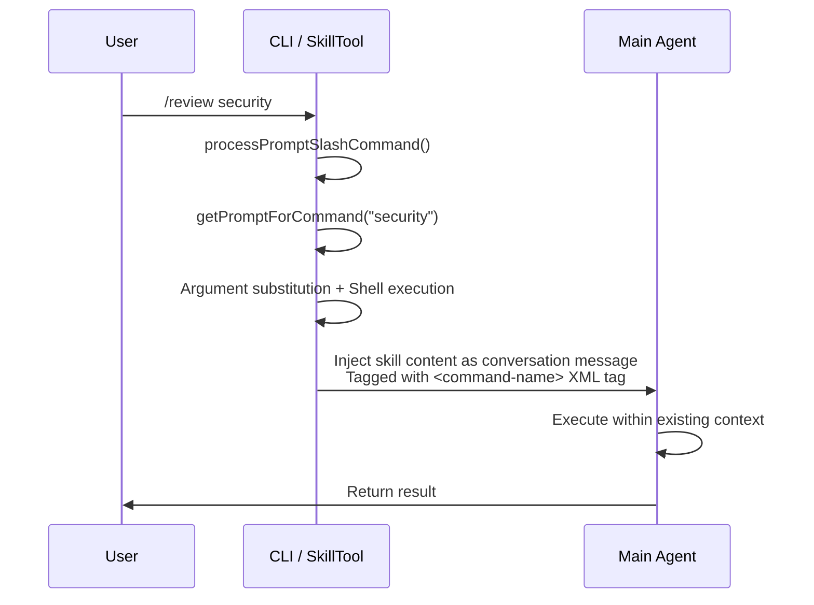
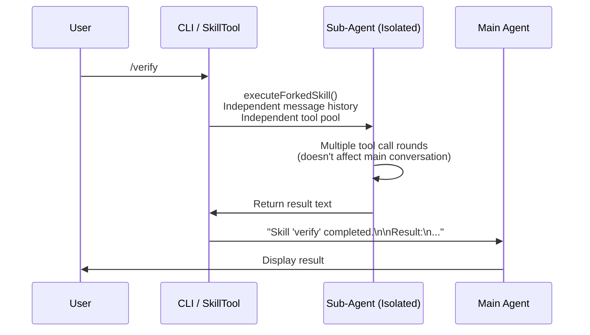
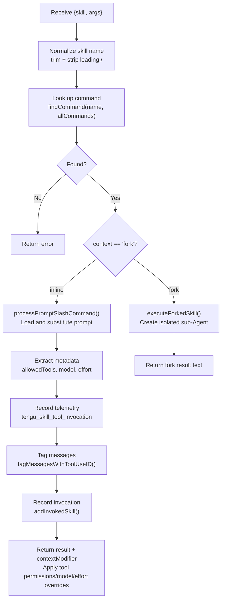

# Chapter 9: Skills System

> Skills are Claude Code's "AI Shell Scripts" — they templatize proven effective prompts so the Agent doesn't have to write the same workflow from scratch every time.

## 9.1 What Are Skills?

Shell scripts automate terminal tasks; skills automate AI tasks. A skill is essentially: **prompt template + metadata + execution context**.



Unlike traditional chatbot "commands," Claude Code's skills have a key characteristic — the **dual invocation model**:

| Invocation Method | Triggered By | Example |
|---------|--------|------|
| Manual by user | User types `/commit` | User explicitly needs a certain workflow |
| Automatic by model | Model decides based on `whenToUse` | User says "help me commit the code," model recognizes intent and calls SkillTool |

When the user invokes manually, the CLI directly parses the `/command args` syntax. When the model invokes automatically, it executes through the SkillTool (a dedicated tool definition). Both paths ultimately converge on the same prompt loading and execution logic.

### PromptCommand Core Type

Skills are represented in code as the `PromptCommand` type (`src/types/command.ts`):

```typescript
type PromptCommand = {
  type: 'prompt'
  name: string                    // Skill name
  description: string             // Display description
  whenToUse?: string              // Model uses this to determine when to auto-trigger
  allowedTools?: string[]         // Allowed tools whitelist
  model?: string                  // Model override
  effort?: EffortValue            // Effort level
  context?: 'inline' | 'fork'    // Execution mode
  agent?: string                  // Agent type when forking
  source: 'bundled' | 'plugin' | 'skills' | 'mcp'  // Source
  hooks?: HooksSettings           // Skill-level hooks
  skillRoot?: string              // Skill resource base directory
  paths?: string[]                // Visibility path patterns
  getPromptForCommand(args, context): Promise<ContentBlockParam[]>  // Content loader
}
```

Key files: `src/skills/loadSkillsDir.ts`, `src/tools/SkillTool/SkillTool.ts`

## 9.2 Skill Sources and Priority

Skills are loaded from 6 sources, in priority from highest to lowest:



Higher-priority sources override lower-priority skills in case of naming conflicts.

### Loading Flow

File system skills are loaded via `loadSkillsFromSkillsDir()`:



**Skill file format requirement**: Only the `skill-name/SKILL.md` directory format is supported — each skill is a directory containing a `SKILL.md` file. This is not an arbitrary restriction: the directory format allows skills to include resource files (such as templates, configurations) and reference them via `${CLAUDE_SKILL_DIR}`.

### Deduplication: Why realpath Instead of inode

Deduplication is implemented via `realpath()` to resolve symlinks — files with the same canonical path are treated as the same skill. The source code comments explain why inode numbers are not used:

> Virtual file systems, container file systems, and NFS may report unreliable inode values (e.g., inode 0), and ExFAT may lose precision. `realpath()` behaves consistently across all platforms.

This is a decision driven by real-world environments — Claude Code runs in various environments, including containers and remote file systems.

### MCP Skill Builders: Breaking Dependency Cycles

Skills provided by MCP servers are loaded through a write-once registry pattern in `mcpSkillBuilders.ts`. This indirection layer exists to **break circular dependencies**:

```
client.ts → mcpSkills.ts → loadSkillsDir.ts → ... → client.ts  ← Circular!
```

The registry pattern registers MCP skill build functions as callbacks, decoupling direct dependencies between modules.

## 9.3 Skill Structure and Frontmatter

Skill files are Markdown + YAML frontmatter. Here are all supported frontmatter fields with detailed descriptions:

```markdown
---
name: my-skill                    # Display name (optional, defaults to directory name)
description: Description           # Skill description (Sonnet uses this to determine auto-triggering)
aliases: [ms]                     # Command alias list
when_to_use: Auto-trigger condition description  # Model uses this to determine when to proactively invoke (affects SkillTool triggering)
argument-hint: "file path"        # Argument hint (displayed in help and Tab completion)
arguments: [file, mode]           # Named argument list (mapped to $file, $mode)
allowed-tools: [Bash, Edit, Read] # Allowed tools whitelist (restricts which tools the skill can use)
model: claude-sonnet              # Model override ("inherit" = inherit from parent, no override)
effort: quick                     # Effort: quick / standard / integer minutes
context: fork                     # Execution context: inline (default) or fork
agent: explorer                   # Agent type used when forking
version: "1.0"                    # Semantic version number
shell: bash                       # Shell type used for inline shell blocks
user-invocable: true              # false hides it, user cannot invoke directly via /name
disable-model-invocation: false   # true allows only manual /skill invocation by user, model cannot auto-trigger
paths:                            # Visibility path patterns (gitignore style)
  - "src/components/**"           # Only show this skill when working under matching paths
hooks:                            # Skill-level hook definitions
  PreToolUse:
    - matcher: "Bash(*)"
      hooks:
        - type: command
          command: "echo checking"
---

Skill prompt content...
Can reference $ARGUMENTS placeholder
```

### Field Parsing Details

`parseSkillFrontmatterFields()` handles all field parsing uniformly (`src/skills/loadSkillsDir.ts`):

**model field**: `"inherit"` is parsed as undefined, meaning use the current session's model. Other values (such as `"claude-sonnet"`) serve as model overrides.

**effort field**: Accepts three formats — `"quick"` (quick tasks), `"standard"` (standard tasks), integer (custom minutes). This affects the model's thinking depth.

**paths field**: Gitignore-style path patterns. `parseSkillPaths()` strips the `/**` suffix and filters out patterns that match all files (such as `*`). This allows skills to activate only in specific code regions — for example, a React component skill visible only under `src/components/`.

**hooks parsing**: Validated through Zod schema (`HooksSchema().safeParse`). Invalid hook definitions **only log warnings but are not fatal** — a malformed hook should not prevent the entire skill from loading.

**arguments field**: Named arguments are extracted via `parseArgumentNames()`. During prompt substitution, both `$file` and `${file}` map to the value of `arguments[0]`.

## 9.4 Lazy Loading and Token Budget

### Lazy Loading: Only Load What's Needed

Skill content is **not loaded at startup** — only frontmatter (name, description, whenToUse) is preloaded. The full Markdown content is read only when the user actually invokes it or the model triggers it.

```typescript
export function estimateSkillFrontmatterTokens(skill: Command): number {
  const frontmatterText = [skill.name, skill.description, skill.whenToUse]
    .filter(Boolean)
    .join(' ')
  return roughTokenCountEstimation(frontmatterText)
}
```

**Why lazy loading?** The system may register dozens of skills. If all were loaded into the system prompt:
- It would crowd out context space (a single skill can have hundreds of lines of prompt)
- Most skills won't be used in the current session
- Loading time increases, affecting first response speed

By loading only frontmatter to display the available skills list and deferring content loading until invocation, this achieves "low discovery cost, on-demand execution cost."

### Token Budget Allocation Algorithm

The skills list occupies space in the system prompt, but space is limited. `formatCommandsWithinBudget()` (`src/tools/SkillTool/prompt.ts`) implements a three-phase budget allocation algorithm:



**Phase 1**: Try using full descriptions for all skills. If the total fits within budget, done.

**Phase 2**: Split skills into two groups: bundled (built-in) and rest (non-built-in). Bundled skills always retain full descriptions — they are core functionality, and truncating would hide essential capabilities. Calculate the remaining budget after bundled skills, and evenly distribute among non-bundled skills.

**Phase 3 (extreme case)**: If the even split results in less than 20 characters per skill (`MIN_DESC_LENGTH`), non-bundled skills are degraded to showing names only. Users can still see that the skills exist, just without descriptions.

**Why protect bundled skills?** Bundled skills represent Claude Code's core capabilities (such as `/commit`, `/review`, `/debug`). Users expect to always see these skills and their functional descriptions. Even if many custom skills are installed causing budget pressure, the discoverability of core functionality should not be sacrificed.

Each skill description also has a hard cap: `MAX_LISTING_DESC_CHARS = 250` characters, preventing any single skill from taking up too much space even when budget is abundant.

## 9.5 Prompt Substitution Pipeline

Skill content undergoes multiple layers of substitution at execution time, driven by `getPromptForCommand()`:



### Step 1: Base Directory Prefix

If the skill has an associated directory (`skillRoot`), `"Base directory for this skill: {baseDir}"` is inserted at the beginning of the prompt. This allows the skill's prompt to reference relative path resources.

### Step 2: Argument Substitution

`substituteArguments()` handles two argument formats:

- `$ARGUMENTS`: Replaced with the user's entire argument string
- `$file` / `${file}`: Replaced with the corresponding named argument (mapped from the frontmatter's `arguments` field)

For example, if a skill defines `arguments: [file, format]` and the user inputs `/skill main.ts json`, then `$file` → `main.ts`, `$format` → `json`.

### Step 3: Environment Variable Substitution

- `${CLAUDE_SKILL_DIR}`: Replaced with the directory path where the skill file resides. On Windows, backslashes are automatically converted to forward slashes for path consistency.
- `${CLAUDE_SESSION_ID}`: Replaced with the current session ID, allowing skills to isolate state per session.

### Step 4: Inline Shell Execution

Skill Markdown can embed shell commands in the `` !`command` `` format. At execution time, the command is run and its output replaces the original text. This allows skills to dynamically obtain environment information:

```markdown
Current branch: !`git branch --show-current`
Recent commits: !`git log --oneline -5`
```

The shell type can be specified via the frontmatter's `shell` field (bash/zsh/fish).

### MCP Security Isolation

MCP skills come from remote untrusted servers, so two security restrictions apply:

```typescript
// Security: MCP skills are remote and untrusted — never execute inline
// shell commands (!`…` / ```! … ```) from their markdown body.
if (loadedFrom !== 'mcp') {
  finalContent = await executeShellCommandsInPrompt(finalContent, ...)
}
```

1. **Inline shell execution disabled**: `` !`rm -rf /` `` in remote prompts will not be executed
2. **`${CLAUDE_SKILL_DIR}` not substituted**: Meaningless for remote skills, and exposing local paths is information leakage

This check is explicitly implemented in the source code rather than relying on some abstraction layer — explicit checks on security-critical paths are more reliable than implicit dependencies.

## 9.6 Skill Execution: Inline vs Fork

Skills have two execution contexts, determined by the frontmatter's `context` field:

### Inline Mode (Default)



The prompt is injected as a message into the current conversation. The model continues execution in the existing context — it can see previous conversation history and use all available tools.

**Advantages**: Shares conversation context, can reference previous discussions; no extra overhead.
**Disadvantages**: Skill prompt occupies main conversation context space; tool calls pollute main conversation history.

**Use cases**: Quick behavior modifications (e.g., `simplify` — review just-written code), tasks that need to reference conversation context.

### Fork Mode



Creates an independent sub-Agent with its own message history and tool pool. Results are returned to the parent conversation upon completion.

**Advantages**: Doesn't pollute main conversation context; can restrict tool set (security isolation); can use a different model.
**Disadvantages**: Cannot reference content from main conversation history; has the overhead of creating a sub-Agent.

**Use cases**: Complex tasks requiring many tool calls (e.g., `verify` — running a complete test suite), security-sensitive tasks requiring tool restrictions.

### Comparison Summary

| Dimension | Inline | Fork |
|------|--------|------|
| Conversation History | Shared with main conversation | Independent |
| Tool Pool | All tools from main Agent | Restricted by `allowedTools` |
| Context Impact | Occupies main context space | Doesn't affect main context |
| Model | Uses current model (overridable) | Can specify a different model |
| Result Format | Outputs directly in conversation | Summarized as a text block returned |

### When to Choose Fork?

- Task requires many tool calls (would pollute main conversation context)
- Need to restrict available tools (security isolation — e.g., a review skill should not be able to write files)
- Need to use a different model (e.g., use Sonnet for quick checks, Opus for deep analysis)
- Need independent failure isolation (fork failure doesn't affect main conversation flow)

### Model Override Resolution

When a skill specifies the `model` field, `resolveSkillModelOverride()` handles the resolution:

- `"inherit"` → undefined (use parent model, no override)
- Specific model alias (e.g., `"claude-sonnet"`) → resolved to actual model ID
- If the main session has a model suffix (e.g., `[1m]`), the suffix is preserved when overriding

### AllowedTools Security Implications in Fork Mode

When a skill specifies `allowed-tools: [Bash, Read, Grep, Glob]`, the forked sub-Agent **can only use these tools**. This is key to security isolation:

- A code review skill doesn't need file writing capability — restrict to read-only tools
- A test runner skill doesn't need network access — restrict to Bash + Read

Tool restrictions are applied via `contextModifier` when returning results, modifying `alwaysAllowRules` in the context.

## 9.7 Skill Permission Model

### SAFE_SKILL_PROPERTIES Whitelist

SkillTool needs to check permissions before executing a skill. A key optimization is: **skills containing only "safe properties" are automatically allowed without user confirmation**.

"Safe properties" are defined by the `SAFE_SKILL_PROPERTIES` whitelist (`src/tools/SkillTool/SkillTool.ts`):

```typescript
const SAFE_SKILL_PROPERTIES = new Set([
  // PromptCommand properties
  'type', 'progressMessage', 'contentLength', 'argNames', 'model', 'effort',
  'source', 'pluginInfo', 'disableNonInteractive', 'skillRoot', 'context',
  'agent', 'getPromptForCommand', 'frontmatterKeys',
  // CommandBase properties
  'name', 'description', 'hasUserSpecifiedDescription', 'isEnabled',
  'isHidden', 'aliases', 'isMcp', 'argumentHint', 'whenToUse', 'paths',
  'version', 'disableModelInvocation', 'userInvocable', 'loadedFrom',
  'immediate'
])
```

`skillHasOnlySafeProperties()` iterates over all keys of the skill object, checking whether each key is in the whitelist. undefined/null/empty values are considered safe.

**Why a whitelist instead of a blacklist?** Forward-compatible security. If a new property is added to the `PromptCommand` type in the future (e.g., `networkAccess`), under the whitelist model it **requires permission approval by default** until explicitly added to the whitelist. The blacklist model is the opposite — new properties are allowed by default and must be explicitly added to the blacklist to trigger approval. In security-sensitive contexts, "deny by default" is safer than "allow by default."

### Trust Levels by Source

| Source | Trust Level | Description |
|------|---------|------|
| managed (enterprise policy) | Highest | Reviewed by enterprise administrators |
| bundled (built-in) | High | Maintained by the Claude Code team |
| project/user skills | Medium | Created by the user themselves, safe properties auto-allowed, others require confirmation |
| plugin | Medium-low | Third-party code, requires explicit consent to enable plugin |
| MCP | Lowest | Remote untrusted, shell execution disabled |

## 9.8 Skill Retention After Compaction

### The Problem

When a conversation becomes too long and triggers autocompact (context compaction), previously injected skill prompts get **overwritten by the compacted summary**. The model loses access to skill instructions, causing behavior inconsistency before and after compaction — it follows skill instructions before compaction but "forgets" the skill after compaction.

### The Solution

`addInvokedSkill()` records complete information to global state on each skill invocation:

```typescript
addInvokedSkill(name, path, content, agentId)
// Records: name, path, full content, timestamp, owning Agent ID
```

After compaction, `createSkillAttachmentIfNeeded()` reconstructs skill content from global state and re-injects it as an attachment.

### Budget Management

```
POST_COMPACT_SKILLS_TOKEN_BUDGET = 25,000  Total budget
POST_COMPACT_MAX_TOKENS_PER_SKILL = 5,000  Per-skill cap
```

- Sorted by **most recently invoked first** — the most recently used skills are most likely still relevant
- When exceeding the per-skill cap, **the head is preserved and the tail is truncated** — because a skill's setup instructions and usage guidelines are typically at the beginning
- When exceeding the total budget, the least active skills are discarded

### Agent Scope Isolation

Recorded skills are isolated by `agentId` — skills invoked by a sub-Agent do not leak into the parent Agent's compaction recovery, and vice versa. `clearInvokedSkillsForAgent(agentId)` cleans up a fork Agent's skill records when it completes.

**Why does this mechanism matter?** Without it, a long coding session (spanning multiple compactions) would gradually "forget" skill context. The behavior when using `/commit` at turn 50 should be the same as at turn 5 — the skill retention mechanism ensures this consistency.

## 9.9 Bundled Skills in Detail

### Registration Mechanism

Bundled skills are registered at startup via `registerBundledSkill()` (`src/skills/bundledSkills.ts`):

```typescript
registerBundledSkill({
  name: 'remember',
  description: 'Review auto-memory entries...',
  whenToUse: 'Use when...',
  userInvocable: true,
  isEnabled: () => isAutoMemoryEnabled(),
  async getPromptForCommand(args) {
    return [{ type: 'text', text: SKILL_PROMPT }]
  }
})
```

Unlike file system skills, bundled skill content is compiled into the binary and does not require runtime file reads.

### Always-Registered Skills

| Skill | Purpose | Execution Context |
|------|------|-----------|
| `updateConfig` | Modify settings.json configuration | inline |
| `keybindings` | Keyboard shortcut reference | inline |
| `verify` | Verification workflow | fork |
| `debug` | Debugging tools | inline |
| `simplify` | Code simplification review | inline |
| `batch` | Batch operations | fork |
| `stuck` | Help when stuck | inline |
| `remember` | Explicitly save memories | inline |
| `skillify` | Convert Markdown scripts to skills | inline |

### Feature-Gated Skills

| Skill | Feature Flag | Purpose |
|------|-------------|------|
| `dream` | KAIROS / KAIROS_DREAM | Daily log distillation |
| `hunter` | REVIEW_ARTIFACT | Artifact review |
| `/loop` | AGENT_TRIGGERS | Cron-like Agent triggers |
| `claudeApi` | BUILDING_CLAUDE_APPS | Claude API assistance |
| `claudeInChrome` | Auto-detected | Chrome integration |

### Secure File Extraction

Some bundled skills need to extract resource files (such as prompt templates) to disk at runtime. This is implemented through `safeWriteFile()`, which uses multiple security measures:

- **`O_NOFOLLOW | O_EXCL` flags**: Prevents symlink attacks. An attacker could pre-create a symlink at the target path pointing to a sensitive file
- **Per-process nonce directory**: Uses a randomly named temporary directory to prevent path prediction
- **Owner-only permissions** (0o700/0o600): Only the current user can read and write

**Lazy extraction**: `extractionPromise` is memoized, so multiple concurrent calls wait for the same extraction to complete rather than racing against each other.

## 9.10 MCP Skill Integration

MCP (Model Context Protocol) servers can expose skills to Claude Code, integrating seamlessly with local skills.

### Loading Path

MCP skills are built through the `mcpSkillBuilders` registry. When SkillTool fetches all commands, it loads both local and MCP skills simultaneously, deduplicating by name.

### Security Model

MCP skills are treated as **untrusted remote code**, with the strictest security restrictions applied:

| Restriction | Reason |
|--------|------|
| Inline shell execution disabled | Shell commands in remote prompts could be malicious |
| `${CLAUDE_SKILL_DIR}` not substituted | Exposing local paths is information leakage |
| `disableModelInvocation: true` optional | Server can require skills to be manually triggered only |
| No file system resources | MCP skills have no `skillRoot` directory |

Despite the restrictions, MCP skills can still use argument substitution (`$ARGUMENTS`) and all non-shell features, and are indistinguishable from local skills in both the UI and the model's perspective.

## 9.11 Skill-Level Hooks

Skills can define their own hooks in frontmatter, which take effect during skill execution:

```yaml
hooks:
  PreToolUse:
    - matcher: "Bash(*)"
      hooks:
        - type: command
          command: "echo '{\"hookSpecificOutput\": {\"hookEventName\": \"PreToolUse\", \"updatedInput\": {\"command\": \"$ORIGINAL_CMD --dry-run\"}}}'"
```

### Hierarchical Layering

```
Global Hooks (settings.json) — always active
  └── Skill-Level Hooks (skill frontmatter) — only active during that skill's execution
```

Skill-level hooks do not override global hooks; they are **layered on top**. Both take effect simultaneously, with global hooks executing first.

### Hook Registration Timing

Skill hooks are registered via `registerSkillHooks()` when the skill is invoked — not at startup. This is consistent with the lazy loading principle: activate only when needed.

### Validation and Fault Tolerance

Hook definitions are validated through Zod schema. If the definition is malformed:
- A warning is logged
- **It does not prevent skill loading** — an invalid hook should not make the entire skill unusable
- Invalid hooks are ignored, valid portions function normally

### Practical Examples

**Safety net for a deployment skill**:
```yaml
hooks:
  PreToolUse:
    - matcher: "Bash(*)"
      hooks:
        - type: command
          command: "validate-deploy-command.sh"
```

**Log collection skill**:
```yaml
hooks:
  PostToolUse:
    - matcher: "*"
      hooks:
        - type: command
          command: "log-tool-usage.sh $TOOL_NAME"
```

## 9.12 Custom Skills in Practice

### Example 1: Code Review Skill (Fork Mode)

```markdown
---
name: review
description: Review all changes on the current branch, checking code quality and potential issues
when_to_use: When the user asks to review code, check changes, or do a review before committing
argument-hint: Optional focus area (e.g., "security", "performance")
allowed-tools: [Bash, Read, Grep, Glob]
context: fork
---

Review all changes on the current branch relative to main.

Focus area: $ARGUMENTS

Steps:
1. Run `git diff main...HEAD` to see all changes
2. Analyze code quality file by file
3. Check for: security vulnerabilities, error handling, edge cases, naming conventions
4. Output a structured review report with issue severity levels
```

**Reason for choosing fork**: Review requires many `git diff`, `Read`, `Grep` calls, which would pollute the main conversation context. Fork mode lets the review complete in an isolated environment, returning only the final report. `allowed-tools` is restricted to read-only tools — a review should not modify code.

### Example 2: Code Style Check (Inline Mode)

```markdown
---
name: lint-check
description: Check whether recently modified files conform to the project's code style
when_to_use: When the user has modified code and wants a quick style consistency check
---

Check whether my recently modified files conform to the project's code style conventions.

Steps:
1. Run `git diff --name-only` to get the list of changed files
2. Run the project-configured linter on each file
3. Summarize results, fix any issues directly
```

**Reason for choosing inline**: This skill may need to fix code (Edit tool), requiring full tool access. Its tool call volume is not large and won't severely pollute the context.

### Example 3: Quick Check (Fork + Different Model)

```markdown
---
name: quick-check
description: Use Sonnet to quickly check code for obvious issues
context: fork
model: claude-sonnet
effort: quick
allowed-tools: [Read, Grep, Glob]
---

Quickly scan the following files for obvious issues: $ARGUMENTS

Focus on:
- Unhandled exceptions
- Hardcoded secrets or passwords
- Obvious logic errors
```

**Reason for choosing fork + sonnet**: This is a quick check that doesn't need deep thinking. Using Sonnet is faster and cheaper. Fork mode ensures isolation. `effort: quick` further reduces thinking depth.

### whenToUse Writing Tips

The `whenToUse` field determines when the model auto-triggers a skill. A good `whenToUse` should:

- **Describe user intent, not the user's wording**: "When the user needs to review code quality" is better than "When the user says review"
- **Include negative conditions**: "When the user asks to review code, but not for PR description generation" helps the model distinguish similar scenarios
- **Be specific rather than vague**: "When the user has modified multiple files and wants to check before committing" is better than "When the user needs help"

## 9.13 SkillTool's Complete Execution Flow

When the model decides to invoke a skill, SkillTool's `call()` method executes the following steps:



`contextModifier` is a key part of the return value — it's a function that modifies the execution context in subsequent turns:
- If the skill specified `allowedTools`, append to `alwaysAllowRules`
- If the skill specified `model`, override `mainLoopModel`
- If the skill specified `effort`, override `effortValue`

## 9.14 Design Insights

1. **Separation of discovery and execution**: Frontmatter is used for browsing and discovery (low cost), full content is used for execution (loaded on demand). This is a universal pattern for managing large toolsets — displaying a catalog doesn't require loading all content

2. **Whitelist permissions are forward-compatible security**: Newly added properties require permission approval by default. This is safer than a blacklist — a missing blacklist entry is a security vulnerability, while a missing whitelist entry is just one extra user confirmation

3. **Markdown + Frontmatter is the right format choice**: Human-readable, version control friendly, clean Git diffs, no special tools needed. More suitable than JSON/YAML config files for scenarios involving large amounts of prompt text

4. **The dual invocation model extends the applicability of skills**: Pure manual triggering (traditional slash commands) limits use cases. Model auto-triggering makes skills part of Agent behavior — users don't need to remember command names, they just need to express intent

5. **Post-compaction recovery ensures long-session consistency**: This is an easily overlooked detail — without it, skills would "decay" in long conversations. Time-priority budget allocation is a reasonable heuristic: the most recently used skills are most likely still relevant

6. **Fork mode is key to isolation and security**: It's not just "running in another thread" — it's complete permission isolation (tool restriction), context isolation (no main conversation pollution), and model isolation (can use different models)

7. **MCP skill trust boundaries are clear**: Remote code is untrusted by default, and security restrictions are explicit. This is more robust than a "trust by default, fix when things go wrong" model

---

> **Hands-on practice**: Try creating a custom skill in the `.claude/skills/` directory. Start with the simplest inline skill — all you need is a `SKILL.md` file. Observe how it appears in the `/` completion list, and how the model automatically triggers it based on `when_to_use`.

Previous chapter: [Memory System](/en/docs/08-memory-system.md) | Next chapter: [Plan Mode](/en/docs/10-plan-mode.md)
