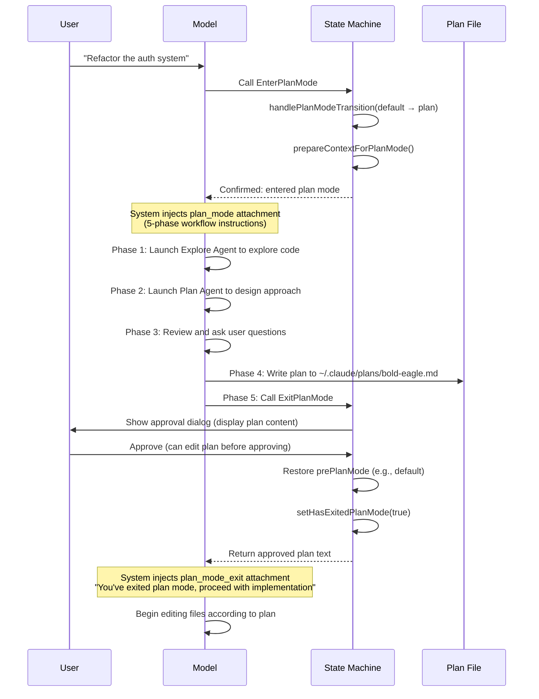
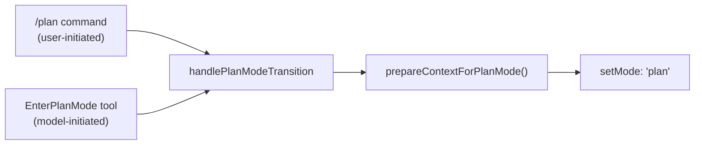

# Chapter 10: Plan Mode

> Think before you act — Plan Mode is the only mechanism in Claude Code where the model **voluntarily downgrades its own permissions** to earn user trust.

## 10.1 Why Plan Mode Exists

Imagine this scenario: you ask Claude Code to "refactor the entire authentication system." Without hesitation, it starts modifying files — changes 12 files, deletes 3 functions, introduces a JWT library you never wanted. Your only recourse is `git checkout .` and start over.

That's the world without Plan Mode.

The core design principle of Plan Mode is: **for complex tasks, make the model explore first, plan second, and only act after the user explicitly approves**. It achieves this through permission downgrade (disabling all write operations), forcing the model into a "read-only exploration + output plan" workflow until the user explicitly approves the plan and write permissions are restored.

Key files:

| File | Lines | Responsibility |
|------|-------|----------------|
| `src/tools/EnterPlanModeTool/EnterPlanModeTool.ts` | 127 | Tool for entering Plan Mode |
| `src/tools/ExitPlanModeTool/ExitPlanModeV2Tool.ts` | 493 | Exiting Plan Mode + approval flow |
| `src/utils/plans.ts` | 398 | Plan file management (slug, read/write, recovery) |
| `src/utils/planModeV2.ts` | 96 | Configuration (agent count, experiment variants) |
| `src/utils/messages.ts:3136-3417` | ~280 | Plan Mode system message generation |
| `src/utils/permissions/permissionSetup.ts` | ~60 | Permission context preparation and restoration |
| `src/bootstrap/state.ts:1349-1470` | ~120 | Plan Mode global state |

## 10.2 The Big Picture: A Complete Plan Mode Flow



The key to the entire flow is **symmetry of state transitions**: save the original mode on entry (`prePlanMode`), restore it precisely on exit. This guarantees Plan Mode is a "nestable insertion layer" — regardless of whether you were in default, auto, or bypassPermissions mode, Plan Mode returns you seamlessly to your previous state.

## 10.3 Entering Plan Mode: Two Paths

There are two ways to enter Plan Mode, but both converge on the same state transition function:



### 10.3.1 User-Initiated: `/plan` Command

When the user types `/plan` or `/plan refactor the auth system` in the REPL, it triggers `src/commands/plan/plan.tsx:64-121`:

```typescript
// src/commands/plan/plan.tsx
const currentMode = appState.toolPermissionContext.mode
if (currentMode !== 'plan') {
  handlePlanModeTransition(currentMode, 'plan')
  setAppState(prev => ({
    ...prev,
    toolPermissionContext: applyPermissionUpdate(
      prepareContextForPlanMode(prev.toolPermissionContext),
      { type: 'setMode', mode: 'plan', destination: 'session' },
    ),
  }))
}
```

If the command includes a description (e.g., `/plan refactor the auth system`), the description is simultaneously submitted as a user message to the model, triggering a full query loop — the model receives this message in plan mode and begins exploring.

### 10.3.2 Model-Initiated: EnterPlanMode Tool

This is the more common path. When the model determines the current task is sufficiently complex, it **proactively calls** the `EnterPlanMode` tool to request entering plan mode.

`src/tools/EnterPlanModeTool/EnterPlanModeTool.ts:77-101`:

```typescript
async call(_input, context) {
  // Sub-agents cannot enter plan mode — plan is a user-level decision
  if (context.agentId) {
    throw new Error('EnterPlanMode tool cannot be used in agent contexts')
  }

  const appState = context.getAppState()
  handlePlanModeTransition(appState.toolPermissionContext.mode, 'plan')

  context.setAppState(prev => ({
    ...prev,
    toolPermissionContext: applyPermissionUpdate(
      prepareContextForPlanMode(prev.toolPermissionContext),
      { type: 'setMode', mode: 'plan', destination: 'session' },
    ),
  }))

  return {
    data: { message: 'Entered plan mode. You should now focus on exploring...' },
  }
}
```

Note the `context.agentId` check — this is a critical design constraint: **sub-agents cannot enter Plan Mode**. The reason is straightforward: Plan Mode requires user interaction (approving the plan), but sub-agents run in the background without direct user interaction capability. If a sub-agent were allowed to enter Plan Mode, it would be stuck forever waiting for approval.

### 10.3.3 Tool Prompt: Guiding the Model on When to Enter

How does the model know when it should enter Plan Mode? The answer lies in the tool's prompt. Claude Code uses carefully crafted prompts to guide the model's judgment.

For **external users** (`src/tools/EnterPlanModeTool/prompt.ts:16-99`), the prompt lists 7 conditions that warrant entering Plan Mode:

```
1. New feature implementation: Adding meaningful new functionality
2. Multiple valid approaches: The task can be solved in several different ways
3. Code modifications: Changes that affect existing behavior or structure
4. Architectural decisions: The task requires choosing between patterns or technologies
5. Multi-file changes: The task will likely touch more than 2-3 files
6. Unclear requirements: You need to explore before understanding the full scope
7. User preferences matter: The implementation could reasonably go multiple ways
```

For **internal users** (ant), the prompt is more conservative — it only suggests entering Plan Mode when there's "genuine architectural ambiguity," avoiding excessive planning that slows velocity. This reflects a practical observation: **internal users are typically more familiar with the codebase and need less "plan before act" protection**.

## 10.4 System Message Injection in Plan Mode

After entering Plan Mode, Claude Code uses the **Attachment System** to inject instructions into each conversation turn, telling the model "you can only read, not write" and "here's the workflow you should follow."

### 10.4.1 Attachment Throttling Mechanism

Instructions aren't injected in full every turn — that would waste too many tokens. `src/utils/attachments.ts:1189-1242` implements a fine-grained throttling logic:

| Turn | Injected Content | Reason |
|------|-----------------|--------|
| Turn 1 | **Full instructions** (full) | Model's first entry, needs complete context |
| Turns 2-4 | Nothing | Save tokens, model should still remember |
| Turn 5 | **Brief reminder** (sparse) | Prevent model from "forgetting" it's in plan mode |
| Turns 6-9 | Nothing | Continue saving |
| Turn 10 | Brief reminder | Keep reminding |
| Every 25th turn | Full instructions | Full context refresh for long sessions |

Configuration constants (`src/utils/attachments.ts:259-262`):

```typescript
export const PLAN_MODE_ATTACHMENT_CONFIG = {
  TURNS_BETWEEN_ATTACHMENTS: 5,          // Inject every 5 turns
  FULL_REMINDER_EVERY_N_ATTACHMENTS: 5,  // 1 out of every 5 injections is full
} as const
```

This means full instructions appear roughly every 25 turns (5 × 5), while the rest use ultra-short sparse reminders (~300 characters) to maintain the model's awareness of the current mode.

### 10.4.2 Two Workflow Modes

Claude Code actually has **two entirely different** Plan Mode workflows, switched via feature gates.

#### 5-Phase Workflow (Default)

This is the mode most users see (`src/utils/messages.ts:3207-3297`). The injected system message divides the entire planning process into 5 strict phases:

```
Phase 1: Initial Understanding
  → Launch Explore Agent to explore the codebase
  → "You can only use Explore sub-agents in this phase"

Phase 2: Design
  → Launch Plan Agent to design the approach
  → Can launch multiple Agents in parallel for different design angles

Phase 3: Review
  → Synthesize Agent results, ask user clarifying questions

Phase 4: Final Plan
  → Write the final plan to the plan file

Phase 5: Call ExitPlanMode
  → Submit the plan for user approval
```

The number of agents per phase is dynamic, depending on the user's subscription tier (`src/utils/planModeV2.ts:5-29`):

```typescript
export function getPlanModeV2AgentCount(): number {
  // Environment variable override takes priority
  if (process.env.CLAUDE_CODE_PLAN_V2_AGENT_COUNT) { ... }

  const subscriptionType = getSubscriptionType()
  const rateLimitTier = getRateLimitTier()

  // Max 20x subscription: 3 parallel Plan Agents
  if (subscriptionType === 'max' && rateLimitTier === 'default_claude_max_20x') {
    return 3
  }
  // Enterprise/Team users: 3
  if (subscriptionType === 'enterprise' || subscriptionType === 'team') {
    return 3
  }
  // Everyone else: 1
  return 1
}
```

The reasoning is practical: **Plan Agents consume massive amounts of tokens** (each agent independently explores the codebase), and only high-quota users can afford the cost of 3 agents planning in parallel.

#### Iterative Workflow (Interview Phase)

This is a more flexible alternative (`src/utils/messages.ts:3323-3383`), controlled by `isPlanModeInterviewPhaseEnabled()`. The key difference is **no phases** — it's a continuous loop:

```
Loop:
  1. Explore — Read code with read-only tools
  2. Update the plan file — Write every discovery immediately
  3. Ask the user — Ask when encountering ambiguity
  → Return to 1, until the plan is complete
```

The critical prompt difference shows in the conversational style:

```
5-Phase mode: "Launch up to 3 Explore agents IN PARALLEL"
  → Encourages the model to explore extensively, then synthesize

Iterative mode: "Start by quickly scanning a few key files...
               Then write a skeleton plan and ask the user your first round of questions.
               Don't explore exhaustively before engaging the user."
  → Encourages quick interaction, progressive deepening
```

### 10.4.3 Phase 4's Four Experiment Variants

Phase 4 (format requirements for the final plan) is an **ongoing A/B experiment** (`tengu_pewter_ledger`), with four variants (`src/utils/messages.ts:3156-3205`):

| Variant | Key Difference | Goal |
|---------|---------------|------|
| **control** | Full format: Context + recommended approach + file paths + verification steps | Baseline |
| **trim** | One-line Context + single verification command | Moderate compression |
| **cut** | No Context paragraph + one line per file + single verification command | Heavy compression |
| **cap** | No prose at all + one bullet per file + **hard limit of 40 lines** | Maximum compression |

> The motivation for this experiment comes from production data: baseline (control) plan files have a p50 of 4,906 characters, p90 of 11,617 characters, and a mean of 6,207 characters. Opus output costs 5x its input price, so overly long plan files directly inflate costs. Moreover, **rejection rate correlates positively with plan length**: plans <2K have a 20% rejection rate, while plans >20K hit 50% rejection. In other words, **the longer the plan, the less satisfied the user**.

## 10.5 Plan File Management

### 10.5.1 File Naming and Storage

Each session's plan file is stored in the `~/.claude/plans/` directory, with a randomly generated word slug as the filename:

```
~/.claude/plans/bold-eagle.md          ← Main session's plan
~/.claude/plans/bold-eagle-agent-7.md  ← Sub-agent 7's plan
```

`src/utils/plans.ts:32-49`:

```typescript
export function getPlanSlug(sessionId?: SessionId): string {
  const id = sessionId ?? getSessionId()
  const cache = getPlanSlugCache()
  let slug = cache.get(id)
  if (!slug) {
    const plansDir = getPlansDirectory()
    // Retry up to 10 times to avoid filename collisions
    for (let i = 0; i < MAX_SLUG_RETRIES; i++) {
      slug = generateWordSlug()
      const filePath = join(plansDir, `${slug}.md`)
      if (!getFsImplementation().existsSync(filePath)) {
        break
      }
    }
    cache.set(id, slug!)
  }
  return slug!
}
```

The slug is cached within the session (`planSlugCache: Map<SessionId, string>`), ensuring the same session always writes to the same file. Why word slugs instead of UUIDs? Because users may need to manually open and edit this file — `bold-eagle.md` is far more recognizable and memorable than `a3f7b2c1-4d5e-6f78.md`.

### 10.5.2 Resume and Fork

When a user resumes a previous session, the corresponding plan file needs to be recovered. `copyPlanForResume()` (`src/utils/plans.ts:164-230`) uses a layered recovery strategy:

```
1. Direct file read       → File is still on disk (common for local sessions)
2. File snapshot recovery  → Recovered from file_snapshot messages in the transcript (remote sessions)
3. ExitPlanMode input     → Extracted from the plan field in tool_use blocks
4. planContent field      → Extracted from the planContent field of user messages
5. plan_file_reference    → Extracted from attachments created by auto-compact
```

Why so many recovery strategies? Because **remote sessions (CCR) don't persist files**. Local users' plan files sit safely in `~/.claude/plans/`, but remote users' pods can be reclaimed at any time. So Claude Code calls `persistFileSnapshotIfRemote()` during every `normalizeToolInput()`, writing the plan content as a `file_snapshot` system message into the transcript — the only reliable persistence channel.

Forking a session (`copyPlanForFork()`, `src/utils/plans.ts:239-264`) is simpler but has one critical detail: **generate a new slug**. If the original slug were reused, the original and forked sessions would write to the same file — causing mutual overwrites.

## 10.6 Exiting Plan Mode: Approval and Permission Restoration

Exiting is the most complex part of Plan Mode, as it must simultaneously handle permission restoration, user approval, plan synchronization, and multiple execution contexts.

### 10.6.1 Validation: Must Be in Plan Mode

The first check in `ExitPlanModeV2Tool` (`src/tools/ExitPlanModeTool/ExitPlanModeV2Tool.ts:195-219`):

```typescript
async validateInput(_input, { getAppState, options }) {
  if (isTeammate()) {
    return { result: true }
  }
  const mode = getAppState().toolPermissionContext.mode
  if (mode !== 'plan') {
    logEvent('tengu_exit_plan_mode_called_outside_plan', { ... })
    return {
      result: false,
      message: 'You are not in plan mode. This tool is only for exiting plan mode...',
      errorCode: 1,
    }
  }
  return { result: true }
}
```

Why is this check necessary? Because **the model sometimes "forgets" it has already exited Plan Mode** (especially after context compaction), and calls `ExitPlanMode` again. This check prevents state corruption from duplicate exits.

### 10.6.2 User Approval

The permission request dialog is triggered through `checkPermissions()` (`src/tools/ExitPlanModeTool/ExitPlanModeV2Tool.ts:221-239`):

```typescript
async checkPermissions(input, context) {
  if (isTeammate()) {
    return { behavior: 'allow' as const, updatedInput: input }
  }
  return {
    behavior: 'ask' as const,
    message: 'Exit plan mode?',
    updatedInput: input,
  }
}
```

In the approval dialog, the user can:
- **Approve directly**: The plan passes as-is
- **Edit then approve**: Modify the plan content before approving (passed back via `permissionResult.updatedInput.plan`)
- **Reject**: Stay in Plan Mode and continue refining the plan

### 10.6.3 The Precise Logic of Permission Restoration

The permission restoration in the `call()` method is the most intricate part (`src/tools/ExitPlanModeTool/ExitPlanModeV2Tool.ts:357-403`):

```typescript
context.setAppState(prev => {
  if (prev.toolPermissionContext.mode !== 'plan') return prev
  setHasExitedPlanMode(true)
  setNeedsPlanModeExitAttachment(true)

  let restoreMode = prev.toolPermissionContext.prePlanMode ?? 'default'

  // Circuit breaker defense: if prePlanMode is auto, but auto gate is now closed
  // → fall back to default, cannot bypass the circuit breaker
  if (feature('TRANSCRIPT_CLASSIFIER')) {
    if (restoreMode === 'auto' && !isAutoModeGateEnabled()) {
      restoreMode = 'default'  // Safe fallback
    }
    autoModeStateModule?.setAutoModeActive(restoreMode === 'auto')
  }

  // Permission rule restoration
  let baseContext = prev.toolPermissionContext
  if (restoreMode === 'auto') {
    // Restoring to auto: keep dangerous permissions stripped
    baseContext = stripDangerousPermissionsForAutoMode(baseContext)
  } else if (prev.toolPermissionContext.strippedDangerousRules) {
    // Restoring to non-auto: restore stripped dangerous permissions
    baseContext = restoreDangerousPermissions(baseContext)
  }

  return {
    ...prev,
    toolPermissionContext: {
      ...baseContext,
      mode: restoreMode,
      prePlanMode: undefined,  // Clear to prevent misuse on next exit
    },
  }
})
```

This logic handles a very nuanced edge case: **circuit breaker defense**. Suppose the user was in auto mode, and the system saved `prePlanMode: 'auto'` when entering Plan Mode. But during Plan Mode, the auto mode circuit breaker tripped (e.g., consecutive failures exceeded the threshold), and the auto gate was disabled. If we blindly restored to `auto`, we'd be bypassing the circuit breaker — which is not allowed. So it first checks `isAutoModeGateEnabled()`, falling back to `default` if the gate has been closed.

### 10.6.4 Four Result Message Types

`mapToolResultToToolResultBlockParam()` returns 4 different messages depending on context (`src/tools/ExitPlanModeTool/ExitPlanModeV2Tool.ts:419-492`):

| Context | Return Message | Subsequent Behavior |
|---------|---------------|---------------------|
| **Teammate waiting for approval** | "Your plan has been submitted to the team lead..." + Request ID | Model waits for inbox message |
| **Sub-agent** | "User has approved the plan. Please respond with 'ok'" | Sub-agent terminates |
| **Empty plan** | "User has approved exiting plan mode. You can now proceed." | Start working immediately |
| **Normal approval** | "User has approved your plan..." + full plan text | Implement according to plan |

The normal approval message **echoes the complete plan text back** — this isn't redundant. It ensures the model can directly reference the plan content during implementation without re-reading the plan file. If the user edited the plan, the tag changes to `"Approved Plan (edited by user)"`, alerting the model to the user's modifications.

## 10.7 Global View of State Management

Plan Mode state is distributed across multiple locations, but transitions are unified through the `handlePlanModeTransition()` function (`src/bootstrap/state.ts:1349-1363`):

```typescript
export function handlePlanModeTransition(fromMode: string, toMode: string): void {
  // Entering plan: clear stale exit attachment flag
  if (toMode === 'plan' && fromMode !== 'plan') {
    STATE.needsPlanModeExitAttachment = false
  }
  // Exiting plan: trigger one-time exit attachment
  if (fromMode === 'plan' && toMode !== 'plan') {
    STATE.needsPlanModeExitAttachment = true
  }
}
```

Complete state fields:

```typescript
// src/bootstrap/state.ts
STATE = {
  hasExitedPlanMode: boolean,           // Session-level: has ever exited plan mode
  needsPlanModeExitAttachment: boolean, // One-time flag: inject exit message next turn
  needsAutoModeExitAttachment: boolean, // One-time flag: auto mode exit message
  planSlugCache: Map<SessionId, string>, // Session → slug mapping
}

// Plan-related fields in ToolPermissionContext
{
  mode: 'default' | 'plan' | 'auto' | 'bypassPermissions',
  prePlanMode?: 'default' | 'auto' | 'bypassPermissions', // Mode before entering plan
  strippedDangerousRules?: ..., // Dangerous permissions stripped for auto mode (saved during plan)
}
```

`needsPlanModeExitAttachment` and `needsAutoModeExitAttachment` are **fire-once flags**. They are cleared immediately after being consumed, ensuring exit messages are injected exactly once. This design prevents the "exited plan mode" notification from repeating on every subsequent turn.

## 10.8 Re-entering Plan Mode

If a user enters Plan Mode a second time in the same session, the system injects a special re-entry guide (`src/utils/messages.ts:3829-3847`):

```
## Re-entering Plan Mode

You are returning to plan mode after having previously exited it.
A plan file exists at {planFilePath} from your previous planning session.

Before proceeding with any new planning, you should:
1. Read the existing plan file to understand what was previously planned
2. Evaluate the user's current request against that plan
3. Decide how to proceed:
   - Different task → start fresh by overwriting
   - Same task, continuing → modify existing plan
4. Always edit the plan file before calling ExitPlanMode
```

This guide addresses a real problem: the model might **assume the old plan is still valid**. Explicitly requiring "read the old plan first, then decide if it's relevant" prevents the model from continuing on top of an outdated plan.

## 10.9 Interactions with Other Systems

### 10.9.1 With the Permission System

Plan Mode is deeply integrated with the [Permission System](/en/docs/11-permission-security.md). The behavior of `prepareContextForPlanMode()` depends on the mode before entry:

```
Entering from default:
  → Simply save prePlanMode = 'default'

Entering from auto (and shouldPlanUseAutoMode = false):
  → Deactivate auto mode
  → Restore stripped dangerous permissions
  → Set needsAutoModeExitAttachment = true
  → Save prePlanMode = 'auto'

Entering from auto (and shouldPlanUseAutoMode = true):
  → Keep auto mode active
  → Save prePlanMode = 'auto'
```

### 10.9.2 With the Multi-Agent System

Plan Mode provides dedicated instructions for sub-agents in the [Multi-Agent Architecture](/en/docs/07-multi-agent.md) (`src/utils/messages.ts:3399-3417`). Sub-agent plan files use a separate namespace (`{slug}-agent-{agentId}.md`), avoiding conflicts with the main session's plan file.

### 10.9.3 With normalizeToolInput

In `src/utils/api.ts:572-580`, `normalizeToolInput()` gives `ExitPlanMode` special treatment — reading the plan content from disk and injecting it into the tool input:

```typescript
case EXIT_PLAN_MODE_V2_TOOL_NAME: {
  const plan = getPlan(agentId)
  const planFilePath = getPlanFilePath(agentId)
  void persistFileSnapshotIfRemote()
  return plan !== null ? { ...input, plan, planFilePath } : input
}
```

The injected `plan` and `planFilePath` fields are consumed by hooks and SDK consumers, but are stripped by `normalizeToolInputForAPI()` before being sent to the API — because these fields don't exist in the API schema.

## 10.10 Design Insights

1. **Voluntarily trading power for trust**: Plan Mode is the only mechanism in all of Claude Code where the model "voluntarily requests to lower its own permissions." This design inverts the traditional "I need permissions" pattern into "I voluntarily give up permissions to earn your trust" — when the model judges a task is complex, it chooses to bind its own hands, using only its eyes, until you say "go ahead."

2. **Symmetric state transitions**: Enter with `prePlanMode = currentMode`, exit with `currentMode = prePlanMode`. This symmetry guarantees Plan Mode is a "pure function" — it produces no side effects, and the system state after exit is identical to before entry (except for the addition of a plan file).

3. **Progressive prompt injection**: The full → sparse → full throttling strategy strikes a balance between token cost and model memory. Full instructions are ~4,700 characters (~1,200 tokens), while sparse reminders are only ~300 characters (~75 tokens). For an average 15-turn plan session, the throttling strategy saves roughly 10,000 tokens.

4. **Experiment-driven iteration**: Phase 4's four variants weren't designed by guesswork — they're based on baseline data from 26.3M sessions, using rigorous A/B testing to validate whether "shorter plans lead to better user satisfaction." This reflects the engineering team's approach of optimizing for **user satisfaction (rejection rate) rather than technical metrics (plan length)**.

5. **Fault tolerance is everywhere**: From the 5-layer plan recovery strategy, to circuit breaker defense, to re-entry guidance, every step of Plan Mode asks "what if something goes wrong?" This isn't over-engineering — in an AI system, the model's behavior is inherently unpredictable, and defensive programming is the only rational strategy.

---

> **Hands-on practice**: Try typing `/plan refactor the most complex module in your project` in Claude Code, and observe how the model explores the code, generates a plan, and waits for your approval. Then edit the plan file (`~/.claude/plans/*.md`) before approving, and watch how the model handles your modifications.

Previous chapter: [Skills System](/en/docs/09-skills-system.md) | Next chapter: [Permissions & Security](/en/docs/11-permission-security.md)
