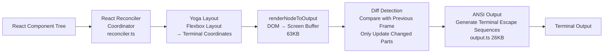

# Chapter 13: User Experience Design

> Good usability = Model capability × Interaction design × Engineering constraints

## 12.1 Design Philosophy

Every Code Agent faces a core UX contradiction: **the tension between autonomy and trust**.

Give the Agent too much autonomy, and users feel uneasy — "What files did it modify where I can't see?" Give the Agent too little autonomy, requiring confirmation at every step, and users get frustrated — "This is slower than writing it myself." Neither extreme is usable.

Claude Code found a precise balance point between the two: **Observable Autonomy**. The Agent acts freely, but lets users see every step in real time:

- **Real-time visibility**: All tool calls are displayed via streaming. This isn't "wait until it's done, then show you the result," but rather "you can see parameters and progress during execution." The benefit is that users can press Ctrl+C to interrupt within the **first 3 seconds** of the Agent going in the wrong direction, instead of waiting 20 seconds for execution to finish before undoing — the cost of interruption is far lower than the cost of undoing.
- **Minimize interruptions**: Only interrupt user flow when permission confirmation is truly needed. Permission dialogs even have a 200ms anti-misclick delay (detailed in Section 11.8), showing how seriously the team takes "the cost of interruption."
- **Streaming output supports decision-making**: Users judge whether the direction is correct while watching streaming output. If they notice the wrong direction after 3 seconds of model output, an immediate Ctrl+C saves the remaining 15 seconds of generation time and Token cost.

This philosophy can be summarized in one sentence: **Trust but verify in real time** — give the Agent full freedom of action, but make every operation a glass box, not a black box.

## 12.2 Ink/React Terminal UI

Claude Code uses a **custom-built Ink terminal renderer** (based on React), with the core module `src/ink/ink.tsx` reaching 251KB. This isn't simple console.log output — it's a complete React application running in the terminal.

### Why React?

Using React in a terminal seems like "using a sledgehammer to crack a nut," but if you understand Claude Code's UI complexity — streaming Markdown rendering, virtual scrolling, multiple animation states, permission dialogs, Vim mode, search highlighting — you'll understand the inevitability of this choice:

1. **Declarative approach eliminates ANSI state management**. The underlying layer of terminal UI is ANSI escape sequences — colors, bold, cursor positions all need manual tracking. Imperative programming requires maintaining "which line we're on, which color is active, which areas of the previous frame need erasing" — state coupling between components quickly spirals out of control. React's declarative model lets developers simply describe "what the UI should look like," and the renderer automatically handles differential updates.

2. **Component model naturally supports composition**. `ToolUseLoader`, `SpinnerGlyph`, `PermissionRequest`, `Markdown` are all independent components that can be nested and composed. No need to coordinate "which line is the Spinner on, should the Spinner yield its position when the permission dialog pops up" — the Flexbox layout engine handles this automatically.

3. **Reconciliation minimizes terminal writes**. Terminals don't have GPU-accelerated rendering like browsers — every character write is an I/O operation. If every frame did a full redraw, even changing a single character would require rewriting the entire screen, producing noticeable flicker. The React Reconciler automatically diffs two consecutive frames and only updates the parts that actually changed.

4. **Reuses the React ecosystem**. Hooks (`useState`, `useMemo`, `useEffect`), Context (global state sharing), Memo (avoiding unnecessary renders) — these React optimization patterns accumulated over the years are directly usable. The team doesn't need to reinvent state management solutions for the terminal scenario.

The cost is 251KB of custom renderer code. But considering the alternative — manually managing UI of this complexity with imperative ANSI output — the cost is entirely worthwhile. An imperative approach is barely maintainable at 10 components; at 50 components it becomes a maintenance nightmare.

### Rendering Pipeline



Each stage has a clear responsibility and reason for existence:

- **React Reconciler** (`reconciler.ts`): Standard React reconciliation process, converting component tree changes into operations on internal DOM nodes. The key point is that it only marks nodes that need updating, without touching unchanged parts.

- **Yoga Layout**: Terminal UI and web layout face the same problems — dynamically changing content, unfixed widths, need for nesting. Yoga is Facebook's open-source Flexbox layout engine (WebAssembly version), providing battle-tested layout computation capabilities so developers don't need to implement "after this text wraps, the component below needs to shift down by how many lines" logic themselves.

- **Diff Detection**: The Screen Buffer compares cell by cell with the previous frame; only cells whose values or styles have actually changed generate ANSI output sequences. This is the key to a smooth experience — users won't see flicker during fast scrolling or streaming output because most of the screen simply isn't being rewritten.

- **Blitting Optimization**: Going further, for consecutive lines in the previous frame that are completely unchanged, they are directly copied (blitted) from the old Screen Buffer, skipping cell-level comparison. This is particularly effective in scenarios with large amounts of static content plus small amounts of dynamic content (e.g., the last few lines growing during streaming output).

- **ANSI Output** (`output.ts`): Converts styled cells into terminal escape sequences. This layer handles encoding for 256-color, TrueColor, bold/italic/underline and other styles, as well as the OSC 8 hyperlink protocol.

### Memory Optimization

Terminal applications have a key difference from web applications: they may run continuously for hours. In a session spanning hundreds of conversation turns, short-lived string and style objects put enormous pressure on the garbage collector.

The Screen Buffer (`src/ink/screen.ts`, 49KB) borrows the **Object Pooling** technique from game engines, using three pools to avoid repeatedly creating objects:

| Object Pool | Purpose | Optimization Technique |
|-------------|---------|----------------------|
| CharPool | Intern repeated characters | ASCII fast path: direct array lookup (`chars[charCode]`), no Map query needed |
| StylePool | Intern repeated styles | Bit-packed style metadata storage (color, bold, etc. encoded into a single integer) |
| HyperlinkPool | Intern repeated URLs | URL deduplication: thousands of cells pointing to the same hyperlink store only one copy |

"Interning" means: there might be 10,000 cells on screen displaying the same white regular character "a", but they share a single CharPool entry rather than each creating its own string object.

Cross-frame optimizations:
- **Blitting**: Copy unchanged regions from the previous frame, avoiding recomputation
- **Generational reset**: Replace unreferenced entries in pools between frames, preventing unbounded pool growth

### Core Components

| Component | Function |
|-----------|----------|
| `App.tsx` (98KB) | Root component, keyboard/mouse/focus event dispatch |
| `Box.tsx` | Flexbox layout container |
| `Text.tsx` | Styled text rendering |
| `ScrollBox.tsx` | Scrollable container (supports text selection) |
| `Button.tsx` | Interactive button (focus/click) |
| `AlternateScreen.tsx` | Fullscreen mode |
| `Ansi.tsx` | Parse ANSI escape codes into React Text |

### Context System

Claude Code's terminal UI uses 5 React Contexts to provide global state to deep component trees, avoiding prop drilling:

```typescript
// 5 React Contexts provide global state access
AppContext              // Global application state (session, config, permission mode)
TerminalFocusContext    // Terminal window focus state (for pausing/resuming animations)
TerminalSizeContext     // Terminal viewport size (rows × columns, responsive layout)
StdinContext            // Standard input stream (keyboard event source)
ClockContext            // Animation clock (unified render frame scheduling)
```

These Contexts follow the "terminal as browser" philosophy. For example, `TerminalSizeContext` triggers Yoga to recalculate layout when the terminal window size changes, similar to how `resize` events in browsers drive CSS reflow. `TerminalFocusContext` pauses animation and streaming output rendering when the user switches to another window, reducing unnecessary CPU overhead.

### Hooks Library

On top of the Context system, Claude Code encapsulates a set of custom Hooks, each wrapping one dimension of terminal I/O complexity:

```typescript
useInput(handler)           // Global keyboard event listener (supports Kitty extended key codes)
useSelection()              // Text selection state management (selection range, selected content)
useSearchHighlight(query)   // Search highlight rendering (match position tracking + current focus)
useAnimationFrame(callback) // Frame scheduling (synced with ClockContext, avoids unnecessary renders)
useTerminalFocus()          // Terminal focus events (pause streaming output on window switch)
useTerminalViewport()       // Viewport size response (triggers Yoga re-layout)
```

Two Hooks deserve particular attention for their design:

**`useAnimationFrame(intervalMs)`**: All animation components (Spinner, Shimmer, Blink) don't maintain their own timers but subscribe to the same clock source provided by `ClockContext`. When `intervalMs` is `null`, the component automatically unsubscribes — this is how pausing is implemented (when the terminal loses focus, `useTerminalFocus()` returns false, and the animation Hook sets intervalMs to null). The benefit is: all animations update within the same frame, avoiding the performance waste of multiple components each triggering their own renders; and when there are no active animation subscribers, the clock automatically stops.

**`useBlink(enabled)`** (`src/hooks/useBlink.ts`): All blinking elements (e.g., multiple executing ToolUseLoaders) are naturally synchronized because they derive state from a shared clock using the same mathematical formula:

```typescript
const isVisible = Math.floor(time / BLINK_INTERVAL_MS) % 2 === 0
```

No "blink coordinator" is needed to synchronize multiple components — they read the same `time`, use the same formula, and the results are naturally consistent. BLINK_INTERVAL_MS = 600ms (300ms on, 300ms off) — fast enough to indicate "in progress," slow enough not to feel glaring. When the terminal loses focus, it returns `[ref, true]` (always visible), avoiding meaningless background animation.

Taking `useInput()` as an example, it handles raw keycode parsing (including Escape sequences and Kitty extended key codes) and dispatches keyboard events to the correct handler based on the current mode (Normal/Vim/search). Developers only need to care about "what key was pressed" and "what mode we're in," without needing to understand the details of the underlying terminal protocol.

## 12.3 Streaming Output

Claude Code's streaming output isn't "wait until it's done, then display" — it's **truly real-time streaming rendering**.

From API to user terminal, the entire pipeline is based on `async function*` async generators:

```
API SSE → callModel() → query() → QueryEngine → REPL → Ink Renderer
     ↓          ↓            ↓           ↓          ↓
   chunk      yield       yield       yield     React Update
```

Each Token begins rendering the instant it returns from the API, and users can see the model's "thinking process" in real time.

### Streaming Event Types

| Event Type | Source | Handling |
|-----------|--------|----------|
| `message_start` | API | Update usage |
| `content_block_delta` | API | Real-time text rendering |
| `message_delta` | API | Accumulate Token count |
| `message_stop` | API | Add to totalUsage |
| `stream_event` | query() | Conditional yield |
| `progress` | Tool | Inline progress update |

### Stream Class: Queue-Based Producer-Consumer

The underlying infrastructure of the streaming pipeline is the `Stream<T>` class (`src/utils/stream.ts`), an `AsyncIterator<T>` implementation of just 76 lines:

```typescript
export class Stream<T> implements AsyncIterator<T> {
  private readonly queue: T[] = []
  private readResolve?: (value: IteratorResult<T>) => void
  private isDone: boolean = false

  enqueue(value: T): void {
    if (this.readResolve) {
      // Consumer is already waiting → deliver directly, zero latency
      const resolve = this.readResolve
      this.readResolve = undefined
      resolve({ done: false, value })
    } else {
      // Consumer hasn't arrived yet → buffer to queue
      this.queue.push(value)
    }
  }

  next(): Promise<IteratorResult<T>> {
    if (this.queue.length > 0) {
      // Queue has data → return immediately
      return Promise.resolve({ done: false, value: this.queue.shift()! })
    }
    // Queue empty → suspend, wait for producer to enqueue
    return new Promise(resolve => { this.readResolve = resolve })
  }
}
```

Design highlights:

- **Dual-path `enqueue()`**: If the consumer's `next()` is already waiting (`readResolve` exists), `enqueue()` directly resolves that Promise, delivering data to the consumer with zero latency. Otherwise it buffers to the internal queue. This is much simpler than Node.js Readable Stream, without the complexity of high-water marks, backpressure signals, etc.
- **Single-iteration guarantee**: A `started` flag ensures the Stream can only be iterated by one consumer. This prevents a subtle bug — if two consumers iterate the same Stream simultaneously, each receives only half the events, causing data loss.
- **Natural backpressure**: If the consumer can't keep up (not calling `next()`), data accumulates in the `queue`. If the producer is too fast, `enqueue()` just pushes to the array without blocking. Backpressure is ultimately determined by the consumer's processing speed — when rendering can't keep up with API speed, the frequency of `next()` calls decreases, and the queue naturally grows.
- **Integration with `async function*`**: `Stream` is used for scenarios requiring **push-based** production (like SSE callbacks, where the API decides when to push data), while `async function*` generators are used for **pull-based** pipeline stages (where the consumer decides when to pull the next value). The two connect at the `callModel()` layer: SSE callbacks push to Stream, and `callModel()`'s `for await...of` pulls from Stream and yields to the upper layer.

### async function* Generator Pipeline

The core of streaming output is a data pipeline composed of `async function*`. Each Token passes through 4 layers of processing from API return to terminal rendering, with each layer passing data downstream in real time via `yield`:

```typescript
// Complete streaming data flow: the full path of each Token from API to terminal

// Layer 1: API SSE → SDK parsing
for await (const event of stream) {
  // content_block_delta: text delta
  // tool_use block: tool call parameters (streamed accumulation)
}

// Layer 2: callModel() → yield to query()
async function* callModel() {
  for await (const event of stream) {
    yield { type: 'text_delta', text }       // Text delta
    yield { type: 'tool_use', block }        // Complete tool call
    yield { type: 'usage', inputTokens, outputTokens }
  }
}

// Layer 3: query() → yield to QueryEngine
async function* query() {
  for await (const event of callModel()) {
    // Tool calls are intercepted and executed here
    if (event.type === 'tool_use') {
      const result = await executeTool(event.block)
      yield { type: 'tool_result', result }
    }
    yield event  // Pass through other events
  }
}

// Layer 4: REPL.tsx → React state update → Ink re-render
handleMessageFromStream(event) {
  // Each yield triggers setState → React reconciliation → terminal redraw
}
```

The key advantage of this design is **backpressure control** — if terminal rendering can't keep up with the API return speed, `yield` naturally pauses the upstream generator, preventing a large accumulation of unrendered events in memory.

### StreamingMarkdown: Incremental Parsing

Streaming output faces a performance challenge: with every Token the model outputs, the accumulated text grows a little. If every delta triggers a full `marked.lexer()` run (Markdown parsing) on the entire text, for a 10KB response this means thousands of O(n) full parses — causing noticeable lag.

`StreamingMarkdown` (`src/components/Markdown.tsx`) has an elegant solution: **split at the last top-level block boundary; the stable portion before it is never re-parsed**.

```typescript
export function StreamingMarkdown({ children }: StreamingProps) {
  const stablePrefixRef = useRef('')
  const stripped = stripPromptXMLTags(children)

  // Only run lexer on content after the boundary — O(unstable length) not O(full text)
  const boundary = stablePrefixRef.current.length
  const tokens = marked.lexer(stripped.substring(boundary))

  // Find all tokens before the last non-empty token, advance the boundary
  // The last token is the "growing block" (e.g., an unclosed code block), cannot be solidified
  let advance = 0
  for (let i = 0; i < tokens.length - 1; i++) {
    advance += tokens[i].raw.length
  }
  stablePrefixRef.current = stripped.substring(0, boundary + advance)

  // Stable prefix rendered by <Markdown> (internal useMemo ensures no re-parsing)
  // Unstable suffix re-parsed on each delta (but is short in length)
  return <>
    {stablePrefix && <Markdown>{stablePrefix}</Markdown>}
    {unstableSuffix && <Markdown>{unstableSuffix}</Markdown>}
  </>
}
```

Key design points:

- **Monotonically increasing boundary**: `stablePrefixRef` only advances forward, never retreats. This ensures safety (idempotency) even under React StrictMode's double rendering.
- **`marked.lexer` correctly handles unclosed code blocks**: An unclosed ` ``` ` is parsed as a complete token, so block boundaries are always safe split points.
- **Stable prefix's `<Markdown>` component**: Internally uses `useMemo` to skip re-rendering when `children` hasn't changed. Since `stablePrefix` only changes when the boundary advances (not on every Token), most frames don't trigger re-rendering of the stable portion at all.

The accompanying Token cache system further optimizes non-streaming scenarios (such as virtual scroll remounting of history messages):

- `TOKEN_CACHE_MAX = 500`, an LRU cache keyed by content hash
- `hasMarkdownSyntax()`: Checks whether the first 500 characters contain Markdown syntax markers (`#`, `*`, `` ` ``, `|`, `[`, etc.). Plain text directly constructs a paragraph token, **skipping `marked.lexer`'s full parsing** (saving approximately 3ms/message)
- LRU eviction + access promotion: `delete(key)` + `set(key, hit)` leverages Map's insertion order property to implement LRU, preventing messages currently being viewed from being unexpectedly evicted

### Spinner State Machine

The Spinner is more than just a "loading" indicator — it encodes the system's running state through visual changes:

**Spinning characters** (`src/components/Spinner/SpinnerGlyph.tsx`): Uses a set of Unicode Braille characters (e.g., `⠋⠙⠹⠸⠼⠴⠦⠧⠇⠏`) cycling forward, then cycling backward, creating a smooth back-and-forth spinning effect.

**Stall indication** (`stalledIntensity`): When the model hasn't produced new Tokens for a certain time and there are no active tool calls, `stalledIntensity` gradually increases from 0 to 1. This drives a **smooth RGB interpolation** from the theme color to `ERROR_RED {r:171, g:43, b:63}`:

```typescript
// Smooth color transition: theme color → red
const interpolated = interpolateColor(baseRGB, ERROR_RED, stalledIntensity)
```

The elegance of this design is that users don't need to read any text to perceive "something is off" — the Spinner gradually turns from its normal color to red, subconsciously conveying "it might be stuck." If the terminal doesn't support RGB, it discretely jumps to the error color when `stalledIntensity > 0.5`.

**Accessibility support** (`reducedMotion`): For users who have set a reduced motion preference, a static dot `●` replaces the spinning characters, paired with a 2000ms light-dark breathing cycle (1 second bright, 1 second dim), expressing "in progress" status with minimal visual motion.

**Spinner modes**: The REPL layer sets different Spinner modes based on streaming event types, each mode corresponding to different visual feedback:

| Mode | Trigger Condition | Visual Presentation |
|------|------------------|-------------------|
| `requesting` | Waiting for API first Token | Fast shimmer (50ms/frame) |
| `thinking` | Received thinking_delta | Slow shimmer (200ms/frame) |
| `responding` | Received text_delta | Spinning characters |
| `tool-input` | Received input_json_delta | Spinning characters (different color) |
| `tool-use` | Tool executing | Spinning characters + progress |

The reason for two shimmer speed levels: during `requesting` the system is waiting for a network response, and 50ms/frame rapid flashing conveys "actively working"; during `thinking` the model is doing reasoning, and 200ms/frame slow flashing conveys "deep thinking."

### Streaming Tool Parallel Execution

An important optimization enabled by streaming output is: **tool execution doesn't need to wait for model output to finish**. When the model produces a complete `tool_use` block during streaming output, that tool begins execution immediately, while the model may still be continuing to output subsequent content. This is managed by `StreamingToolExecutor` (detailed in Section 4.5).

In real-world scenarios, model streaming output typically takes 5-30 seconds, while tool execution (such as file reading, searching) usually takes less than 1 second. Through parallel execution, tool latency is completely "hidden" within the model's output time, and users barely notice the tool execution wait. This is also why Claude Code feels much faster than "serial execution" Agents in multi-tool-call scenarios.

## 12.4 Tool Call Transparency

Every tool call is displayed in real time through React components. Each Tool interface defines its own rendering methods:

```typescript
// Each tool comes with 4 rendering methods
renderToolUseMessage(input, options): React.ReactNode       // Tool call display
renderToolResultMessage?(content, progress): React.ReactNode // Result display
renderToolUseRejectedMessage?(input): React.ReactNode        // Rejection display
renderToolUseErrorMessage?(result): React.ReactNode          // Error display
```

Users can see in real time:
- What tool the model intends to execute, with what parameters
- Tool execution progress (Bash command stdout)
- Tool results or errors
- Permission confirmation dialog (if needed)

### Tool Group Rendering

The `renderGroupedToolUse?()` method supports merging multiple tool calls of the same type into a single render, reducing visual noise. For example, multiple file reads can be merged and displayed as a single list.

### ToolUseLoader: Synchronized Visual Feedback

`ToolUseLoader` (`src/components/ToolUseLoader.tsx`) is the status indicator in front of each tool call — a small dot `●` that encodes status through color and blinking:

| State | Color | Animation | Meaning |
|-------|-------|-----------|---------|
| Incomplete + animating | Dim | Blinking (600ms cycle) | Executing |
| Incomplete + queued | Dim | Static | Waiting to execute |
| Successfully completed | Green | Static | Completed |
| Error | Red | Static | Execution failed |

When multiple tools execute in parallel, all "executing" ToolUseLoader dots **blink in sync** — they light up or go dark at the same instant. This isn't achieved by a "blink coordinator" but leverages the mathematical synchronization of the `useBlink` Hook (detailed in Section 11.2). Synchronized blinking gives users a sense of "the system operating in unison," which feels more orderly than each blinking independently.

The source code also contains an interesting comment revealing an ANSI rendering pitfall: chalk library's `</dim>` and `</bold>` both reset via `\x1b[22m]`, which means when a dim element immediately precedes a bold element, bold gets unexpectedly rendered as dim. ToolUseLoader deliberately places the dot and tool name in separate `<Text>` elements with a `<Box>` spacer between them to work around this issue.

### Diff Rendering System

When tools perform file edits, Claude Code renders a `git diff`-like difference view, letting users see the specific changes before confirming.

Difference computation is based on `structuredPatch` (`src/utils/diff.ts`):

```typescript
structuredPatch(filePath, filePath, oldContent, newContent, {
  context: 3,      // Show 3 lines of context before and after changes (consistent with git diff)
  timeout: 5000    // Prevent extreme diff computation from blocking
})
```

Rendering uses the `StructuredDiffList` component: deleted lines in red, added lines in green, context lines in gray, with line numbers. Code blocks support syntax highlighting (via `cli-highlight` + `highlight.js`, supporting 180+ languages).

For large files, the `readEditContext` module doesn't load the entire file into memory but reads in chunks based on edit position (a `CHUNK_SIZE`-sized window), loading only the context area around the changes.

The Diff component uses the React `Suspense` pattern — during asynchronous file content loading and patch computation, a `"…"` placeholder is displayed, which is replaced with the complete diff view once loading is finished. This ensures that diffs of long files don't block UI rendering.

### Permission Classifier Shimmer Animation

When a tool call requires permission confirmation, Claude Code's safety classifier judges the risk level of the operation. The classifier takes 1-3 seconds to run, during which users see a **character-level shimmer animation** — a light point sweeps across the status text from left to right, indicating "determining whether your confirmation is needed."

The `useShimmerAnimation` Hook returns a `glimmerIndex` that increments each frame. Each character determines its brightness based on the distance between its position and `glimmerIndex`, forming a wave-like sweeping light effect. This animation is isolated in a standalone component `ClassifierCheckingSubtitle` (using React.memo), running on a 20fps animation clock without triggering re-rendering of the entire permission dialog.

### Progress Message Stream

Tools can emit progress events during execution via `yield { type: 'progress', content }` (for example, the Bash tool streaming stdout/stderr). These events travel along the streaming pipeline all the way to the REPL component, rendered as real-time updates in the tool output area via `renderToolResultMessage(content, progress)`.

This means when a user runs `npm install`, instead of waiting 30 seconds to see all output at once, they see each line of package installation logs in real time. This immediate feedback dramatically reduces the anxiety of "What is the Agent doing? Why is it taking so long?"

## 12.5 Error Handling and Recovery

Claude Code's error handling strategy is "recover automatically whenever possible; only tell the user when there's truly no alternative." But this isn't simply "retry everything" — it makes nuanced judgments based on error type, query source, and system state.

### Retry Strategy Details

The core retry logic is in `src/services/api/withRetry.ts`, with key parameters:

```
DEFAULT_MAX_RETRIES = 10      // Maximum retry count
BASE_DELAY_MS = 500           // Base delay
MAX_529_RETRIES = 3           // Threshold of consecutive 529 errors to trigger degradation
```

The backoff strategy uses **exponential backoff + random jitter**:

| Retry Count | Delay (approx.) | Notes |
|-------------|-----------------|-------|
| 1st | 500ms | Base delay |
| 2nd | 1s | 500 × 2¹ |
| 3rd | 2s | 500 × 2² |
| 4th | 4s | 500 × 2³ |
| ... | ... | |
| 7th+ | 32s | Capped at upper limit |

Each delay has an additional ±25% random jitter to prevent multiple clients from retrying at the same moment, causing a "thundering herd" effect. If the API response includes a `retry-after` header, that value is used directly instead of the calculated value.

### Foreground vs Background Queries: Avoiding Cascade Amplification
This is one of the most elegant designs in the retry system: **not all queries are worth retrying**.

```typescript
// Only foreground queries where the user is directly waiting for results retry on 529
const FOREGROUND_529_RETRY_SOURCES = new Set([
  'repl_main_thread',    // User is waiting for the model's response
  'sdk',                 // SDK calls
  'agent:default',       // Agent subtasks
  'compact',             // Context compaction
  'auto_mode',           // Safety classifier
  // ...
])
```

Background queries — summary generation, title suggestions, command completion suggestions — **immediately give up on receiving 529, without retrying**. The rationale:

1. **Preventing cascading amplification**: During capacity-constrained periods (429/529), each retry amplifies traffic to the API gateway by 3-10x. Background queries are invisible to the user — if they fail to retry, the user won't even notice. But if their retry-induced traffic amplification causes foreground queries to start timing out, the user will clearly perceive the lag.
2. **Resource prioritization**: Foreground queries are what the user is actively waiting for; background queries are "nice to have." Abandoning background queries reserves capacity for foreground queries.

This is a **load-aware retry strategy** — full retries when the system is healthy, protecting only the most critical query paths when capacity is tight.

### Fast Mode Degradation

When Fast Mode encounters capacity errors, the system performs tiered degradation:

```
Short retry-after (< 20 seconds) → Wait then retry still using Fast Mode
  Rationale: Preserve prompt cache (same model name, cache hit)

Long retry-after (≥ 20 seconds) → Enter cooldown period, switch to Standard Mode
  Cooldown duration = max(retry-after, 10 minutes)
  Rationale: Long waits indicate severe capacity issues; continuing to use Fast Mode will repeatedly trigger rate limiting
```

The 10-minute minimum cooldown period (`MIN_COOLDOWN_MS`) is to prevent **mode flip-flopping**: if the cooldown period is too short, the system will repeatedly switch between Fast → Standard → Fast, losing the prompt cache on each switch, which actually makes things slower.

There is also a special case: if the API returns an `anthropic-ratelimit-unified-overage-disabled-reason` header, it means the account's Fast Mode quota is exhausted, and the system **permanently disables** Fast Mode (for the current session only), displaying the specific reason.

### Connection Recovery

In long-running sessions, HTTP keep-alive connections may time out and become stale on the server side. When the client tries to send a request on an already-stale connection, it will receive an `ECONNRESET` or `EPIPE` error.

Claude Code's handling:

```
ECONNRESET / EPIPE detection
  → disableKeepAlive()    // Disable connection pool reuse
  → Obtain new client instance  // Establish a brand new connection
  → Retry request
```

This is a "self-healing" design: after the first ECONNRESET failure, all subsequent requests use new connections and won't encounter the same problem again.

### Automatic Recovery Transparent to Users

| Error Type | Automatic Recovery Strategy |
|---------|------------|
| PTL (Prompt Too Long) | Parse the error message to extract actual/limit token counts (`/prompt is too long.*?(\d+)\s*tokens?\s*>\s*(\d+)/i`), calculate the excess, trigger context compaction (Chapter 3) |
| Max-Output-Tokens | Automatically upgrade token limit or inject continuation prompt |
| API 5xx | Exponential backoff retry (up to 10 times) |
| ECONNRESET | Disable Keep-Alive + retry with new connection |
| OAuth Expired | Detect 401 → `handleOAuth401Error()` automatically refreshes token → retry with new client |
| Media Size Exceeded | `isMediaSizeError()` detection → remove oversized images/PDFs during responsive compaction |

### Errors Requiring User Intervention

- **Invalid API Key**: Prompts `Not logged in · Please run /login`
- **OAuth Token Revoked**: Prompts `OAuth token revoked · Please run /login`
- **Rate Limit (user-visible)**: Displays wait time + automatic retry
- **Budget Exceeded**: Displays cost spent and terminates gracefully (waits for the current operation to complete, does not abruptly interrupt)

### Model Degradation Notification

When 3 consecutive 529 errors trigger model degradation:

```
3 consecutive 529s → Throw FallbackTriggeredError(originalModel, fallbackModel)
  → Clear previous assistant messages (prevent the degraded model from seeing the advanced model's output format)
  → Strip thinking signature blocks (the degraded model may not support them)
  → Yield system message notifying user of degradation
  → Retry with degraded model
```

The user will see a system message indicating the model has been degraded, but no action is required.

### Persistent Retry Mode

For unattended automation scenarios (`CLAUDE_CODE_UNATTENDED_RETRY` environment variable), the system adopts a more aggressive retry strategy:

```
Infinite retry on 429/529
Maximum backoff: 5 minutes (PERSISTENT_MAX_BACKOFF_MS)
Total cap: 6 hours (PERSISTENT_RESET_CAP_MS)
Heartbeat: yield a SystemAPIErrorMessage every 30 seconds
  Purpose: Prevent the host environment from marking the session as idle and terminating it
```

## 12.6 Keyboard Shortcuts

Claude Code supports a rich set of keyboard shortcuts, covering the full range from basic operations to advanced features:

| Shortcut | Function | Description |
|--------|------|------|
| Enter | Submit message | Send current input to the model |
| Option/Alt+Enter | Newline | Insert a new line in the input box |
| Ctrl+C | Interrupt | Interrupt the current model response or tool execution |
| Ctrl+L | Clear screen | Clear terminal display |
| Ctrl+R | Search history | Fuzzy search through message history |
| Escape | Abort/Exit | Abort permission dialog or exit search mode |
| Tab | Autocomplete | File path and command completion |
| Up/Down | Browse history | Navigate through input history |
| Ctrl+D | Exit | Exit Claude Code |

### Custom Key Bindings

Claude Code supports user-defined shortcuts, with the configuration file located at `~/.claude/keybindings.json`:

```json
// ~/.claude/keybindings.json
{
  "bindings": [
    {
      "key": "ctrl+s",
      "command": "submit",          // Use Ctrl+S instead of Enter to submit
      "when": "inputFocused"
    },
    {
      "key": "ctrl+k ctrl+s",       // Chord shortcut
      "command": "settings"
    }
  ]
}
```

The key binding system supports three key features:

- **Chord Shortcuts**: Multi-key combinations, such as `ctrl+k ctrl+s`, which require pressing two key groups in sequence to trigger. This borrows from VS Code's design. In terminal environments, the available key combinations are far fewer than in GUI applications (many combinations are occupied by the terminal emulator or shell), and the chord mechanism expands the available shortcut space through sequential combinations.
- **Context Conditions (`when`)**: The `when` field restricts the scope in which a shortcut takes effect, such as `inputFocused` (when the input box is focused), `permissionDialogOpen` (when the permission dialog is open), etc.
- **Extended Key Codes**: Thanks to the Kitty keyboard protocol, Claude Code can distinguish key combinations that traditional terminals cannot differentiate (e.g., Ctrl+Shift+A vs Ctrl+A), providing more granular shortcut support.

## 12.7 Vim Mode

`src/vim/` implements Vim key bindings for terminal input (approximately 40KB total), allowing users accustomed to Vim to use familiar editing modes in Claude Code's input box.

### Four-Mode State Machine

Vim mode implements a complete four-mode state machine, with transitions between modes via specific keys:

```mermaid
stateDiagram-v2
    [*] --> Normal
    Normal --> Insert: i, a, o, A, I, O
    Insert --> Normal: Escape
    Normal --> Visual: v, V
    Visual --> Normal: Escape
    Normal --> Command: :
    Command --> Normal: Escape, Enter
```

- **Normal Mode**: Default mode, for navigation and operator combinations
- **Insert Mode**: Text input mode, behaves identically to a regular editor
- **Visual Mode**: Text selection mode, supports character selection (`v`) and line selection (`V`)
- **Command Mode**: Command-line mode, entered via `:`

### operators.ts (16KB) — Operators

Operators are the core verbs of Vim, combined with motions and text objects to form complete editing commands:

| Operator | Key | Function |
|--------|-----|------|
| Delete | d | Delete (composable: dw=delete word, dd=delete line, d$=delete to end of line) |
| Yank | y | Copy (yw=copy word, yy=copy line) |
| Change | c | Change (delete + enter Insert mode: cw=change word, cc=change line) |
| Paste | p/P | Paste (p=after cursor, P=before cursor) |

### motions.ts (1.9KB) — Motions

Motion commands define how the cursor moves and can be used standalone or combined with operators:

| Motion | Key | Description |
|------|-----|------|
| Character | h, l | Move left, move right |
| Word | w, b, e | Next word start, previous word start, word end |
| Line | 0, $, ^ | Line start, line end, first non-whitespace character |
| Document | gg, G | Document start, document end |

### textObjects.ts (5KB) — Text Objects

Text objects are Vim's "nouns," defining the scope of an operation. They come in two varieties: `inner` (interior) and `a` (including delimiters):

| Text Object | Key | Description |
|----------|-----|------|
| inner word | iw | Inside the word (excluding spaces) |
| a word | aw | Entire word (including trailing spaces) |
| inner paragraph | ip | Inside the paragraph |
| a paragraph | ap | Entire paragraph (including blank lines) |
| inner quotes | i", i' | Content inside quotes |
| inner parens | i(, i{ | Content inside parentheses/braces |

Operators, motions, and text objects can be freely combined to form a powerful editing grammar: `diw` = delete inside word, `ci"` = change content inside quotes, `ya{` = yank inside braces (including the braces). This compositional design means a small number of basic elements can cover a vast number of editing scenarios, making it feel especially natural for Vim users when editing long prompts.

## 12.8 REPL Main Interface

`src/screens/REPL.tsx` (895KB) is the primary interaction interface of the entire application. It integrates:

- Streaming message processing (`handleMessageFromStream`)
- Tool execution orchestration
- Permission request handling (`PermissionRequest` component)
- Message compaction (`partialCompactConversation`)
- Search history (`useSearchInput`)
- Session recovery and Worktree management
- Background task coordination
- Cost tracking and rate limiting
- Virtual scrolling (`VirtualMessageList`)

### Core Dependent Components

The REPL interface is composed of multiple key sub-components working together:

| Component | Function |
|------|------|
| `Messages` | Conversation history rendering (supports Markdown, code highlighting, tool call display) |
| `PromptInput` | User input control (multi-line editing, autocomplete, Vim mode toggle) |
| `VirtualMessageList` | Virtual scrolling (only renders the visible area, supports hundreds of messages) |
| `MessageSelector` | Message selection dialog (for referencing, copying, deleting history messages) |
| `PermissionRequest` | Permission confirmation UI (Allow/Deny buttons + 200ms accidental-press prevention) |

### Virtual Message List: Why and How

For a conversation that may last hundreds of turns, rendering all messages simultaneously would face severe performance issues: each `MessageRow` requires Yoga layout calculation, Markdown parsing, and potentially syntax highlighting — rendering hundreds of messages in full means seconds of render time and continuously growing memory usage.

The `useVirtualScroll` (`src/hooks/useVirtualScroll.ts`) solution is: **only mount messages within the viewport visible range + upper/lower buffer zones**, with blank Spacers for the rest to maintain scroll height.

The design reasoning behind key constants (these numbers are not arbitrary — each has a corresponding trade-off consideration):

| Constant | Value | Why |
|------|-----|--------|
| `DEFAULT_ESTIMATE` | 3 lines | **Intentionally low**. Overestimation causes blank space: the viewport thinks enough messages have been rendered to reach the bottom, when they actually haven't. Underestimation just means mounting a few extra messages into the overscan area, at minimal cost. **Asymmetric error chooses the safer direction.** |
| `OVERSCAN_ROWS` | 80 lines | **Very generous**. Because real message heights can be 10x the estimate (a long tool output might occupy 30+ lines). If overscan is too small, users will see blank space during fast scrolling. |
| `SCROLL_QUANTUM` | 40 lines | `= OVERSCAN_ROWS / 2`. Used to quantize `scrollTop` for `useSyncExternalStore`. Without this quantization, every scroll wheel tick (a single scroll wheel notch produces 3-5 ticks) triggers a complete React commit + Yoga layout + Ink diff cycle. Visually scrolling remains smooth (ScrollBox directly reads the real DOM scrollTop), and React only re-renders when the mount range actually needs to move. |
| `SLIDE_STEP` | 25 items | **Each commit mounts at most 25 new items**. Without this limit, scrolling into an unmeasured region would mount approximately 194 items at once (2x overscan + viewport), with each item's first render taking approximately 1.5ms (marked lexer + formatToken + ~11 createInstance calls), totaling approximately 290ms of synchronous blocking. Spreading across multiple commits gradually slides the range, keeping each blocking period manageable. |
| `MAX_MOUNTED_ITEMS` | 300 items | Hard cap on React fiber allocations, preventing memory explosion in extreme cases. |
| `PESSIMISTIC_HEIGHT` | 1 line | Worst-case assumption for unmeasured items in coverage calculations. Ensures the mount range physically reaches the bottom of the viewport — even if all unmeasured items are only 1 line tall. The cost is potentially mounting extra items, but the overscan absorbs this cost. |

The handling during terminal resize is also noteworthy: rather than clearing the cache and re-measuring (which would cause an approximately 600ms rendering spike — 190 new mounts x 3ms each), it **scales** cached heights proportionally by column count ratio. The scaled values are not perfectly accurate, but they get overwritten by real heights on the next Yoga layout pass.

### The 200ms Accidental-Press Prevention for Permission Confirmation

The 200ms accidental-press prevention in `PermissionRequest` is not a "nice to have" — it is a **safety-critical design**.

Scenario: the user is rapidly typing a message. The Agent decides to execute a Bash command at this moment and pops up a permission confirmation dialog. If the dialog immediately responds to key presses upon appearing, the user's next Enter (intended as a newline or message submission) would be interpreted as "Allow" — accidentally approving an operation that could modify the filesystem.

The 200ms design rationale: the inter-keystroke interval during fast human typing is typically 50-150ms. A 200ms delay ensures the user has stopped their typing action (visually noticed the popup appearing) before input is accepted. This value cannot be too long (otherwise it impacts users who want to confirm quickly) nor too short (otherwise it fails to prevent accidental presses).

### Session Recovery

Claude Code has complete session recovery capabilities, ensuring that unexpected interruptions do not lose work progress:

- **Conversation history persistence**: Conversation records are saved in `~/.claude/history.jsonl`, written in real-time with each interaction turn
- **Resume from breakpoint**: Upon restart, if an incomplete session is detected, the user is prompted whether to resume
- **Worktree state preservation**: If a sub-Agent was working in a Git Worktree when interrupted, that Worktree is preserved. After resuming the session, execution can continue from the breakpoint

This means that even if Claude Code crashes, the terminal closes unexpectedly, or the system restarts, users will not lose the context of a long-running conversation.

## 12.9 Terminal Protocol Support

`src/ink/termio/` handles low-level terminal protocols, supporting multiple advanced features:

| Feature | Protocol | Description |
|------|------|------|
| Hyperlinks | OSC 8 | Clickable links |
| Mouse tracking | Mode-1003/1000 | Move/click events |
| Keyboard | Kitty Protocol | Extended key codes |
| Text selection | Custom | Word/line snapping |
| Search highlighting | Custom | With position tracking |
| Bidirectional text | bidi.ts | RTL language support |
| Hit testing | Hit Testing | Precise element targeting |

### Low-Level I/O Modules

Terminal protocol support is composed of multiple specialized modules, each handling specific terminal protocol standards:

| Module | Protocol | Function |
|------|------|------|
| ANSI Parser | CSI, DEC, OSC | Parses terminal escape sequences into structured events |
| SGR | Select Graphic Rendition | Colors (256-color + TrueColor), bold, italic, underline, and other styles |
| CSI | Control Sequence Introducer | Cursor movement, region erasure, extended key codes (Kitty Protocol) |
| OSC | Operating System Command | Hyperlinks (OSC 8), clipboard access (OSC 52), title setting |
| bidi.ts | Unicode Bidirectional | RTL language support (correct rendering of Arabic, Hebrew text) |

The complete data flow path is:

```
Raw terminal bytes → ANSI Parser parsing → Structured events (keystrokes, mouse clicks, focus changes)
  → Dispatched to React components via useInput() hook
```

This architecture transforms the terminal's low-level byte stream into high-level semantic events, so React components don't need to concern themselves with terminal protocol details. The ANSI Parser is responsible for recognizing various escape sequences (CSI sequences for keyboard and cursor, OSC sequences for hyperlinks and clipboard, SGR sequences for styling), converting them into typed event objects, and then distributing them to the appropriate components through React's event system.

## 12.10 Diagnostics Interface

`src/screens/Doctor.tsx` (73KB) provides system diagnostics functionality:

```
┌─────────────────────────────────────┐
│           Claude Code Doctor        │
│                                     │
│  ✓ API Connection       OK          │
│  ✓ Auth Status          Logged In   │
│  ✓ Model Availability   3 models    │
│  ✗ MCP Server "foo"     Timeout     │
│  ✓ Plugin "bar"         Loaded      │
│  ✓ Git Status           main branch │
│  ✓ Config Validation    No errors   │
└─────────────────────────────────────┘
```

## 12.11 Cost and Usage Display

### Actual Display Format

At the end of each session (`/cost` command or upon exit), `formatTotalCost()` (`src/cost-tracker.ts`) outputs a summary in the following format:

```
Total cost:            $0.1234
Total duration (API):  2m 34s
Total duration (wall): 5m 12s
Total code changes:    42 lines added, 15 lines removed
Usage by model:
  claude-sonnet-4-20250514:  125.4K input, 15.2K output, 98.1K cache read, 12.3K cache write ($0.0823)
       claude-haiku-4-5:  10.2K input, 2.1K output, 8.5K cache read, 1.0K cache write ($0.0012)
```

A few design details:

**Cost precision tiers**: `formatCost()` selects different precision based on the amount — above $0.50 retains 2 decimal places ($1.23), otherwise retains 4 decimal places ($0.0012). Rationale: expensive sessions can display clean dollar amounts; cheap sessions need sufficient precision to be meaningful ($0.00 shows no difference, but $0.0012 vs $0.0089 can distinguish the cost of different operations).

**Model-level aggregation**: Uses `getCanonicalName()` to normalize model IDs with different date suffixes (e.g., `claude-sonnet-4-20250514`, `claude-sonnet-4-20250601`) into the same short name, aggregating and displaying by short name. This way users see clear "which model cost how much" rather than a bunch of API version numbers.

### The Significance of Cache Hits

The `cache read` and `cache write` metrics in the output are very important because they directly reflect cost optimization effectiveness:

- **cache_read_tokens cost only 1/10 of normal input tokens**. In a long conversation, system prompts and early conversation history get cached by the API. When cache hits occur, the cost for this portion of tokens is dramatically reduced.
- **High cache_read / low cache_write = good cache efficiency**: Means the prompt structure is stable, cache hits are repeated, and costs are being optimized.
- **High cache_write / low cache_read = frequent cache rebuilds**: Possibly because the context changes too frequently (e.g., large amounts of new tool results every turn), and the cache gets updated before it can be hit.

These metrics are directly related to the context engineering in Chapter 3 — Claude Code's carefully designed prompt structure (system prompts first, stable content first) is precisely aimed at maximizing the cache_read ratio.

### Asynchronous Cost Calculation

Cost calculation uses a fire-and-forget pattern, not blocking the query loop. The `usage` field from each stream event is collected and asynchronously accumulated to `totalUsage` in the background. The total cost is calculated and displayed all at once when the conversation ends, ensuring that cost tracking does not affect interactive performance.

### Rate Limiting and Budget Control

```
429 Too Many Requests → Display wait time + automatic retry (transparent to user)
Budget exceeded → Display cost spent and terminate gracefully (will not abruptly interrupt the current operation)
```

When rate limiting is encountered, Claude Code displays the estimated wait time on the interface and automatically retries. When the user's configured budget is about to be exhausted, the system terminates gracefully after the current operation completes, rather than abruptly interrupting an in-progress tool call or model output.

## 12.12 Search and Text Selection

### Search Highlighting

Claude Code has built-in conversation search functionality, driven by the `useSearchHighlight(query)` hook:

```typescript
// useSearchHighlight(query) workflow:
// 1. User presses Ctrl+F to enter search mode
// 2. Type search term → real-time highlighting of all match positions
// 3. Current focus match is identified with a different color
// 4. Ctrl+N / Ctrl+P to navigate between matches
// 5. Position tracking ensures the current match is always in the visible area
```

Search uses incremental matching — highlighting updates immediately with each character typed, without needing to press Enter to confirm. The currently focused match is distinguished from other matches using a different color (similar to the browser's Ctrl+F), and the viewport automatically scrolls to ensure the currently focused match is always visible.

### Text Selection

Text selection in a terminal is far more complex than in GUI applications, because mouse coordinates need to be mapped to specific text positions in the Screen Buffer. Claude Code supports three selection modes:

```typescript
// Text selection supports three modes:
// 1. Character selection: precise selection via mouse drag
// 2. Word snapping: double-click to select an entire word
// 3. Line snapping: triple-click to select an entire line

// Hit Testing: precisely determine which text element corresponds to a mouse position
// Each cell in the Screen Buffer records its source component
// Mouse coordinates → cell → component → text position → selection
```

Hit Testing is the key technology for text selection: each cell in the Screen Buffer stores not only character and style information but also records which React component it originated from. When the user clicks or drags the mouse, the system precisely determines the selection range through the chain of `mouse coordinates → Screen Buffer cell → source component → text offset position`. This enables text selection precision in the terminal comparable to GUI applications.

## 12.13 Design Insights

1. **React in Terminal is not a toy**: The 251KB custom Ink renderer proves that terminal UI can achieve web-level interactive experiences. But the real value is not in the rendering itself, but in **development efficiency** — new features (Shimmer animation, virtual scrolling, search highlighting) can be composed from existing React primitives without touching the rendering pipeline.

2. **Streaming is the core of user experience**: Watching the model's thinking process in real-time is better than waiting 10 seconds for a complete result. `StreamingMarkdown`'s incremental parsing (stable prefix memoize + only re-parse the trailing block) demonstrates the team's depth of commitment to this point — not just "printing characters one by one," but building a complete incremental rendering pipeline that keeps streaming at O(delta) rather than O(total).

3. **Tool transparency builds trust**: Each tool comes with 4 rendering methods (invocation/result/rejection/error), meaning all possible states are explicitly designed, not degraded into a single generic "Something went wrong" error page. Users are willing to grant the Agent more permissions only when they can see every step of the operation.

4. **Automatic recovery reduces disruption**: But it's not "retry everything" — the retry distinction between foreground/background queries shows this is intentional design. During capacity constraints, background queries proactively give up to reduce cascading amplification, reserving resources for foreground queries the user is waiting on. This is a **load-aware degradation strategy**, not a naive "retry on error."

5. **Rendering coupled with logic**: Each tool comes with its own rendering methods, ensuring display and behavior remain consistent. When adding new tools, developers are forced to think about "how should each state of this tool be presented to the user," rather than retrofitting a generic display afterward.

6. **Animation as information**: The Spinner gradient from theme color to red (stall indication), Shimmer's two speed tiers (50ms during request / 200ms during thinking), synchronized blinking of multiple ToolUseLoaders — these are not decorative animations. Each animation encodes system state information, and users subconsciously learn to "read" these visual signals, perceiving what the system is doing without needing to check text descriptions.

7. **Asymmetric error budgets**: Multiple constants in virtual scrolling consistently choose **the error direction that degrades gracefully** — `DEFAULT_ESTIMATE=3` (underestimate and mount a few extra items vs overestimate and show blank space), `PESSIMISTIC_HEIGHT=1` (mount extra vs mount too few and show blank space), `OVERSCAN_ROWS=80` (buffer more vs show blank space during fast scrolling). When uncertain, always choose "do a bit of extra unnecessary work" over "let the user see imperfections."

---

Previous chapter: [Permission and Security](/en/docs/11-permission-security.md) | Next chapter: [Minimal Required Components](/en/docs/13-minimal-components.md)
