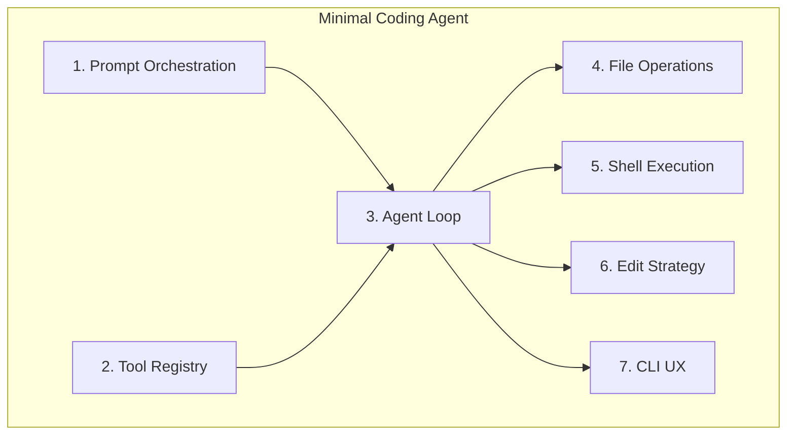
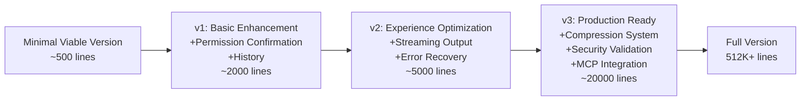

# Chapter 13: Minimal Necessary Components

> From 512K+ lines of source code to a runnable minimal coding agent -- what do you really need?

## 13.1 Why the "Minimal Necessary" Perspective

Claude Code is a production-grade system. Its 512K+ lines of code cover everything from OAuth to MCP to Vim mode. If you try to understand the essence of a coding agent by reading all the source code, you will get lost in massive amounts of edge case handling, UI optimization, and platform adaptation code. It is like trying to understand the principles of "flight" by studying the complete blueprints of a Boeing 747 -- what you need is to first understand Bernoulli's equation and the four fundamental forces.

Fred Brooks distinguished between **essential complexity** and **accidental complexity** in *The Mythical Man-Month*. For a coding agent:

- **Essential complexity**: Looping model calls, executing tools, managing context -- these 7 components are problems that any coding agent must solve
- **Accidental complexity**: MCP protocol integration, Vim mode, OSC 8 hyperlinks, OAuth authentication -- these are requirements driven by production environments and user experience

The [claude-code-from-scratch](https://github.com/Windy3f3f3f3f/claude-code-from-scratch) project is built precisely around this idea: implementing a fully functional coding agent with ~3000 lines of code and 11 source files (including advanced capabilities such as memory, skills, multi-Agent, and permission rules). The approach of this chapter is -- **starting from this minimal implementation, tracing back to the Claude Code production code component by component**, understanding what problem each layer of complexity exists to solve.

**Reading guide**:

- **12.2.1 - 12.2.3** (Prompt Orchestration, Tool Registry, Agent Loop) form the **core loop layer** -- these three components constitute the skeleton of the agent
- **12.2.4 - 12.2.6** (File Operations, Shell Execution, Edit Strategy) form the **capability layer** -- giving the agent concrete programming abilities
- **12.2.7** (CLI UX) is the **interaction layer** -- enabling humans to use this agent

## 13.2 The Seven Minimal Necessary Components



### Component 1: Prompt Orchestration

> Corresponding source code: Minimal implementation `src/prompt.ts` (65 lines) + `src/system-prompt.md` | Claude Code `src/context.ts` + `src/utils/api.ts`

#### Why Prompt Orchestration Is Needed

The system prompt is the agent's "operating manual." Without it, the model does not know it is a coding agent, does not know what tools are available, and does not even know which directory it is working in.

An effective system prompt must contain three elements:

1. **Role identity and behavioral guidelines**: Tell the model what it is and what it should do ("You are a programming assistant, read files before modifying them")
2. **Environment state**: Current working directory, operating system, git branch, recent commits -- giving the model "context awareness"
3. **Project-specific instructions**: Project rules from CLAUDE.md ("use pytest for testing", "do not modify the API interface")

There is a key point that is easy to overlook here: **the system prompt is not a static text file, but a document assembled at runtime**. Each time the agent starts, the current directory, git state, and project instructions are different, so the prompt must be dynamically generated. This is why it needs a builder function, not a constant string.

#### How the Minimal Implementation Works

The minimal implementation's `prompt.ts` is only 65 lines, but embodies the complete "runtime assembly" approach:

```typescript
// prompt.ts — System prompt constructor

export function buildSystemPrompt(): string {
  // 1. Load template file (with {{variable}} placeholders)
  const template = readFileSync(join(__dirname, "system-prompt.md"), "utf-8");

  // 2. Collect runtime environment information
  const date = new Date().toISOString().split("T")[0];
  const platform = `${os.platform()} ${os.arch()}`;
  const shell = process.env.SHELL || "unknown";
  const gitContext = getGitContext();   // git branch/status/recent commits
  const claudeMd = loadClaudeMd();      // project instructions

  // 3. Replace placeholders → generate final prompt
  return template
    .replace("{{cwd}}", process.cwd())
    .replace("{{date}}", date)
    .replace("{{platform}}", platform)
    .replace("{{shell}}", shell)
    .replace("{{git_context}}", gitContext)
    .replace("{{claude_md}}", claudeMd);
}
```

The three key sub-functions each have their own ingenuity:

**`getGitContext()`** runs three git commands to obtain the repository state:

```typescript
export function getGitContext(): string {
  try {
    const opts = { encoding: "utf-8", timeout: 3000, ... };
    const branch = execSync("git rev-parse --abbrev-ref HEAD", opts).trim();
    const log = execSync("git log --oneline -5", opts).trim();
    const status = execSync("git status --short", opts).trim();
    // ... assemble and return
  } catch {
    return "";  // Graceful degradation for non-git repositories
  }
}
```

Note the 3-second timeout -- this is not set arbitrarily. Git commands can be slow on large repositories or network-mounted file systems. The timeout prevents hanging during startup, and the `catch` returning an empty string allows non-git directories to work normally. This "graceful degradation" pattern is very important in agent development: **environment information is a nice-to-have, not a requirement.**

**`loadClaudeMd()`** traverses up the directory tree to collect project instructions:

```typescript
export function loadClaudeMd(): string {
  const parts: string[] = [];
  let dir = process.cwd();
  while (true) {
    const file = join(dir, "CLAUDE.md");
    if (existsSync(file)) {
      parts.unshift(readFileSync(file, "utf-8"));  // unshift: ancestors first
    }
    const parent = resolve(dir, "..");
    if (parent === dir) break;  // Reached root directory
    dir = parent;
  }
  return parts.length > 0
    ? "\n\n# Project Instructions (CLAUDE.md)\n" + parts.join("\n\n---\n\n")
    : "";
}
```

Why traverse upward? Because in a monorepo, the root directory may have global rules ("all code in TypeScript"), while subdirectory projects have specific rules ("this package uses Vitest for testing"). `unshift` ensures ancestor rules come first and subdirectory rules come later -- the latter can override the former, which is intuitive.

The behavioral instructions in the **`system-prompt.md`** template are equally critical. It does not just tell the model "you are a programming assistant" -- it also contains specific operational guidelines:

- "Always read a file before editing it" -- prevents blind modifications
- "Prefer editing existing files over creating new ones" -- prevents file proliferation
- "Use dedicated tools (read_file, grep_search) instead of shell commands (cat, grep)" -- guides the model to use safer, more controllable dedicated tools

The implementation cost of these instructions is zero (they are just text), but their impact on model behavior is enormous. They are essentially **programming the model's behavior using natural language**.

#### What Claude Code Does and Why

Claude Code's prompt system is far more complex than template substitution, primarily enhancing three dimensions:

**1. Cache-Aware Layered Assembly**

Claude Code does not concatenate all content into a single string. Instead, it carefully controls the arrangement order of content. Static content (role definitions, tool usage specifications) is placed at the front of the prompt, while dynamic content (git status, recently accessed files) is placed at the back. Why? Because the Anthropic API's prompt caching uses **prefix matching** -- when the front content remains unchanged, the cache hit rate is higher, which directly saves cost and latency. The minimal version does not need to worry about this, because token costs for short conversations are low; but when your agent handles thousands of queries per day, cache optimization can save 30-50% of API costs (see [Chapter 3: Context Engineering](/en/docs/03-context-engineering.md) for details).

**2. Tools Dynamically Contributing to the Prompt**

In Claude Code, each tool has a `prompt()` method that can dynamically generate usage guidelines based on the current context. For example, BashTool's prompt adjusts its suggestions based on the detected shell type (bash/zsh/fish). This means part of the system prompt is "contributed" by the tools themselves, rather than being hardcoded in some central location. This design makes tools self-describing -- when adding a new tool, its usage guidelines come along with it, without needing to modify code elsewhere.

**3. Multi-Layer CLAUDE.md Discovery**

The production version does not just traverse up the directory tree. It also searches for global instructions in the `~/.claude/` directory, handles project configuration in the `.claude/` subdirectory, and supports `CLAUDE.local.md` (local instructions not committed to git). These are all driven by real user scenarios: teams have shared rules (committed to the repo), individuals have preference settings (local files), and organizations have global standards (user directory).

### Component 2: Tool Registry

> Corresponding source code: Minimal implementation `src/tools.ts` (326 lines) | Claude Code `src/Tool.ts` + `src/tools.ts` + `src/services/tools/toolOrchestration.ts`

#### Why a Tool Registry Is Needed

Tools are the bridge connecting the agent's "thinking" to "action." An LLM without tools is just a text generator; with tools, it can truly read files, modify code, and run tests.

A tool registry needs to solve three core problems:

1. **Discovery**: The model needs to know what tools are available, what each tool can do, and what parameters it accepts
2. **Dispatch**: The system needs to find and invoke the corresponding execution function based on the tool name returned by the model
3. **Validation**: Check whether input parameters are valid before execution to avoid runtime errors

These three problems have an interesting evolutionary pattern: in the minimal implementation, tools are **data** (JSON objects + switch/case); in the production system, tools are **behavior** (class instances + methods). This evolution from "data" to "behavior" reflects a universal software maturation pattern -- when an entity needs more than 5-8 associated behaviors, it should be upgraded from a data structure to an object.

#### How the Minimal Implementation Works

The minimal version's tool system is divided into two parts: **definition** and **execution**, totaling 326 lines.

**Tool definitions** are a pure JSON Schema array, with each tool taking about 15 lines:

```typescript
export const toolDefinitions: Anthropic.Tool[] = [
  {
    name: "read_file",
    description: "Read the contents of a file. Returns the file content with line numbers.",
    input_schema: {
      type: "object",
      properties: {
        file_path: { type: "string", description: "The path to the file to read" },
      },
      required: ["file_path"],
    },
  },
  // ... write_file, edit_file, list_files, grep_search, run_shell
];
```

This design involves a deliberate trade-off: **no abstraction**. The definitions of the 6 tools are just 6 flat JSON objects -- no base class, no interface, no factory function. Why? Because at the scale of 6 tools, the cognitive overhead of introducing a class hierarchy **exceeds** the benefit it provides. Someone reading the code does not need to understand inheritance chains, generic constraints, or lifecycle hooks -- they can look directly at the JSON to know what parameters the tool accepts.

**Tool execution** is a switch/case dispatch function:

```typescript
export async function executeTool(
  name: string,
  input: Record<string, any>
): Promise<string> {
  let result: string;
  switch (name) {
    case "read_file":
      result = readFile(input as { file_path: string });
      break;
    case "write_file":
      result = writeFile(input as { file_path: string; content: string });
      break;
    // ... other tools
    default:
      return `Unknown tool: ${name}`;
  }
  return truncateResult(result);
}
```

Note the last line `truncateResult(result)` -- this is an easily overlooked but extremely important safeguard. If the model calls `read_file` to read a 10MB log file, the result would be injected directly into the message history, potentially filling up the entire context window in a single call. `truncateResult` limits results to 50,000 characters, keeping the first and last halves:

```typescript
const MAX_RESULT_CHARS = 50000;

function truncateResult(result: string): string {
  if (result.length <= MAX_RESULT_CHARS) return result;
  const keepEach = Math.floor((MAX_RESULT_CHARS - 60) / 2);
  return (
    result.slice(0, keepEach) +
    "\n\n[... truncated " + (result.length - keepEach * 2) + " chars ...]\n\n" +
    result.slice(-keepEach)
  );
}
```

Why keep both the beginning and the end rather than just the beginning? Because much information resides at the end of files (the latest logs, the end of function definitions, the bottom of error stacks). This simple truncation strategy can effectively prevent context overflow even in the minimal version.

#### What Claude Code Does and Why

Claude Code's tool system evolved from "JSON array + switch/case" to a complete generic type system:

```typescript
// Claude Code production version: Tool generic interface, 30+ methods/properties
interface Tool<Input, Output, P extends z.ZodTypeAny> {
  name: string
  description: string
  inputSchema: P              // Zod schema (runtime validation + type inference)
  prompt(): string            // Dynamic prompt (generates usage guidelines based on current context)
  validateInput(input): boolean
  execute(input, context): Promise<Output>
  renderToolUseMessage(): JSX.Element  // React component rendering
  isReadOnly(): boolean       // Whether read-only (affects concurrency strategy)
  isConcurrencySafe(): boolean // Whether it can safely run concurrently (more fine-grained judgment)
  needsPermission(): boolean  // Whether user authorization is needed
  // ... more methods
}
```

This evolution is not over-engineering, but is driven by three production requirements:

**1. Safety Classification Methods**

The three methods `isReadOnly()`, `isConcurrencySafe()`, and `needsPermission()` each serve different levels of safety judgment. `isReadOnly()` determines whether permission checks can be skipped; `isConcurrencySafe()` determines whether a tool can execute in parallel with other tools; `needsPermission()` determines whether a confirmation dialog needs to be shown. In the minimal version, all tools execute serially with uniform permission checks, so these distinctions are unnecessary. But when you have 66+ tools and want high performance, these classifications become critical.

**2. Fail-Closed Defaults**

Claude Code's `buildTool()` factory function sets conservative defaults for new tools:

```typescript
const TOOL_DEFAULTS = {
  isConcurrencySafe: false,  // Default: not concurrency-safe
  isReadOnly: false,         // Default: not read-only (requires permission check)
  // ...
}
```

This is an **ingenious design in safety engineering**: any newly added tool, if the developer forgets to declare its safety properties, will automatically be treated as "potentially dangerous, not concurrency-safe." The system defaults to safe, rather than defaulting to trust. To have a tool marked as concurrency-safe or permission-exempt, the developer must **explicitly declare** it -- this is equivalent to requiring active proof of safety, rather than assuming safety.

**3. Concurrent Tool Orchestration**

Claude Code's `partitionToolCalls()` function (`toolOrchestration.ts`) implements an elegant concurrency strategy:

```typescript
// Partition a batch of tool calls into concurrent and non-concurrent batches
function partitionToolCalls(toolUseMessages, toolUseContext): Batch[] {
  return toolUseMessages.reduce((acc, toolUse) => {
    const tool = findToolByName(toolUseContext.options.tools, toolUse.name);
    const isConcurrencySafe = tool?.isConcurrencySafe(parsedInput) ?? false;
    // Consecutive safe tools are merged into one batch for parallel execution
    if (isConcurrencySafe && acc[acc.length - 1]?.isConcurrencySafe) {
      acc[acc.length - 1].blocks.push(toolUse);
    } else {
      acc.push({ isConcurrencySafe, blocks: [toolUse] });
    }
    return acc;
  }, []);
}
```

When the model calls `GrepTool`, `GlobTool`, and `ReadFileTool` simultaneously in a single response, these three read-only tools are grouped into one batch and executed in parallel, reducing latency from 3x to 1x. But if a `FileWriteTool` is mixed in, it is separated into its own serial batch to ensure atomicity of write operations. This kind of concurrency orchestration is impossible in the minimal version, because the minimal version's tools are JSON objects -- there is nowhere to declare `isConcurrencySafe()`.

Additionally, Claude Code has a **ToolSearch lazy loading** mechanism: not all 66+ tools are placed in the system prompt (that would consume too many tokens). Instead, infrequently used tools are marked as `shouldDefer` and discovered on demand through a special ToolSearch tool. This is similar to dynamic linking in operating systems -- instead of loading all libraries into memory, they are loaded only when needed.

### Component 3: Agent Loop

> Corresponding source code: Minimal implementation `src/agent.ts`'s `chatAnthropic()` (65 lines core) | Claude Code `src/query.ts` (1,728 lines)

#### Why an Agent Loop Is Needed

This is the **heart** of a coding agent, and the fundamental difference between an agent and a chatbot.

A chatbot uses the **request-response** pattern: the user says something, the model replies, and a single API call is complete. An agent uses the **request-loop** pattern: the user says something, and the model may call 5 tools, read 10 files, modify 3 pieces of code, involving dozens of API calls -- **the model itself decides when to stop**.

This "model decides to stop" mechanism is extremely elegant: when the model's response does not contain any `tool_use` blocks, the loop naturally terminates. No special "done" signal is needed, no counter, no timeout -- the model expresses "I believe the task is complete" by "choosing not to call any tools."

The loop is also where all reliability issues concentrate: What if the context window is full? What if the API times out? What if tool execution fails? The minimal version's answer is "crash" -- which is sufficient for a prototype. The production version has prepared recovery strategies for each type of failure scenario, which is exactly why `query.ts` has 1,728 lines.

#### How the Minimal Implementation Works

The `chatAnthropic()` method is the core of the entire minimal implementation. Let us walk through it section by section:

```typescript
private async chatAnthropic(userMessage: string): Promise<void> {
  // 1. Add user message to history
  this.anthropicMessages.push({ role: "user", content: userMessage });

  while (true) {
    // 2. Check abort signal (from Ctrl+C)
    if (this.abortController?.signal.aborted) break;

    // 3. Stream call to the model
    const response = await this.callAnthropicStream();

    // 4. Track token usage (for cost display and auto-compaction decisions)
    this.totalInputTokens += response.usage.input_tokens;
    this.totalOutputTokens += response.usage.output_tokens;
    this.lastInputTokenCount = response.usage.input_tokens;

    // 5. Extract tool calls
    const toolUses: Anthropic.ToolUseBlock[] = [];
    for (const block of response.content) {
      if (block.type === "tool_use") toolUses.push(block);
    }

    // 6. Save assistant message to history
    this.anthropicMessages.push({ role: "assistant", content: response.content });

    // 7. Exit condition: no tool calls → model considers the task complete
    if (toolUses.length === 0) {
      printCost(this.totalInputTokens, this.totalOutputTokens);
      break;
    }

    // 8. Execute each tool call
    const toolResults: Anthropic.ToolResultBlockParam[] = [];
    for (const toolUse of toolUses) {
      if (this.abortController?.signal.aborted) break;
      const input = toolUse.input as Record<string, any>;
      printToolCall(toolUse.name, input);  // Display to user

      // Permission check (non-yolo mode)
      if (!this.yolo) {
        const confirmMsg = needsConfirmation(toolUse.name, input);
        if (confirmMsg && !this.confirmedPaths.has(confirmMsg)) {
          const confirmed = await this.confirmDangerous(confirmMsg);
          if (!confirmed) {
            toolResults.push({
              type: "tool_result",
              tool_use_id: toolUse.id,
              content: "User denied this action.",
            });
            continue;  // Skip execution, but feed the "denied" result back to the model
          }
          this.confirmedPaths.add(confirmMsg);  // Session-level whitelist
        }
      }

      const result = await executeTool(toolUse.name, input);
      printToolResult(toolUse.name, result);
      toolResults.push({ type: "tool_result", tool_use_id: toolUse.id, content: result });
    }

    // 9. Add tool results as a "user" message to history
    this.anthropicMessages.push({ role: "user", content: toolResults });

    // 10. Check if context compaction is needed
    await this.checkAndCompact();
  }
}
```

Several design decisions worth noting:

**User denial does not equal tool failure**: When the user denies a dangerous operation (step 8's `"User denied this action."`), the result is still fed back to the model. This lets the model know the operation was denied and it can choose an alternative (such as a safer command), rather than being confused about "why there is no result."

**Session-level permission whitelist**: `confirmedPaths` is a `Set<string>` that stores confirmed operations. If the user confirms `rm -rf dist/`, subsequent identical commands will not prompt again. This is a simple but important user experience optimization -- imagine how annoying it would be if every `rm` command required confirmation when fixing an issue that involves cleaning a build directory.

**Message role of tool results**: Tool results are added to the message history with `role: "user"`. This is not a hack -- it is a design convention of the Anthropic API. In the API's message format, conversations always alternate user -> assistant -> user -> assistant. Tool results, although not spoken by a human, occupy the "user" position in the message structure.

**Streaming calls** are wrapped in `callAnthropicStream()`:

```typescript
private async callAnthropicStream(): Promise<Anthropic.Message> {
  return withRetry(async (signal) => {
    const stream = this.anthropicClient!.messages.stream(createParams, { signal });

    let firstText = true;
    stream.on("text", (text) => {
      if (firstText) { printAssistantText("\n"); firstText = false; }
      printAssistantText(text);  // Output each text fragment in real time
    });

    const finalMessage = await stream.finalMessage();

    // Filter thinking blocks (not stored in history; they are internal state of the reasoning process)
    if (this.thinking) {
      finalMessage.content = finalMessage.content.filter(
        (block: any) => block.type !== "thinking"
      );
    }
    return finalMessage;
  }, this.abortController?.signal);
}
```

There are two clever aspects here:

1. **Streaming + final message separation**: `stream.on("text")` is used for real-time display (user experience), while `stream.finalMessage()` is used to obtain the complete response (for subsequent processing). Streaming is for humans to see; the final message is for code to use.
2. **Thinking block filtering**: Claude's extended thinking feature produces content blocks of type `thinking`. These blocks are useful for debugging, but should not be stored in message history -- they consume a large amount of context space, and sending them back to the model is pointless (the model does not need to "recall" its own thinking process).

**The retry mechanism** `withRetry()` implements exponential backoff with random jitter:

```typescript
async function withRetry<T>(fn, signal, maxRetries = 3): Promise<T> {
  for (let attempt = 0; ; attempt++) {
    try {
      return await fn(signal);
    } catch (error: any) {
      if (signal?.aborted) throw error;  // User initiated abort, do not retry
      if (attempt >= maxRetries || !isRetryable(error)) throw error;
      // Exponential backoff + random jitter (prevents "thundering herd" when multiple clients retry simultaneously)
      const delay = Math.min(1000 * Math.pow(2, attempt), 30000) + Math.random() * 1000;
      printRetry(attempt + 1, maxRetries, reason);
      await new Promise((r) => setTimeout(r, delay));
    }
  }
}
```

The retryable error codes are carefully chosen: 429 (rate limited), 503 (service unavailable), 529 (API overloaded). All three are transient errors -- waiting a moment usually resolves them. Meanwhile, 400 (malformed request) and 401 (authentication failure) are not retried -- these are permanent errors where retrying is pointless.

**Auto-compaction** `checkAndCompact()` is the key mechanism for keeping long conversations from crashing:

```typescript
private async checkAndCompact(): Promise<void> {
  // Trigger compaction when context utilization exceeds 85%
  if (this.lastInputTokenCount > this.effectiveWindow * 0.85) {
    await this.compactConversation();
  }
}
```

Why 85% and not 95%? Because compaction itself requires one API call -- sending the current history to the model and requesting a summary. This call itself consumes tokens. If you wait until 95% to compact, the compaction request might fail due to insufficient context space. 85% leaves sufficient headroom.

The compaction strategy itself is also worth analyzing:

```typescript
private async compactAnthropic(): Promise<void> {
  if (this.anthropicMessages.length < 4) return;  // Too short, no need to compact

  // Keep the last user message (the task currently being processed)
  const lastUserMsg = this.anthropicMessages[this.anthropicMessages.length - 1];

  // Request the model to summarize the previous conversation
  const summaryResp = await this.anthropicClient!.messages.create({
    model: this.model,
    max_tokens: 2048,
    system: "You are a conversation summarizer. Be concise but preserve important details.",
    messages: [...this.anthropicMessages.slice(0, -1), summaryReq],
  });

  // Replace the entire history with the summary
  this.anthropicMessages = [
    { role: "user", content: `[Previous conversation summary]\n${summaryText}` },
    { role: "assistant", content: "Understood. I have the context from our previous conversation." },
  ];
  // Restore the last user message
  if (lastUserMsg.role === "user") this.anthropicMessages.push(lastUserMsg);
}
```

This strategy has three key points: (1) it preserves the last user message, ensuring the current task is not lost; (2) it replaces the history with a synthetic user-assistant conversation pair, maintaining the alternating message format required by the Anthropic API; (3) the summarization instruction requires "preserve key decisions, file paths, and context" -- information essential for continuing the work.

#### What Claude Code Does and Why

Claude Code's `query()` is a 1,728-line async generator. It is this large not because the code is redundant, but because **every section of code corresponds to a real failure scenario discovered in production**.

**7 Continue Sites**: The loop is not a simple `while(true)`, but has 7 different "re-entry points." When different types of errors are encountered, the recovery strategies differ:

- **Prompt Too Long (PTL)**: Context exceeds limit -> compress messages first, then re-enter from the "API call" step
- **Max Output Tokens**: Model output is truncated -> increase token limit, retry from the "API call" step
- **API Overload**: Service temporarily unavailable -> retry from the "API call" step after exponential backoff
- **Tool Execution Failure**: A tool throws an error -> feed the error message back to the model (not the user), letting the model attempt to fix it

This last point -- **error withholding** -- is a particularly clever design. When a tool execution fails, the error message is not directly shown to the user but is fed back to the model as a tool result. The model can often fix the problem on its own -- for example, switching to a different file path, modifying command arguments, or trying a different approach. Only errors that the model cannot self-repair are ultimately presented to the user (see [Chapter 2: The Main Agent Loop](/en/docs/02-agent-loop.md) for details).

**Streaming Tool Parallel Execution**: In the minimal version, tools are executed one after another in serial. Claude Code uses `toolOrchestration.ts`'s `runTools()` to implement the concurrent orchestration mentioned earlier -- read-only tools execute in parallel, write operations execute serially.

**Token Budget Management**: Not only does it track used tokens, it also manages the remaining budget. `taskBudget` carries over across compression operations -- even if the conversation history is compressed, the consumed token budget is not reset. This prevents the situation of "infinite usage through constant compression" and makes cost control more precise.

### Component 4: File Operations

> Corresponding source code: Minimal implementation `src/tools.ts` `readFile`/`grepSearch`/`listFiles` | Claude Code `src/tools/FileReadTool/` + `src/tools/GrepTool/` + `src/tools/GlobTool/`

#### Why File Operations Are Needed

File operations are the "eyes" of a coding agent. An agent that cannot read code is like a programmer with closed eyes -- no matter how strong its reasoning ability, it cannot work effectively.

There are three different information retrieval needs here, each requiring a specialized tool:

| Need | Tool | Use Case |
|------|------|----------|
| "What does this file say" | `read_file` | Read the contents of a file at a known path |
| "Which files contain this keyword" | `grep_search` | Search for specific code patterns at unknown locations |
| "What TypeScript files are in the project" | `list_files` | Understand project structure and file distribution |

An often underestimated fact: in typical programming tasks, **the model's read operations far outnumber write operations**. Fixing a bug may require reading 5-15 files (understanding context, tracing call chains, checking tests), but only modifying 1-3 files. This means the efficiency of file reading and context efficiency directly determine the agent's overall performance.

#### How the Minimal Implementation Works

**`readFile`** is only 12 lines of implementation, but contains a key design:

```typescript
function readFile(input: { file_path: string }): string {
  const content = readFileSync(input.file_path, "utf-8");
  const lines = content.split("\n");
  const numbered = lines
    .map((line, i) => `${String(i + 1).padStart(4)} | ${line}`)
    .join("\n");
  return numbered;
}
```

Why add line numbers? Not for aesthetics, but to provide positioning reference for the subsequent `edit_file` tool. When the model sees `  42 | function processData(input) {`, it can more accurately construct the `old_string` parameter to locate the code segment to edit. Line numbers are an implicit collaboration mechanism between the read and edit tools.

**`grepSearch`** wraps system grep:

```typescript
function grepSearch(input: { pattern: string; path?: string; include?: string }): string {
  const args = ["--line-number", "--color=never", "-r"];
  if (input.include) args.push(`--include=${input.include}`);
  args.push(input.pattern);
  args.push(input.path || ".");
  const result = execSync(`grep ${args.join(" ")}`, { ... });
  const lines = result.split("\n").filter(Boolean);
  return lines.slice(0, 100).join("\n") +
    (lines.length > 100 ? `\n... and ${lines.length - 100} more matches` : "");
}
```

The 100-line result cap is not an arbitrary choice. grep can return tens of thousands of matching lines in large projects. If all were returned, a single search would consume a large amount of the context window. 100 lines are enough for the model to judge whether it found the needed information; if not, it can narrow the search scope and search again.

**`listFiles`** uses glob pattern matching:

```typescript
async function listFiles(input: { pattern: string; path?: string }): Promise<string> {
  const files = await glob(input.pattern, {
    cwd: input.path || process.cwd(),
    nodir: true,
    ignore: ["node_modules/**", ".git/**"],  // Ignore the largest noise sources
  });
  return files.slice(0, 200).join("\n") + ...;
}
```

`ignore: ["node_modules/**", ".git/**"]` is an optimization based on practical experience. In a typical Node.js project, `node_modules` may contain tens of thousands of files; `.git` contains a large number of binary objects. These two directories are almost never the targets users want to search. Ignoring them by default saves time and reduces noise.

#### What Claude Code Does and Why

**FileReadTool Multi-Format Support**: The production version doesn't just read text files; it also supports images (base64-encoded and sent to the model as multimodal content), PDFs (extracting text from specified pages), and Jupyter Notebooks (parsing the JSON structure to display cell contents). Why is image support needed? Because when debugging UI issues, "taking a glance at a screenshot" is the most natural action. The model is multimodal -- restricting it to only process text is an artificial waste.

**GrepTool Based on ripgrep**: ripgrep is 10-100x faster than system grep (the difference is more pronounced on large codebases), respects `.gitignore` by default (automatically excluding build artifacts and dependencies), and supports richer regex syntax. For a coding agent that needs to search frequently, this performance difference directly impacts user experience.

**Large Result Persistence**: When tool results exceed the inline size limit, Claude Code writes the complete results to a temporary file and keeps only a reference in the message history. This way, the context window won't be filled up by a single large result, but the model can still access the complete data by reading the temporary file. This is a strategy of trading filesystem for context space.

### Component 5: Shell Execution

> Corresponding source code: Minimal implementation `src/tools.ts` `runShell` + `DANGEROUS_PATTERNS` | Claude Code `src/tools/BashTool/`

#### Why Shell Execution Is Needed

Shell execution upgrades the agent from "can only read and write files" to "can do everything a programmer can do" -- running tests, installing dependencies, using git, compiling code, starting services. This is the most powerful capability of a coding agent.

But it is also the most dangerous. A program that can execute arbitrary shell commands essentially has all of the user's permissions. `rm -rf ~` can delete all of a user's files; `curl ... | bash` can execute arbitrary remote code. This creates a fundamental tension: **the need to maximize capability directly conflicts with the need to minimize risk**.

Every agent designer must find a balance point in this tension. The minimal version chose a simple but effective approach: regex blocklist + user confirmation.

#### How the Minimal Implementation Works

**The executor** itself is simple -- wrapping `execSync`:

```typescript
function runShell(input: { command: string; timeout?: number }): string {
  try {
    const result = execSync(input.command, {
      encoding: "utf-8",
      maxBuffer: 5 * 1024 * 1024,  // 5MB output cap
      timeout: input.timeout || 30000,  // 30-second timeout
      stdio: ["pipe", "pipe", "pipe"],  // Capture stdin/stdout/stderr
    });
    return result || "(no output)";
  } catch (e: any) {
    // When a command fails, return exit code + stdout + stderr (both are useful)
    const stderr = e.stderr ? `\nStderr: ${e.stderr}` : "";
    const stdout = e.stdout ? `\nStdout: ${e.stdout}` : "";
    return `Command failed (exit code ${e.status})${stdout}${stderr}`;
  }
}
```

The 5MB output cap prevents memory overflow (e.g., `cat` on a huge log file). The 30-second timeout prevents commands from hanging (e.g., commands waiting for network connections). `stdio: ["pipe", "pipe", "pipe"]` ensures both stdout and stderr are captured -- many useful error messages are in stderr.

**Dangerous command detection** is a regex blocklist:

```typescript
const DANGEROUS_PATTERNS = [
  /\brm\s/,           // rm command
  /\bgit\s+(push|reset|clean|checkout\s+\.)/, // Destructive git operations
  /\bsudo\b/,         // Privilege escalation
  /\bmkfs\b/,         // Format disk
  /\bdd\s/,           // Low-level disk operations
  />\s*\/dev\//,      // Write to device files
  /\bkill\b/,         // Terminate process
  /\bpkill\b/,        // Terminate process by name
  /\breboot\b/,       // Reboot
  /\bshutdown\b/,     // Shutdown
];
```

These 10 patterns cover the most common dangerous operations. Note the use of `\b` word boundaries -- `/\brm\s/` matches `rm -rf` but not `perform`. However, this regex approach has obvious limitations: `r''m -rf /` (quotes breaking the word), `$(rm -rf /)` (command substitution), `echo rm | bash` (indirect execution) can all bypass the detection. This is acceptable in the minimal version -- the user confirmation mechanism serves as the second line of defense, and the minimal version's user base is typically developers themselves.

**The unified permission check function** `needsConfirmation()` handles different types of dangerous operations uniformly:

```typescript
export function needsConfirmation(toolName: string, input: Record<string, any>): string | null {
  if (toolName === "run_shell" && isDangerous(input.command)) return input.command;
  if (toolName === "write_file" && !existsSync(input.file_path)) return `write new file: ${input.file_path}`;
  if (toolName === "edit_file" && !existsSync(input.file_path)) return `edit non-existent file: ${input.file_path}`;
  return null;
}
```

Returning `null` means safe; returning a string (confirmation message) means user confirmation is needed. This design centralizes permission logic in one place rather than scattering it across each tool's execution code.

#### What Claude Code Does and Why

Claude Code's shell security system is one of the most complex parts of the entire project, because it faces an **open-ended attack surface** -- shell syntax is nearly infinitely flexible.

**Bash AST Analysis**: Claude Code uses a tree-sitter parser to parse commands into an abstract syntax tree, then performs security checks on the AST. Why is AST far more powerful than regex? Consider this command:

```bash
echo "hello" && $(rm -rf /)
```

The regex `/\brm\s/` can match this. But what about this?

```bash
eval "$(echo cm0gLXJmIC8= | base64 -d)"
```

This is base64-encoded `rm -rf /`, completely undetectable by regex. AST analysis can identify the pattern of `eval` + command substitution and flag it as potentially dangerous (see [Chapter 11: Permissions and Security](/en/docs/11-permission-security.md) for details).

**Command Classification**: Claude Code categorizes commands into six classes: search/read/list/neutral/write/destructive. Read-only categories (search, read, list) can execute without permission. This dramatically reduces the frequency of permission confirmation dialogs -- in a typical programming task, commands like `grep`, `find`, `ls`, `git log` account for over 60% of total invocations. If confirmation were required every time, the user experience would be terrible (this is the "permission fatigue" problem).

**Zsh-Specific Defenses**: Zsh has some dangerous features that bash doesn't -- `zmodload` can load kernel modules, `emulate -c` can change shell behavior, `sysopen/syswrite` can bypass normal file operations. Claude Code's security checks contain 60+ lines of Zsh-specific patterns. These patterns are not imagined from thin air -- each one comes from a real bypass path discovered during security testing.

**Sandbox Mode**: At the highest security level, Claude Code uses platform-specific sandboxing technologies (macOS Seatbelt, Linux namespaces) to restrict a command's filesystem and network access. Even if a command's content passes all static checks, the sandbox as the last line of defense ensures it cannot access resources it shouldn't.

### Component 6: Edit Strategy

> Corresponding source code: Minimal implementation `src/tools.ts` `editFile`/`writeFile` | Claude Code `src/tools/FileEditTool/` + `src/tools/FileWriteTool/`

#### Why an Edit Strategy Is Needed

File editing is the agent's most consequential operation -- a single wrong edit can break builds, introduce bugs, or even cause data loss. The choice of edit strategy directly determines the agent's usability and reliability.

Three common editing approaches each have their pros and cons:

| Approach | Pros | Fatal Flaw |
|----------|------|------------|
| **Full file rewrite** | Simplest to implement | Large files consume many tokens; the model may "forget" unmodified parts |
| **Line number editing** | Precise positioning | Line number offset during multi-step edits: after modifying line 10, what was originally line 20 becomes line 21 |
| **search-and-replace** | Content-based positioning, unaffected by line number changes | Requires uniqueness constraint |

Claude Code chose **search-and-replace**, a deliberate decision. The core reason is: **the model "thinks" in units of text content, not coordinate positions**. Having the model specify "change this code to that code" is more natural and more reliable than having it specify "modify lines 42 through 45." When the model sees code and decides to modify it, it directly forms a "old code -> new code" mapping in its mind -- search-and-replace directly corresponds to this mental model.

#### How the Minimal Implementation Works

`editFile` is only 18 lines, but implements complete search-and-replace logic:

```typescript
function editFile(input: { file_path: string; old_string: string; new_string: string }): string {
  try {
    const content = readFileSync(input.file_path, "utf-8");

    // Core: uniqueness check
    const count = content.split(input.old_string).length - 1;
    if (count === 0) return `Error: old_string not found in ${input.file_path}`;
    if (count > 1) return `Error: old_string found ${count} times. Must be unique.`;

    // Unique match -> safe replacement
    const newContent = content.replace(input.old_string, input.new_string);
    writeFileSync(input.file_path, newContent);
    return `Successfully edited ${input.file_path}`;
  } catch (e: any) {
    return `Error editing file: ${e.message}`;
  }
}
```

**The uniqueness constraint** is the most important design decision of this tool:

- `count === 0` (not found): The model's `old_string` doesn't match the file's actual content. The model may have "hallucinated" non-existent code, or the file may have been modified since it was read. In either case, refusing the edit is correct.
- `count > 1` (multiple matches): The `old_string` is not specific enough to determine which occurrence to modify. For example, `old_string: "return null"` might appear 5 times in a file. Enforcing uniqueness forces the model to provide more context (such as including the function signature and surrounding lines of code), which actually improves editing precision.
- `count === 1`: Unique match, safe replacement.

The `content.split(old_string).length - 1` counting approach is better than regex search because it doesn't require escaping special characters. With regex, `(`, `)`, `*`, `.` and other characters in `old_string` would all need escaping, otherwise matching errors would occur. `split` uses literal string matching, completely avoiding this problem.

**`writeFile`** is used for creating new files (full file write):

```typescript
function writeFile(input: { file_path: string; content: string }): string {
  const dir = dirname(input.file_path);
  if (!existsSync(dir)) mkdirSync(dir, { recursive: true });  // Auto-create directories
  writeFileSync(input.file_path, input.content);
  return `Successfully wrote to ${input.file_path}`;
}
```

`mkdirSync(dir, { recursive: true })` automatically creates the missing directory chain -- this small detail avoids the common "directory does not exist" error.

Note the division of labor between these two tools: `edit_file` is for modifying existing files, `write_file` is for creating new files. The system prompt explicitly instructs the model to "Use edit_file instead of write_file for existing files." This behavioral instruction and the uniqueness constraint together ensure the model won't use full file rewrite to "modify" files -- doing so would lose information, consume more tokens, and be more error-prone.

#### What Claude Code Does and Why

**`replace_all` Option**: When you need to rename a variable from `oldName` to `newName`, it might appear 20 times in a file. The uniqueness constraint becomes a hindrance in this scenario. `replace_all: true` relaxes the uniqueness requirement, allowing batch replacement. This is a design of "strict constraints most of the time, with an escape hatch for special cases."

**`readFileState` Integration**: Claude Code maintains a file read state cache. When the model calls `edit_file`, the system checks whether this file has been read before and whether it has been modified since reading. If the model tries to edit a file it has never read (blind editing), the system refuses. If the file has been externally modified since it was read, the system warns. These two checks greatly reduce editing errors and are one of the most worthwhile enhancements to add when going from the minimal version to the production version.

**Diff Generation and Colorized Display**: After each edit, Claude Code generates and displays a colorized diff (deleted lines in red, added lines in green). This doesn't change functionality but greatly improves user trust -- users can intuitively see "what the agent changed" without needing to compare files themselves. Transparency is a key factor in building user trust in agents (see [Chapter 5: Code Editing Strategy](/en/docs/05-code-editing-strategy.md) for details).

### Component 7: CLI UX (Command-Line Interaction)

> Corresponding source code: Minimal implementation `src/cli.ts` (240 lines) + `src/ui.ts` (102 lines) + `src/session.ts` (64 lines) | Claude Code `src/screens/REPL.tsx` + `src/ink/`

#### Why a CLI Interaction Layer Is Needed

The CLI is the user's only window for observing and controlling the agent. No matter how strong the agent's underlying capabilities are, if users cannot understand what it's doing, cannot interrupt it when needed, and cannot know how much it costs, the agent is unusable.

Agent CLIs have a fundamental difference from traditional CLIs: **traditional CLI output is predictable** (`ls` always lists files), **agent CLI output is non-deterministic and potentially infinite**. After a user inputs "fix this bug," the agent might read 3 files and be done, or it might enter a lengthy debugging loop, reading 30 files, running 10 tests, and modifying 5 pieces of code. This uncertainty requires the CLI to provide three capabilities:

1. **Real-time visibility**: Users must be able to see what the agent is currently doing (streaming output, tool call indicators)
2. **Interruptibility**: Users must be able to interrupt the agent when it "goes off track" (Ctrl+C)
3. **Cost awareness**: Users must know how many tokens / how much money this operation cost

#### How the Minimal Implementation Works

**The REPL loop** (`cli.ts`) provides a dual-mode design:

```typescript
async function main() {
  // ... argument parsing and Agent initialization

  if (prompt) {
    // One-shot mode: execute command then exit
    await agent.chat(prompt);
  } else {
    // Interactive REPL mode
    await runRepl(agent);
  }
}
```

One-shot mode (`mini-claude "fix the bug in app.ts"`) is suitable for script integration and quick tasks; REPL mode (`mini-claude`) is suitable for exploratory work and multi-turn conversations. Both modes share the same Agent instance; the only difference is the input source.

**Ctrl+C handling** is one of the most subtle interaction designs in agent CLIs:

```typescript
let sigintCount = 0;
process.on("SIGINT", () => {
  if (agent.isProcessing) {
    // Agent is working: abort current operation
    agent.abort();
    console.log("\n  (interrupted)");
    sigintCount = 0;
    printUserPrompt();  // Return to input prompt
  } else {
    // Agent is idle: prepare to exit
    sigintCount++;
    if (sigintCount >= 2) {
      console.log("\nBye!\n");
      process.exit(0);
    }
    console.log("\n  Press Ctrl+C again to exit.");
    printUserPrompt();
  }
});
```

Two-layer design:
- **Ctrl+C while agent is working**: Aborts the current operation (via AbortController), but does not exit the program. Users can review the completed portion or give new instructions. This is much better than exiting directly -- the agent may have already completed 80% of the work, and the user doesn't want to lose it all.
- **Ctrl+C twice while agent is idle**: Exits the program. A single Ctrl+C shows a prompt message to prevent accidental exits. This follows the conventions of the Node.js REPL and Python interactive environment.

**REPL Commands** provide three basic session management capabilities:

```typescript
if (input === "/clear") {
  agent.clearHistory();   // Clear conversation history, start from scratch
  askQuestion(); return;
}
if (input === "/cost") {
  agent.showCost();       // Display token usage and cost estimate
  askQuestion(); return;
}
if (input === "/compact") {
  await agent.compact();  // Manually trigger conversation compression
  askQuestion(); return;
}
```

`/clear` is for "switching topics" -- the current conversation's context is no longer relevant. `/cost` fulfills the cost awareness need -- developers need to know how much this debugging session cost. `/compact` lets users proactively trigger compression when they feel "the conversation is too long and the model is starting to get confused," without having to wait for the 85% threshold.

**Terminal UI** (`ui.ts`) is only 102 lines but carefully crafted:

```typescript
export function printToolCall(name: string, input: Record<string, any>) {
  const icon = getToolIcon(name);      // 📖 read_file, 🔧 edit_file, 💻 run_shell
  const summary = getToolSummary(name, input);  // File path or command summary
  console.log(chalk.yellow(`\n  ${icon} ${name}`) + chalk.gray(` ${summary}`));
}

export function printToolResult(name: string, result: string) {
  const maxLen = 500;
  const truncated = result.length > maxLen
    ? result.slice(0, maxLen) + chalk.gray(`\n  ... (${result.length} chars total)`)
    : result;
  // ...
}
```

Tool calls are displayed in yellow with icons, letting users instantly see "this is a tool operation, not the model's text output." Results are truncated to 500 characters **for display** (the complete result remains in context; the model can see all of it). This "show the human a brief version, show the model the complete version" dual-track design is already present in the minimal version.

**Session Persistence** (`session.ts`) implements basic "resume after closing" capability in 64 lines:

```typescript
const SESSION_DIR = join(homedir(), ".mini-claude", "sessions");

export function saveSession(id: string, data: SessionData): void {
  ensureDir();
  writeFileSync(join(SESSION_DIR, `${id}.json`), JSON.stringify(data, null, 2));
}

export function getLatestSessionId(): string | null {
  const sessions = listSessions();
  sessions.sort((a, b) => new Date(b.startTime).getTime() - new Date(a.startTime).getTime());
  return sessions[0]?.id || null;
}
```

The `--resume` flag loads the most recent session, restoring the complete message history. This means users can close the terminal to go have lunch and continue their previous work when they return. The implementation is just simple JSON serialization/deserialization, but it solves a real user pain point.

#### What Claude Code Does and Why

**React + Ink Terminal Renderer**: Claude Code uses React components to build the terminal UI. This looks like over-engineering, but there's a reasonable justification: agent UI is inherently **highly stateful**. At any given moment there may be: streaming text being output, tool call progress being updated, a permission confirmation dialog waiting for response, and a status bar displaying token counts. Managing these concurrent UI updates with `console.log` would turn into spaghetti code. React's declarative model -- "given these states, the UI should look like this" -- makes complex UI state management maintainable.

**Virtual Scrolling**: Long agent sessions can produce tens of thousands of lines of output. If all of it were rendered to the terminal buffer, it would cause memory bloat and terminal lag. Virtual scrolling only renders the content in the visible area, keeping sessions of any length smooth.

**OSC 8 Hyperlinks**: File paths in the output (like `src/utils/helper.ts:42`) are rendered as terminal hyperlinks. In supported terminals (iTerm2, VSCode terminal, etc.), clicking jumps directly to the corresponding file and line number. This small feature has low implementation cost (a few dozen lines of code) but greatly improves the daily workflow -- users don't need to copy paths and manually open files.

## 13.3 From Minimal to Production: Progressive Enhancement Roadmap



### Phase 1: Minimal Viable (~500 lines)

```
User Input -> System Prompt + Messages -> API Call -> Tool Execution -> Loop
```

Tools: `read_file`, `write_file`, `run_shell` -- just these three form a complete read-execute-write loop.

**Why start with these three tools?** Because they cover the agent's basic operation cycle: use `read_file` to understand the current state, use `run_shell` to execute commands (tests, compilation, git), use `write_file` to create or modify files. `edit_file` (search-and-replace), `grep_search`, `list_files` are all "better ways" to do what `read_file` + `run_shell` can already do.

**Implementation Tip**: Start with Anthropic SDK's `messages.create()` (non-streaming) rather than `messages.stream()`. Non-streaming is simpler, returns a complete response object, and doesn't require handling event streams. Once the basic loop works, upgrade to streaming.

**The biggest risk at this phase**: Context window overflow. Without `truncateResult`, a single `run_shell("cat huge_file.log")` can fill up the entire window. Even in the minimal version, it's recommended to add result truncation -- these 15 lines of code can save a lot of debugging time.

### Phase 2: Basic Enhancement (~2000 lines)

**Add Permission Confirmation**: 10 regex patterns + a confirmation dialog. Simple to implement but remarkably effective -- this is the key step to turn the agent from "your own toy" to "something you dare give to others." No need for anything as complex as AST analysis; a regex blocklist + user confirmation already covers 95% of dangerous scenarios.

**Add `edit_file` Tool**: This is the highest-value feature of Phase 2. With search-and-replace, the agent upgrades from "can only create files" to "can precisely modify existing code." The implementation is only 18 lines (uniqueness counting + replacement), but its impact on agent capability is a qualitative change.

**Add `grep_search` + `list_files`**: Enables the agent to navigate unfamiliar codebases. Without these two tools, the agent can only operate on files whose paths it already knows. With search capability, it can autonomously explore project structure.

**Add Conversation History Persistence**: JSON file + `--resume` flag. 64 lines of code solve the problem of "losing work after closing the terminal."

### Phase 3: Experience Optimization (~5000 lines)

**Add Streaming Output**: Upgrade from `messages.create()` to `messages.stream()`. This is a medium-scale refactor but brings a huge experience improvement -- users no longer stare at a blank screen waiting, but see text appearing character by character. In scenarios where the agent thinks for 10-30 seconds (common), streaming output is the difference between "feels 10x faster" and "I think it's frozen."

**Add Auto-Compression**: When context reaches 85%, automatically summarize and compress the conversation history. This is key to supporting long sessions -- without compression, 20-30 rounds of complex tool calls will hit the context limit. Implementation is about 50 lines (summary request + history replacement), but there's a tricky detail: the summary request itself consumes tokens, so the trigger threshold can't be too late.

**Add Error Retry**: Exponential backoff + retryable error code identification. API 429 (rate limiting) is common during heavy use; automatic retry frees users from having to manually handle transient errors.

**Add Token Tracking and Cost Display**: Cumulative input/output token counting, multiplied by unit price to display cost. Helps users build cost awareness and paves the way for subsequent budget management features.

### Phase 4: Production Ready (~20000 lines)

**Multi-Level Compression Pipeline**: Phase 3's "full summary" is the most brute-force compression approach. The production version has 4 levels of progressive compression strategy -- first truncate oversized tool results, then trim early messages, then micro-compress cache annotations, and only then summarize. Each level preserves as much information as possible, only escalating to a more aggressive strategy when necessary (see [Chapter 3: Context Engineering](/en/docs/03-context-engineering.md) for details).

**Bash AST Security Analysis**: tree-sitter parsing + 23 static checks. This is a qualitative leap from regex blocklist to structured analysis. Each check rule corresponds to a bypass method discovered during security testing.

**MCP Protocol Integration**: Through Model Context Protocol, supports external tool extensions (database queries, sending Slack messages, Jira operations, etc.). This extends the agent's capability boundary from "local file operations" to "any external service."

**Multi-Agent** (AgentTool): Decomposes complex tasks for sub-agents to execute in parallel. The main agent is responsible for planning and coordination; sub-agents are responsible for concrete execution. This is the key architecture for handling large project-level tasks (see [Chapter 7: Multi-Agent Architecture](/en/docs/07-multi-agent.md) for details).

**Prompt Caching Optimization**: Carefully arranges the content order of system prompts to maximize API prefix cache hit rates. In high-frequency use scenarios, this can save 30-50% of API costs.

## 13.4 The claude-code-from-scratch Project

The [claude-code-from-scratch](https://github.com/Windy3f3f3f3f/claude-code-from-scratch) project provides a runnable minimal implementation (~3000 lines of core code) to help you:

1. **Understand core mechanisms**: Without being overwhelmed by 512K lines of code, focus on the 11 essential components
2. **Hands-on experimentation**: Modify loop logic, add new tools, adjust system prompts
3. **Learn design decisions**: Understand why each component exists and why it's implemented this way
4. **Progressive building**: Gradually add features from the minimal version, experiencing the value of each layer of complexity

The project also provides **dual backend support** (Anthropic native + OpenAI-compatible API), meaning you can use it to connect to virtually any LLM backend. Switch to any OpenAI-compatible endpoint via the `--api-base` parameter.

**Customization Advice**: If you want to build your own agent based on this minimal implementation, **the system prompt template** (`src/system-prompt.md`) is the highest-leverage customization point. Modifying behavioral instructions, adding domain-specific knowledge, adjusting tool usage preferences -- these zero-cost text modifications can significantly change the agent's behavior.

For detailed step-by-step tutorials, please refer to the [claude-code-from-scratch documentation](https://github.com/Windy3f3f3f3f/claude-code-from-scratch).

## 13.5 Key Differences Between Minimal and Production Versions

| Dimension | Minimal Version | Claude Code Production Version |
|-----------|----------------|-------------------------------|
| Context Management | 85% threshold full summary | 4-level progressive compression pipeline |
| Security | 10 regexes + user confirmation | 7-layer validation + 23 AST checks + sandbox |
| Concurrency | Serial execution | Read-only tools parallel + write operations serial |
| Error Handling | Direct error reporting | Error withholding -> model self-repair -> show only on persistent failure |
| Tool Results | 50K character truncation | Large results persisted to disk + reference replacement |
| Streaming | Text streaming output | Text + tool arguments streamed simultaneously, supports streaming tool execution |
| UI | chalk colorized console.log | React + Ink terminal renderer |
| Extensibility | 6 hardcoded tools | MCP + plugins + skills + ToolSearch lazy loading |
| Multi-Agent | None | AgentTool + coordinator + Swarm |
| Caching | None | Multi-layer prompt caching + prefix hit rate optimization |
| Memory System | None | MEMORY.md + semantic recall |
| Prompts | Template substitution (6 variables) | Multi-layer dynamic assembly + tool contributions + cache-aware ordering |
| Model Backend | Anthropic + OpenAI compatible | Anthropic + OpenAI compatible + Bedrock + Vertex |
| Session Management | JSON file persistence | JSONL transcripts + snapshot recovery |
| Token Tracking | Simple counting | Budget management + cost display + carry-over across compressions |

## 13.6 Core Insights

The biggest misconception in building a coding agent is thinking "writing a good prompt is enough." In reality:

1. **The loop is the core**: The agent's value lies not in a single call, but in the continuous tool loop. The minimal version's `while (true)` loop is only 15 lines, but it is the heart of the entire system. The evolution from 15 lines to 1,728 lines is not code bloat, but defense against every type of real failure scenario -- each piece of added code corresponds to "a problem discovered in production that caused the agent to freeze or crash."

2. **Edit strategy determines usability**: Choosing search-and-replace over line number editing is not a matter of implementation complexity, but an adaptation to the model's cognitive style. The model "thinks" in units of text content; having it specify "what to change" is more reliable than specifying "where to change." The uniqueness constraint further ensures safety -- better to refuse an edit than to change the wrong place.

3. **Context management determines the ceiling**: An agent without a compression system has its conversation length limited to a hard cap of ~200K tokens (roughly 20-30 rounds of complex tool calls). Production-grade compression can let conversations extend indefinitely. This is the dividing line between "a toy that can handle simple tasks" and "a tool that can handle complex projects."

4. **Security is not optional**: When executing code in the user's environment, security is a prerequisite. Even the minimal version should not omit basic dangerous command confirmation -- 10 regexes + user confirmation requires only 30 lines of code but can prevent catastrophic misoperations. The evolution from regex to AST analysis is not "better engineering" but defense against smarter attack vectors.

5. **Experience is a multiplier effect**: With the same model capabilities, streaming output makes the wait disappear, colorized terminal makes information hierarchy clear, and progress indicators give users peace of mind. These don't change the agent's actual capabilities but change users' trust and willingness to use it. An agent that users don't trust will never be used, no matter how powerful.

6. **Evolution from data to behavior**: The minimal version's tools are JSON objects (data); the production version's tools are class instances (behavior). This is not over-engineering but a natural software maturation process -- when an entity has more than 5-8 associated behaviors (validation, permissions, concurrency declarations, UI rendering, dynamic prompts...), it naturally evolves from a data structure into an object. Recognizing this "evolution timing" is one of the key judgments in software design.

7. **System prompts are underestimated**: The behavioral instructions in the minimal implementation's 74-line `system-prompt.md` -- "read before edit," "prefer editing over creating," "use dedicated tools over shell" -- influence agent behavior no less than hundreds of lines of code. The implementation cost of these instructions is zero (they're just text), but they are "programming" the model's decision logic in natural language. Before you write a single line of code, get the system prompt right -- this may be the highest-ROI work.

---

> **Hands-on Practice**: [claude-code-from-scratch](https://github.com/Windy3f3f3f3f/claude-code-from-scratch) is the complete implementation of this chapter's "minimal necessary components" philosophy -- ~3,000 lines of TypeScript, covering the Agent loop, tools, system prompts, streaming output, memory, skills, multi-Agent, and permission rules. Run with `npm run build && npm start`.
