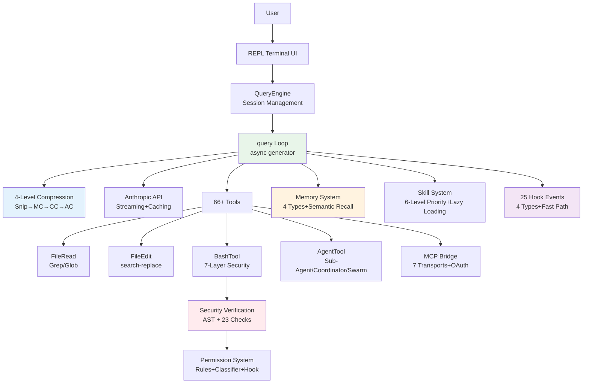

# Understand Claude Code in 10 Minutes

> This article is a condensed version of the Claude Code source code analysis. Each topic includes links for further reading.

Whether you want to understand the internal mechanisms of Claude Code, or draw on its design philosophy to build your own coding agent, this article will help you quickly establish a holistic understanding. We won't dive into every line of code, but instead focus on **key design decisions** — the engineering choices that make Claude Code go from "it works" to "it works well."

## What is Claude Code

Claude Code is Anthropic's CLI programming Agent. It's not a code completion tool, but rather a **controlled tool-loop Agent** — an autonomous programming assistant that can understand codebases, edit files, execute commands, and manage git.

You might ask: why does a CLI tool need 512K+ lines of code? This is exactly what makes it interesting. Claude Code doesn't solve the simple problem of "how to call a large model API," but rather a series of engineering challenges:

- **How to let an Agent autonomously complete complex tasks?** → Agent Loop's multi-turn decision-making and error recovery
- **How to work efficiently within a limited context window?** → 4-level progressive context compression
- **How to let AI safely execute Shell commands?** → 7-layer defense in depth + AST-level command analysis
- **How to let an Agent learn across sessions?** → Memory system + Skill system
- **How to handle tasks beyond a single Agent's capability?** → 3 multi-Agent collaboration patterns

The answers to these questions form a complete **Agent engineering methodology** — which is exactly what this documentation series aims to help you understand.

> Further reading: [Overview](/en/docs/01-overview.md)

---

## Core: Agent Loop

The Agent Loop is the soul of Claude Code — understanding it means understanding the core pattern of all coding agents.

It is essentially a `while(true)` loop:

```
User input → Assemble context → Call model → Model decision
  ↓
  Has tool calls? → Execute tool → Inject results → Continue loop
  ↓
  No tool calls? → Return text response → End
```

This flow looks simple, but the devil is in the details. Imagine asking Claude Code to "refactor all function names in this file to snake_case" — the model would first read the file (tool call), analyze the current naming (text reasoning), then edit function names one by one (multiple tool calls), checking for any missed ones after each edit (continue loop), until it confirms everything is done before returning the result. The entire process might loop a dozen times, but for the user it's just a single instruction.

### Dual-Layer Architecture

Implemented as an `async function*` async generator, using a dual-layer design:

- **QueryEngine** (outer layer): Manages the conversation lifecycle — persistence, budget checking, user interruption. It cares about "should this conversation continue"
- **query()** (inner layer): Manages a single loop iteration — API streaming, tool execution, error recovery. It cares about "how to complete this round"

Why two layers? Because session management and query execution have completely different concerns. The session layer needs to handle user interruptions, Token budget exhaustion, conversation persistence and other lifecycle issues; while the query layer only needs to focus on the tight loop of "call API → parse response → execute tool → assemble results." Layering keeps the logic at each level clear.

### Automatic Error Recovery

query() has **7 Continue Sites**, each corresponding to a different fault recovery path — this is why you rarely encounter errors when using Claude Code:

- Model output truncated? → Automatically retry with a higher Token limit
- Context nearly full? → Trigger compression and continue
- API returns an error? → Retry with backoff strategy

The core design principle is **error withholding** — recoverable errors are not exposed to the caller; they are automatically fixed before continuing. An Agent should be like a reliable colleague who solves minor problems on their own, rather than coming to ask you every time.

### Streaming Parallel Execution

- **Tool pre-execution** — While the model is still generating output, tool calls that have already been fully parsed begin executing immediately, hiding roughly 1 second of tool latency within the model's 5-30 second generation window. The user perceives tools as "completing instantly"
- **StreamingToolExecutor** — Parses streaming output and executes concurrently; read-only tools are automatically parallelized. When the model calls multiple read-only tools simultaneously (such as reading three files at once), they execute concurrently rather than waiting in a queue

> Further reading: [System Main Loop](/en/docs/02-agent-loop.md)

---

## Context Engineering

If the Agent Loop is the skeleton of Claude Code, then context engineering is its lifeblood. A large model's capability depends entirely on what it "sees" — the same model, given carefully organized context versus haphazardly assembled context, can perform dramatically differently.

### Three-Layer Context Structure

The context for each API call consists of three parts:

1. **System prompt** (most stable, highest cache efficiency): Agent identity, behavioral guidelines, tool descriptions
2. **System/User context** (session-level stable): Git status, CLAUDE.md project instructions, current date
3. **Message history** (most volatile): Conversation records, tool call results

### 4-Level Compression Pipeline

The context window is finite. A complex programming task might require dozens of conversation rounds, each producing new messages, tool call results, file contents — the context fills up quickly. Claude Code's solution is a compression pipeline that activates progressively from lightweight to aggressive:

```
Snip → Microcompact → Context Collapse → Autocompact
```

- **Snip**: Replaces large tool outputs with placeholders — the lightest approach, with almost no information loss
- **Microcompact**: Applies local compression to tool results — preserves key information, removes redundancy
- **Context Collapse**: Collapses entire conversation segments into summaries — significantly frees up space
- **Autocompact**: Last resort, triggered when Token usage reaches approximately 87%, forks a sub-Agent to generate structured summaries

Each level "loses" more detail than the previous one, but also frees more space — the system always tries to solve the problem with the lightest approach possible.

### Post-Compression Recovery

Compression isn't just about deleting information — it also actively recovers critical context. Imagine you ask Claude Code to edit five files, and the context gets compressed while editing the third one, deleting the contents of previously read files. Without any handling, the model might forget the modification details of the first two files. So the system will:

- Automatically re-read the **5 most recently edited files** (each ≤5K tokens)
- Reactivate active skill contexts (≤25K tokens)
- Reset Context Collapse markers

### Prompt Caching

Every API call sends the full context, but most of the content is unchanged between adjacent calls. By marking cache breakpoints, the API server can reuse previously processed prefixes, significantly reducing latency and cost. The system can also automatically detect cache breakage (sudden increases in cache miss rate), attributing it to CLAUDE.md changes, conversation compression, or oversized tool results.

> Further reading: [Context Engineering](/en/docs/03-context-engineering.md)

---

## Tool System

Tools are the means by which an Agent interacts with the real world. Without tools, a large model can only generate text; with tools, it can truly read files, write code, and run tests.

### Unified Tool Interface

Claude Code includes **66+ built-in tools**, all unified under the `Tool` interface. The core design is **fail-closed defaults** — if a new tool doesn't explicitly declare safety properties, it is treated as unsafe by default. This means a missing declaration won't cause a security vulnerability, only limited functionality.

| Core Tools | Function |
|------------|----------|
| BashTool | Shell command execution (most complex, 7-layer security verification) |
| FileEditTool | search-and-replace precise editing |
| FileReadTool | File reading (supports images/PDF/Jupyter) |
| GrepTool | ripgrep-driven content search |
| AgentTool | Spawns sub-Agents (supports worktree isolation) |

### Concurrency and Execution

Concurrency rules follow a simple principle: **read-only tools run in parallel, write tools run serially**. This is determined declaratively through two methods, `isReadOnly()` and `isConcurrencySafe()` — the model can read three files simultaneously without conflicts, but write operations are strictly queued.

Tool execution follows an **8-stage pipeline**: lookup → validation → parallel launch → permission check → execution → result processing → post-Hooks → event emission. When tool output exceeds 100K characters, it is automatically dumped to a temporary file, and the model only receives a summary and file path, preventing oversized output from blowing up the context.

### MCP Integration

MCP (Model Context Protocol) makes Claude Code no longer a closed system. Through MCP, third-party developers can add arbitrary capabilities to Claude Code — connecting to databases, calling internal APIs, operating Kubernetes clusters — without modifying Claude Code's own code. MCP tools follow the same permission checking, input validation, and concurrency control rules as built-in tools.

> Further reading: [Tool System](/en/docs/04-tool-system.md)

---

## Code Editing Strategy

Code editing is the most core and most dangerous capability of a coding agent. A common approach is to have the model generate the entire file and then overwrite it, but this is very problematic in real projects: for a 500-line file, the model might only need to change 3 lines, but a full file rewrite means it needs to perfectly reproduce the remaining 497 lines — any omission introduces bugs.

Claude Code chose the **search-and-replace strategy**, which is not just an editing method, but a well-thought-out design decision:

- **Position-independent**: Doesn't rely on line numbers, so edits won't become misaligned after file modifications — line number approaches are extremely error-prone in multi-turn editing
- **Anti-hallucination**: `old_string` must match exactly and be unique in the file; non-existent code causes the edit to fail rather than silently writing
- **Token-efficient**: Only needs to send context near the modification point, not the entire file
- **Git-friendly**: Produces minimal precise diffs, facilitating code review

Reading a file before editing is mandatory — this isn't a suggestion in the prompt, but an enforced check at the code level (the `hasReadFileInSession` flag). If the model tries to edit a file it hasn't read yet, the tool directly refuses to execute.

Edit validation goes through a **14-step validation pipeline**: file existence, encoding detection, permission checking, configuration file safety, quote normalization (automatically converting curly quotes to straight quotes), uniqueness constraints, and more.

> Further reading: [Code Editing Strategy](/en/docs/05-code-editing-strategy.md)

---

## Permissions and Security

An AI Agent that can execute arbitrary Shell commands and read/write arbitrary files, without strict security controls, is a ticking time bomb. Claude Code employs a **defense in depth** strategy, with 7 protection layers progressively stacked, each using different techniques (regex, AST parsing, ML classification, human judgment), ensuring that a single point of failure won't breach the entire defense:

```
Trust Dialog → Permission Mode → Rule Matching → Bash AST Analysis → Tool-level Validation → Sandbox Isolation → User Confirmation
```

### Bash Security Verification

The most complex part of the entire system — uses tree-sitter to perform AST-level analysis of commands, plus 23 static checks, covering attack vectors such as command injection, environment variable leakage, and Shell metacharacters. It's not simple blacklist matching, but truly "understanding" the structure of commands.

### Permission Decision Racing

Permission confirmation uses a **racing mechanism**: UI dialog, Hook, and ML classifier run simultaneously, and the first to complete determines the outcome. For clearly safe operations (classifier makes a quick determination), the user doesn't need to wait; for operations requiring human judgment, the UI dialog pops up. User interaction always takes priority over automatic results. There is a 200ms anti-misclick grace period.

### Permission Rule System

Supports three matching modes (exact match, prefix `:*`, wildcard `*`), with rules configurable at both project and user levels. **Deny rules always take priority** — even in the most permissive permission mode, deny rules still take effect.

The PermissionRequest Hook is the most powerful extension point — enterprise teams can implement custom approval logic, such as "all `git push` must be approved by a team lead" or "automatically add `--dry-run` to `rm`."

> Further reading: [Permissions and Security](/en/docs/11-permission-security.md)

---

## Hooks and Extensibility

Every team has its own workflow. The Hook system lets users **customize Agent behavior without modifying source code**.

Claude Code provides **25 Hook events**, covering the Agent's complete lifecycle (before/after tool calls, permission decisions, session management, compression, etc.).

**Four Hook types** cover all scenarios from simple scripts to enterprise services:

| Hook Type | Use Case | Example |
|-----------|----------|---------|
| Command | Simple Shell commands | CI build checks, logging |
| Prompt | Logic requiring AI processing | Custom Linter feedback |
| Agent | Complex multi-step decisions | Security audit workflows |
| HTTP | Enterprise HTTP service integration | Team approval systems |

The Hook execution engine has a critical **fast-path optimization**: when all matching Hooks are of the callback/function type, the framework skips JSON serialization and progress events, reducing latency by approximately 70%.

> Further reading: [Hooks and Extensibility](/en/docs/06-hooks-extensibility.md)

---

## Multi-Agent Architecture

A single Agent handles simple tasks with ease, but when facing large projects — such as "refactor this microservice's API layer and update all callers" — a single Agent hits bottlenecks: the context window isn't large enough, the task is too complex, or modifications to multiple files need to proceed in parallel.

Claude Code supports three multi-Agent patterns:

### Sub-Agent Mode

The most commonly used. Forks independent subtasks via AgentTool, with each sub-Agent having its own context window and tool set. Key design:

- **Context isolation**: Sub-Agents **do not inherit the parent's conversation history**, only receiving a self-contained task description. This ensures isolation and cost control
- **Tool filtering**: 4-layer filtering pipeline (remove meta-tools → custom restrictions → async allowlist → Agent-level deny list), different types of sub-Agents get different tool sets
- **Git Worktree isolation**: Each sub-Agent can get an independent copy of the code; multiple Agents editing different files simultaneously won't conflict
- **3 built-in types**: Explore (read-only, uses Haiku model to reduce cost), Plan (read-only, structured output), General-purpose (full tool set)

### Coordinator Mode

A pure commander — **can only assign tasks, cannot read files or write code itself**. This design seems limiting, but it actually prevents the coordinator from "casually" doing work that should be delegated to workers, ensuring clear separation of responsibilities. Standard 4-phase workflow: Research → Synthesize → Implement → Verify.

### Swarm Team Mode

The most flexible and most complex. Named Agents communicate via peer-to-peer mailboxes, without needing a central coordinator. Suitable for scenarios where multiple Agents work in parallel over extended periods.

> Further reading: [Multi-Agent Architecture](/en/docs/07-multi-agent.md)

---

## Memory and Skill System

### Memory System

Have you ever had this experience: every time you start a new session, you have to tell the AI again that "this project uses a monorepo," "the test framework is Vitest not Jest"? This is the pain point of lacking cross-session memory.

Claude Code's memory system is a knowledge base with structure, categorization, and intelligent recall:

- **4 closed memory types**: user (user profile), feedback (behavioral corrections), project (project context), reference (external resource pointers). Closed categorization prevents tag proliferation
- **Semantic recall**: Not keyword matching, but using the Sonnet model to evaluate the relevance of each memory to the current task
- **Clear "what not to remember"**: Code patterns, git history, content already in existing documentation — these can be derived from the current project state; remembering them only creates outdated information
- **Complementary to CLAUDE.md**: CLAUDE.md is team-shared project rules (checked into git), memory is personal cross-session learning (stored locally)

### Skill System

If memory is the Agent's "long-term knowledge," skills are its "reusable capabilities" — think of them as "AI Shell scripts."

- Users can manually invoke them via slash commands like `/commit`, and the model can also automatically trigger them based on context (when the user says "help me commit," the model determines it should invoke the commit skill)
- **6-level priority loading** (managed > project > user > plugin > built-in > MCP), teams can define shared skills at the project level, individual users can override or extend
- **Lazy loading**: Only reads frontmatter metadata during registration; skill content is loaded only when actually invoked, maintaining startup speed
- **Token budget allocation**: 3-phase algorithm — full descriptions → partitioned descriptions (built-in skills retain full descriptions, others share the remainder) → names only. Ensures the skill list doesn't crowd out context space

> Further reading: [Memory System](/en/docs/08-memory-system.md) | [Skill System](/en/docs/09-skills-system.md)

---

## From Minimal to Complete

After reading the above, you might feel that building a coding agent is an extremely complex endeavor. But the good news is: **the core concepts are actually quite simple**. A minimal viable coding agent only needs 7 components:

1. **Prompt Orchestration** — Runtime assembly of environment information + git context + project rules
2. **Tool Registry** — JSON Schema declarations + switch/case dispatch
3. **Agent Loop** — async generator state machine, looping until the model no longer calls tools
4. **File Operations** — Read files, search files
5. **Shell Execution** — Execute commands, capture output
6. **Edit Strategy** — search-and-replace precise editing
7. **CLI UX** — readline interaction, streaming output

A runnable minimal version can be implemented in ~3000 lines of code (including advanced capabilities such as memory, skills, multi-Agent, and permission rules). Claude Code's 512K+ lines cover production-grade requirements: Hooks system, Coordinator/Swarm multi-Agent modes, MCP integration, OAuth authentication, and more. The gap from 3000 lines to 512K lines is the engineering distance between "feature-complete" and "enterprise-grade production."

If you want to get hands-on, you can follow our step-by-step tutorial to build from scratch: [claude-code-from-scratch](https://github.com/Windy3f3f3f3f/claude-code-from-scratch)

> Further reading: [Minimal Required Components](/en/docs/13-minimal-components.md)

---

## Core Architecture Diagram

The diagram below shows the relationships between Claude Code's modules. The Agent Loop (green) is the hub of the entire system, connecting the context compression (blue), security system (red), memory system (orange), and Hook system (purple):



## Key File Index

| File | Lines | Responsibility |
|------|-------|----------------|
| `src/query.ts` | 1,728 | Core query loop |
| `src/QueryEngine.ts` | 1,155 | Session engine |
| `src/Tool.ts` | ~400 | Tool interface definition |
| `src/tools.ts` | ~200 | Tool registration |
| `src/context.ts` | 190 | Context construction |
| `src/services/api/claude.ts` | 3,419 | API call logic |
| `src/services/compact/compact.ts` | 1,705 | Compression engine |
| `src/hooks/` | — | Hook execution engine and permission handling |
| `src/coordinator/` | — | Multi-Agent coordinator |
| `src/memdir/` | — | Memory system |
| `src/skills/` | — | Skill system |

---

*This document is based on Claude Code source code analysis. The complete analysis documentation can be found in the project root directory.*

*Project links: [how-claude-code-works](https://github.com/Windy3f3f3f3f/how-claude-code-works) | [claude-code-from-scratch](https://github.com/Windy3f3f3f3f/claude-code-from-scratch)*
